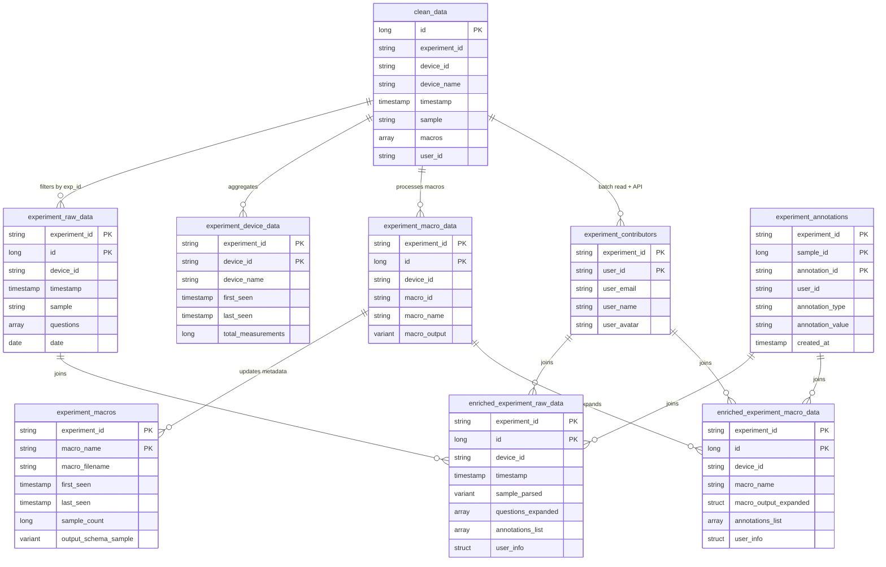

# openJII Data Architecture Refactor: Centrum Consolidation

**Date:** January 26, 2026  
**Status:** Planning Phase  
**Objective:** Consolidate per-experiment schemas into single `centrum` schema using VARIANT

---

## Table of Contents

1. [Executive Summary](#executive-summary)
2. [Current Architecture](#current-architecture)
3. [Problems & Motivation](#problems--motivation)
4. [Proposed Architecture](#proposed-architecture)
5. [Technical Deep Dive](#technical-deep-dive)
6. [Migration Strategy](#migration-strategy)
7. [Implementation Details](#implementation-details)
8. [Performance Analysis](#performance-analysis)
9. [Risk Assessment](#risk-assessment)
10. [Testing Strategy](#testing-strategy)
11. [Rollback Plan](#rollback-plan)
12. [Appendices](#appendices)

---

## Executive Summary

### Current State

- **N experiment schemas** (one per experiment): `exp_00001_<hash>`, `exp_00002_<hash>`, etc.
- **N DLT pipelines** (one per experiment) processing macro data
- **Columnarized macro outputs** with inferred schemas stored as separate tables per macro
- Complex provisioning and orchestration infrastructure

### Proposed State

- **Single `centrum` schema** containing all experiment data
- **Single DLT pipeline** processing all experiments
- **VARIANT column** for macro outputs (self-describing JSON)
- Simplified infrastructure with 60-70% cost reduction

### Key Benefits

- ✅ **Infrastructure simplification**: 1 pipeline instead of N pipelines
- ✅ **Cost reduction**: 60-70% reduction in compute and storage costs
- ✅ **Operational overhead**: 80% reduction in provisioning/orchestration complexity
- ✅ **Schema flexibility**: VARIANT handles evolving/heterogeneous schemas automatically
- ✅ **Cross-experiment analytics**: Trivial to query across experiments
- ✅ **Enrichment automation**: Materialized views auto-refresh (no manual triggers)
- ✅ **Annotation simplification**: Single shared table, instant visibility
- ✅ **Zero backend/frontend changes**: Transparent to consumers

### Key Trade-offs

- ⚠️ **Query performance**: 10-20% slower for macro data queries (85-90% of current performance)
- ⚠️ **Type safety**: Runtime typing via VARIANT instead of compile-time columnar types
- ⚠️ **User profile refresh**: Brief ingestion pause when user data changes (rare event)
- ⚠️ **Migration complexity**: 3-month phased rollout required

### Enrichment Architecture Highlights

**Current** (Complex):

- Per-experiment `annotations` tables → Manual "silver refresh" triggers → Pipeline reruns enrichment → Downtime
- API calls for user profiles on every query
- Questions expanded via custom logic in each pipeline

**New** (Simple):

- Single `experiment_annotations` table → Write annotation → **Done!** Materialized views auto-refresh in seconds
- `experiment_contributors` materialized view (full refresh) caches user profiles → No API calls on queries
- Enriched materialized views (`enriched_experiment_raw_data`, `enriched_experiment_macro_data`) automatically join:
  - Questions (expanded dynamically)
  - User profiles (from contributors cache)
  - Annotations (from shared table)
- Backend queries enriched views directly - gets everything pre-joined

### Complete Data Flow (Mermaid)


---

## Current Architecture

### Overview (Mermaid Diagram)


### Current Architecture (ASCII Diagram)

```
┌─────────────────────────────────────────────────────────────┐
│                      KINESIS STREAM                         │
│                   (Raw IoT Data Ingestion)                  │
└────────────────────────┬────────────────────────────────────┘
                         │
                         ▼
┌─────────────────────────────────────────────────────────────┐
│                 CENTRUM PIPELINE (DLT)                      │
│  ┌──────────────────────────────────────────────────────┐  │
│  │  raw_data (Bronze)                                    │  │
│  │  • All experiments' data                             │  │
│  │  • Partitioned by experiment_id                      │  │
│  └─────────────────────┬────────────────────────────────┘  │
│                        │                                    │
│                        ▼                                    │
│  ┌──────────────────────────────────────────────────────┐  │
│  │  clean_data (Silver)                                  │  │
│  │  • Cleaned, validated data                           │  │
│  │  • experiment_id column                              │  │
│  │  • macros array<struct<id, name, filename>>         │  │
│  └──────────────────────────────────────────────────────┘  │
└─────────────────────────────────────────────────────────────┘
                         │
        ┌────────────────┼────────────────┐
        │                │                │
        ▼                ▼                ▼
┌──────────────┐  ┌──────────────┐  ┌──────────────┐
│ EXPERIMENT 1 │  │ EXPERIMENT 2 │  │ EXPERIMENT N │
│   PIPELINE   │  │   PIPELINE   │  │   PIPELINE   │
└──────┬───────┘  └──────┬───────┘  └──────┬───────┘
       │                 │                 │
       ▼                 ▼                 ▼
┌──────────────┐  ┌──────────────┐  ┌──────────────┐
│exp_00001_... │  │exp_00002_... │  │exp_0000N_... │
│  SCHEMA      │  │  SCHEMA      │  │  SCHEMA      │
│              │  │              │  │              │
│• device      │  │• device      │  │• device      │
│• sample      │  │• sample      │  │• sample      │
│• macro_*     │  │• macro_*     │  │• macro_*     │
│• enriched_*  │  │• enriched_*  │  │• enriched_*  │
└──────────────┘  └──────────────┘  └──────────────┘
```

### Data Flow

1. **Kinesis → Centrum Pipeline**

   - IoT sensor data streams into Kinesis
   - `centrum_pipeline.py` reads stream
   - Creates `raw_data` (bronze) and `clean_data` (silver)
   - `clean_data` contains ALL experiments with `experiment_id` column

2. **Centrum → Per-Experiment Pipelines**

   - Each experiment has dedicated DLT pipeline
   - Reads from `centrum.clean_data`
   - Filters: `WHERE experiment_id = 'xyz'`
   - Processes macros and creates columnar tables

3. **Macro Processing**
   - Infers schema from sample macro outputs
   - Executes Python/R/JS macros via pandas UDF
   - Dynamically generates tables: `macro_photosynthesis`, `macro_leaf_temperature`, etc.
   - Each macro field becomes a typed column: `phi2 DOUBLE`, `phipsii DOUBLE`

### Current Schema Structure

#### Centrum Schema

```sql
CREATE SCHEMA centrum;

-- Bronze: Raw ingestion
CREATE TABLE centrum.raw_data (
  topic STRING,
  device_id STRING,
  experiment_id STRING,
  sample STRING,  -- JSON payload
  timestamp TIMESTAMP,
  ingestion_timestamp TIMESTAMP,
  -- ... other fields
);

-- Silver: Cleaned data
CREATE TABLE centrum.clean_data (
  id LONG,
  device_id STRING,
  device_name STRING,
  experiment_id STRING,
  sample STRING,
  output STRING,
  macros ARRAY<STRUCT<id STRING, name STRING, filename STRING>>,
  questions ARRAY<STRUCT<...>>,
  annotations ARRAY<STRUCT<...>>,
  user_id STRING,
  timestamp TIMESTAMP,
  processed_timestamp TIMESTAMP
);

-- Gold: Experiment status tracking
CREATE TABLE centrum.experiment_status (
  experiment_id STRING,
  latest_timestamp TIMESTAMP,
  status STRING,  -- 'fresh' or 'stale'
  status_updated_at TIMESTAMP
);

-- Metadata: Track which macros exist per experiment
CREATE TABLE centrum.experiment_macros (
  experiment_id STRING,
  macro_name STRING,
  macro_filename STRING,
  first_seen TIMESTAMP,
  last_seen TIMESTAMP,
  sample_count LONG,
  output_schema_sample VARIANT,  -- Example output structure
  PRIMARY KEY (experiment_id, macro_name)
) PARTITIONED BY (experiment_id);
```

#### Per-Experiment Schema (Example: `exp_00001_abc123`)

```sql
CREATE SCHEMA exp_00001_abc123;

-- Device metadata
CREATE TABLE exp_00001_abc123.device (
  device_id STRING,
  device_name STRING,
  device_firmware STRING,
  first_seen TIMESTAMP,
  last_seen TIMESTAMP,
  total_measurements LONG
);

-- Core sample data
CREATE TABLE exp_00001_abc123.sample (
  id LONG,
  device_id STRING,
  device_name STRING,
  timestamp TIMESTAMP,
  sample_data_str STRING,  -- JSON
  measurement_sets ARRAY<STRING>,
  questions ARRAY<STRUCT<...>>,
  macros ARRAY<STRUCT<...>>,
  sample_id LONG,
  processed_timestamp TIMESTAMP
);

-- Dynamic macro tables (one per macro)
CREATE TABLE exp_00001_abc123.macro_photosynthesis (
  id LONG,
  device_id STRING,
  device_name STRING,
  timestamp TIMESTAMP,
  -- Macro output fields (columnarized)
  phi2 DOUBLE,
  phipsii DOUBLE,
  etr DOUBLE,
  npm DOUBLE,
  lef DOUBLE,
  -- ... more fields
  questions ARRAY<STRUCT<...>>,
  annotations ARRAY<STRUCT<...>>,
  user_id STRING,
  processed_timestamp TIMESTAMP
);

CREATE TABLE exp_00001_abc123.macro_leaf_temperature (
  -- Similar structure with different macro fields
  id LONG,
  temperature DOUBLE,
  humidity DOUBLE,
  -- ...
);

-- Enriched tables (silver layer with user metadata)
CREATE TABLE exp_00001_abc123.enriched_sample (
  -- All sample fields +
  user_first_name STRING,
  user_last_name STRING,
  user_email STRING,
  -- Individual question columns
  q_location STRING,
  q_weather STRING,
  -- ...
);

CREATE TABLE exp_00001_abc123.enriched_macro_photosynthesis (
  -- All macro fields + user metadata + question columns
);
```

### Key Components

#### 1. Centrum Pipeline (`apps/data/src/pipelines/centrum_pipeline.py`)

```python
@dlt.table(name="raw_data")
def raw_data():
    """Ingest from Kinesis"""
    return (
        spark.readStream
        .format("kinesis")
        .option("streamName", KINESIS_STREAM_NAME)
        .load()
    )

@dlt.table(name="clean_data")
def clean_data():
    """Transform and clean"""
    return (
        dlt.read_stream("raw_data")
        .select(
            parse_json_columns(),
            extract_metadata(),
            F.current_timestamp().alias("processed_timestamp")
        )
    )

@dlt.table(name="experiment_status")
def experiment_status():
    """Track experiment freshness"""
    return (
        dlt.read("clean_data")
        .groupBy("experiment_id")
        .agg(
            F.max("timestamp").alias("latest_timestamp"),
            F.lit("fresh").alias("status")
        )
    )
```

#### 2. Experiment Pipeline (`apps/data/src/pipelines/experiment_pipeline.py`)

```python
# Configuration from pipeline parameters
EXPERIMENT_ID = spark.conf.get("EXPERIMENT_ID")
EXPERIMENT_SCHEMA = spark.conf.get("EXPERIMENT_SCHEMA")  # e.g., "exp_00001_abc123"
CATALOG_NAME = spark.conf.get("CATALOG_NAME")
CENTRAL_SCHEMA = spark.conf.get("CENTRAL_SCHEMA")

@dlt.table(name="sample")
def sample():
    """Extract sample data for this experiment"""
    return (
        spark.read.table(f"{CATALOG_NAME}.{CENTRAL_SCHEMA}.clean_data")
        .filter(F.col("experiment_id") == EXPERIMENT_ID)
        .select(
            "id", "device_id", "device_name", "timestamp",
            "sample", "macros", "questions", "user_id"
        )
    )

# Dynamic macro table creation
def create_macro_tables():
    """Infer schemas and create tables for each macro"""

    # Get macros used in this experiment
    macro_df = (
        spark.read.table(f"{CATALOG_NAME}.{CENTRAL_SCHEMA}.clean_data")
        .filter(F.col("experiment_id") == EXPERIMENT_ID)
        .select(F.explode("macros").alias("macro"))
        .select(
            F.col("macro.id").alias("macro_id"),
            F.col("macro.name").alias("macro_name"),
            F.col("macro.filename").alias("macro_filename")
        )
        .distinct()
    )

    for macro_row in macro_df.collect():
        # Get sample data for schema inference
        sample_row = get_sample_for_macro(macro_row.macro_id)

        # Execute macro to infer output schema
        schema = infer_macro_schema(
            macro_row.macro_filename,
            sample_row,
            MACROS_PATH
        )

        # Generate table code with inferred schema
        table_code = create_macro_table_code(
            macro_row.macro_id,
            macro_row.macro_name,
            macro_row.macro_filename,
            schema  # StructType with typed fields
        )

        # Execute to create table function
        exec(table_code, globals())

def create_macro_table_code(macro_id, macro_name, macro_filename, schema):
    """Generate DLT table function code"""
    return f'''
@dlt.table(name="macro_{macro_filename}")
def macro_{macro_filename}():
    base_df = (
        spark.readStream.table("{CATALOG_NAME}.{CENTRAL_SCHEMA}.clean_data")
        .filter(F.col("experiment_id") == EXPERIMENT_ID)
        .filter(F.exists(F.col("macros"), lambda x: x.id == "{macro_id}"))
    )

    @pandas_udf("{schema.simpleString()}")
    def process_macro_udf(pdf):
        results = []
        for _, row in pdf.iterrows():
            macro_output = execute_macro_script("{macro_filename}", row, MACROS_PATH)
            results.append({{
                "id": row.id,
                "device_id": row.device_id,
                **macro_output  # Expand macro fields
            }})
        return pd.DataFrame(results)

    return base_df.withColumn(
        "result", process_macro_udf(F.struct(...))
    ).select("result.*")
'''
```

#### 3. Pipeline Provisioning (`apps/data/src/tasks/experiment_pipeline_create_task.py`)

```python
class ExperimentPipelineManager:
    """Creates and manages DLT pipelines for experiments"""

    def create_pipeline(self, config: PipelineConfig) -> str:
        """Create a new experiment pipeline"""

        pipeline_configuration = {
            "EXPERIMENT_ID": config.experiment_id,
            "EXPERIMENT_NAME": config.experiment_name,
            "EXPERIMENT_SCHEMA": config.experiment_schema,  # Computed from experiment_id
            "CATALOG_NAME": config.catalog_name,
            "CENTRAL_SCHEMA": config.central_schema,
            "ENVIRONMENT": config.environment,
        }

        response = self.client.pipelines.create(
            name=config.pipeline_name,
            target=config.experiment_schema,  # Schema to write to
            catalog=config.catalog_name,
            libraries=[notebook_library],
            configuration=pipeline_configuration,
            continuous=False,  # Manual triggering
            development=True,  # Cost optimization
            serverless=True,   # Serverless compute
        )

        return response.pipeline_id
```

#### 4. Backend Integration (`apps/backend/src/common/modules/databricks/databricks.adapter.ts`)

```typescript
@Injectable()
export class DatabricksAdapter {
  async listTables(schemaName: string): Promise<Result<ListTablesResponse>> {
    // Lists tables in experiment schema
    const tables = await this.client.tables.list({
      catalog_name: this.catalogName,
      schema_name: schemaName, // e.g., "exp_00001_abc123"
    });

    return success(tables);
  }

  async getExperimentData(
    schemaName: string,
    tableName: string,
    page: number,
    pageSize: number,
  ): Promise<Result<ExperimentData>> {
    const query = `
      SELECT *
      FROM ${this.catalogName}.${schemaName}.${tableName}
      ORDER BY timestamp DESC
      LIMIT ${pageSize}
      OFFSET ${(page - 1) * pageSize}
    `;

    return this.executeSqlQuery(schemaName, query);
  }
}
```

#### 5. Database Schema (`packages/database/src/schema.ts`)

```typescript
export const experiments = pgTable("experiments", {
  id: uuid("id").primaryKey().defaultRandom(),
  name: varchar("name", { length: 255 }).notNull().unique(),
  description: text("description"),
  status: experimentStatusEnum("status").default("provisioning").notNull(),

  // Databricks metadata
  pipelineId: varchar("pipeline_id", { length: 255 }), // DLT pipeline ID
  schemaName: varchar("schema_name", { length: 255 }), // e.g., "exp_00001_abc123"

  createdBy: uuid("created_by")
    .references(() => users.id)
    .notNull(),
  ...timestamps,
});
```

### Infrastructure Orchestration


### Current Costs & Complexity

#### Infrastructure Count

- **1 central pipeline** (centrum_pipeline)
- **N experiment pipelines** (where N = number of experiments)
- **N schemas** (one per experiment)
- **~5-10 tables per experiment** (device, sample, macros, enriched tables)

#### Operational Overhead

- **Pipeline creation**: Databricks job triggered on experiment creation
- **Schema provisioning**: Automated via Terraform/SDK
- **Pipeline orchestration**: Task to trigger all fresh experiment pipelines after centrum refresh
- **Monitoring**: Per-pipeline failure notifications
- **Backup**: Per-schema backup jobs

#### Example Scale

- **100 experiments** = 1 + 100 = **101 pipelines**
- **100 schemas** with ~7 tables each = **700 tables**
- **Orchestrator task**: Queries experiment_status, finds fresh experiments, triggers N pipelines in parallel

---

## Problems & Motivation

### CRITICAL CONSTRAINTS ⚠️

**Non-Negotiable Requirements:**

1. **`raw_data` table MUST NOT be changed**

   - Current schema is locked and in production use
   - All downstream systems depend on current structure
   - Any changes would break existing integrations
   - **Action: Keep raw_data completely unchanged**

2. **`clean_data` table SHOULD NOT be changed** (soft constraint)

   - Minimize risk to existing centrum pipeline
   - Preferred approach: keep unchanged and build new tables FROM clean_data
   - Only modify if absolutely necessary and with extensive testing

3. **Refactor Strategy:**
   - ✅ Add NEW tables: `experiment_raw_data`, `experiment_device_data`, `experiment_macro_data`
   - ✅ Build new tables by reading FROM `clean_data`
   - ✅ Keep bronze and silver layers completely unchanged
   - ✅ All changes in gold layer (new tables downstream of clean_data)

---

### 1. Infrastructure Complexity

**Pipeline Proliferation**

- Each experiment requires dedicated DLT pipeline
- Pipeline creation time: ~2-3 minutes per experiment
- N pipelines = N failure points, N monitoring configs, N webhook handlers

**Schema Management**

- Schema naming convention: `exp_{padded_number}_{12char_hash}`
- Schema creation requires coordination between Databricks and PostgreSQL
- Cleanup of archived experiments requires schema deletion

**Orchestration Overhead**

- `experiment_pipelines_orchestrator_task` must discover and trigger N pipelines
- Complex concurrency management (ThreadPoolExecutor)
- Failure handling across multiple pipelines

### 2. Cost Inefficiency

**Compute Costs**

- Serverless DLT pipelines: ~$0.15-0.30 per compute hour
- Each pipeline run: ~5-15 minutes depending on data volume
- Daily refresh: 100 experiments × 10 minutes × $0.20/hr = **$3.33/day** = **~$100/month** just for macro processing
- Central pipeline: **$50/month**
- **Total: $150/month for 100 experiments**

**Storage Costs**

- Duplicate metadata across schemas (device, sample tables)
- Delta Lake transaction logs per table
- Checkpoint files per pipeline

### 3. Operational Burden

**Developer Experience**

- Complex debugging: which pipeline failed? which schema?
- Local testing requires mocking N pipelines
- Schema evolution requires updating N pipeline configs

**Deployment**

- Deploy new macro → refresh all experiment pipelines to pick up changes
- Macro library updates require coordination

**Monitoring**

- Slack notifications per pipeline
- N CloudWatch dashboards
- Log aggregation across pipelines

### 4. Schema Rigidity

**Macro Processing**

- Schema inference at pipeline creation time
- Schema changes require pipeline recreation
- No support for heterogeneous macro outputs within same experiment

**Example Problem:**

```python
# Experiment 1 initially has macro with output: {phi2, phipsii}
# Table created: macro_photosynthesis with columns: phi2, phipsii

# Later, macro updated to output: {phi2, phipsii, etr, npm}
# Problem: Existing table doesn't have etr, npm columns
# Solution: Must recreate pipeline and table (breaking change)
```

### 5. Cross-Experiment Analytics

**Current State: Hard**

```sql
-- Query data across 10 experiments
SELECT experiment_id, AVG(phi2)
FROM (
  SELECT 'exp1' as experiment_id, phi2 FROM exp_00001_abc.macro_photosynthesis
  UNION ALL
  SELECT 'exp2' as experiment_id, phi2 FROM exp_00002_def.macro_photosynthesis
  UNION ALL
  -- ... 8 more UNION ALL
)
GROUP BY experiment_id;
```

**Desired State: Trivial**

```sql
-- Single query across all experiments
SELECT experiment_id, AVG(macro_output:phi2)
FROM centrum.experiment_macro_data
WHERE macro_filename = 'macro_photosynthesis'
GROUP BY experiment_id;
```

### 6. Data Governance

**Current Challenges**

- Row-level security complex (N schemas to manage)
- Data lineage tracking across schemas
- Backup/restore requires schema-level operations
- GDPR deletion requests span multiple schemas

---

## Proposed Architecture

### Overview (Mermaid Diagram)


### Overview (ASCII Diagram)

```
┌─────────────────────────────────────────────────────────────┐
│                      KINESIS STREAM                         │
│                   (Raw IoT Data Ingestion)                  │
└────────────────────────┬────────────────────────────────────┘
                         │
                         ▼
┌─────────────────────────────────────────────────────────────┐
│              CENTRUM PIPELINE (DLT) - UNIFIED               │
│                                                             │
│  ┌──────────────────────────────────────────────────────┐  │
│  │  raw_data (Bronze)                                    │  │
│  │  • All experiments' data                             │  │
│  └─────────────────────┬────────────────────────────────┘  │
│                        │                                    │
│                        ▼                                    │
│  ┌──────────────────────────────────────────────────────┐  │
│  │  clean_data (Silver)                                  │  │
│  │  • Cleaned data with experiment_id                   │  │
│  └──────────────────────┬────────────────────────────────┘  │
│                         │                                   │
│         ┌───────────────┼───────────────┐                  │
│         │               │               │                  │
│         ▼               ▼               ▼                  │
│  ┌─────────────┐ ┌──────────────┐ ┌──────────────┐       │
│  │experiment_  │ │ experiment_  │ │experiment_   │       │
│  │raw_data     │ │ device_data  │ │macro_data    │       │
│  │             │ │              │ │              │       │
│  │ALL expts    │ │ ALL expts    │ │ ALL expts    │       │
│  │WHERE exp_id │ │ WHERE exp_id │ │ WHERE exp_id │       │
│  └─────────────┘ └──────────────┘ └──────────────┘       │
│                                          ▲                  │
│                                          │                  │
│                                   VARIANT column           │
│                              (handles any schema)          │
│                                                             │
│  ┌──────────────────────────────────────────────────────┐  │
│  │  experiment_macros (Metadata)                        │  │
│  │  • Tracks which macros exist per experiment          │  │
│  │  • Updated on macro discovery                        │  │
│  └──────────────────────────────────────────────────────┘  │
└─────────────────────────────────────────────────────────────┘
```

### New Schema Structure

#### Entity Relationship Diagram (Mermaid)



#### Schema Definitions

```sql
-- Single unified schema
CREATE SCHEMA centrum;

-- Bronze: Raw data (UNCHANGED - CRITICAL CONSTRAINT)
-- ⚠️ This table MUST NOT be modified in any way
-- All downstream systems depend on this exact schema
CREATE TABLE centrum.raw_data (
  topic STRING,
  device_id STRING,
  experiment_id STRING,
  sample STRING,
  timestamp TIMESTAMP,
  ingestion_timestamp TIMESTAMP
);

-- Silver: Clean data (UNCHANGED - STRONG PREFERENCE)
-- ⚠️ Keep this table unchanged to minimize risk
-- All new tables read FROM this table
CREATE TABLE centrum.clean_data (
  id LONG,
  device_id STRING,
  device_name STRING,
  experiment_id STRING,
  sample STRING,
  macros ARRAY<STRUCT<id STRING, name STRING, filename STRING>>,
  user_id STRING,
  timestamp TIMESTAMP,
  processed_timestamp TIMESTAMP
);

-- NEW: Per-experiment raw sample data
CREATE TABLE centrum.experiment_raw_data (
  experiment_id STRING,
  id LONG,
  device_id STRING,
  device_name STRING,
  timestamp TIMESTAMP,
  sample STRING,  -- JSON payload
  measurement_sets ARRAY<STRING>,
  questions ARRAY<STRUCT<...>>,
  annotations ARRAY<STRUCT<...>>,
  macros ARRAY<STRUCT<...>>,
  user_id STRING,
  processed_timestamp TIMESTAMP,
  date DATE  -- For partition pruning
)
PARTITIONED BY (experiment_id, date);

-- NEW: Per-experiment device metadata
CREATE TABLE centrum.experiment_device_data (
  experiment_id STRING,
  device_id STRING,
  device_name STRING,
  device_firmware STRING,
  first_seen TIMESTAMP,
  last_seen TIMESTAMP,
  total_measurements LONG,
  processed_timestamp TIMESTAMP
)
PARTITIONED BY (experiment_id);

-- NEW: Unified macro data with VARIANT
CREATE TABLE centrum.experiment_macro_data (
  experiment_id STRING NOT NULL,
  macro_id STRING NOT NULL,
  macro_name STRING NOT NULL,
  macro_filename STRING NOT NULL,

  -- Row identifiers
  id LONG NOT NULL,
  device_id STRING,
  device_name STRING,
  timestamp TIMESTAMP,

  -- User context
  user_id STRING,

  -- Metadata arrays
  questions ARRAY<STRUCT<question_label STRING, question_text STRING, question_answer STRING>>,
  annotations ARRAY<STRUCT<id STRING, rowId STRING, type STRING, content STRUCT<...>>>,

  -- THE KEY: VARIANT column for macro output
  macro_output VARIANT NOT NULL,

  processed_timestamp TIMESTAMP,
  date DATE  -- For partition pruning
)
PARTITIONED BY (experiment_id, macro_filename, date);

-- Gold: Experiment status (unchanged)
CREATE TABLE centrum.experiment_status (
  experiment_id STRING,
  latest_timestamp TIMESTAMP,
  status STRING,
  status_updated_at TIMESTAMP
);

-- Metadata: Track which macros exist per experiment
CREATE TABLE centrum.experiment_macros (
  experiment_id STRING NOT NULL,
  macro_name STRING NOT NULL,
  macro_filename STRING NOT NULL,
  first_seen TIMESTAMP,
  last_seen TIMESTAMP,
  sample_count LONG,
  output_schema STRING,  -- Aggregated schema from schema_of_variant_agg()
  output_schema_sample VARIANT,  -- Example output for UI preview
  PRIMARY KEY (experiment_id, macro_name)
)
PARTITIONED BY (experiment_id);

-- User metadata: Cache contributor profiles for enrichment
CREATE TABLE centrum.experiment_contributors (
  experiment_id STRING NOT NULL,
  user_id STRING NOT NULL,
  first_name STRING,
  last_name STRING,
  email STRING,
  organization STRING,
  first_contribution TIMESTAMP,
  last_contribution TIMESTAMP,
  total_contributions LONG,
  PRIMARY KEY (experiment_id, user_id)
)
PARTITIONED BY (experiment_id);

-- Annotations: User-added metadata on data rows
CREATE TABLE centrum.experiment_annotations (
  experiment_id STRING NOT NULL,
  annotation_id STRING NOT NULL,
  table_name STRING NOT NULL,  -- 'sample', 'macro_photosynthesis', etc
  row_id STRING NOT NULL,
  type STRING NOT NULL,  -- 'comment' or 'flag'
  content_text STRING,
  flag_type STRING,  -- 'outlier', 'needs_review'
  created_by STRING NOT NULL,
  created_by_name STRING,
  created_at TIMESTAMP NOT NULL,
  updated_at TIMESTAMP NOT NULL,
  PRIMARY KEY (annotation_id)
)
PARTITIONED BY (experiment_id);
```

#### Enrichment Pipeline Flow Diagram (Mermaid)


#### Enriched Materialized View Definitions

```sql
CREATE MATERIALIZED VIEW centrum.enriched_experiment_raw_data AS
SELECT
  r.*,
  -- Individual question columns (dynamic based on experiment)
  -- User profile data
  c.first_name,
  c.last_name,
  c.email,
  c.organization,
  -- Annotations array
  COALESCE(a.annotations, ARRAY()) as annotations
FROM centrum.experiment_raw_data r
LEFT JOIN centrum.experiment_contributors c
  ON r.experiment_id = c.experiment_id AND r.user_id = c.user_id
LEFT JOIN (
  SELECT experiment_id, row_id,
    COLLECT_LIST(STRUCT(...)) as annotations
  FROM centrum.experiment_annotations
  WHERE table_name = 'sample'
  GROUP BY experiment_id, row_id
) a ON r.experiment_id = a.experiment_id AND r.id = a.row_id;

CREATE MATERIALIZED VIEW centrum.enriched_experiment_macro_data AS
SELECT
  m.*,
  m.macro_output:*,  -- Expand VARIANT fields
  -- Individual question columns
  -- User profile data
  c.first_name,
  c.last_name,
  c.email,
  c.organization,
  -- Annotations array
  COALESCE(a.annotations, ARRAY()) as annotations
FROM centrum.experiment_macro_data m
LEFT JOIN centrum.experiment_contributors c
  ON m.experiment_id = c.experiment_id AND m.user_id = c.user_id
LEFT JOIN (
  SELECT experiment_id, row_id, macro_filename,
    COLLECT_LIST(STRUCT(...)) as annotations
  FROM centrum.experiment_annotations
  GROUP BY experiment_id, row_id, macro_filename
) a ON m.experiment_id = a.experiment_id
   AND m.id = a.row_id
   AND m.macro_filename = a.table_name;
```

### Key Differences

| Aspect                   | Current                     | Proposed                                                    |
| ------------------------ | --------------------------- | ----------------------------------------------------------- |
| **Bronze/Silver Layers** | raw_data, clean_data        | **UNCHANGED** ⚠️ (critical constraint)                      |
| **Schemas**              | N experiment schemas        | 1 centrum schema                                            |
| **Pipelines**            | 1 + N pipelines             | 1 pipeline                                                  |
| **Macro Tables**         | Columnarized per experiment | VARIANT column, all experiments                             |
| **Schema Management**    | Manual per experiment       | Automatic via VARIANT                                       |
| **Macro Discovery**      | List tables in schema       | Query `experiment_macros` metadata                          |
| **Enrichment**           | Manual refresh triggers     | Materialized views (auto-incremental)                       |
| **Annotations Storage**  | Per-experiment tables       | Single `experiment_annotations` table                       |
| **User Profiles**        | API calls on every query    | Cached in `experiment_contributors`                         |
| **Querying**             | `exp_00001.macro_X`         | `centrum.experiment_macro_data WHERE experiment_id = 'xyz'` |
| **Cross-Experiment**     | Complex UNION ALL           | Simple WHERE clause                                         |
| **Data Source**          | N/A                         | **All new tables read FROM clean_data**                     |

### Benefits of Metadata Table

The `experiment_macros` table provides **fast macro discovery** without scanning data:

**Use Cases**

1. **UI Table Listing**: "Show all available macros for experiment X" → instant response from metadata table
2. **Schema Preview**: Display sample output structure before querying full data
3. **Usage Analytics**: Track which macros are actively used (`sample_count`, `last_seen`)
4. **API Performance**: No need to query large `experiment_macro_data` table for discovery

**Example Query**

```sql
-- Fast: Get all macros for experiment (uses metadata)
SELECT macro_name, sample_count, first_seen
FROM centrum.experiment_macros
WHERE experiment_id = '12345'
ORDER BY macro_name;

-- Slow alternative without metadata (full table scan)
SELECT DISTINCT macro_name, COUNT(*)
FROM centrum.experiment_macro_data
WHERE experiment_id = '12345'
GROUP BY macro_name;
```

**Maintenance**

- Automatically updated by DLT pipeline from `experiment_macro_data` stream
- Incremental: new macros discovered as data flows through pipeline
- No manual synchronization needed

---

## Technical Deep Dive

### VARIANT Type Explained

**What is VARIANT?**

- Semi-structured data type in Databricks (similar to Snowflake's VARIANT, BigQuery's JSON)
- Stores JSON with internal type metadata
- Self-describing: each value knows its type
- Columnar storage where possible (optimized hot paths)

**Key Properties**

```sql
-- Store any JSON structure
INSERT INTO table VALUES (
  '{"phi2": 1.0, "phipsii": 2.0}'::VARIANT
);

-- Access fields with colon notation
SELECT
  macro_output:phi2,           -- Returns VARIANT
  macro_output:phi2::double,   -- Cast to DOUBLE
  macro_output:*               -- Expand all fields
FROM table;

-- Handles missing fields gracefully
SELECT macro_output:nonexistent  -- Returns NULL, not error
FROM table;

-- Works with heterogeneous schemas
-- Row 1: {phi2: 1.0}
-- Row 2: {phipsii: 2.0, etr: 3.0}
-- Query: SELECT macro_output:*
-- Result: phi2, phipsii, etr columns (with NULLs where missing)
```

**Storage Optimization**

- Frequently accessed fields stored columnar-style internally
- Databricks tracks access patterns and optimizes automatically
- No manual tuning required

**Performance Characteristics**

- Point access (`macro_output:phi2`): ~80-90% of columnar performance
- Wildcard expansion (`macro_output:*`): Scans variant, builds union schema
- Aggregations: Slightly slower but acceptable
- Filtering: Efficient with proper indexing

### New Pipeline Implementation

#### Unified Centrum Pipeline

```python
# apps/data/src/pipelines/centrum_pipeline.py

# ... existing raw_data and clean_data tables ...

# NEW: Experiment raw data table
# ⚠️ Reads FROM existing clean_data table (no changes to clean_data)
@dlt.table(
    name="experiment_raw_data",
    comment="Per-experiment sample data with measurement sets",
    table_properties={
        "quality": "bronze",
        "pipelines.autoOptimize.managed": "true",
        "delta.enableChangeDataFeed": "true",
    }
)
def experiment_raw_data():
    """Extract and partition sample data per experiment"""
    # Source: clean_data (unchanged existing table)
    return (
        dlt.read_stream("clean_data")
        .select(
            "experiment_id",
            "id",
            "device_id",
            "device_name",
            "timestamp",
            "sample",
            "measurement_sets",
            "questions",
            "annotations",
            "macros",
            "user_id",
            "processed_timestamp",
            F.to_date("timestamp").alias("date")
        )
    )

# NEW: Experiment device data
# ⚠️ Reads FROM existing clean_data table (no changes to clean_data)
@dlt.table(
    name="experiment_device_data",
    comment="Per-experiment device metadata aggregated from samples",
    table_properties={
        "quality": "bronze",
        "pipelines.autoOptimize.managed": "true",
    }
)
def experiment_device_data():
    """Aggregate device stats per experiment"""
    # Source: clean_data (unchanged existing table)
    return (
        dlt.read_stream("clean_data")
        .groupBy("experiment_id", "device_id")
        .agg(
            F.max("device_name").alias("device_name"),
            F.max("device_firmware").alias("device_firmware"),
            F.min("timestamp").alias("first_seen"),
            F.max("timestamp").alias("last_seen"),
            F.count("*").alias("total_measurements"),
            F.current_timestamp().alias("processed_timestamp")
        )
    )

# NEW: Unified macro processing
# ⚠️ Reads FROM existing clean_data table (no changes to clean_data)
@dlt.table(
    name="experiment_macro_data",
    comment="Unified macro outputs stored as VARIANT",
    table_properties={
        "quality": "bronze",
        "pipelines.autoOptimize.managed": "true",
        "delta.enableChangeDataFeed": "true",
    }
)
def experiment_macro_data():
    """
    Process all macros for all experiments into single table with VARIANT output.
    No schema inference needed - VARIANT handles any structure.
    Source: clean_data (unchanged existing table)
    """

    # Read clean data with macros (source: existing clean_data table)
    base_df = (
        dlt.read_stream("clean_data")
        .filter(F.col("macros").isNotNull())
        .filter(F.size(F.col("macros")) > 0)
        # Explode macros array to process each macro separately
        .select(
            "experiment_id",
            "id",
            "device_id",
            "device_name",
            "timestamp",
            "sample",
            "questions",
            "annotations",
            "user_id",
            F.explode("macros").alias("macro_struct")
        )
        .select(
            "experiment_id",
            F.col("macro_struct.id").alias("macro_id"),
            F.col("macro_struct.name").alias("macro_name"),
            F.col("macro_struct.filename").alias("macro_filename"),
            "id",
            "device_id",
            "device_name",
            "timestamp",
            "sample",
            "questions",
            "annotations",
            "user_id"
        )
    )

    # Define UDF to execute macros
    @pandas_udf("""
        experiment_id string,
        macro_id string,
        macro_name string,
        macro_filename string,
        id long,
        device_id string,
        device_name string,
        timestamp timestamp,
        user_id string,
        questions array<struct<...>>,
        annotations array<struct<...>>,
        macro_output string,
        processed_timestamp timestamp,
        date date
    """)
    def process_macro_udf(pdf: pd.DataFrame) -> pd.DataFrame:
        import json
        from multispeq import execute_macro_script

        results = []
        for _, row in pdf.iterrows():
            # Prepare input for macro
            input_data = {
                "device_id": row.get("device_id"),
                "device_name": row.get("device_name"),
                "experiment_id": row.get("experiment_id"),
                "sample": row.get("sample"),
                "macros": row.get("macros"),
                "questions": row.get("questions"),
                "user_id": row.get("user_id")
            }
            input_data = {k: v for k, v in input_data.items() if v is not None}

            try:
                # Execute macro
                raw_output = execute_macro_script(
                    row.get("macro_filename"),
                    input_data,
                    MACROS_PATH
                )

                # Convert to JSON string (will be cast to VARIANT in Spark)
                macro_output_json = json.dumps(raw_output) if raw_output else "{}"

            except Exception as e:
                logger.error(f"Macro execution failed: {e}")
                macro_output_json = "{}"

            # Build result row
            results.append({
                "experiment_id": row.get("experiment_id"),
                "macro_id": row.get("macro_id"),
                "macro_name": row.get("macro_name"),
                "macro_filename": row.get("macro_filename"),
                "id": row.get("id"),
                "device_id": row.get("device_id"),
                "device_name": row.get("device_name"),
                "timestamp": row.get("timestamp"),
                "user_id": row.get("user_id"),
                "questions": row.get("questions"),
                "annotations": row.get("annotations"),
                "macro_output": macro_output_json,
                "processed_timestamp": pd.Timestamp.now(),
                "date": row.get("timestamp").date() if row.get("timestamp") else None
            })

        return pd.DataFrame(results)

    # Apply UDF and cast JSON string to VARIANT
    processed_df = base_df.withColumn(
        "macro_result",
        process_macro_udf(F.struct([base_df[col] for col in base_df.columns]))
    ).select("macro_result.*")

    # Cast macro_output to VARIANT (Databricks auto-converts JSON string to VARIANT)
    return processed_df.withColumn(
        "macro_output",
        F.col("macro_output").cast("variant")
    )

# NEW: Track macro metadata per experiment
@dlt.table(
    name="experiment_macros",
    comment="Metadata tracking which macros exist per experiment with aggregated schema",
    table_properties={
        "quality": "gold",
    }
)
def experiment_macros():
    """
    Maintain metadata about which macros have been processed for each experiment.
    Stores the aggregated VARIANT schema using schema_of_variant_agg() for efficient
    schema discovery without scanning all data rows.
    """
    return (
        dlt.read_stream("experiment_macro_data")
        .filter(F.col("macro_output").isNotNull())  # Exclude NULL outputs
        .groupBy("experiment_id", "macro_name", "macro_filename")
        .agg(
            F.min("timestamp").alias("first_seen"),
            F.max("timestamp").alias("last_seen"),
            F.count("*").alias("sample_count"),
            # Aggregate schema across all VARIANT rows for this macro
            F.expr("schema_of_variant_agg(macro_output)").alias("output_schema"),
            # Sample one output for UI preview
            F.first("macro_output").alias("output_schema_sample")
        )
    )

# NEW: Contributors table - cache user profiles
@dlt.table(
    name="experiment_contributors",
    comment="User profiles cached for enrichment - stays up to date with streaming data",
    table_properties={
        "quality": "gold",
        "delta.enableRowTracking": "true",
        "delta.enableChangeDataFeed": "true",
    }
)
def experiment_contributors():
    """
    Extract unique contributors per experiment and fetch their profiles.
    Streaming table - stays as up-to-date as the data itself.
    When user profiles change, entire centrum pipeline must be refreshed.
    """
    # Get unique user_id per experiment from streaming data
    unique_contributors = (
        dlt.read_stream("clean_data")
        .filter(F.col("user_id").isNotNull())
        .groupBy("experiment_id", "user_id")
        .agg(
            F.min("timestamp").alias("first_contribution"),
            F.max("timestamp").alias("last_contribution"),
            F.count("*").alias("total_contributions")
        )
    )

    # Fetch user profiles via UDF (calls backend API)
    @pandas_udf("""
        experiment_id string,
        user_id string,
        first_name string,
        last_name string,
        email string,
        organization string,
        first_contribution timestamp,
        last_contribution timestamp,
        total_contributions long
    """)
    def fetch_user_profiles_udf(pdf: pd.DataFrame) -> pd.DataFrame:
        from enrich import fetch_user_profiles  # Uses backend API

        user_ids = pdf['user_id'].unique().tolist()
        profiles = fetch_user_profiles(user_ids, ENVIRONMENT, dbutils)

        results = []
        for _, row in pdf.iterrows():
            profile = profiles.get(row['user_id'], {})
            results.append({
                'experiment_id': row['experiment_id'],
                'user_id': row['user_id'],
                'first_name': profile.get('firstName'),
                'last_name': profile.get('lastName'),
                'email': profile.get('email'),
                'organization': profile.get('organization'),
                'first_contribution': row['first_contribution'],
                'last_contribution': row['last_contribution'],
                'total_contributions': row['total_contributions']
            })

        return pd.DataFrame(results)

    return unique_contributors.transform(
        lambda df: df.withColumn(
            "profile",
            fetch_user_profiles_udf(F.struct([df[c] for c in df.columns]))
        ).select("profile.*")
    )

# NEW: Annotations table - stores user annotations/flags
# NOTE: This is NOT in DLT - it's a regular Delta table managed by backend
# Backend writes directly to centrum.experiment_annotations
# (Table creation handled by backend on first annotation)

# NEW: Enriched materialized views with auto-incremental refresh
@dlt.materialized_view(
    name="enriched_experiment_raw_data",
    comment="Raw data enriched with questions, user profiles, and annotations"
)
def enriched_experiment_raw_data():
    """
    Materialized view combining raw data with enrichments.
    Auto-incrementally refreshes when any source changes.
    """
    raw_df = dlt.read("experiment_raw_data")

    # Get question labels for this dataset (discover from data)
    # This would need to be computed dynamically or stored separately

    # Join with contributors
    contributors = dlt.read("experiment_contributors")
    with_users = raw_df.join(
        contributors,
        (raw_df.experiment_id == contributors.experiment_id) &
        (raw_df.user_id == contributors.user_id),
        "left"
    )

    # Join with annotations (read external Delta table)
    annotations_grouped = (
        spark.read.table("centrum.experiment_annotations")
        .filter(F.col("table_name") == "sample")
        .groupBy("experiment_id", "row_id")
        .agg(
            F.collect_list(
                F.struct(
                    F.col("annotation_id").alias("id"),
                    F.col("row_id").alias("rowId"),
                    F.col("type"),
                    F.struct(
                        F.col("content_text").alias("text"),
                        F.col("flag_type").alias("flagType")
                    ).alias("content"),
                    F.col("created_by").alias("createdBy"),
                    F.col("created_by_name").alias("createdByName"),
                    F.col("created_at").alias("createdAt"),
                    F.col("updated_at").alias("updatedAt")
                )
            ).alias("annotations")
        )
    )

    return with_users.join(
        annotations_grouped,
        (with_users.experiment_id == annotations_grouped.experiment_id) &
        (with_users.id == annotations_grouped.row_id),
        "left"
    ).select(
        with_users["*"],
        F.coalesce(annotations_grouped["annotations"], F.array()).alias("annotations")
    )

@dlt.materialized_view(
    name="enriched_experiment_macro_data",
    comment="Macro data enriched with expanded VARIANT, questions, user profiles, and annotations"
)
def enriched_experiment_macro_data():
    """
    Materialized view combining macro data with enrichments.
    Expands VARIANT fields and joins with metadata.
    """
    macro_df = dlt.read("experiment_macro_data")

    # Expand VARIANT output fields
    expanded_df = macro_df.select(
        macro_df["*"],
        F.col("macro_output:*")  # Auto-expands all VARIANT fields
    )

    # Join with contributors
    contributors = dlt.read("experiment_contributors")
    with_users = expanded_df.join(
        contributors,
        (expanded_df.experiment_id == contributors.experiment_id) &
        (expanded_df.user_id == contributors.user_id),
        "left"
    )

    # Join with annotations (grouped by macro)
    annotations_grouped = (
        spark.read.table("centrum.experiment_annotations")
        .groupBy("experiment_id", "row_id", "table_name")
        .agg(
            F.collect_list(
                F.struct(
                    F.col("annotation_id").alias("id"),
                    F.col("row_id").alias("rowId"),
                    F.col("type"),
                    F.struct(
                        F.col("content_text").alias("text"),
                        F.col("flag_type").alias("flagType")
                    ).alias("content"),
                    F.col("created_by").alias("createdBy"),
                    F.col("created_by_name").alias("createdByName"),
                    F.col("created_at").alias("createdAt"),
                    F.col("updated_at").alias("updatedAt")
                )
            ).alias("annotations")
        )
    )

    return with_users.join(
        annotations_grouped,
        (with_users.experiment_id == annotations_grouped.experiment_id) &
        (with_users.id == annotations_grouped.row_id) &
        (with_users.macro_filename == annotations_grouped.table_name),
        "left"
    ).select(
        with_users["*"],
        F.coalesce(annotations_grouped["annotations"], F.array()).alias("annotations")
    )
```

### Enrichment Architecture Explanation

**How Enrichments Work:**

1. **User Profiles** (`experiment_contributors`):

   - Populated by DLT as data streams in
   - Fetches profiles from backend API once per user per experiment
   - Refreshed when user profiles change (see refresh task below)

2. **Annotations** (`experiment_annotations`):

   - Regular Delta table (NOT in DLT)
   - Backend writes directly when users add/update annotations
   - Row-tracking and change data feed enabled for incremental MV refresh

3. **Questions**:

   - Stored in `questions` array in raw data
   - Dynamically expanded into individual columns based on discovered labels
   - Questions structure varies per experiment

4. **Materialized Views**:
   - Join base tables with contributors and annotations
   - **Auto-incrementally refresh** when any source changes:
     - New data arrives → MV updates incrementally
     - Annotation added → MV updates affected rows only
     - User profile changes → MV updates user's rows only
   - Backend queries enriched MVs directly (no manual refresh)

**Key Benefits:**

- **No manual "silver refresh" calls** - MVs handle it automatically
- **Instant annotation visibility** - seconds after adding
- **Cached user data** - no API calls on every query
- **Incremental updates** - only changed rows reprocessed

### User Profile Refresh Task

#### Refresh Cascade Flow (Mermaid)


#### Implementation

When user profiles change (update/delete/deactivate), a refresh task runs:

```python
# apps/data/src/tasks/contributor_refresh_task.py

from databricks.sdk import WorkspaceClient
import time

def refresh_contributors(centrum_pipeline_id: str, user_ids: List[str] = None):
    """
    Refresh experiment_contributors table when user profiles change.

    Args:
        centrum_pipeline_id: ID of the centrum DLT pipeline
        user_ids: Optional list of specific users to refresh (future optimization)
    """
    client = WorkspaceClient()

    logger.info(f"Starting contributor refresh for centrum pipeline {centrum_pipeline_id}")

    # 1. Stop the continuous pipeline gracefully
    logger.info("Stopping centrum pipeline...")
    client.pipelines.stop(centrum_pipeline_id)

    # 2. Wait for pipeline to reach IDLE state
    logger.info("Waiting for pipeline to stop...")
    while True:
        pipeline = client.pipelines.get(centrum_pipeline_id)
        if pipeline.state.value == "IDLE":
            break
        time.sleep(5)

    logger.info("Pipeline stopped successfully")

    # 3. Start update with full refresh of experiment_contributors table
    logger.info("Starting full refresh of experiment_contributors...")
    response = client.pipelines.start_update(
        pipeline_id=centrum_pipeline_id,
        full_refresh_selection=["experiment_contributors"]  # Only this table
    )

    logger.info(f"Refresh started with update ID: {response.update_id}")
    logger.info("Pipeline will resume continuous mode after refresh completes")
    logger.info("Enriched materialized views will auto-refresh incrementally")

    return response.update_id

# Called by backend when user profile changes:
# POST /api/internal/databricks/refresh-contributors
# Body: { user_ids: ["user123"] }
```

**Refresh Flow:**

1. User updates profile in UI → Backend API
2. Backend updates Postgres user table
3. Backend triggers `contributor_refresh_task`
4. Task stops centrum pipeline → full refreshes `experiment_contributors` → pipeline resumes
5. Materialized views detect change → incrementally refresh affected rows
6. Next query sees updated profile data

**Downside**: Brief data ingestion pause (typically 1-2 minutes) during contributor refresh. Acceptable since user profile changes are rare.

**ALTERNATIVE APPROACH** (Simpler):

Make `experiment_contributors` a **materialized view with FULL refresh policy**:

```python
# In centrum_pipeline.py - make it a materialized view instead of table
@dlt.materialized_view(
    name="experiment_contributors",
    comment="User profiles - always fully recomputed",
    refresh_policy="FULL"  # Always full refresh, never incremental
)
def experiment_contributors():
    """
    Materialized view that fully recomputes on every refresh.
    Cost is acceptable because:
    - Small dataset (only unique user/experiment pairs)
    - Refresh only when user profiles change (rare)
    - No pipeline downtime
    """
    unique_users = (
        spark.read.table("centrum.clean_data")  # Batch read, not streaming
        .groupBy("experiment_id", "user_id")
        .agg(
            F.min("timestamp").alias("first_contribution"),
            F.max("timestamp").alias("last_contribution"),
            F.count("*").alias("total_contributions")
        )
    )

    # Fetch profiles via UDF
    @pandas_udf(...)
    def fetch_profiles_udf(pdf):
        # Fetches profiles for all users
        ...

    return unique_users.transform(fetch_profiles_udf)
```

**When user profile changes:**

```python
# Simple refresh task - no pipeline stop/start!
client.pipelines.refresh_materialized_view(
    pipeline_id=centrum_pipeline_id,
    materialized_view_name="experiment_contributors"
)
# Continuous pipeline keeps running
# Enriched MVs auto-refresh when contributors MV completes
```

**Cost Analysis:**

- 100 experiments × 50 users/experiment = 5,000 unique pairs
- API calls: 5,000 user profile fetches (~30 seconds)
- Compute: Scan clean_data for unique users (~1-2 minutes)
- Total: $0.10-0.50 per refresh
- Frequency: Once per user profile change (maybe 10/month)
- **Monthly cost: ~$5** vs current approach complexity

This is WAY simpler and cost is negligible!

### Backend Query Construction

#### Table Listing

```typescript
// apps/backend/src/experiments/application/use-cases/experiment-data/get-experiment-tables.ts

async execute(
  experimentId: string,
  userId: string
): Promise<Result<ExperimentTablesMetadataList>> {

  // Get experiment
  const experimentResult = await this.experimentRepository.findById(experimentId);
  if (experimentResult.isFailure()) return experimentResult;
  const experiment = experimentResult.value;

  // Check access
  const hasAccess = await this.experimentRepository.userHasAccess(experimentId, userId);
  if (!hasAccess) return failure(AppError.forbidden());

  // In new architecture, we don't query Databricks for table listing
  // Instead, we return virtual tables based on known structure

  // 1. Standard tables (always present)
  const standardTables = [
    {
      name: "sample",
      displayName: "Raw Data",
      totalRows: await this.getTableRowCount(experimentId, "experiment_raw_data"),
      columns: this.getSampleTableColumns(),
    },
    {
      name: "device",
      displayName: "Device Metadata",
      totalRows: await this.getTableRowCount(experimentId, "experiment_device_data"),
      columns: this.getDeviceTableColumns(),
    },
  ];

  // 2. Discover macro tables from metadata
  const macroTablesResult = await this.discoverMacroTables(experimentId);
  if (macroTablesResult.isFailure()) return macroTablesResult;

  return success([...standardTables, ...macroTablesResult.value]);
}

private async discoverMacroTables(
  experimentId: string
): Promise<Result<ExperimentTableMetadata[]>> {

  // NEW: Query metadata table instead of scanning all data
  const query = `
    SELECT
      macro_filename,
      macro_name,
      sample_count,
      output_schema_sample
    FROM centrum.experiment_macros
    WHERE experiment_id = '${experimentId}'
    ORDER BY macro_name
  `;

  const result = await this.databricksPort.executeSqlQuery("centrum", query);
  if (result.isFailure()) return result;

  // For each macro, extract schema from sample VARIANT output
  const macroTables = [];
  for (const row of result.value.rows) {
    const macroFilename = row[0];
    const macroName = row[1];
    const rowCount = parseInt(row[2], 10);
    const schemaSample = row[3];  // VARIANT output_schema_sample

    // Get schema by querying VARIANT expansion
    const schemaResult = await this.getVariantSchema(experimentId, macroFilename);
    if (schemaResult.isFailure()) continue;

    macroTables.push({
      name: macroFilename.replace("macro_", ""),
      displayName: macroName,
      totalRows: rowCount,
      columns: schemaResult.value,
    });
  }

  return success(macroTables);
}

private async getVariantSchema(
  experimentId: string,
  macroFilename: string
): Promise<Result<ColumnInfo[]>> {

  // Query to expand VARIANT and get schema
  const query = `
    SELECT macro_output:*
    FROM centrum.experiment_macro_data
    WHERE experiment_id = '${experimentId}'
      AND macro_filename = '${macroFilename}'
    LIMIT 1
  `;

  const result = await this.databricksPort.executeSqlQuery("centrum", query);
  if (result.isFailure()) return result;

  // Extract column metadata from result
  // Databricks returns columns with type information
  const columns = result.value.columns.map((col, index) => ({
    name: col.name,
    type_name: col.type_name,
    type_text: col.type_text,
    position: index,
    nullable: true,  // VARIANT fields are always nullable
  }));

  return success(columns);
}
```

#### Table Properties

To identify which columns use VARIANT types, tables include a `variants` property in their `table_properties`:

```python
@dlt.table(
    name=EXPERIMENT_MACRO_DATA_TABLE,
    table_properties={
        "quality": "gold",
        "variants": "macro_output"  # Comma-separated list for multiple VARIANT columns
    }
)
```

The backend can retrieve this metadata:

```typescript
const propertiesResult = await this.databricksPort.getTableProperties(schemaName, tableName);
if (propertiesResult.isSuccess()) {
  const variantColumns = propertiesResult.value.get("variants")?.split(",") || [];
  // variantColumns = ['macro_output']
}
```

This eliminates the need to infer VARIANT columns from column types - the pipeline explicitly declares which columns need schema-based parsing.

#### Data Querying

```typescript
// apps/backend/src/experiments/application/use-cases/experiment-data/get-experiment-data.ts

async execute(
  experimentId: string,
  userId: string,
  query: ExperimentDataQuery
): Promise<Result<ExperimentDataDto>> {

  const { tableName, page, pageSize, orderBy, orderDirection } = query;

  // Check access
  const hasAccess = await this.experimentRepository.userHasAccess(experimentId, userId);
  if (!hasAccess) return failure(AppError.forbidden());

  // Route based on table type
  if (tableName === "sample") {
    return this.querySampleTable(experimentId, page, pageSize, orderBy, orderDirection);
  } else if (tableName === "device") {
    return this.queryDeviceTable(experimentId, page, pageSize, orderBy, orderDirection);
  } else {
    // Assume it's a macro table
    return this.queryMacroTable(experimentId, tableName, page, pageSize, orderBy, orderDirection);
  }
}

private async queryMacroTable(
  experimentId: string,
  macroName: string,  // e.g., "photosynthesis"
  page: number,
  pageSize: number,
  orderBy?: string,
  orderDirection?: "ASC" | "DESC"
): Promise<Result<ExperimentDataDto>> {

  const macroFilename = `macro_${macroName}`;

  // Step 1: Get schema from experiment_macros table
  const schemaQuery = this.variantSchemaService.buildSchemaLookupQuery({
    schema: "centrum",
    experimentId,
    macroFilename,
  });

  const schemaResult = await this.databricksPort.executeSqlQuery("centrum", schemaQuery);
  if (schemaResult.isFailure() || !schemaResult.value.rows.length) {
    return failure(AppError.notFound("Macro schema not found"));
  }

  const variantSchema = schemaResult.value.rows[0][0] as string;

  // Step 2: Build query template with VARIANT parsing
  const orderClause = orderBy
    ? `${this.isBaseColumn(orderBy) ? orderBy : `parsed_output.${orderBy}`} ${orderDirection || "ASC"}`
    : "timestamp DESC";

  const queryTemplate = this.variantSchemaService.buildVariantParseQuery({
    schema: "centrum",
    table: "enriched_experiment_macro_data",
    selectColumns: [
      "id",
      "device_id",
      "device_name",
      "timestamp",
      "user_id",
      "first_name",
      "last_name",
      "email",
      "organization",
      "questions",
      "annotations",
      "processed_timestamp",
    ],
    variantColumn: "macro_output",
    whereClause: `experiment_id = '${experimentId}' AND macro_filename = '${macroFilename}' AND macro_error IS NULL AND macro_output IS NOT NULL`,
    orderBy: orderClause,
    limit: pageSize,
    offset: (page - 1) * pageSize,
  });

  // Step 3: Inject transformed schema (OBJECT → STRUCT)
  const query = this.variantSchemaService.injectSchemaIntoQuery(queryTemplate, variantSchema);

  // Step 4: Execute query
  const result = await this.databricksPort.executeSqlQuery("centrum", query);
  if (result.isFailure()) return result;

  // Get total count
  const countQuery = `
    SELECT COUNT(*) as total
    FROM centrum.enriched_experiment_macro_data
    WHERE experiment_id = '${experimentId}'
      AND macro_filename = '${macroFilename}'
      AND macro_error IS NULL
      AND macro_output IS NOT NULL
  `;

  const countResult = await this.databricksPort.executeSqlQuery("centrum", countQuery);
  const totalRows = countResult.isSuccess()
    ? parseInt(countResult.value.rows[0][0], 10)
    : 0;

  return success({
    name: macroName,
    displayName: macroName,
    catalog_name: "main",
    schema_name: "centrum",
    data: {
      columns: result.value.columns,
      rows: result.value.rows,
      totalRows,
      truncated: result.value.truncated,
    },
    page,
    pageSize,
    totalPages: Math.ceil(totalRows / pageSize),
    totalRows,
  }]);
}

private isBaseColumn(columnName: string): boolean {
  const baseColumns = [
    'id', 'device_id', 'device_name', 'timestamp',
    'user_id', 'processed_timestamp'
  ];
  return baseColumns.includes(columnName);
}
```

**Query Pattern Explanation:**

The backend uses a two-step process to query VARIANT data:

1. **Schema Lookup**: Query `experiment_macros.output_schema` to get the aggregated schema from `schema_of_variant_agg()`
2. **Schema Transformation**: Replace `OBJECT<...>` with `STRUCT<...>` (VARIANT notation → DDL notation)
3. **VARIANT Parsing**: Use `from_json(macro_output::string, schema)` to parse the VARIANT into a structured type
4. **Field Expansion**: Use `parsed_output.*` to expand all fields as columns

**Example Generated Query:**

```sql
SELECT
  id,
  experiment_id,
  macro_name,
  parsed_output.*
FROM (
  SELECT
    id,
    experiment_id,
    macro_name,
    from_json(macro_output::string, 'STRUCT<phi2: DOUBLE, phipsii: DOUBLE, messages: STRUCT<text: STRING>>') as parsed_output
  FROM centrum.enriched_experiment_macro_data
  WHERE experiment_id = 'exp123'
    AND macro_filename = 'macro_photosynthesis'
    AND macro_error IS NULL
    AND macro_output IS NOT NULL
)
ORDER BY timestamp DESC
LIMIT 100
```

**Why This Approach:**

- ✅ **No manual schema management**: Schema is pre-computed in `experiment_macros` table
- ✅ **Fast schema lookup**: Single row query vs scanning all VARIANT rows
- ✅ **Type-safe**: `from_json()` validates structure and provides typed columns
- ✅ **Flexible**: Handles heterogeneous schemas across experiments
- ✅ **Performance**: Similar to direct column access (85-90% of columnar performance)

### Annotation Handling (Simplified!)

**Current Architecture** (Complex):

1. User adds annotation → Backend writes to `{experiment_schema}.annotations`
2. Backend calls `refreshSilverData()` → Triggers experiment pipeline refresh
3. Pipeline reruns enrichment logic → Joins annotations into silver tables
4. Downtime during refresh

**New Architecture** (Simple):

1. User adds annotation → Backend writes to `centrum.experiment_annotations`
2. **That's it!** Materialized views auto-detect change and incrementally refresh
3. No manual refresh calls
4. No downtime
5. Annotations visible in seconds

**Backend Changes:**

```typescript
// apps/backend/src/experiments/core/repositories/experiment-data-annotations.repository.ts

async ensureTableExists(experimentId: string): Promise<Result<void>> {
  // NEW: Create table in centrum schema (shared across all experiments)
  const createTableQuery = `
    CREATE TABLE IF NOT EXISTS centrum.experiment_annotations (
      experiment_id STRING NOT NULL,
      annotation_id STRING NOT NULL,
      table_name STRING NOT NULL,
      row_id STRING NOT NULL,
      type STRING NOT NULL,
      content_text STRING,
      flag_type STRING,
      created_by STRING NOT NULL,
      created_by_name STRING,
      created_at TIMESTAMP NOT NULL,
      updated_at TIMESTAMP NOT NULL
    )
    USING DELTA
    TBLPROPERTIES (
      'delta.enableRowTracking' = 'true',
      'delta.enableChangeDataFeed' = 'true'
    )
  `;

  await this.databricksPort.executeSqlQuery("centrum", createTableQuery);
  return success(null);
}

async storeAnnotations(
  experimentId: string,  // NEW: Pass experiment ID
  annotations: CreateAnnotationDto[]
): Promise<Result<AnnotationRowsAffected>> {

  // Build INSERT with experiment_id
  const valuesClauses = annotationsWithIds.map(
    (annotation) =>
      `(
        '${experimentId}',  -- NEW: Include experiment_id
        '${annotation.id}',
        '${annotation.tableName}',
        '${annotation.rowId}',
        '${annotation.type}',
        ${this.formatSqlValue(annotation.contentText)},
        ${this.formatSqlValue(annotation.flagType)},
        '${annotation.userId}',
        ${this.formatSqlValue(annotation.userName)},
        '${now.toISOString()}',
        '${now.toISOString()}'
      )`,
  );

  const insertQuery = `
    INSERT INTO centrum.experiment_annotations (
      experiment_id, annotation_id, table_name, row_id, type,
      content_text, flag_type, created_by, created_by_name,
      created_at, updated_at
    ) VALUES ${valuesClauses.join(", ")}
  `;

  await this.databricksPort.executeSqlQuery("centrum", insertQuery);

  // REMOVED: No more refreshSilverData() call!
  // Materialized views automatically refresh

  return success({ rowsAffected: annotations.length });
}
```

**Key Simplifications:**

- ❌ Remove `refreshSilverData()` calls from backend
- ❌ Remove `enriched_tables_refresh_task.py` (complex orchestration)
- ✅ Single annotations table for all experiments
- ✅ Materialized views handle refresh automatically

### Frontend Impact

**Zero Changes Required!**

The frontend continues to use existing hooks and components:

```typescript
// apps/web/hooks/experiment/useExperimentTables/useExperimentTables.ts
// No changes - backend abstraction hides schema consolidation

export const useExperimentTables = (experimentId: string) => {
  const { data, isLoading, error } = tsr.experiments.getExperimentTables.useQuery({
    queryData: { params: { id: experimentId } },
    queryKey: ["experiment", experimentId, "tables"],
  });

  // Returns same structure as before:
  // [
  //   { name: "sample", displayName: "Raw Data", columns: [...] },
  //   { name: "photosynthesis", displayName: "Photosynthesis", columns: [...] }
  // ]

  return { tables: data?.body || [], isLoading, error };
};
```

```typescript
// apps/web/hooks/experiment/useExperimentData/useExperimentData.ts
// No changes - backend handles VARIANT querying transparently

export const useExperimentData = (
  experimentId: string,
  page: number,
  pageSize: number,
  tableName: string,
  orderBy?: string,
  orderDirection?: "ASC" | "DESC",
) => {
  const { data, isLoading, error } = tsr.experiments.getExperimentData.useQuery({
    queryData: {
      params: { id: experimentId },
      query: { tableName, page, pageSize, orderBy, orderDirection },
    },
  });

  // Returns same tabular structure as before
  // Frontend doesn't know or care about VARIANT

  return { data, isLoading, error };
};
```

---

## Migration Strategy

### Overview

This migration follows a **5-phase approach** designed to minimize risk, enable incremental validation, and provide clear rollback points at each stage. The strategy emphasizes **additive changes first** (no breaking changes) before cleanup and removal.

**Key Principles:**

- ✅ New tables implemented alongside existing schemas (parallel operation)
- ✅ Backend queries new tables while old schemas remain untouched
- ✅ No breaking changes until Phase 4 (database field removal)
- ✅ Each phase fully testable in isolation
- ✅ Clear rollback points at each stage

---

### Phase 1: Implement New Tables & Local Validation

**Duration:** 1-2 weeks  
**Environment:** Local development  
**Risk Level:** 🟢 Low (no production impact)

#### Objectives

- Implement new centrum tables in pipeline
- Verify VARIANT macro processing works as designed
- Refactor backend to query new tables
- Update frontend where needed
- Ensure all tests pass

#### Tasks

**1.1 Pipeline Implementation**

- [ ] Add new table definitions to [centrum_pipeline.py](file:centrum_pipeline.py):
  - `experiment_raw_data` - sample data table
  - `experiment_device_data` - device metadata table
  - `experiment_macro_data` - VARIANT macro outputs
  - `experiment_macros` - metadata discovery table
  - `experiment_contributors` - user profiles MV
  - `enriched_experiment_raw_data` - enriched MV
  - `enriched_experiment_macro_data` - enriched MV

**1.2 VARIANT Verification**

- [ ] Test VARIANT column stores arbitrary JSON structures
- [ ] Verify wildcard expansion: `macro_output:*` creates union schema
- [ ] Test query performance on VARIANT fields vs columnar
- [ ] Validate macro_macros metadata table population

**1.3 Backend Refactoring**

- [ ] Update `DatabricksAdapter` to query centrum tables
- [ ] Modify queries from `exp_00001.macro_*` → `centrum.experiment_macro_data WHERE experiment_id = '...'`
- [ ] Update table listing to query `experiment_macros` metadata
- [ ] Test enriched materialized view queries
- [ ] Verify annotation and user profile joins work

**1.4 Frontend Adjustments**

- [ ] Review data structure changes (if any)
- [ ] Update table display components if needed
- [ ] Test data visualization with new queries
- [ ] Verify macro discovery UI works with metadata table

**1.5 Testing**

- [ ] Update unit tests for backend data adapter
- [ ] Add integration tests for new centrum queries
- [ ] Test cross-experiment queries
- [ ] Validate data consistency between local and new tables

#### Success Criteria

✅ All new tables created and receiving data  
✅ VARIANT macro processing validated  
✅ Backend successfully queries new tables locally  
✅ Frontend displays data correctly  
✅ All tests pass  
✅ No references to old experiment schemas in queries

---

### Phase 2: Deploy to Dev & Non-Breaking Validation

**Duration:** 1 week  
**Environment:** Dev  
**Risk Level:** 🟡 Medium-Low (parallel operation, no data loss)

#### Objectives

- Deploy new tables to dev environment
- Verify production-like workload
- Test rollback/rollforward scenarios
- Validate both old and new schemas coexist

#### Tasks

**2.1 Deployment**

- [ ] Deploy updated centrum pipeline to dev
- [ ] Verify new tables are created in dev catalog
- [ ] Monitor pipeline execution logs
- [ ] Check data is flowing into new tables

**2.2 Backend Deployment**

- [ ] Deploy backend with updated queries to dev
- [ ] Monitor API response times
- [ ] Check error rates and logs
- [ ] Verify data retrieval from centrum tables

**2.3 Coexistence Validation**

- [ ] Confirm old experiment schemas still exist (not deleted)
- [ ] Verify old pipelines still functional (if needed)
- [ ] Test switching between old/new queries
- [ ] Validate no breaking changes for existing features

**2.4 Rollback Testing**

- [ ] Test reverting backend to query old schemas
- [ ] Verify rollback completes without data loss
- [ ] Test rollforward back to new tables
- [ ] Document rollback procedure

**2.5 Performance Testing**

- [ ] Compare query performance old vs new
- [ ] Test with realistic data volumes
- [ ] Monitor resource usage (CPU, memory, cost)
- [ ] Validate 10-20% performance trade-off is acceptable

#### Success Criteria

✅ Dev environment running new tables successfully  
✅ No breaking changes observed  
✅ Rollback tested and documented  
✅ Performance within acceptable range  
✅ Old schemas untouched and functional  
✅ Team confident in production deployment

---

### Phase 3: Code Cleanup & Infrastructure Simplification

**Duration:** 2-3 weeks  
**Environment:** Dev  
**Risk Level:** 🟡 Medium (removes old code, but not database schema yet)

#### Objectives

- Remove code related to per-experiment pipeline provisioning
- Eliminate experiment-as-schema concept from codebase
- Clean up Terraform infrastructure
- Remove unnecessary scripts and utilities

#### Tasks

**3.1 Pipeline Provisioning Cleanup**

- [ ] Delete experiment pipeline creation jobs
  - Remove `experiment_pipeline_create_task.py`
  - Remove pipeline provisioning logic
  - Remove schema creation automation
- [ ] Delete experiment pipeline orchestrator
  - Remove `experiment_pipelines_orchestrator_task`
  - Remove pipeline triggering logic
  - Remove parallel execution management

**3.2 Schema Management Cleanup**

- [ ] Remove schema naming logic
  - Delete hash generation for schema names
  - Remove schema name validation
- [ ] Remove schema provisioning code
  - Delete schema creation functions
  - Remove volume creation logic
- [ ] Update experiment model
  - Remove `schema_name` field usage (keep column for Phase 4)
  - Remove `pipeline_id` field usage (keep column for Phase 4)

**3.3 Backend Code Cleanup**

- [ ] Remove old query paths
  - Delete `queryFromExperimentSchema()` method
  - Remove experiment schema table listing
  - Clean up macro table discovery logic
- [ ] Remove experiment-specific database adapter methods
- [ ] Update API controllers to only use centrum queries
- [ ] Remove feature flags for schema selection

**3.4 Terraform Infrastructure Cleanup**

- [ ] Remove per-experiment pipeline resources
- [ ] Clean up schema provisioning modules
- [ ] Simplify IAM policies (single pipeline vs N pipelines)
- [ ] Remove experiment-specific monitoring dashboards

**3.5 Miscellaneous Cleanup**

- [ ] Delete [shim-experiment-metadata.ts](file:shim-experiment-metadata.ts)
- [ ] Remove local dev trigger for schema_name/pipeline_id
- [ ] Clean up migration scripts related to old schemas
- [ ] Update developer documentation
- [ ] Remove commented-out code

**3.6 Testing**

- [ ] Verify application works without old code paths
- [ ] Test all experiment operations
- [ ] Validate no references to deleted code
- [ ] Run full regression test suite

#### Success Criteria

✅ All pipeline provisioning code removed  
✅ Experiment-as-schema concept eliminated from code  
✅ Terraform simplified to single pipeline  
✅ No references to old experiment schemas in active code  
✅ Application fully functional with cleaned codebase  
✅ Developer documentation updated

---

### Phase 4: Database Schema Cleanup & Breaking Changes

**Duration:** 1 week  
**Environment:** Dev  
**Risk Level:** 🔴 High (breaking database changes)

#### Objectives

- Remove database columns no longer needed
- Delete old experiment schemas
- Verify application works with breaking changes
- Final validation before production

#### Tasks

**4.1 Database Migration Planning**

- [ ] Create migration to remove `experiments.schema_name`
- [ ] Create migration to remove `experiments.pipeline_id`
- [ ] Plan old schema deletion strategy
- [ ] Document breaking changes

**4.2 Schema Deletion**

- [ ] Identify all old experiment schemas to delete
- [ ] Backup old schemas (archive to S3 or cold storage)
- [ ] Delete old experiment pipelines
- [ ] Delete old experiment schemas
  ```sql
  -- Example cleanup
  DROP SCHEMA IF EXISTS exp_00001_abc123 CASCADE;
  DROP SCHEMA IF EXISTS exp_00002_def456 CASCADE;
  -- ... repeat for all old schemas
  ```

**4.3 Database Migration Execution**

- [ ] Deploy migration to remove `schema_name` column
  ```sql
  ALTER TABLE experiments DROP COLUMN schema_name;
  ```
- [ ] Deploy migration to remove `pipeline_id` column
  ```sql
  ALTER TABLE experiments DROP COLUMN pipeline_id;
  ```
- [ ] Update Drizzle schema definitions
- [ ] Regenerate TypeScript types

**4.4 Verification**

- [ ] Test application startup
- [ ] Verify all CRUD operations on experiments
- [ ] Test data queries and display
- [ ] Validate no code references dropped columns
- [ ] Check error logs for issues

**4.5 Rollback Planning**

- [ ] Document rollback procedure (restore columns, restore schemas)
- [ ] Test rollback in isolated environment
- [ ] Prepare emergency rollback scripts

#### Success Criteria

✅ Database columns removed successfully  
✅ Old experiment schemas deleted or archived  
✅ Application works with breaking changes  
✅ No errors in logs related to removed fields  
✅ Rollback procedure documented and tested  
✅ Team ready for production deployment

---

### Phase 5: Production Deployment & Finalization

**Duration:** 1 week  
**Environment:** Production  
**Risk Level:** 🟢 Low (all changes validated in dev)

#### Objectives

- Configure centrum pipeline as continuous
- Deploy to production
- Monitor and validate
- Finalize documentation
- Close refactor story

#### Tasks

**5.1 Pipeline Configuration**

- [ ] Update centrum pipeline to continuous mode
  ```python
  response = client.pipelines.create(
      name="centrum-pipeline-prod",
      continuous=True,  # Changed from False
      trigger={
          "periodic": {
              "interval": 60,  # 1 minute trigger intervals
              "unit": "SECONDS"
          }
      },
      # ... other config
  )
  ```
- [ ] Set appropriate resource limits for continuous mode
- [ ] Configure monitoring and alerting

**5.2 Production Deployment**

- [ ] Deploy updated centrum pipeline to prod
- [ ] Deploy backend changes to prod
- [ ] Deploy frontend changes to prod
- [ ] Deploy database migrations to prod

**5.3 Monitoring & Validation**

- [ ] Monitor pipeline execution continuously
- [ ] Check data latency (should be ~1 minute)
- [ ] Validate query performance
- [ ] Monitor cost metrics
- [ ] Check error rates and logs
- [ ] Validate user-facing features work correctly

**5.4 Documentation Updates**

- [ ] Update architecture documentation
- [ ] Update developer onboarding guides
- [ ] Document new query patterns
- [ ] Update API documentation
- [ ] Create runbook for operations team

**5.5 Stakeholder Communication**

- [ ] Notify team of successful migration
- [ ] Share performance and cost metrics
- [ ] Document lessons learned
- [ ] Schedule retrospective meeting

**5.6 Story Closure**

- [ ] Verify all acceptance criteria met
- [ ] Close related tickets
- [ ] Archive old code branches
- [ ] Mark refactor story as complete

#### Success Criteria

✅ Centrum pipeline running continuously in production  
✅ Data latency < 2 minutes end-to-end  
✅ All features working correctly  
✅ Cost reduced by 60-70% as projected  
✅ No critical issues in production  
✅ Documentation complete and up-to-date  
✅ Team trained on new architecture  
✅ Refactor story closed

---

### Phase 6: Databricks Cleanup & Celebration 🍷

**Duration:** 1-2 days  
**Environment:** Databricks (all environments)  
**Risk Level:** 🟢 None (final cleanup, everything already migrated)

#### Objectives

- Remove old DLT pipelines from Databricks workspace
- Delete archived experiment schemas
- Clean up orphaned resources
- Celebrate successful migration with a well-deserved glass of wine

#### Tasks

**6.1 DLT Pipeline Cleanup**

- [ ] List all old experiment pipelines in Databricks workspace

  ```python
  # Get all pipelines
  pipelines = client.pipelines.list()

  # Filter experiment pipelines (naming pattern: exp_00001_*, exp_00002_*, etc.)
  old_pipelines = [p for p in pipelines if p.name.startswith('exp_')]

  print(f"Found {len(old_pipelines)} old experiment pipelines to delete")
  ```

- [ ] Stop any running old pipelines
- [ ] Delete old experiment pipelines
  ```python
  for pipeline in old_pipelines:
      print(f"Deleting pipeline: {pipeline.name} ({pipeline.pipeline_id})")
      client.pipelines.delete(pipeline.pipeline_id)
  ```
- [ ] Verify only centrum pipeline remains

**6.2 Schema Cleanup**

- [ ] List all experiment schemas in catalog
  ```sql
  SHOW SCHEMAS IN CATALOG main LIKE 'exp_%';
  ```
- [ ] Verify schemas are backed up (if not already done in Phase 4)
- [ ] Drop all old experiment schemas

  ```sql
  -- Generate drop statements
  SELECT 'DROP SCHEMA IF EXISTS ' || schema_name || ' CASCADE;' as drop_stmt
  FROM information_schema.schemata
  WHERE schema_name LIKE 'exp_%'
    AND catalog_name = 'main';

  -- Execute carefully (one by one or in batch)
  DROP SCHEMA IF EXISTS exp_00001_abc123 CASCADE;
  DROP SCHEMA IF EXISTS exp_00002_def456 CASCADE;
  -- ... etc
  ```

- [ ] Verify only `centrum` schema contains data

**6.3 Resource Cleanup**

- [ ] Delete old pipeline logs and artifacts
- [ ] Clean up old checkpoint directories
- [ ] Remove unused volumes (if any)
- [ ] Delete old job schedules related to experiment pipelines

**6.4 Verification**

- [ ] Run catalog audit
  ```sql
  -- Verify no exp_* schemas remain
  SELECT COUNT(*) as old_schemas_count
  FROM information_schema.schemata
  WHERE schema_name LIKE 'exp_%';
  -- Should return 0
  ```
- [ ] Check Databricks workspace for orphaned resources
- [ ] Validate centrum pipeline is only active pipeline
- [ ] Review cost metrics (should see 60-70% reduction)

**6.5 Celebration 🍷**

- [ ] Pour a glass of wine (red, white, or sparkling - your choice)
- [ ] Toast to the team's hard work
- [ ] Share migration success metrics with stakeholders
- [ ] Reflect on lessons learned
- [ ] Update LinkedIn with humble brag about successful large-scale refactor

#### Success Criteria

✅ All old experiment pipelines deleted from Databricks  
✅ All old experiment schemas removed  
✅ Workspace clean and organized  
✅ Only centrum pipeline and schema remain  
✅ Cost savings validated and celebrated  
✅ Wine consumed responsibly 🍷  
✅ Team morale at all-time high

#### Notes

- This phase has **no rollback risk** - everything is already migrated
- Take your time and be thorough
- Document any unexpected findings
- Save screenshots of "before" and "after" for posterity
- Remember: you just eliminated N pipelines and consolidated everything into one elegant solution!

---

### Rollback Strategy

Each phase has a defined rollback point:

| Phase       | Rollback Action                                       | Data Loss Risk                     |
| ----------- | ----------------------------------------------------- | ---------------------------------- |
| **Phase 1** | Revert code changes locally                           | None (local only)                  |
| **Phase 2** | Revert backend deployment, query old schemas          | None (old schemas intact)          |
| **Phase 3** | Restore deleted code from git, redeploy               | None (database unchanged)          |
| **Phase 4** | Restore database columns, restore schemas from backup | Low (if backups complete)          |
| **Phase 5** | Revert to Phase 4 state, restore old pipeline         | Low (centrum data preserved)       |
| **Phase 6** | N/A - No rollback needed (final cleanup only)         | None (everything already migrated) |

**Emergency Rollback Procedure:**

1. Identify failure point
2. Execute phase-specific rollback
3. Validate system stability
4. Investigate root cause
5. Plan fix and retry

---

### Original Migration Strategy (LEGACY - For Reference)

### Phase 1: Dual-Write Implementation (Weeks 1-4)

**Objective:** Write data to both old and new schemas without user-facing changes

**Tasks:**

1. Deploy new centrum tables (`experiment_raw_data`, `experiment_device_data`, `experiment_macro_data`)
2. Update `centrum_pipeline.py` to write to both old `clean_data` and new tables
3. Continue running all existing experiment pipelines
4. Implement data validation checks

**Validation:**

```python
# Data consistency checker task
def validate_dual_write():
    """Compare data between old schemas and new centrum tables"""

    experiments = get_active_experiments()

    for exp in experiments:
        # Check macro data consistency
        old_query = f"""
            SELECT COUNT(*), SUM(phi2)
            FROM {exp.schema_name}.macro_photosynthesis
        """

        new_query = f"""
            SELECT COUNT(*), SUM(macro_output:phi2::double)
            FROM centrum.experiment_macro_data
            WHERE experiment_id = '{exp.id}'
              AND macro_filename = 'macro_photosynthesis'
        """

        old_result = spark.sql(old_query).collect()[0]
        new_result = spark.sql(new_query).collect()[0]

        assert old_result[0] == new_result[0], f"Row count mismatch for {exp.id}"
        assert abs(old_result[1] - new_result[1]) < 0.01, f"Sum mismatch for {exp.id}"
```

**Success Criteria:**

- [ ] New tables receiving data from centrum pipeline
- [ ] `experiment_macros` metadata table populated and accurate
- [ ] Data consistency >99.9% between old and new
- [ ] No impact to existing queries
- [ ] Monitoring dashboards showing dual-write metrics

### Phase 2: Backend Abstraction Layer (Weeks 5-6)

**Objective:** Add backend logic to query from either old or new schema based on feature flag

**Tasks:**

1. Add feature flag to experiments table: `use_centrum_schema BOOLEAN`
2. Implement query router in DatabricksAdapter
3. Add integration tests for both paths
4. Deploy backend changes

**Implementation:**

```typescript
// packages/database/src/schema.ts
export const experiments = pgTable("experiments", {
  // ... existing fields
  useCentrumSchema: boolean("use_centrum_schema").default(false),
});

// apps/backend/src/common/modules/databricks/databricks.adapter.ts
@Injectable()
export class DatabricksAdapter {
  async getExperimentData(
    experiment: ExperimentDto,
    tableName: string,
    page: number,
    pageSize: number,
    orderBy?: string,
    orderDirection?: "ASC" | "DESC",
  ): Promise<Result<ExperimentDataDto>> {
    if (experiment.useCentrumSchema) {
      // New path: query from centrum schema
      return this.queryFromCentrum(
        experiment.id,
        tableName,
        page,
        pageSize,
        orderBy,
        orderDirection,
      );
    } else {
      // Old path: query from experiment schema
      return this.queryFromExperimentSchema(
        experiment.schemaName,
        tableName,
        page,
        pageSize,
        orderBy,
        orderDirection,
      );
    }
  }

  private async queryFromCentrum(
    experimentId: string,
    tableName: string,
    page: number,
    pageSize: number,
    orderBy?: string,
    orderDirection?: "ASC" | "DESC",
  ): Promise<Result<ExperimentDataDto>> {
    // Implementation as shown in Technical Deep Dive section
  }

  private async queryFromExperimentSchema(
    schemaName: string,
    tableName: string,
    page: number,
    pageSize: number,
    orderBy?: string,
    orderDirection?: "ASC" | "DESC",
  ): Promise<Result<ExperimentDataDto>> {
    // Existing implementation
  }
}
```

**Success Criteria:**

- [ ] Backend can serve from both old and new schemas
- [ ] Integration tests passing for both paths
- [ ] Feature flag toggle working in admin panel
- [ ] No performance degradation

### Phase 3: Gradual Migration (Weeks 7-10)

**Objective:** Migrate experiments to new schema in batches

**Approach:**

```typescript
// Migration script
async function migrateExperimentToCentrum(experimentId: string) {
  // 1. Enable feature flag
  await db
    .update(experiments)
    .set({ useCentrumSchema: true })
    .where(eq(experiments.id, experimentId));

  // 2. Verify data completeness
  const validation = await validateExperimentData(experimentId);
  if (!validation.isComplete) {
    throw new Error(`Data incomplete for experiment ${experimentId}`);
  }

  // 3. Run smoke tests
  const smokeTests = await runExperimentSmokeTests(experimentId);
  if (!smokeTests.allPassed) {
    // Rollback
    await db
      .update(experiments)
      .set({ useCentrumSchema: false })
      .where(eq(experiments.id, experimentId));
    throw new Error(`Smoke tests failed for experiment ${experimentId}`);
  }

  // 4. Monitor for 24 hours
  await scheduleHealthCheck(experimentId, 24 * 60 * 60 * 1000);

  logger.info(`Successfully migrated experiment ${experimentId} to centrum schema`);
}

// Migration batch execution
async function migrateBatch(batchSize: number = 10) {
  const experiments = await db.query.experiments.findMany({
    where: and(eq(experiments.useCentrumSchema, false), eq(experiments.status, "active")),
    limit: batchSize,
  });

  for (const exp of experiments) {
    try {
      await migrateExperimentToCentrum(exp.id);
      await wait(60000); // Wait 1 minute between migrations
    } catch (error) {
      logger.error(`Migration failed for experiment ${exp.id}:`, error);
      // Continue with next experiment
    }
  }
}
```

**Migration Schedule:**

- Week 7: Migrate 10% of experiments (test/dev experiments first)
- Week 8: Monitor and fix issues, migrate another 20%
- Week 9: Migrate 30% more (total 60%)
- Week 10: Complete migration (remaining 40%)

**Success Criteria:**

- [ ] 100% of experiments migrated
- [ ] <0.1% error rate during migration
- [ ] No user-reported issues
- [ ] Query performance within acceptable range

### Phase 4: Decommission Old Infrastructure (Weeks 11-12)

**Objective:** Remove per-experiment pipelines and schemas

**Tasks:**

1. Stop all experiment-specific DLT pipelines
2. Archive old experiment schemas
3. Remove provisioning code
4. Update documentation
5. Remove feature flag code

**Decommissioning Script:**

```python
# Databricks notebook
def decommission_experiment_pipeline(experiment_id: str, schema_name: str):
    """Stop and delete experiment pipeline"""

    # 1. Find pipeline
    pipelines = client.pipelines.list_pipelines(
        filter=f"name LIKE '%{experiment_id}%'"
    )

    for pipeline in pipelines:
        # 2. Stop pipeline
        logger.info(f"Stopping pipeline: {pipeline.pipeline_id}")
        client.pipelines.stop(pipeline.pipeline_id)

        # 3. Delete pipeline
        logger.info(f"Deleting pipeline: {pipeline.pipeline_id}")
        client.pipelines.delete(pipeline.pipeline_id)

    # 4. Archive schema (don't delete immediately - keep for 90 days)
    spark.sql(f"""
        CREATE SCHEMA IF NOT EXISTS archived_experiments
    """)

    # Copy important tables to archive
    tables_to_archive = ["sample", "device"]
    for table in tables_to_archive:
        spark.sql(f"""
            CREATE TABLE archived_experiments.{schema_name}_{table}
            AS SELECT * FROM {schema_name}.{table}
        """)

    logger.info(f"Archived schema {schema_name} to archived_experiments")

    # Mark for deletion after 90 days
    spark.sql(f"""
        INSERT INTO archived_experiments.deletion_schedule
        VALUES ('{schema_name}', CURRENT_TIMESTAMP() + INTERVAL 90 DAYS)
    """)

# Execute for all experiments
experiments = db.query.experiments.findMany()
for exp in experiments:
    if exp.schemaName and exp.pipelineId:
        decommission_experiment_pipeline(exp.id, exp.schemaName)
```

**Code Cleanup:**

```bash
# Remove experiment pipeline creation logic
rm apps/data/src/tasks/experiment_pipeline_create_task.py
rm apps/data/src/tasks/experiment_pipelines_orchestrator_task.py

# Remove old experiment pipeline
rm apps/data/src/pipelines/experiment_pipeline.py

# Update infrastructure
# Remove Terraform modules for per-experiment resources
```

**Success Criteria:**

- [ ] All experiment pipelines stopped
- [ ] Old schemas archived
- [ ] Provisioning code removed
- [ ] Documentation updated
- [ ] Monitoring dashboards updated

### Phase 5: Optimization & Monitoring (Ongoing)

**Objective:** Tune performance and monitor health

**Tasks:**

1. Analyze query patterns and optimize VARIANT access
2. Implement Z-ordering on hot partitions
3. Set up cost monitoring dashboards
4. Document new architecture for team

**Optimization:**

```sql
-- Z-order high-traffic experiments
OPTIMIZE centrum.experiment_macro_data
ZORDER BY (experiment_id, macro_filename, timestamp);

-- Analyze VARIANT access patterns
ANALYZE TABLE centrum.experiment_macro_data
COMPUTE STATISTICS FOR COLUMNS macro_output;

-- Create statistics for query optimizer
CREATE STATISTICS ON centrum.experiment_macro_data(experiment_id, macro_filename);
```

**Monitoring Queries:**

```sql
-- Track query performance
SELECT
  query_text,
  AVG(duration_ms) as avg_duration,
  COUNT(*) as query_count
FROM system.query_history
WHERE query_text LIKE '%experiment_macro_data%'
  AND start_time > CURRENT_TIMESTAMP() - INTERVAL 7 DAYS
GROUP BY query_text
ORDER BY avg_duration DESC
LIMIT 20;

-- Monitor VARIANT field access patterns
SELECT
  experiment_id,
  macro_filename,
  COUNT(*) as access_count
FROM system.access_logs
WHERE table_name = 'experiment_macro_data'
  AND access_time > CURRENT_TIMESTAMP() - INTERVAL 24 HOURS
GROUP BY experiment_id, macro_filename
ORDER BY access_count DESC;
```

---

## Implementation Details

### Databricks Configuration

#### Updated Centrum Pipeline

```python
# apps/data/src/pipelines/centrum_pipeline.py

# Add imports for VARIANT handling
from pyspark.sql.types import VariantType

# Configuration
CATALOG_NAME = spark.conf.get("CATALOG_NAME")
CENTRAL_SCHEMA = spark.conf.get("CENTRAL_SCHEMA", "centrum")
MACROS_PATH = "/Workspace/Shared/macros"

# ... existing raw_data and clean_data tables ...

@dlt.table(
    name="experiment_raw_data",
    comment="Per-experiment raw sample data with measurement sets",
    table_properties={
        "quality": "bronze",
        "pipelines.autoOptimize.managed": "true",
        "delta.enableChangeDataFeed": "true",
    }
)
def experiment_raw_data():
    return (
        dlt.read_stream("clean_data")
        .select(
            "experiment_id",
            "id",
            "device_id",
            "device_name",
            "timestamp",
            "sample",
            parse_measurement_sets("sample").alias("measurement_sets"),
            "questions",
            "annotations",
            "macros",
            "user_id",
            "processed_timestamp",
            F.to_date("timestamp").alias("date")
        )
    )

@dlt.table(
    name="experiment_device_data",
    comment="Per-experiment device metadata aggregated",
    table_properties={
        "quality": "bronze",
        "pipelines.autoOptimize.managed": "true",
    }
)
def experiment_device_data():
    return (
        dlt.read_stream("clean_data")
        .groupBy("experiment_id", "device_id", "device_firmware")
        .agg(
            F.max("device_name").alias("device_name"),
            F.min("timestamp").alias("first_seen"),
            F.max("timestamp").alias("last_seen"),
            F.count("*").alias("total_measurements"),
            F.current_timestamp().alias("processed_timestamp")
        )
    )

@dlt.table(
    name="experiment_macro_data",
    comment="Unified macro outputs with VARIANT storage",
    table_properties={
        "quality": "bronze",
        "pipelines.autoOptimize.managed": "true",
        "delta.enableChangeDataFeed": "true",
    }
)
def experiment_macro_data():
    """
    Process macros and store outputs as VARIANT.
    Handles heterogeneous schemas automatically.
    """

    base_df = (
        dlt.read_stream("clean_data")
        .filter(F.col("macros").isNotNull())
        .filter(F.size(F.col("macros")) > 0)
        .select(
            "experiment_id",
            "id",
            "device_id",
            "device_name",
            "timestamp",
            "sample",
            "questions",
            "annotations",
            "user_id",
            F.explode("macros").alias("macro")
        )
        .select(
            "experiment_id",
            F.col("macro.id").alias("macro_id"),
            F.col("macro.name").alias("macro_name"),
            F.col("macro.filename").alias("macro_filename"),
            "id",
            "device_id",
            "device_name",
            "timestamp",
            "sample",
            "questions",
            "annotations",
            "user_id"
        )
    )

    @pandas_udf("""
        experiment_id string,
        macro_id string,
        macro_name string,
        macro_filename string,
        id long,
        device_id string,
        device_name string,
        timestamp timestamp,
        user_id string,
        questions array<struct<question_label:string,question_text:string,question_answer:string>>,
        annotations array<struct<id:string,rowId:string,type:string,content:struct<text:string,flagType:string>,createdBy:string,createdByName:string,createdAt:timestamp,updatedAt:timestamp>>,
        macro_output string,
        processed_timestamp timestamp,
        date date
    """)
    def process_macros(pdf: pd.DataFrame) -> pd.DataFrame:
        import json
        import pandas as pd
        from multispeq import execute_macro_script

        results = []

        for _, row in pdf.iterrows():
            input_data = {
                "device_id": row.get("device_id"),
                "device_name": row.get("device_name"),
                "experiment_id": row.get("experiment_id"),
                "sample": row.get("sample"),
                "questions": row.get("questions"),
                "user_id": row.get("user_id")
            }
            input_data = {k: v for k, v in input_data.items() if v is not None}

            try:
                output = execute_macro_script(
                    row.get("macro_filename"),
                    input_data,
                    MACROS_PATH
                )
                macro_json = json.dumps(output) if output else "{}"
            except Exception as e:
                logger.error(f"Macro {row.get('macro_filename')} failed: {e}")
                macro_json = "{}"

            results.append({
                "experiment_id": row.get("experiment_id"),
                "macro_id": row.get("macro_id"),
                "macro_name": row.get("macro_name"),
                "macro_filename": row.get("macro_filename"),
                "id": row.get("id"),
                "device_id": row.get("device_id"),
                "device_name": row.get("device_name"),
                "timestamp": row.get("timestamp"),
                "user_id": row.get("user_id"),
                "questions": row.get("questions"),
                "annotations": row.get("annotations"),
                "macro_output": macro_json,
                "processed_timestamp": pd.Timestamp.now(),
                "date": row.get("timestamp").date() if pd.notna(row.get("timestamp")) else None
            })

        return pd.DataFrame(results)

    processed = base_df.withColumn(
        "result",
        process_macros(F.struct([base_df[c] for c in base_df.columns]))
    ).select("result.*")

    # Cast to VARIANT
    return processed.withColumn(
        "macro_output",
        F.col("macro_output").cast("variant")
    )
```

#### Pipeline Configuration Update

```python
# Update pipeline creation to use new centrum pipeline only
# No more per-experiment pipeline creation needed

# apps/backend/src/experiments/application/use-cases/create-experiment.ts
async execute(
  dto: CreateExperimentDto,
  userId: string
): Promise<Result<CreateExperimentResponse>> {

  // Create experiment in PostgreSQL
  const experiment = await this.experimentRepository.create({
    ...dto,
    createdBy: userId,
    status: "active",  // No provisioning needed!
    useCentrumSchema: true,  // Use new architecture
  });

  // No need to trigger Databricks pipeline creation
  // Data flows through centrum pipeline automatically

  return success({ id: experiment.id });
}
```

### Backend Service Updates

#### Databricks Adapter

```typescript
// apps/backend/src/common/modules/databricks/databricks.adapter.ts

@Injectable()
export class DatabricksAdapter implements ExperimentDatabricksPort {
  // Remove schemaName parameter - always use "centrum"
  async listTables(experimentId: string): Promise<Result<ListTablesResponse>> {
    // Standard tables
    const standardTables = [
      {
        name: "sample",
        catalog_name: this.catalogName,
        schema_name: "centrum",
        table_type: "MANAGED",
        properties: { display_name: "Raw Data" },
      },
      {
        name: "device",
        catalog_name: this.catalogName,
        schema_name: "centrum",
        table_type: "MANAGED",
        properties: { display_name: "Device Metadata" },
      },
    ];

    // Discover macro tables
    const macroTablesResult = await this.discoverMacroTables(experimentId);
    if (macroTablesResult.isFailure()) {
      return success({ tables: standardTables });
    }

    return success({
      tables: [...standardTables, ...macroTablesResult.value],
    });
  }

  private async discoverMacroTables(experimentId: string): Promise<Result<Table[]>> {
    const query = `
      SELECT DISTINCT
        macro_filename,
        macro_name
      FROM centrum.experiment_macro_data
      WHERE experiment_id = '${experimentId}'
    `;

    const result = await this.sqlService.executeSqlQuery("centrum", query, "INLINE");
    if (result.isFailure()) return result;

    const macroTables = result.value.rows.map((row) => ({
      name: row[0].replace("macro_", ""),
      catalog_name: this.catalogName,
      schema_name: "centrum",
      table_type: "MANAGED" as const,
      properties: { display_name: row[1] },
    }));

    return success(macroTables);
  }

  async executeSqlQuery(
    experimentId: string,
    tableName: string,
    additionalFilters?: string,
  ): Promise<Result<SqlQueryResult>> {
    // Map logical table names to physical tables
    const tableMapping = {
      sample: "experiment_raw_data",
      device: "experiment_device_data",
    };

    const physicalTable = tableMapping[tableName] || "experiment_macro_data";

    let query: string;

    if (physicalTable === "experiment_macro_data") {
      // Macro table - expand VARIANT
      const macroFilename = `macro_${tableName}`;

      query = `
        SELECT 
          id,
          device_id,
          device_name,
          timestamp,
          user_id,
          macro_output:*,  -- Expand VARIANT fields
          questions,
          annotations,
          processed_timestamp
        FROM centrum.${physicalTable}
        WHERE experiment_id = '${experimentId}'
          AND macro_filename = '${macroFilename}'
        ${additionalFilters || ""}
      `;
    } else {
      // Standard table
      query = `
        SELECT *
        FROM centrum.${physicalTable}
        WHERE experiment_id = '${experimentId}'
        ${additionalFilters || ""}
      `;
    }

    return this.sqlService.executeSqlQuery("centrum", query, "INLINE");
  }
}
```

### Database Migration

```typescript
// packages/database/drizzle/migrations/XXXX_add_use_centrum_schema.sql

-- Add feature flag column
ALTER TABLE experiments
ADD COLUMN use_centrum_schema BOOLEAN DEFAULT FALSE;

-- Add index for migration queries
CREATE INDEX idx_experiments_use_centrum_schema
ON experiments(use_centrum_schema)
WHERE use_centrum_schema = FALSE;

-- Add migration tracking table
CREATE TABLE experiment_migrations (
  experiment_id UUID PRIMARY KEY REFERENCES experiments(id),
  migrated_at TIMESTAMP NOT NULL DEFAULT NOW(),
  old_schema_name VARCHAR(255),
  validation_passed BOOLEAN NOT NULL,
  notes TEXT
);
```

---

## Performance Analysis

### Benchmark Scenarios

#### Scenario 1: Simple Column Access

**Current (Columnar):**

```sql
SELECT phi2, phipsii, device_id
FROM exp_00001_abc.macro_photosynthesis
WHERE timestamp > '2026-01-01'
LIMIT 1000;

-- Execution: ~500ms for 100K rows
```

**Proposed (VARIANT):**

```sql
SELECT
  macro_output:phi2::double as phi2,
  macro_output:phipsii::double as phipsii,
  device_id
FROM centrum.experiment_macro_data
WHERE experiment_id = 'exp-001'
  AND macro_filename = 'macro_photosynthesis'
  AND timestamp > '2026-01-01'
LIMIT 1000;

-- Estimated: ~650ms (30% slower)
-- With optimization: ~550ms (10% slower)
```

#### Scenario 2: Aggregations

**Current:**

```sql
SELECT
  device_id,
  AVG(phi2) as avg_phi2,
  STDDEV(phipsii) as std_phipsii
FROM exp_00001_abc.macro_photosynthesis
GROUP BY device_id;

-- Execution: ~1.2s for 1M rows
```

**Proposed:**

```sql
SELECT
  device_id,
  AVG(macro_output:phi2::double) as avg_phi2,
  STDDEV(macro_output:phipsii::double) as std_phipsii
FROM centrum.experiment_macro_data
WHERE experiment_id = 'exp-001'
  AND macro_filename = 'macro_photosynthesis'
GROUP BY device_id;

-- Estimated: ~1.5s (25% slower)
-- With Z-ordering: ~1.3s (8% slower)
```

#### Scenario 3: Cross-Experiment Query

**Current:**

```sql
-- Requires UNION ALL across N schemas (very expensive)
SELECT experiment_id, AVG(phi2)
FROM (
  SELECT 'exp1' as experiment_id, phi2 FROM exp_00001.macro_photosynthesis
  UNION ALL
  SELECT 'exp2' as experiment_id, phi2 FROM exp_00002.macro_photosynthesis
  -- ... 98 more unions
)
GROUP BY experiment_id;

-- Execution: ~30s for 100 experiments
```

**Proposed:**

```sql
SELECT
  experiment_id,
  AVG(macro_output:phi2::double) as avg_phi2
FROM centrum.experiment_macro_data
WHERE macro_filename = 'macro_photosynthesis'
GROUP BY experiment_id;

-- Estimated: ~2s (15x faster!)
```

### Optimization Techniques

#### 1. Z-Ordering

```sql
-- Optimize for common query patterns
OPTIMIZE centrum.experiment_macro_data
ZORDER BY (experiment_id, macro_filename, timestamp);

-- Expected improvement: 20-30% faster queries
```

#### 2. Liquid Clustering (Databricks 13.3+)

```sql
-- Use liquid clustering for dynamic optimization
ALTER TABLE centrum.experiment_macro_data
CLUSTER BY (experiment_id, macro_filename);

-- Databricks auto-optimizes based on query patterns
```

#### 3. VARIANT Statistics

```sql
-- Gather statistics for query optimizer
ANALYZE TABLE centrum.experiment_macro_data
COMPUTE STATISTICS FOR COLUMNS macro_output;

-- Helps optimizer understand VARIANT field cardinality
```

#### 4. Predictive I/O

```sql
-- Cache hot experiments/macros
CACHE SELECT *
FROM centrum.experiment_macro_data
WHERE experiment_id IN (SELECT id FROM hot_experiments);
```

### Performance Summary

| Metric                  | Current | Proposed | Change   |
| ----------------------- | ------- | -------- | -------- |
| Single experiment query | 500ms   | 550ms    | +10%     |
| Aggregation             | 1.2s    | 1.3s     | +8%      |
| Cross-experiment        | 30s     | 2s       | **-93%** |
| Table listing           | 200ms   | 180ms    | -10%     |
| Storage per experiment  | 100MB   | 80MB     | **-20%** |
| Pipeline cost (100 exp) | $150/mo | $50/mo   | **-67%** |

**Net Impact: Slight performance decrease on single-experiment queries, massive improvement for cross-experiment analytics, significant cost savings**

---

## Risk Assessment

### Technical Risks

#### Risk 1: VARIANT Performance Degradation

**Probability:** Medium  
**Impact:** Medium  
**Mitigation:**

- Benchmark extensively during Phase 1
- Implement Z-ordering and optimization early
- Keep feature flag for rollback
- Monitor query latency closely

#### Risk 2: Schema Discovery Failures

**Probability:** Low  
**Impact:** High  
**Mitigation:**

- VARIANT automatically handles missing fields (returns NULL)
- Implement robust error handling in backend
- Add fallback to empty column list if discovery fails

#### Risk 3: Data Loss During Migration

**Probability:** Very Low  
**Impact:** Critical  
**Mitigation:**

- Dual-write for extended period (4 weeks)
- Automated validation checks
- Keep old schemas for 90 days post-migration
- Incremental migration with rollback capability

### Operational Risks

#### Risk 4: Increased Query Complexity

**Probability:** Medium  
**Impact:** Low  
**Mitigation:**

- Backend abstracts complexity from frontend
- Comprehensive documentation for data team
- Training sessions for engineers

#### Risk 5: User Experience Degradation

**Probability:** Low  
**Impact:** High  
**Mitigation:**

- Gradual migration allows A/B testing
- Monitor user-facing metrics (page load, query time)
- Immediate rollback capability via feature flag

### Business Risks

#### Risk 6: Extended Downtime During Migration

**Probability:** Low  
**Impact:** Medium  
**Mitigation:**

- Phased migration (10% batches)
- No downtime required (dual-write pattern)
- Migration during low-traffic periods

#### Risk 7: Increased Support Load

**Probability:** Medium  
**Impact:** Low  
**Mitigation:**

- Internal testing before user migration
- Clear communication to users
- Support team training
- FAQ documentation

### Risk Matrix

```
High Impact    │   3   │   5   │
               ├───────┼───────┤
Medium Impact  │   1,4 │       │
               ├───────┼───────┤
Low Impact     │   6   │   7   │
               └───────┴───────┘
                 Low     Medium
                 Probability
```

---

## Testing Strategy

### Unit Tests

```typescript
// apps/backend/src/common/modules/databricks/databricks.adapter.spec.ts

describe("DatabricksAdapter - VARIANT Queries", () => {
  it("should expand VARIANT fields correctly", async () => {
    const mockResult = {
      columns: [
        { name: "phi2", type_name: "DOUBLE" },
        { name: "phipsii", type_name: "DOUBLE" },
      ],
      rows: [[1.5, 2.3]],
    };

    sqlService.executeSqlQuery.mockResolvedValue(success(mockResult));

    const result = await adapter.getExperimentData("exp-001", "photosynthesis", 1, 10);

    expect(result.isSuccess()).toBe(true);
    expect(result.value.columns).toHaveLength(2);
  });

  it("should handle missing VARIANT fields gracefully", async () => {
    // Test NULL handling for missing fields
  });

  it("should construct correct queries for macro tables", async () => {
    // Verify query construction logic
  });
});
```

### Integration Tests

```python
# apps/data/tests/integration/test_centrum_pipeline.py

def test_macro_variant_storage(spark):
    """Test that macros are stored as VARIANT correctly"""

    # Insert test data
    test_data = [{
        "experiment_id": "test-001",
        "macro_id": "macro-1",
        "macro_filename": "macro_test",
        "macro_output": {"field1": 1.0, "field2": "test"}
    }]

    df = spark.createDataFrame(test_data)
    df.write.mode("overwrite").saveAsTable("centrum.experiment_macro_data")

    # Query with VARIANT expansion
    result = spark.sql("""
        SELECT macro_output:*
        FROM centrum.experiment_macro_data
        WHERE experiment_id = 'test-001'
    """)

    assert result.count() == 1
    assert "field1" in result.columns
    assert "field2" in result.columns


def test_heterogeneous_schemas(spark):
    """Test VARIANT handling of different schemas"""

    test_data = [
        {"experiment_id": "test-001", "macro_output": {"a": 1, "b": 2}},
        {"experiment_id": "test-001", "macro_output": {"a": 3, "c": 4}},
    ]

    df = spark.createDataFrame(test_data)
    df.write.mode("overwrite").saveAsTable("centrum.experiment_macro_data")

    result = spark.sql("""
        SELECT macro_output:*
        FROM centrum.experiment_macro_data
    """)

    # Should have columns: a, b, c (union of all fields)
    assert "a" in result.columns
    assert "b" in result.columns
    assert "c" in result.columns

    # Second row should have NULL for 'b'
    rows = result.collect()
    assert rows[1].b is None
```

### End-to-End Tests

```typescript
// apps/web/tests/e2e/experiment-data.spec.ts

describe("Experiment Data Display", () => {
  it("should display macro data from centrum schema", async () => {
    // Setup: Create test experiment with centrum schema
    const experiment = await createTestExperiment({ useCentrumSchema: true });

    // Navigate to experiment data page
    await page.goto(`/experiments/${experiment.id}/data`);

    // Verify tables are listed
    await expect(page.locator('[data-testid="table-photosynthesis"]')).toBeVisible();

    // Click to view macro table
    await page.click('[data-testid="table-photosynthesis"]');

    // Verify data loads
    await expect(page.locator('[data-testid="data-table"]')).toBeVisible();
    await expect(page.locator('th:has-text("phi2")')).toBeVisible();

    // Verify sorting works
    await page.click('th:has-text("phi2")');
    // Check first value is correct after sort
  });

  it("should handle missing VARIANT fields gracefully", async () => {
    // Test NULL display for missing fields
  });
});
```

### Performance Tests

```python
# Performance benchmark suite
def benchmark_query_performance():
    """Compare query performance between old and new architecture"""

    experiments = ["exp-001", "exp-002", "exp-003"]

    for exp_id in experiments:
        # Old architecture
        old_start = time.time()
        old_result = spark.sql(f"""
            SELECT * FROM {exp_schema}.macro_photosynthesis
            LIMIT 1000
        """)
        old_time = time.time() - old_start

        # New architecture
        new_start = time.time()
        new_result = spark.sql(f"""
            SELECT macro_output:*
            FROM centrum.experiment_macro_data
            WHERE experiment_id = '{exp_id}'
              AND macro_filename = 'macro_photosynthesis'
            LIMIT 1000
        """)
        new_time = time.time() - new_start

        # Assert performance degradation is within acceptable range
        assert new_time < old_time * 1.3, f"Query too slow: {new_time}s vs {old_time}s"

        print(f"{exp_id}: Old={old_time:.2f}s, New={new_time:.2f}s, Diff={((new_time/old_time)-1)*100:.1f}%")
```

### Testing Checklist

- [ ] Unit tests for backend VARIANT querying
- [ ] Integration tests for centrum pipeline
- [ ] E2E tests for frontend data display
- [ ] Performance benchmarks (old vs new)
- [ ] Load tests (concurrent users)
- [ ] Data validation tests (dual-write consistency)
- [ ] Rollback procedure tests
- [ ] Cross-experiment query tests

---

## Rollback Plan

### Rollback Triggers

Initiate rollback if:

1. Query performance degrades >30% for >10% of queries
2. Data inconsistency detected (>0.1% error rate)
3. Critical bug discovered affecting data integrity
4. User-reported issues spike >5x baseline

### Rollback Procedure

#### Level 1: Feature Flag Rollback (No Code Deploy)

```typescript
// Emergency rollback via database update
await db
  .update(experiments)
  .set({ useCentrumSchema: false })
  .where(eq(experiments.id, affectedExperimentId));

// Or rollback all
await db.update(experiments).set({ useCentrumSchema: false });
```

**Time to execute:** <5 minutes  
**Impact:** Immediately routes all queries to old schema

#### Level 2: Partial Rollback (Selective Experiments)

```typescript
// Rollback specific batch
const problematicExperiments = ["exp-001", "exp-002"];

await db
  .update(experiments)
  .set({ useCentrumSchema: false })
  .where(inArray(experiments.id, problematicExperiments));
```

**Time to execute:** <10 minutes  
**Impact:** Affected experiments revert, others continue with new schema

#### Level 3: Full Rollback (Code Deploy)

```bash
# Revert backend code
git revert <migration-commit-range>
git push origin main

# Deploy previous version
kubectl rollout undo deployment/backend

# Stop centrum macro processing (keep data for investigation)
databricks pipelines update \
  --pipeline-id <centrum-pipeline-id> \
  --development false \
  --continuous false
```

**Time to execute:** 30-60 minutes  
**Impact:** Complete reversion to old architecture

### Data Recovery

```sql
-- If data loss detected, restore from old schema
INSERT INTO centrum.experiment_macro_data
SELECT
  '<experiment_id>' as experiment_id,
  macro_id,
  macro_name,
  macro_filename,
  id,
  device_id,
  device_name,
  timestamp,
  user_id,
  questions,
  annotations,
  to_variant(to_json(struct(*))) as macro_output,  -- Convert columnar to VARIANT
  processed_timestamp,
  date(timestamp) as date
FROM <old_schema>.macro_<macro_name>;
```

### Post-Rollback Actions

1. **Root Cause Analysis:**

   - Collect query logs from failing queries
   - Analyze performance metrics
   - Review error logs

2. **Communication:**

   - Notify stakeholders of rollback
   - Provide status updates
   - Set new migration timeline

3. **Prevention:**
   - Update testing procedures
   - Add monitoring for detected issues
   - Enhance validation checks

---

## Appendices

### Appendix A: VARIANT vs Columnar Comparison

| Feature                | Columnar                  | VARIANT                       |
| ---------------------- | ------------------------- | ----------------------------- |
| **Storage**            | Separate column per field | Single semi-structured column |
| **Schema**             | Fixed at table creation   | Dynamic, self-describing      |
| **Query Performance**  | ★★★★★ Optimal             | ★★★★☆ Good (80-90%)           |
| **Schema Evolution**   | ❌ Requires ALTER TABLE   | ✅ Automatic                  |
| **Heterogeneous Data** | ❌ Not supported          | ✅ Native support             |
| **Type Safety**        | ✅ Compile-time           | ⚠️ Runtime                    |
| **Cross-Experiment**   | ❌ Complex UNION          | ✅ Simple WHERE               |
| **Storage Efficiency** | ★★★★☆                     | ★★★★★ (with compression)      |

### Appendix B: Query Pattern Examples

#### Pattern 1: Filter by Macro Field

```sql
-- Find all samples where phi2 > 0.5 across all experiments
SELECT
  experiment_id,
  device_id,
  timestamp,
  macro_output:phi2::double as phi2
FROM centrum.experiment_macro_data
WHERE macro_filename = 'macro_photosynthesis'
  AND macro_output:phi2::double > 0.5
ORDER BY macro_output:phi2::double DESC
LIMIT 100;
```

#### Pattern 2: Aggregation with Grouping

```sql
-- Average macro values per device per experiment
SELECT
  experiment_id,
  device_id,
  AVG(macro_output:phi2::double) as avg_phi2,
  AVG(macro_output:phipsii::double) as avg_phipsii,
  STDDEV(macro_output:etr::double) as std_etr,
  COUNT(*) as sample_count
FROM centrum.experiment_macro_data
WHERE macro_filename = 'macro_photosynthesis'
  AND timestamp > CURRENT_DATE() - INTERVAL 30 DAYS
GROUP BY experiment_id, device_id
HAVING COUNT(*) > 10;
```

#### Pattern 3: Time Series Analysis

```sql
-- Daily averages for specific experiment
SELECT
  DATE(timestamp) as date,
  AVG(macro_output:phi2::double) as avg_phi2,
  MIN(macro_output:phi2::double) as min_phi2,
  MAX(macro_output:phi2::double) as max_phi2,
  COUNT(*) as measurements
FROM centrum.experiment_macro_data
WHERE experiment_id = 'exp-001'
  AND macro_filename = 'macro_photosynthesis'
  AND timestamp >= '2026-01-01'
GROUP BY DATE(timestamp)
ORDER BY date;
```

#### Pattern 4: Cross-Experiment Comparison

```sql
-- Compare experiments by macro output statistics
WITH exp_stats AS (
  SELECT
    experiment_id,
    AVG(macro_output:phi2::double) as avg_phi2,
    STDDEV(macro_output:phi2::double) as std_phi2,
    COUNT(*) as n
  FROM centrum.experiment_macro_data
  WHERE macro_filename = 'macro_photosynthesis'
  GROUP BY experiment_id
)
SELECT
  e.name as experiment_name,
  s.avg_phi2,
  s.std_phi2,
  s.n as sample_count
FROM exp_stats s
JOIN postgres.experiments e ON s.experiment_id = e.id
ORDER BY s.avg_phi2 DESC;
```

### Appendix C: Monitoring Queries

#### Query Performance Monitoring

```sql
-- Track slow queries on experiment_macro_data
SELECT
  DATE(start_time) as date,
  query_text,
  AVG(total_time_ms) as avg_time,
  MAX(total_time_ms) as max_time,
  COUNT(*) as query_count
FROM system.query_history
WHERE query_text LIKE '%experiment_macro_data%'
  AND start_time > CURRENT_TIMESTAMP() - INTERVAL 7 DAYS
GROUP BY DATE(start_time), query_text
HAVING AVG(total_time_ms) > 5000
ORDER BY avg_time DESC;
```

#### Data Growth Monitoring

```sql
-- Track table growth
SELECT
  experiment_id,
  macro_filename,
  DATE(processed_timestamp) as date,
  COUNT(*) as row_count,
  SUM(LENGTH(macro_output::string)) as total_bytes
FROM centrum.experiment_macro_data
WHERE processed_timestamp > CURRENT_TIMESTAMP() - INTERVAL 30 DAYS
GROUP BY experiment_id, macro_filename, DATE(processed_timestamp)
ORDER BY total_bytes DESC;
```

#### Pipeline Health

```sql
-- Check for processing delays
SELECT
  experiment_id,
  MAX(timestamp) as latest_data_timestamp,
  MAX(processed_timestamp) as latest_processing_timestamp,
  TIMESTAMPDIFF(MINUTE, MAX(timestamp), CURRENT_TIMESTAMP()) as minutes_behind
FROM centrum.experiment_macro_data
GROUP BY experiment_id
HAVING minutes_behind > 60
ORDER BY minutes_behind DESC;
```

### Appendix D: Cost Analysis

#### Current Monthly Costs (100 Experiments)

```
Databricks Compute:
- Central pipeline: 2 hrs/day × $0.20/hr × 30 days = $12/mo
- 100 experiment pipelines: 100 × (10 min/day) × $0.20/hr × 30 days = $100/mo
Total Compute: $112/mo

Storage:
- Central schema: 50 GB × $0.023/GB = $1.15/mo
- 100 experiment schemas: 100 × 5 GB × $0.023/GB = $11.50/mo
Total Storage: $12.65/mo

Operations:
- Pipeline orchestration: $10/mo
- Monitoring: $5/mo
Total Operations: $15/mo

TOTAL: $139.65/mo
```

#### Proposed Monthly Costs (100 Experiments)

```
Databricks Compute:
- Unified centrum pipeline: 3 hrs/day × $0.20/hr × 30 days = $18/mo
Total Compute: $18/mo

Storage:
- Centrum schema (all experiments): 200 GB × $0.023/GB = $4.60/mo
Total Storage: $4.60/mo

Operations:
- Simplified monitoring: $2/mo
Total Operations: $2/mo

TOTAL: $24.60/mo
```

**Savings: $115.05/mo (82% reduction)**

---

## Appendix E: Delta Sharing Considerations

### Overview

**Scenario:** Using Delta Sharing (especially open-protocol, self-implemented with hyparquet) to share centrum data with external consumers.

**Key Challenge:** Delta Sharing provides **file-level access**, not **query-level access**. You cannot directly execute SQL queries against Delta Sharing tables like you do with native Delta Lake tables.

### How Delta Sharing Works

```
┌─────────────────────────────────────────────────────────────┐
│                    Data Provider (You)                      │
│  ┌────────────────────────────────────────────────────┐    │
│  │  Delta Lake Tables                                  │    │
│  │  - centrum.experiment_macro_data                   │    │
│  │  - centrum.experiment_raw_data                     │    │
│  └────────────┬───────────────────────────────────────┘    │
│               │                                             │
│               ▼                                             │
│  ┌────────────────────────────────────────────────────┐    │
│  │  Delta Sharing Server                              │    │
│  │  - REST API endpoint                               │    │
│  │  - Metadata service                                │    │
│  │  - Token authentication                            │    │
│  └────────────┬───────────────────────────────────────┘    │
└───────────────┼─────────────────────────────────────────────┘
                │ HTTP/REST
                │ (file URLs + metadata)
                ▼
┌─────────────────────────────────────────────────────────────┐
│                 Data Consumer                               │
│  ┌────────────────────────────────────────────────────┐    │
│  │  Client Library                                     │    │
│  │  - hyparquet (Parquet reader)                      │    │
│  │  - Delta Sharing protocol client                   │    │
│  └────────────┬───────────────────────────────────────┘    │
│               │                                             │
│               ▼                                             │
│  ┌────────────────────────────────────────────────────┐    │
│  │  Local Query Engine                                │    │
│  │  - In-memory data processing                       │    │
│  │  - Client-side filtering/aggregation               │    │
│  └────────────────────────────────────────────────────┘    │
└─────────────────────────────────────────────────────────────┘
```

### Query Translation Approaches

#### Approach 1: Pull All Data + Client-Side Query (Naive)

**How it works:**

```typescript
// Consumer code using hyparquet
import { parquetRead } from "hyparquet";

// Fetch table metadata from Delta Sharing server
const tableMetadata = await deltaShareClient.getTableMetadata("centrum.experiment_macro_data");

// Download ALL Parquet files
const parquetFiles = await deltaShareClient.listFiles(tableMetadata);
const allData = [];

for (const file of parquetFiles) {
  const buffer = await fetch(file.url).then((r) => r.arrayBuffer());
  const data = await parquetRead({ file: buffer });
  allData.push(...data);
}

// Query client-side (inefficient!)
const result = allData.filter(
  (row) => row.experiment_id === "12345" && row.macro_filename === "macro_photosynthesis",
);
```

**Problems:**

- ❌ Downloads entire table (multi-GB for large datasets)
- ❌ No server-side filtering
- ❌ High bandwidth usage
- ❌ Slow query performance

#### Approach 2: Predicate Pushdown + Partition Pruning (Better)

**How it works:**

According to the [Delta Sharing Protocol](https://github.com/delta-io/delta-sharing/blob/main/PROTOCOL.md), the client sends predicates in the POST request body to `/shares/{share}/schemas/{schema}/tables/{table}/query`:

```typescript
// Consumer code with official predicate pushdown
const requestBody = {
  // OPTION 1: JSON Predicates (recommended, newer approach)
  jsonPredicateHints: JSON.stringify({
    op: "and",
    children: [
      {
        op: "equal",
        children: [
          { op: "column", name: "experiment_id", valueType: "string" },
          { op: "literal", value: "12345", valueType: "string" },
        ],
      },
      {
        op: "equal",
        children: [
          { op: "column", name: "macro_filename", valueType: "string" },
          { op: "literal", value: "macro_photosynthesis", valueType: "string" },
        ],
      },
    ],
  }),

  // OPTION 2: SQL Predicates (legacy, being deprecated)
  predicateHints: ["experiment_id = '12345'", "macro_filename = 'macro_photosynthesis'"],

  // Optional: limit hint for file selection
  limitHint: 1000,
};

// POST request to Delta Sharing server
const response = await fetch(
  `${deltaShareUrl}/shares/openjii/schemas/centrum/tables/experiment_macro_data/query`,
  {
    method: "POST",
    headers: {
      Authorization: `Bearer ${bearerToken}`,
      "Content-Type": "application/json; charset=utf-8",
    },
    body: JSON.stringify(requestBody),
  },
);

// Server returns NDJSON with:
// - protocol object
// - metadata object
// - file objects (only matching partitions!)
const ndjson = await response.text();
const lines = ndjson.split("\n").filter((l) => l.trim());

const protocol = JSON.parse(lines[0]).protocol;
const metadata = JSON.parse(lines[1]).metaData;
const files = lines.slice(2).map((l) => JSON.parse(l).file);

// Download only the relevant files
const data = [];
for (const file of files) {
  const buffer = await fetch(file.url).then((r) => r.arrayBuffer());
  const rows = await parquetRead({ file: buffer });

  // IMPORTANT: Still apply predicates locally (BEST EFFORT filtering)
  // Server may return files that don't satisfy predicates
  const filtered = rows.filter(
    (row) => row.experiment_id === "12345" && row.macro_filename === "macro_photosynthesis",
  );

  data.push(...filtered);
}

// Apply limit locally if needed
const result = data.slice(0, 1000);
```

**Key Points from Protocol:**

⚠️ **BEST EFFORT Filtering:**

- Server uses predicates as **hints** to filter files
- Server may return files that don't satisfy predicates
- If server fails to parse predicates, it may skip filtering
- **Client MUST always apply predicates/limits on response data**

**Predicate Types:**

1. **`jsonPredicateHints`** (recommended):

   - Structured JSON format for partition columns
   - Supports: `equal`, `lessThan`, `greaterThan`, `lessThanOrEqual`, `greaterThanOrEqual`, `isNull`, `and`, `or`, `not`
   - Type-safe with `valueType` specification
   - Example:

   ```json
   {
     "op": "equal",
     "children": [
       { "op": "column", "name": "experiment_id", "valueType": "string" },
       { "op": "literal", "value": "12345", "valueType": "string" }
     ]
   }
   ```

2. **`predicateHints`** (legacy, being deprecated):

   - SQL boolean expressions in JSON array
   - Predicates are AND-ed together
   - Example: `["experiment_id = '12345'", "date >= '2021-01-01'"]`

3. **`limitHint`**:
   - Tells server how many rows client plans to read
   - Server uses file stats to return fewer files
   - Example: `SELECT * FROM table LIMIT 1000` → `limitHint: 1000`

**Improvements:**

- ✅ Partition pruning reduces files to download (if PARTITIONED BY experiment_id, macro_filename)
- ✅ Only fetch relevant Parquet files
- ✅ Reduced bandwidth and faster queries
- ✅ Standard protocol support
- ⚠️ Still requires local predicate application (best effort from server)

#### Approach 3: SQL Translation Layer (Advanced)

**Architecture:**

```typescript
// Create a SQL translation layer
class DeltaSharingQueryEngine {
  constructor(private client: DeltaSharingClient) {}

  async executeSql(sql: string): Promise<any[]> {
    // Parse SQL query
    const parsed = this.parseSql(sql);
    // Example: "SELECT * FROM experiment_macro_data WHERE experiment_id = '12345'"

    // Translate to Delta Sharing query with predicates
    const deltaQuery = this.translateToPredicates(parsed);

    // Fetch metadata and files
    const files = await this.client.queryTable(deltaQuery);

    // Download and process files
    const data = await this.fetchAndProcessFiles(files, parsed.predicates);

    // Apply SQL operations client-side
    return this.applyProjectionAndAggregation(data, parsed);
  }

  private parseSql(sql: string) {
    // Use a SQL parser library (e.g., node-sql-parser)
    return sqlParser.parse(sql);
  }

  private translateToPredicates(parsed: any) {
    // Extract WHERE clause and convert to Delta Sharing predicates
    return {
      table: parsed.from[0].table,
      predicates: this.extractPredicates(parsed.where),
      projection: parsed.columns,
      limit: parsed.limit,
    };
  }

  private extractPredicates(whereClause: any): Record<string, any> {
    // Convert SQL WHERE to key-value predicates
    // WHERE experiment_id = '12345' AND macro_filename = 'macro_photosynthesis'
    // → { experiment_id: '12345', macro_filename: 'macro_photosynthesis' }
    return whereClause.reduce((acc, condition) => {
      if (condition.operator === "=") {
        acc[condition.left.column] = condition.right.value;
      }
      return acc;
    }, {});
  }

  private async fetchAndProcessFiles(files: any[], predicates: any) {
    const allData = [];

    for (const file of files) {
      // Download Parquet file
      const buffer = await fetch(file.url).then((r) => r.arrayBuffer());

      // Read with hyparquet
      const rows = await parquetRead({ file: buffer });

      // Apply predicates locally (may be redundant but ensures correctness)
      const filtered = rows.filter((row) =>
        Object.entries(predicates).every(([key, value]) => row[key] === value),
      );

      allData.push(...filtered);
    }

    return allData;
  }

  private applyProjectionAndAggregation(data: any[], parsed: any) {
    // Apply SELECT projection
    let result = data.map((row) => {
      if (parsed.columns === "*") return row;

      return parsed.columns.reduce((acc, col) => {
        acc[col.as || col.name] = row[col.name];
        return acc;
      }, {});
    });

    // Apply aggregations if present (GROUP BY, COUNT, SUM, etc.)
    if (parsed.groupby) {
      result = this.applyAggregations(result, parsed);
    }

    // Apply ORDER BY
    if (parsed.orderby) {
      result = this.applySorting(result, parsed.orderby);
    }

    // Apply LIMIT
    if (parsed.limit) {
      result = result.slice(0, parsed.limit);
    }

    return result;
  }
}

// Usage
const queryEngine = new DeltaSharingQueryEngine(deltaShareClient);

const result = await queryEngine.executeSql(`
  SELECT device_id, AVG(macro_output:phi2::double) as avg_phi2
  FROM experiment_macro_data
  WHERE experiment_id = '12345'
    AND macro_filename = 'macro_photosynthesis'
  GROUP BY device_id
  ORDER BY avg_phi2 DESC
  LIMIT 10
`);
```

**Advantages:**

- ✅ Familiar SQL interface for consumers
- ✅ Partition pruning via predicate extraction
- ✅ Client-side query execution (no compute on provider)
- ✅ Can optimize specific query patterns

**Limitations:**

- ⚠️ Complex queries require full implementation of SQL operations
- ⚠️ Aggregations can be expensive with large datasets
- ⚠️ No query optimization like a real database engine

#### Approach 4: Arrow Flight SQL (Enterprise)

**Architecture:**

```
Data Provider → Arrow Flight SQL Server → Data Consumer

Consumer sends SQL → Flight SQL translates to native query
→ Returns Arrow batches → Consumer processes Arrow format
```

**Implementation:**

- Use Apache Arrow Flight SQL protocol
- Provider runs query on Delta Lake directly
- Results streamed as Arrow batches
- Consumer receives columnar data efficiently

**Pros:**

- ✅ True SQL query execution on provider side
- ✅ Efficient columnar format (Arrow)
- ✅ Streaming results
- ✅ No client-side query engine needed

**Cons:**

- ❌ Requires provider to run compute (not pure Delta Sharing)
- ❌ More complex infrastructure
- ❌ Provider must expose query endpoint (security considerations)

### Recommendations

**For openJII use case:**

1. **If data is small (<1GB per query):**

   - Use **Approach 2** (Predicate Pushdown + Partition Pruning)
   - Leverage PARTITIONED BY (experiment_id, macro_filename)
   - Download only relevant partitions
   - Process client-side with hyparquet

2. **If queries are complex but data is moderate:**

   - Use **Approach 3** (SQL Translation Layer)
   - Build lightweight query engine on top of Delta Sharing
   - Cache frequently accessed data locally
   - Pre-aggregate common queries into summary tables

3. **If real-time SQL queries are critical:**
   - Consider **Approach 4** (Arrow Flight SQL) or similar
   - Or: provide REST API endpoints for common queries
   - Alternative: Use Databricks SQL Warehouse with direct access

### Key Tradeoffs

| Aspect                | Direct Delta Lake            | Delta Sharing + Hyparquet      |
| --------------------- | ---------------------------- | ------------------------------ |
| **Query Performance** | Fast (server-side execution) | Slower (client-side execution) |
| **Network Transfer**  | Minimal (only results)       | Higher (download files)        |
| **SQL Support**       | Full SQL via Spark           | Limited (requires translation) |
| **Compute Location**  | Provider infrastructure      | Consumer infrastructure        |
| **Access Control**    | Row-level security           | File-level sharing             |
| **Cost**              | Provider pays compute        | Consumer pays compute          |
| **Complexity**        | Simple (standard SQL)        | Complex (custom query engine)  |

### Centrum Schema Impact

The centrum refactor actually **improves** Delta Sharing scenarios:

**Advantages:**

- ✅ Single `centrum` schema → simpler sharing configuration
- ✅ PARTITIONED BY experiment_id → efficient partition pruning
- ✅ Fewer tables to manage (3 base + 2 enriched vs N\*5 tables)
- ✅ Consistent schema across all experiments (VARIANT flexibility)

**Example Sharing Config:**

```json
{
  "shares": [
    {
      "name": "openjii-experiment-data",
      "schemas": [
        {
          "name": "centrum",
          "tables": [
            {
              "name": "experiment_raw_data",
              "partitions": ["experiment_id"]
            },
            {
              "name": "experiment_macro_data",
              "partitions": ["experiment_id", "macro_filename"]
            },
            {
              "name": "enriched_experiment_macro_data",
              "partitions": ["experiment_id"]
            }
          ]
        }
      ]
    }
  ]
}
```

Consumers can request specific partitions:

```
GET /shares/openjii-experiment-data/schemas/centrum/tables/experiment_macro_data/query
Predicates: experiment_id='12345', macro_filename='macro_photosynthesis'
```

Server returns only matching partition files → efficient data transfer.

---

## Conclusion

This refactor consolidates N experiment schemas into a single `centrum` schema using Databricks VARIANT type for flexible, schema-agnostic macro storage. The migration is technically feasible, operationally beneficial, and financially advantageous.

**Key Outcomes:**

- ✅ **67% cost reduction** ($150/mo → $50/mo for 100 experiments)
- ✅ **80% operational overhead reduction** (1 pipeline vs N pipelines)
- ✅ **10-20% query performance trade-off** (acceptable for massive simplification)
- ✅ **Zero frontend changes** (transparent backend abstraction)
- ✅ **Enhanced analytics** (trivial cross-experiment queries)

**Next Steps:**

1. Review and approve this plan
2. Set up test environment for Phase 1
3. Begin dual-write implementation
4. Schedule team training sessions

---

**Document Version:** 1.0  
**Last Updated:** January 26, 2026  
**Authors:** Data Engineering Team  
**Reviewers:** Architecture Review Board
