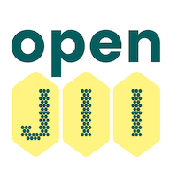

# OpenJII Platform

<p align="center">
  
</p>

**OpenJII** is an open-source platform for agricultural IoT research and plant phenotyping developed by the Jan IngenHousz Institute. The platform enables researchers to collect, process, and analyze sensor data from MultispeQ devices and other plant monitoring tools.

[](https://github.com/Jan-IngenHousz-Institute/open-jii/blob/main/LICENSE)

## 🔍 Overview

OpenJII supports the entire plant research workflow, from data collection to analysis:

- **Data Collection** - Secure MQTT-based protocol for MultispeQ devices and custom IoT sensors
- **Data Processing** - Sophisticated data pipeline with medallion architecture
- **Experiment Management** - Tools for creating and managing research experiments
- **Data Analysis** - Jupyter notebooks and visualization tools for research
- **Documentation** - Comprehensive guides for users and developers
- **Custom IoT Development** - Node-RED flows for creating and integrating your own IoT devices

## 🛠️ Technology Stack

OpenJII leverages modern technologies across its stack:

### Frontend

- **Next.js** - React framework for the web application
- **Tailwind CSS** - Utility-first CSS framework for styling
- **Radix UI** via ShadCN UI - Accessible component primitives
- **TypeScript** - For type-safe code

### Backend

- **NestJS** - Progressive Node.js framework for building server-side applications
- **Drizzle ORM** - TypeScript ORM for SQL databases with a focus on developer experience
- **Zod** - TypeScript-first schema validation with static type inference

### IoT Development

- **Node-RED** - Flow-based development tool for visual programming of IoT devices
- **MQTT** - Lightweight messaging protocol for IoT communications
- **Custom Nodes** - Extended Node-RED functionality for agricultural sensors

### Infrastructure

- **OpenTofu** (formerly Terraform) - Infrastructure as Code for cloud provisioning
- **AWS** - Cloud infrastructure provider (IoT Core, S3, Timestream, etc.)
- **Docker** - Containerization for development and deployment
- **Databricks** - Unified analytics platform for data processing

### Documentation

- **Docusaurus** - Documentation website generator

## 🏛️ Architecture

The platform is built using a modern cloud-native architecture:

- **Frontend**: Next.js web application for user interface
- **Backend**: NestJS API for experiment management and authentication
- **Data Platform**: Databricks for data processing and analytics
- **IoT Infrastructure**: AWS IoT Core for device connectivity
- **Storage**: Combination of S3 for raw data and Timestream for time-series metrics
- **Authentication**: OIDC-compliant identity provider

For details on the infrastructure, see the [infrastructure documentation](infrastructure/README.md).

## 📋 Repository Structure

This monorepo is managed with Turborepo and contains:

### Apps

- `web`: Next.js web application (OpenJII Community Hub)
- `docs`: Docusaurus documentation site
- `backend`: NestJS API for experiment management
- `node-red`: Node-RED flows for IoT device integration and development
- `tools/multispeq_mqtt_interface`: Tools for interfacing with MultispeQ devices

### Packages

- `database`: Database schema and migrations with Drizzle ORM
- `ui`: Shared UI components built with Radix UI/ShadCN
- `validator`: Data validation utilities powered by Zod
- `eslint-config`: Shared ESLint configurations
- `typescript-config`: Shared TypeScript configurations

### Infrastructure

- `infrastructure/`: OpenTofu (Terraform) modules for AWS cloud deployment
- `infrastructure/modules/`: Reusable infrastructure components
- `infrastructure/env/`: Environment-specific configurations
- `infrastructure/notebooks/`: Databricks notebooks for data processing

## 🚀 Getting Started

### Prerequisites

- Node.js v22+
- pnpm (as package manager)
- Docker (for local development)
- AWS CLI (for infrastructure deployment)
- OpenTofu CLI (for infrastructure management)

### Installation

```bash
# Clone the repository
git clone https://github.com/Jan-IngenHousz-Institute/open-jii.git
cd open-jii

# Use the correct Node version
nvm use

# Enable PNPM
corepack enable

# Install dependencies
pnpm install
```

### Development

```bash
# Run development server for all applications
pnpm dev

# Build all applications
pnpm build

# Run tests
pnpm test

# Lint code
pnpm lint

# Start Node-RED for IoT device development
pnpm --filter node-red start
```

### IoT Development with Node-RED

The platform includes a Node-RED application that allows you to create and integrate your own IoT devices:

1. Start the Node-RED server:

   ```bash
   pnpm --filter node-red start
   ```

2. Access the Node-RED editor at http://localhost:1880

3. Use the custom OpenJII nodes to:
   - Connect to the MQTT broker
   - Process sensor data
   - Create visualization dashboards
   - Integrate with the OpenJII data pipeline

For detailed tutorials on creating your own IoT devices with Node-RED, see the [IoT Development Guide](apps/docs/docs/004-iot-development).

### Infrastructure Management

```bash
# Initialize OpenTofu
cd infrastructure/env/dev
tofu init

# Plan infrastructure changes
tofu plan

# Apply infrastructure changes
tofu apply
```

## 📚 Documentation (WIP)

Complete documentation is available in the [Documentation Hub](https://docs.openjii.org) or in the `apps/docs` directory.

Key documentation sections:

- [Getting Started](apps/docs/docs/002-getting-started)
- [Data Platform](apps/docs/docs/003-data-platform)
- [IoT Development](apps/docs/docs/004-iot-development)
- [Developer's Guide](apps/docs/docs/006-for-developers)
- [Design Decisions](apps/docs/docs/006-for-developers/001-developers-guide/001-design-decisions)

## 🤝 Contributing

Contributions are welcome! Please read our [Contributing Guidelines](CONTRIBUTING.md) and [Code of Conduct](CODE_OF_CONDUCT.md) before submitting changes.

1. Fork the repository
2. Create your feature branch (`git checkout -b feature/amazing-feature`)
3. Commit your changes (`git commit -m 'Add some amazing feature'`)
4. Push to the branch (`git push origin feature/amazing-feature`)
5. Open a Pull Request

## 📄 License

This project is licensed under the terms found in [LICENSE](LICENSE).

## 🔗 Resources

- [Project Website](https://www.openjii.org)
- [Jan IngenHousz Institute](https://www.jan-ingenhousz-institute.org)
- [Documentation](https://docs.openjii.org)
