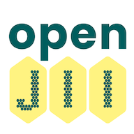
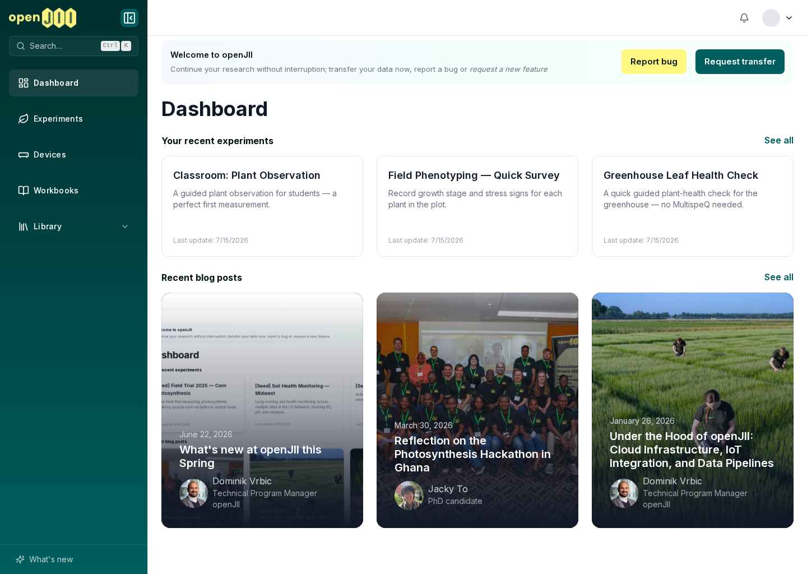
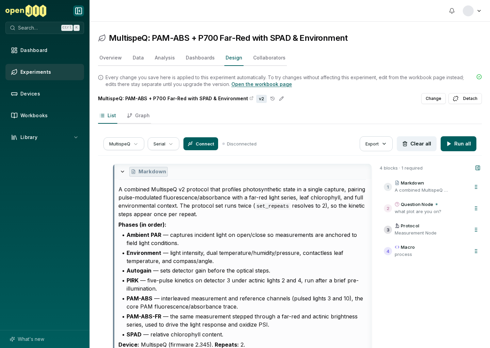
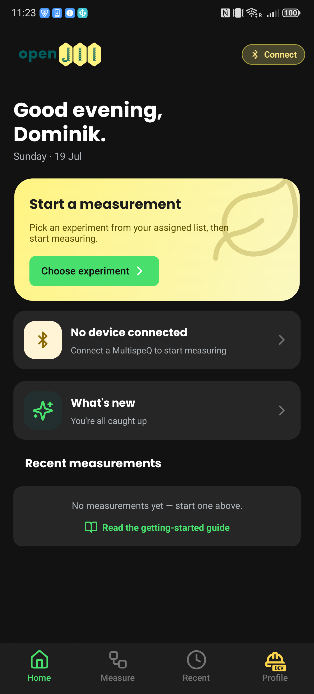
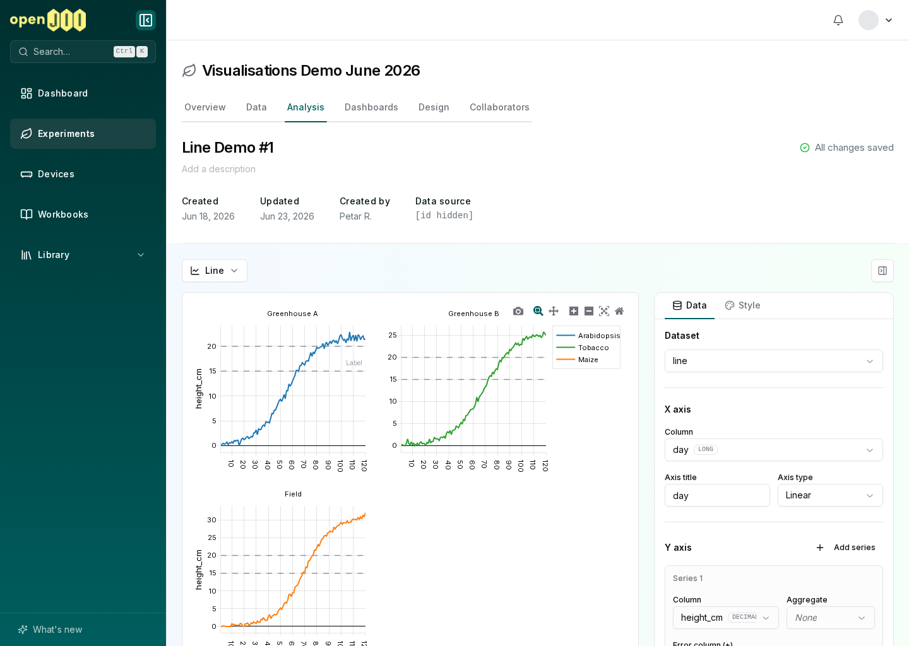

# openJII Platform

<p align="center">
  
</p>

<p align="center">
  <a href="https://codecov.io/gh/Jan-IngenHousz-Institute/open-jii"></a>
  <a href="./LICENSE"></a>
</p>

An open-source platform for photosynthesis research and plant phenotyping, developed by the [Jan IngenHousz Institute](https://www.jan-ingenhousz-institute.org). openJII helps researchers collect, process, and analyze sensor data from MultispeQ devices and continuous IoT sensors.

## What is openJII?

openJII supports plant researchers throughout their workflow:

- **Design experiments** with workbooks: measurement protocols, questions, analysis macros, and device commands in one reusable design
- **Measure in the field** with the mobile app, connected to MultispeQ handhelds over Bluetooth or USB — including offline capture and sync
- **Ingest continuous sensor data** from autonomous IoT devices (Ambyte and friends) over MQTT
- **Process and analyze data** in a Databricks medallion pipeline, with visualizations and dashboards on the platform
- **Share results** with collaborators, embargo controls, and open/FAIR data exports

<p align="center">
  
</p>

<table>
  <tr>
    <td align="center" width="55%">
      
      <sub>Workbook designer</sub>
    </td>
    <td align="center" width="22%">
      
      <sub>Mobile app</sub>
    </td>
    <td align="center" width="23%">
      
      <sub>Data analysis</sub>
    </td>
  </tr>
</table>

## Monorepo layout

A pnpm + Turborepo workspace.

### Apps

| App                  | What it is                                                                                                                                 |
| -------------------- | ------------------------------------------------------------------------------------------------------------------------------------------ |
| `apps/web`           | Next.js web platform — public site (Contentful-driven) plus the authenticated research platform; deployed with OpenNext                    |
| `apps/backend`       | NestJS API — contract-first oRPC endpoints, Better Auth, Drizzle ORM, AWS integrations (IoT Core, S3, Lambda, Cognito)                     |
| `apps/mobile`        | Expo / React Native app for field measurements with MultispeQ devices (Bluetooth + USB serial, offline-first with SQLite)                  |
| `apps/data`          | Databricks workspace — Lakeflow pipelines, notebooks, and Python packages (managed with [uv](https://docs.astral.sh/uv/))                  |
| `apps/macro-sandbox` | Sandboxed AWS Lambda environment that executes user-written analysis macros in Python, JavaScript, and R                                   |
| `apps/docs`          | Documentation site ([docs.openjii.org](https://docs.openjii.org)) built with Fumadocs; API reference generated from OpenAPI/AsyncAPI specs |
| `apps/tools`         | Developer tools, e.g. the MultispeQ MQTT interface (`apps/tools/multispeq_mqtt_interface`) for bridging devices to AWS IoT                 |

### Packages

| Package                  | What it is                                                                       |
| ------------------------ | -------------------------------------------------------------------------------- |
| `packages/api`           | oRPC API contract shared by backend, web, and mobile; generates the OpenAPI spec |
| `packages/auth`          | [Better Auth](https://better-auth.com) configuration (web + mobile)              |
| `packages/database`      | Drizzle ORM schema, migrations, seeding, and local Postgres compose scripts      |
| `packages/ui`            | Shared React component library (shadcn/Radix, charts, maps, forms)               |
| `packages/cms`           | Contentful integration for the public site (GraphQL codegen, live preview)       |
| `packages/i18n`          | i18next internationalization (en-US, de-DE)                                      |
| `packages/iot`           | Shared IoT device types and connector logic                                      |
| `packages/transactional` | Transactional email templates (React Email)                                      |
| `packages/analytics`     | PostHog analytics and feature flags (client + server)                            |

Infrastructure lives in `infrastructure/` (AWS, managed with [OpenTofu](https://opentofu.org)), and shared configs (ESLint, TypeScript, Tailwind, Vitest, release tooling) in `tooling/`.

## Tech stack

- **Frontend**: Next.js (React 19) with Tailwind CSS and shadcn/Radix components
- **Mobile**: Expo / React Native
- **API**: NestJS with contract-first [oRPC](https://orpc.unnoq.com), Better Auth, Drizzle ORM, and Zod validation
- **Data**: Databricks (medallion architecture) fed by AWS IoT Core / Kinesis ingestion
- **Infrastructure**: AWS, managed with OpenTofu
- **Content & comms**: Contentful (public site content), React Email (transactional email), PostHog (analytics + feature flags)

## Getting started

### Prerequisites

- Node.js v24+ (see `.nvmrc`)
- pnpm 11 (via corepack)
- Docker (local Postgres and backend containers)
- [uv](https://docs.astral.sh/uv/) (only for the `apps/data` Databricks workspace)

### Installation

```bash
git clone https://github.com/Jan-IngenHousz-Institute/open-jii.git
cd open-jii
nvm use
corepack enable
pnpm install
```

### Development commands

```bash
pnpm dev:fb       # Run just the web app + backend (most common)
pnpm dev          # Run all development servers
pnpm db:setup     # First-time setup: start Postgres and reset + migrate the DB (wipes existing local data)
pnpm db:migrate   # Apply pending migrations (non-destructive)
pnpm db:studio    # Browse the database with Drizzle Studio

pnpm lint         # Check code style
pnpm typecheck    # Type-check all packages
pnpm test         # Run tests
pnpm format       # Format with Prettier
pnpm build        # Build all apps and packages
```

API documentation is generated from the oRPC contract (`pnpm --filter @repo/api generate:openapi`) and rendered in the docs site's API reference.

## Documentation

Visit the [Documentation Hub](https://docs.openjii.org) or browse `apps/docs` for:

- Researcher guide (experiments, devices & protocols, measuring, data analysis, sharing)
- Developer guides, architecture docs, and design decisions (ADRs)
- REST and MQTT API references

## Contentful live preview

To enable live preview of content on the Contentful website for your deployed development site, update the preview URL in Contentful: **Settings** → **Content preview** → edit the **blog** preview entry and point it at your deployed dev site.

## Contributing

We welcome contributions! Please check our [Contributing Guidelines](CONTRIBUTING.md) and [Code of Conduct](CODE_OF_CONDUCT.md).

## License

This project is licensed under the terms found in [LICENSE](LICENSE).

## Links

- [Project Website](https://www.openjii.org)
- [Documentation](https://docs.openjii.org)
- [Jan IngenHousz Institute](https://www.jan-ingenhousz-institute.org)
