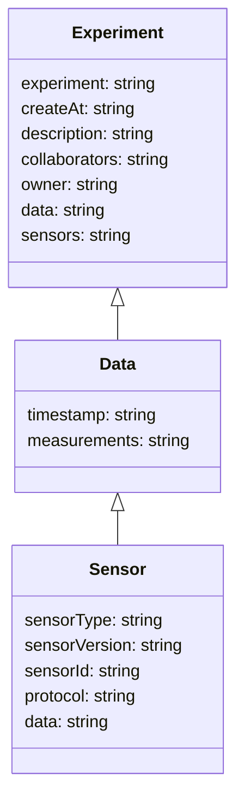

# Updated Document for open-jii Project

Below is the revised documentation reflecting the latest MQTT topics and class diagram changes.

---

## 1. MQTT Topics

### 1.1. Experiment Ingest

```text
experiment/data/ingest/v1/<experimentId>/<sensorType>/v<sensorVersion>/<sensorId>/<protocolId>
```

- experiment/data/ingest/v1
  This prefix indicates messages associated with experiment data ingestion under version 1 of the ingest format.
- <experimentId>  
   Unique identifier of the experiment (e.g., exp123).
- <sensorType>  
   The type or family of sensor.  
   Could be a short name or a UUID (e.g., soilSensor, tempSensor, or 123e4567-e89b-12d3-a456-426614174000).
- v<sensorVersion>
  Sensor firmware/hardware revision, prefixed with v.
  Example: v1, v2.1, etc.
- <sensorId>  
   UUID (abcdef12-1234-abcd-ef12-12345678abcd).
- <protocolId>  
   Unique name or UUID representing the sampling or measurement protocol (e.g., protoA, or abcdef12-1234-abcd-ef12-12345678abcd).

#### Example

```text
experiment/data/ingest/v1/exp123/soilSensor/v2/sensor01/protoA
```

This might represent data for experiment exp123 from a soil sensor (firmware v2), identified as sensor01, following protocol protoA.

---

### 1.2. Device Actions

```text
device/action/<update|status|kill|init|...>/<deviceId|deviceType>
```

- device/action
  - Indicates an action or command channel for devices in the system.
- <update|status|kill|init|...>
  - The specific action to be performed (update, status, kill, init, etc.).
- <deviceId|deviceType>
  - Either a unique device ID (e.g., abc123) or a device type (e.g., sensor, gateway) if broadcasting to multiple devices of the same type.

#### Examples

```text
device/action/update/abc123
```

Command device with ID abc123 to perform an update.

```text
device/action/status/sensor
```

Request status from all devices of type sensor.

---

### 1.3. OTA Updates

```text
ota/<deviceType>/<deviceId>/v<targetVersion>
```

- ota
  - Indicates this message pertains to Over-The-Air updates.
- <deviceType>  
  - Category or class of the device (e.g., sensor, gateway).
- <deviceId>  
  - Unique identifier of the specific device.
- v<targetVersion>
  - The target firmware/software version for the OTA update.

#### Example

```text
ota/sensor/abc123/v2.1
```

OTA update instructions or package reference for device abc123, targeting version 2.1.

---

## 2. Class Diagram

Below is the updated Mermaid diagram, showing how the Experiment, Data, and Sensor entities relate to one another.



### Entity Descriptions

- Experiment  
  Represents a specific research experiment. Contains metadata like creation date, description, collaborators, owner, and references to data and sensors.

- Data  
  Encompasses measurements and associated timestamps. An experiment can have multiple data records, each potentially linked to one or more sensors.

- Sensor  
  Defines a sensor’s type, version, unique identifier, and protocol. A sensor can produce (or be associated with) one or more data entries.

---

## 3. Notes & Best Practices

1. Topic Structure  
   Keep tokens short, relevant, and stable. Avoid placing rapidly changing attributes (like timestamps or measurement values) in the topic.

2. Wildcard Subscriptions  
   MQTT allows for + (single-level) and # (multi-level) wildcards.

   - To subscribe to all experiment ingest data for any version, sensor, or protocol:
     ```text
     experiment/data/ingest/v1/#
     ```
   - To subscribe to all device actions for kills or updates across any device:
     ```text
     device/action/+
     ```

3. Message Payload  
   Store dynamic values (e.g., measurement data, timestamps, environment info) in the payload rather than the topic.

4. Extendability  
   As your system grows, you can add new tokens (e.g., environment or region) to the topic path as needed, but maintain a consistent hierarchical approach.
