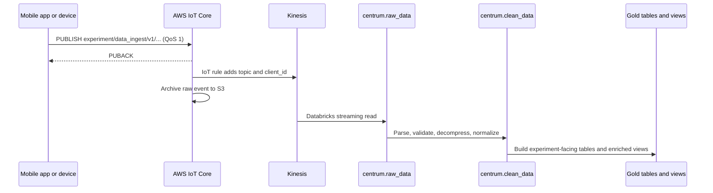

{/* verified: code@b92f75cb4 2026-07-23 */}

openJII uses an extract-load-transform path: capture and acknowledge the measurement first, preserve the raw event, then refine it in Databricks.

## Ingestion flow



### Anatomy of the experiment topic

The canonical topic is:

```text
experiment/data_ingest/v1/{experimentId}/{sensorType}/{sensorVersion}/{sensorId}/{protocolId}
```

Each `/` separates a topic level, and every level carries routing or provenance
meaning:

<div
  style={{
    display: "flex",
    flexWrap: "wrap",
    gap: "4px 0",
    alignItems: "flex-start",
    fontFamily: "var(--font-mono, monospace)",
    fontSize: "0.85rem",
    lineHeight: 1.3,
    margin: "1rem 0",
  }}
>
  {[
    ["experiment", "domain"],
    ["data_ingest", "action"],
    ["v1", "schema version"],
    ["{experimentId}", "which experiment"],
    ["{sensorType}", "sensor family"],
    ["{sensorVersion}", "firmware / hardware rev"],
    ["{sensorId}", "which physical sensor"],
    ["{protocolId}", "measurement protocol"],
  ].map(([part, label], i) => (
    <span key={part} style={{ display: "flex", alignItems: "flex-start" }}>
      {i > 0 && (
        <span
          style={{ color: "var(--color-fd-muted-foreground)", padding: "0 0.3rem" }}
          aria-hidden
        >
          /
        </span>
      )}
      <span style={{ display: "flex", flexDirection: "column", alignItems: "center" }}>
        <strong style={{ color: "var(--color-fd-primary)" }}>{part}</strong>
        <span style={{ color: "var(--color-fd-muted-foreground)", fontSize: "0.7rem" }}>
          {label}
        </span>
      </span>
    </span>
  ))}
</div>

| Level             | Meaning                                             | How it is used                                                                      |
| ----------------- | --------------------------------------------------- | ----------------------------------------------------------------------------------- |
| `experiment`      | Domain prefix.                                      | Groups all experiment traffic; the IoT rule subscribes beneath it.                  |
| `data_ingest`     | Action within the domain.                           | Distinguishes measurement ingestion from other experiment traffic.                  |
| `v1`              | Topic schema version.                               | Lets a future payload or path change ship as `v2` without breaking `v1` publishers. |
| `{experimentId}`  | Unique identifier of the experiment.                | Routes each measurement to its experiment's data tables.                            |
| `{sensorType}`    | Sensor family (for example `multispeq`, `ambit`).   | Selects family-specific parsing and normalization downstream.                       |
| `{sensorVersion}` | Device firmware or hardware revision.               | Preserved as provenance so results can be traced to device behavior.                |
| `{sensorId}`      | Unique identifier of the physical device.           | Attributes readings to one device across sessions.                                  |
| `{protocolId}`    | Identifier of the sampling or measurement protocol. | Records which method produced the reading.                                          |

The exact channel parameters and message schema are maintained in the [MQTT API reference](/api/mqtt). Do not copy the deployed broker endpoint from examples: obtain environment-specific connection details and credentials through the supported application flow. For MQTT topic fundamentals, wildcards, and naming best practices, [HiveMQ's MQTT Essentials on topics](https://www.hivemq.com/blog/mqtt-essentials-part-5-mqtt-topics-best-practices/) is a good primer.

## Client-side durability

The mobile app uses a transactional outbox:

1. A measurement is saved in the local SQLite `measurements` table as `pending`.
2. The outbox publishes the stored topic and payload through one lazily connected MQTT transport.
3. A QoS 1 PUBACK marks the row `successful`.
4. Retryable failures use the configured backoff and eventually become `failed`; pending and failed rows are rehydrated after restart, foregrounding, or reconnect.

The `sample` field is gzip-compressed and base64-encoded before upload, with `_sample_encoding: "gzip+base64"`. The outer JSON envelope remains readable to the AWS IoT rule. The outbox adds `_client_id`, a local row UUID that downstream processing can use when diagnosing repeat delivery after a crash between PUBACK and the local status update.

## AWS routing

The IoT rule in `infrastructure/modules/iot-core/main.tf` selects the original topic and authenticated MQTT client ID into the event. It forwards each event to Kinesis and writes a raw archive object to S3. The Databricks Bronze pipeline reads Kinesis directly using a Unity Catalog service credential and records Kinesis sequence, shard, arrival, and ingestion metadata.

MQTT is at-least-once delivery. Consumers must not assume that receiving PUBACK means every downstream transformation is already complete, or that an event can never be seen twice.

## Imported and uploaded data

Not all data starts in MQTT:

- external project-transfer Parquet files enter `raw_imported_data` with Auto Loader;
- web uploads enter `raw_uploaded_data`;
- payloads too large for MQTT (over 128 KB) are uploaded straight to S3 through a backend-issued pre-signed URL (`/api/v1/iot/upload-url`, keyed `large-iot/{experimentId}/{uuid}.json`) and enter `raw_large_data` with Auto Loader directory listing;
- all are normalized into the same central model downstream.

Because pre-signed uploads never touch the broker, there is no authenticated MQTT client identity: `client_id` stays null and the payload's self-reported `device_id` is not promoted to a trusted identity.

This lets researchers query one experiment-facing model without erasing the source-specific raw layers.

## Macro input projection

Macro execution reads one canonical value without rewriting the stored event.
Every execution host calls the shared normalizer for every input. The
normalizer projects only a plain top-level object with its own `sample`
property when that property contains a JSON object or array. Direct objects,
scalars, `null`, and root arrays of any length pass through unchanged.

The same normalizer runs at each execution surface, but Databricks deliberately
adapts its legacy source shape before the host receives it:

| Surface                          | Value supplied to normalization and resulting root-array behavior                                    |
| -------------------------------- | ---------------------------------------------------------------------------------------------------- |
| Generic backend API              | Receives the caller's root array; macro code receives the complete array, including `[]`             |
| Workbook web                     | Preserves a root-array output for the backend; macro `json`, `ctx`, and branches see the whole array |
| Mobile                           | Local JavaScript or Pyodide Python host passes the complete root array to user code                  |
| Databricks Gold macro processing | Legacy producer wraps a source root array as `{ sample: data }`; macro code receives the first item  |

This root-array change is intentional migration behavior. Generic backend,
web, and mobile execution no longer interprets `[first, second]` as a transport
envelope and no longer rejects `[]`; those values reach macro code whole. Code
that wants one element must select it explicitly.

Databricks is the deliberate compatibility exception. Its adapter keeps
wrapping legacy source arrays before the backend batch call, so the shared
normalizer still applies sample-envelope semantics: it selects the first
measurement, and an empty source array becomes `{ sample: [] }` and fails. This
preserves existing Gold macro results while the other surfaces adopt the new
generic JSON contract.

At the generic backend, web, and mobile boundaries, an empty root array is valid
and remains `[]`. Only a value actually presented to normalization as an empty
sample envelope (`{ sample: [] }`) fails before macro code runs. In a backend
batch, only that item fails and valid siblings continue. If a `sample` envelope
contains multiple entries, the first is selected and the host emits a
content-free warning containing the source and counts, not measurement values.
The operation is deliberately shallow: it inspects only the input object's own
top-level `sample` property and never traverses nested values.

This is a read-time boundary, not an ingestion transformation. It does not
rewrite MQTT payloads, source measurement columns, workbook output cells, or
mobile upload payloads. Canonical projection is used when a host exposes a value
to macro `json`, builds macro `ctx`, or resolves a workbook branch field.
Databricks writes macro results separately to `experiment_macro_data`; it does
not replace the source measurement.

Language sandboxes receive the value prepared by their host. There is no
sandbox normalization guard, shadow/enforce mode, or event marker: the shared
host normalizer is the only compatibility projection. Macro authors must not
depend on wrapper behavior such as reading `json.sample[0]`.

For mixed-version deployments, release the backend normalization first while
the old sandbox remains compatible, then release the web producer and
Databricks adapter, and simplify the language sandboxes last. The deployment
workflow encodes the same successful-or-skipped dependency order without
forcing unchanged applications to deploy.

## Where to inspect the implementation

| Concern                     | Current source                                                                  |
| --------------------------- | ------------------------------------------------------------------------------- |
| MQTT contract               | `asyncapi.yaml`                                                                 |
| Mobile payload construction | `apps/mobile/src/features/recent-measurements/services/build-upload-payload.ts` |
| Durable outbox              | `apps/mobile/src/features/recent-measurements/services/outbox.ts`               |
| MQTT session                | `apps/mobile/src/features/connection/services/mqtt/`                            |
| IoT routing                 | `infrastructure/modules/iot-core/main.tf`                                       |
| Bronze/Silver/Gold pipeline | `apps/data/src/pipelines/centrum/`                                              |
| Shared macro projection     | `packages/api/src/transforms/normalize-macro-input.ts`                          |
| Backend macro execution     | `apps/backend/src/macros/application/use-cases/`                                |
| Mobile macro execution      | `apps/mobile/src/features/measurement-flow/utils/process-scan/`                 |

Continue with [Medallion layers](/developers/architecture/medallion-layers) for the transformation model.
