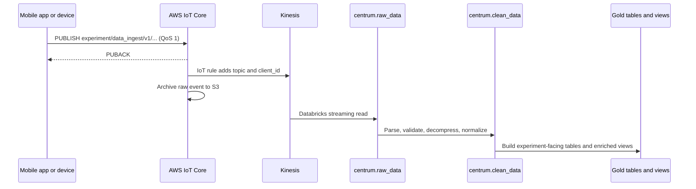

{/* verified: code@22aae4d36 2026-07-22 */}

openJII uses an extract-load-transform path: capture and acknowledge the measurement first, preserve the raw event, then refine it in Databricks.

## Ingestion flow



### Anatomy of the experiment topic

The canonical topic is:

```text
experiment/data_ingest/v1/{experimentId}/{sensorType}/{sensorVersion}/{sensorId}/{protocolId}
```

Each `/` separates a topic level, and every level carries routing or provenance
meaning:

<div
  style={{
    display: "flex",
    flexWrap: "wrap",
    gap: "4px 0",
    alignItems: "flex-start",
    fontFamily: "var(--font-mono, monospace)",
    fontSize: "0.85rem",
    lineHeight: 1.3,
    margin: "1rem 0",
  }}
>
  {[
    ["experiment", "domain"],
    ["data_ingest", "action"],
    ["v1", "schema version"],
    ["{experimentId}", "which experiment"],
    ["{sensorType}", "sensor family"],
    ["{sensorVersion}", "firmware / hardware rev"],
    ["{sensorId}", "which physical sensor"],
    ["{protocolId}", "measurement protocol"],
  ].map(([part, label], i) => (
    <span key={part} style={{ display: "flex", alignItems: "flex-start" }}>
      {i > 0 && (
        <span
          style={{ color: "var(--color-fd-muted-foreground)", padding: "0 0.3rem" }}
          aria-hidden
        >
          /
        </span>
      )}
      <span style={{ display: "flex", flexDirection: "column", alignItems: "center" }}>
        <strong style={{ color: "var(--color-fd-primary)" }}>{part}</strong>
        <span style={{ color: "var(--color-fd-muted-foreground)", fontSize: "0.7rem" }}>
          {label}
        </span>
      </span>
    </span>
  ))}
</div>

| Level             | Meaning                                             | How it is used                                                                      |
| ----------------- | --------------------------------------------------- | ----------------------------------------------------------------------------------- |
| `experiment`      | Domain prefix.                                      | Groups all experiment traffic; the IoT rule subscribes beneath it.                  |
| `data_ingest`     | Action within the domain.                           | Distinguishes measurement ingestion from other experiment traffic.                  |
| `v1`              | Topic schema version.                               | Lets a future payload or path change ship as `v2` without breaking `v1` publishers. |
| `{experimentId}`  | Unique identifier of the experiment.                | Routes each measurement to its experiment's data tables.                            |
| `{sensorType}`    | Sensor family (for example `multispeq`, `ambit`).   | Selects family-specific parsing and normalization downstream.                       |
| `{sensorVersion}` | Sensor firmware or hardware revision.               | Preserved as provenance so results can be traced to instrument behavior.            |
| `{sensorId}`      | Unique identifier of the physical sensor.           | Attributes readings to one instrument across sessions.                              |
| `{protocolId}`    | Identifier of the sampling or measurement protocol. | Records which method produced the reading.                                          |

The exact channel parameters and message schema are maintained in the [MQTT API reference](/api/mqtt). Do not copy the deployed broker endpoint from examples: obtain environment-specific connection details and credentials through the supported application flow. For MQTT topic fundamentals, wildcards, and naming best practices, [HiveMQ's MQTT Essentials on topics](https://www.hivemq.com/blog/mqtt-essentials-part-5-mqtt-topics-best-practices/) is a good primer.

## Client-side durability

The mobile app uses a transactional outbox:

1. A measurement is saved in the local SQLite `measurements` table as `pending`.
2. The outbox publishes the stored topic and payload through one lazily connected MQTT transport.
3. A QoS 1 PUBACK marks the row `successful`.
4. Retryable failures use the configured backoff and eventually become `failed`; pending and failed rows are rehydrated after restart, foregrounding, or reconnect.

The `sample` field is gzip-compressed and base64-encoded before upload, with `_sample_encoding: "gzip+base64"`. The outer JSON envelope remains readable to the AWS IoT rule. The outbox adds `_client_id`, a local row UUID that downstream processing can use when diagnosing repeat delivery after a crash between PUBACK and the local status update.

## AWS routing

The IoT rule in `infrastructure/modules/iot-core/main.tf` selects the original topic and authenticated MQTT client ID into the event. It forwards each event to Kinesis and writes a raw archive object to S3. The Databricks Bronze pipeline reads Kinesis directly using a Unity Catalog service credential and records Kinesis sequence, shard, arrival, and ingestion metadata.

MQTT is at-least-once delivery. Consumers must not assume that receiving PUBACK means every downstream transformation is already complete, or that an event can never be seen twice.

## Imported and uploaded data

Not all data starts in MQTT:

- external project-transfer Parquet files enter `raw_imported_data` with Auto Loader;
- web uploads enter `raw_uploaded_data`;
- both are normalized into the same central model downstream.

This lets researchers query one experiment-facing model without erasing the source-specific raw layers.

## Where to inspect the implementation

| Concern                     | Current source                                                                  |
| --------------------------- | ------------------------------------------------------------------------------- |
| MQTT contract               | `asyncapi.yaml`                                                                 |
| Mobile payload construction | `apps/mobile/src/features/recent-measurements/services/build-upload-payload.ts` |
| Durable outbox              | `apps/mobile/src/features/recent-measurements/services/outbox.ts`               |
| MQTT session                | `apps/mobile/src/features/connection/services/mqtt/`                            |
| IoT routing                 | `infrastructure/modules/iot-core/main.tf`                                       |
| Bronze/Silver/Gold pipeline | `apps/data/src/pipelines/centrum/`                                              |

Continue with [Medallion layers](/developers/architecture/medallion-layers) for the transformation model.
