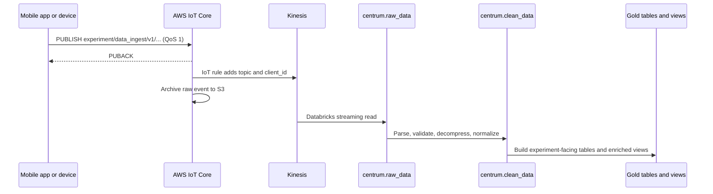

{/* verified: code@12a361a74966 2026-07-19 */}

openJII uses an extract-load-transform path: capture and acknowledge the measurement first, preserve the raw event, then refine it in Databricks.

## Ingestion flow



The canonical topic is:

```text
experiment/data_ingest/v1/{experimentId}/{sensorType}/{sensorVersion}/{sensorId}/{protocolId}
```

The exact channel parameters and message schema are maintained in the [MQTT API reference](/api/mqtt). Do not copy the deployed broker endpoint from examples: obtain environment-specific connection details and credentials through the supported application flow.

## Client-side durability

The mobile app uses a transactional outbox:

1. A measurement is saved in the local SQLite `measurements` table as `pending`.
2. The outbox publishes the stored topic and payload through one lazily connected MQTT transport.
3. A QoS 1 PUBACK marks the row `successful`.
4. Retryable failures use the configured backoff and eventually become `failed`; pending and failed rows are rehydrated after restart, foregrounding, or reconnect.

The `sample` field is gzip-compressed and base64-encoded before upload, with `_sample_encoding: "gzip+base64"`. The outer JSON envelope remains readable to the AWS IoT rule. The outbox adds `_client_id`, a local row UUID that downstream processing can use when diagnosing repeat delivery after a crash between PUBACK and the local status update.

## AWS routing

The IoT rule in `infrastructure/modules/iot-core/main.tf` selects the original topic and authenticated MQTT client ID into the event. It forwards each event to Kinesis and writes a raw archive object to S3. The Databricks Bronze pipeline reads Kinesis directly using a Unity Catalog service credential and records Kinesis sequence, shard, arrival, and ingestion metadata.

MQTT is at-least-once delivery. Consumers must not assume that receiving PUBACK means every downstream transformation is already complete, or that an event can never be seen twice.

## Imported and uploaded data

Not all data starts in MQTT:

- external project-transfer Parquet files enter `raw_imported_data` with Auto Loader;
- web uploads enter `raw_uploaded_data`;
- both are normalized into the same central model downstream.

This lets researchers query one experiment-facing model without erasing the source-specific raw layers.

## Where to inspect the implementation

| Concern                     | Current source                                                                  |
| --------------------------- | ------------------------------------------------------------------------------- |
| MQTT contract               | `asyncapi.yaml`                                                                 |
| Mobile payload construction | `apps/mobile/src/features/recent-measurements/services/build-upload-payload.ts` |
| Durable outbox              | `apps/mobile/src/features/recent-measurements/services/outbox.ts`               |
| MQTT session                | `apps/mobile/src/features/connection/services/mqtt/`                            |
| IoT routing                 | `infrastructure/modules/iot-core/main.tf`                                       |
| Bronze/Silver/Gold pipeline | `apps/data/src/pipelines/centrum/`                                              |

Continue with [Medallion layers](/developers/architecture/medallion-layers) for the transformation model.
