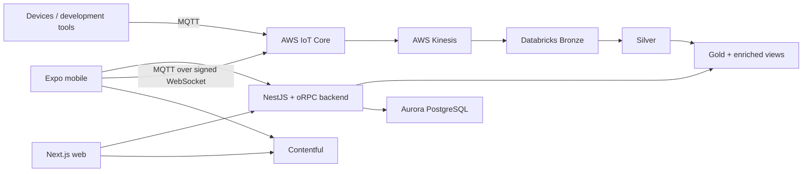

{/* verified: code@12a361a74966 2026-07-19 */}

openJII is a pnpm/Turborepo monorepo. Product behavior is split across web, mobile, backend, data, and documentation applications; shared contracts and reusable capabilities live in workspace packages.

## System map

## Applications

| Path                 | Runtime                          | Responsibility                                                                                                 |
| -------------------- | -------------------------------- | -------------------------------------------------------------------------------------------------------------- |
| `apps/web`           | Next.js 16 / React 19            | Experiment and workbook management, visualization, uploads, and public content.                                |
| `apps/mobile`        | Expo / React Native              | Device connections, workbook-guided measurement, offline storage, and MQTT sync.                               |
| `apps/backend`       | NestJS / oRPC                    | Authentication integration, business rules, database access, AWS credentials, and data-platform orchestration. |
| `apps/data`          | Python / PySpark                 | Databricks pipelines, exports, transfers, and scheduled data tasks.                                            |
| `apps/macro-sandbox` | Containerized Lambda runtimes    | Isolated execution of user-authored Python, JavaScript, and R macros.                                          |
| `apps/docs`          | Fumadocs / Next.js static export | Guide, developer documentation, and generated API references.                                                  |
| `apps/tools`         | Developer utilities              | Includes the Python MultispeQ MQTT interface under `apps/tools/multispeq_mqtt_interface`.                      |

## Shared packages

The most important dependency boundaries are:

- `packages/api`: Zod schemas, oRPC contracts, OpenAPI generation, and shared API types.
- `packages/auth`: Better Auth configuration and clients.
- `packages/database`: Drizzle schema, migrations, and database client.
- `packages/iot`: device drivers and transport-independent command execution.
- `packages/cms`: Contentful client, generated GraphQL SDK, alerts, and public-site components.
- `packages/transactional`: React Email templates and Contentful-backed rendering.
- `packages/ui`, `packages/i18n`, and `packages/analytics`: shared presentation, localization, and telemetry.
- `tooling/*`: reusable TypeScript, ESLint, Tailwind, Vitest, and release configuration.

## Request and data boundaries

The web and mobile clients use contracts from `packages/api`, while the backend implements those contracts with oRPC inside NestJS. Authentication is handled by Better Auth; AWS Cognito Identity is separately used to obtain scoped AWS credentials for mobile MQTT access.

Measurements do not travel through the transactional backend API. The mobile app stores them locally, publishes them to the experiment ingestion topic, and waits for MQTT QoS 1 acknowledgement. AWS IoT rules forward the message to Kinesis and also archive raw IoT messages to S3. Databricks reads Kinesis into the central `centrum` pipeline.

Read [Data ingestion](/developers/architecture/data-ingestion), [Time synchronization](/developers/architecture/time-synchronization), and [Medallion layers](/developers/architecture/medallion-layers) for the detailed paths. Contract details live in the [REST](/api/rest) and [MQTT](/api/mqtt) references.

## Deployment model

OpenTofu under `infrastructure/` declares AWS and Databricks resources. GitHub Actions authenticates through OIDC; contributors should plan infrastructure changes but must not apply shared environments from a feature branch. The docs app is a static export to S3/CloudFront, while the web app uses the repository's OpenNext deployment path.
