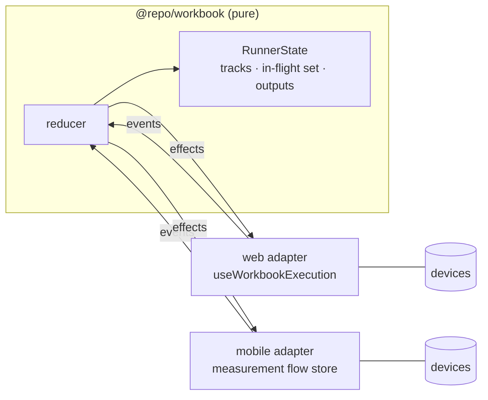
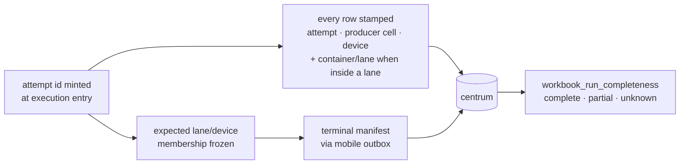

{/* verified: code@546757ef4 2026-08-08 */}

Both hosts (web and the mobile app) execute workbooks through one shared
runtime, `@repo/workbook`. The runtime is a pure reducer over an event queue:
hosts start physical effects (device commands, macro runs, uploads) through
ports and feed results back as events; the runtime owns all control flow.
Neither host reinterprets branches, jumps, or containers on its own.

## Tracks and effects

`RunnerState` holds a map of **tracks**. An ordinary run has one `main` track;
entering a parallel container spawns one track per lane. Everything that used
to be global is track-local: the cursor (including its lane-body path), branch
visit counts and return stack, dispatch queue and consumed targets, progress,
and any pending human interaction.

Every in-flight effect is keyed by effect id and owns
`{effectId, trackId, cellId, phase}` plus its **frozen device subset**.
The invariants that reviews found worth stating explicitly:

- **Continuation is body-scoped.** A track advances only within its own lane
  body (or the root array for `main`); one track can never execute a cell
  another track owns.
- **Device subsets are frozen at container entry** and threaded through every
  effect: inline commands, protocol resolve to command chains, macro artifact
  dispatch, and nested `$device` regrouping. Producers never fall back to the
  full roster inside a lane.
- **Stale results are rejected twice**: by effect-id membership and by attempt
  generation, so a late callback from a cancelled attempt cannot mutate rows,
  outputs, or state.
- `STOP` parks work at phase boundaries without rewriting pending questions;
  answers are stored, and only an explicit resume launches new work.
  `CANCEL` aborts the whole effect set and stays in `cancelling` until every
  id is accounted for. Post-cancel `RETRY` reruns the exact remaining
  subgroup and queue position, never the full roster.
- Aggregate status is **derived** from track state, never stored. The same
  rule holds for container attempt state; each new attempt purges its
  predecessor's lane outputs through a single entry-purge helper shared by
  fresh entry, loop-back re-entry, and restart.

The web host declares `allowMacroArtifactDispatch: false` as an explicit
policy: a macro result that merely looks like a command artifact is ordinary
output, not something to send to hardware. Mobile snapshots persist as schema
v3; paused v1/v2 runs migrate or are discarded honestly, never resumed into a
different execution model.

## Parallel containers

A `parallel` cell holds named lanes; each lane binds devices with the same
condition vocabulary as a `$device` dispatcher branch and owns a shallow body
(bodies cannot nest another container). Semantics, as shipped:

- lanes launch concurrently and run independently; questions and instructions
  from different lanes serialize onto the screen per track;
- the container is a wait-all barrier with failure counting as terminal;
  abandoning a lane is the bound for non-device work;
- a finished container publishes an ordinary producer output keyed by its own
  cell id (lane ids as top-level fields), so later branches can act on lane
  status without new reference vocabulary;
- cell ids are unique across the whole shallow tree, and lane ids resolve by
  the same single-resolver discipline as branch paths: `resolved`, `absent`,
  or `ambiguous`, with every consumer failing closed on ambiguity.

## Capability gating

`zWorkbookCell` is a closed union, so an old client fails to parse a whole
document containing an unknown cell type. Container content is therefore
fenced end to end:

- clients advertise `x-workbook-capabilities: workbook-parallel-v1`;
- every full-content egress (workbook get/create/update/version reads and flow
  get/create/update) refuses container content to a client without the
  capability using **426** with an empty body, checked before any write
  mutates;
- the mobile app validates persisted and cached content at the hydration
  boundary (inside the Zustand `merge`), so unsupported state never reaches
  render;
- minting a _version_ of a container workbook sits behind the default-off
  `workbook-parallel-publish` feature flag. Drafts save normally; publishing
  is the release lever. Note that the experiment Design page pins a version on
  every save, so gated workbooks are edited from the workbook page until the
  flag is on.

## Run completeness

Completeness is provenance plus an explicit terminal record; absence of rows
is never treated as success.

Device identity uses one canonical resolver everywhere (firmware id, then
handshake id, then transport id), with frozen assignments reconciled to the
firmware id when results arrive, so expected and realized membership cannot
drift apart. Terminal manifests are emitted only from an explicitly persisted
terminal-ready marker (never inferred from row presence), and outbox delivery
is generation-gated so a replaced row cannot be acknowledged by its
predecessor's publish. Late rows heal `partial` into `complete`; a crashed run
stays `unknown`.

<Callout type="warn">
  Mobile migration `0006_add_delivery_generation` makes older app builds delivery-unsafe after
  upgrade. The first native version carrying it must become the force-update floor; see the release
  notes in `apps/mobile/README.md`.
</Callout>

## Where things live

| Concern                                         | Location                                                                                     |
| ----------------------------------------------- | -------------------------------------------------------------------------------------------- |
| Runtime, scheduler, tracks                      | `packages/workbook`                                                                          |
| Cell schemas, branch/lane resolvers, converters | `packages/api/src/domains/workbook`, `packages/api/src/transforms`                           |
| Web host adapter and editors                    | `apps/web/hooks/workbook`, `apps/web/components/workbook`, `apps/web/components/flow-editor` |
| Mobile host adapter, outbox, manifests          | `apps/mobile` measurement flow modules                                                       |
| Completeness pipeline                           | `apps/data/centrum` (bronze/silver plus the `workbook_run_completeness` gold notebook)       |
| Capability egress audit                         | `docs/workbook-parallel-capability-egress.md`                                                |

The authoring-facing side of these features is documented in the user guide:
[Branching, Go to, and parallel devices](/guide/experiments/workbook-branching-parallel).
