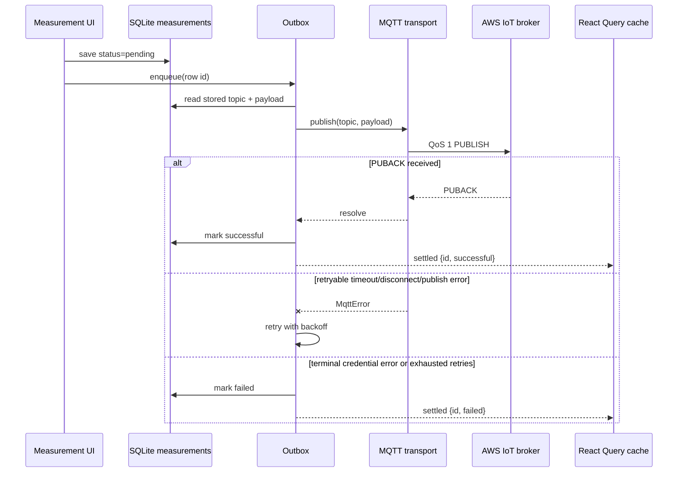

{/* verified: code@12a361a74966 2026-07-19 */}

The canonical MQTT contract is generated from root `asyncapi.yaml` and rendered in the [MQTT API reference](/api/mqtt). This page explains how current clients use that contract; the generated reference wins if field-level details differ.

## Experiment ingestion topic

```text
experiment/data_ingest/v1/{experimentId}/{sensorType}/{sensorVersion}/{sensorId}/{protocolId}
```

| Segment                     | Meaning                                                              |
| --------------------------- | -------------------------------------------------------------------- |
| `experiment/data_ingest/v1` | Versioned fixed prefix routed by the AWS IoT rule.                   |
| `experimentId`              | Experiment receiving the measurement.                                |
| `sensorType`                | Device family, such as `multispeq`.                                  |
| `sensorVersion`             | Hardware/firmware family version used for routing and compatibility. |
| `sensorId`                  | Device identifier.                                                   |
| `protocolId`                | Measurement protocol identifier.                                     |

Treat every segment as routing data: do not include `/` inside a value. AWS IoT policies scope which topics a credential may publish, so a structurally valid topic can still be unauthorized.

## Delivery semantics

MMI and the mobile Paho transport publish with MQTT QoS 1. Success means the broker acknowledged the message, not that the Databricks transformation is already visible. QoS 1 is at-least-once; retries can produce repeat delivery and downstream code must retain enough identity/provenance to investigate or deduplicate it.

MMI uses AWS IoT's native SDK and X.509 paths. Mobile uses an AWS-signed WebSocket URL and temporary credentials. These authentication flows are not interchangeable.

## Payloads

Production mobile payloads include measurement/device output plus experiment context such as user, timestamp, timezone, questions, macros, annotations, and an optional workbook-run ID. The large `sample` field is gzip-compressed and base64-encoded; `_sample_encoding: "gzip+base64"` tells Silver processing to decompress it.

MMI currently publishes the analyzed single-SPAD result produced by `DeviceManager`, with interactive `plant_metadata`. Continuous mode also adds an ISO timestamp. This development payload is useful for testing the route but is not a complete example of the mobile production payload.

The AWS IoT rule adds the original topic and authenticated client ID before it writes Kinesis/S3. Do not let a self-reported JSON device ID substitute for broker-authenticated identity in security decisions.

## Mobile measurement sync

The mobile app uses a SQLite transactional outbox so a measurement survives restarts and offline periods.




### Status and retry model

| Status       | Meaning                                                                      |
| ------------ | ---------------------------------------------------------------------------- |
| `pending`    | Durable locally, not yet acknowledged.                                       |
| `failed`     | Delivery exhausted retries or hit a terminal error; eligible for user retry. |
| `successful` | QoS 1 PUBACK received.                                                       |

The current constants allow eight concurrent rows and use waits of 1, 4, and 15 seconds, giving up to four attempts. The transport itself does not run a background reconnect loop. It lazily opens one session on demand, rejects in-flight work on disconnect, and closes after 30 seconds idle. Each publish also has a 30-second acknowledgement timeout.

`PublishError`, `Timeout`, and `Disconnected` are retryable. `CredentialError` is terminal because repeating the same invalid authorization cannot heal it. Pending and failed rows are rehydrated at construction and on foreground, with a cooldown to collapse duplicate lifecycle triggers. The queue pauses while React Query's online manager reports offline.

### Reactive UI path

The outbox exposes aggregate, per-row, and settled-burst subscriptions. `outbox-to-query-cache-bridge.ts` throttles settled bursts before surgically patching React Query lists and counts, avoiding a database reread and render storm for every PUBACK. The composition root stores the transport/outbox graph on `globalThis` so React Native Fast Refresh cannot leave duplicate queues publishing the same rows.

### Current module map

| Concern                     | Path under `apps/mobile/src`                                             |
| --------------------------- | ------------------------------------------------------------------------ |
| SQLite source of truth      | `shared/db/schema.ts`, `shared/db/measurements-storage.ts`               |
| Outbox and tuning           | `features/recent-measurements/services/outbox.ts`, `upload-constants.ts` |
| Cache bridge                | `features/recent-measurements/services/outbox-to-query-cache-bridge.ts`  |
| MQTT transport/session/auth | `features/connection/services/mqtt/`                                     |
| Composition root            | `shared/composition/upload.ts`                                           |
| Wide-event tracing          | `shared/observability/trace.ts`                                          |

For the cloud side of this sequence, read [Data ingestion](/developers/architecture/data-ingestion).
