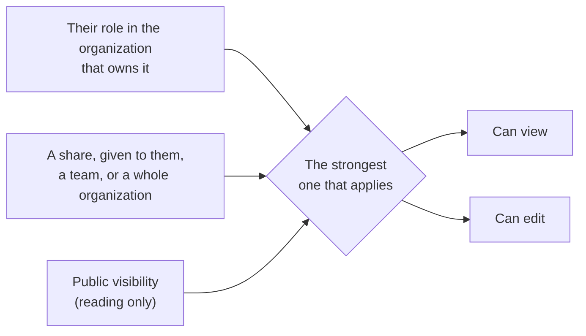

{/* verified: code@2a0698c44 2026-08-17 */}

If you have ever wondered why someone can edit an experiment you never shared with
them, or why a person you removed from a lab can still open the data, the answer is
almost always the same: access arrives by more than one route, and the Collaborators
list only shows one of them.

This page is the model behind every access screen in openJII. Read it once and the
rest of the guide stops being surprising.

## Three ways in

Someone can reach a resource three ways. They are independent — any one of them is
enough on its own.

- **Their role in the organization that owns it.** Every resource is owned by exactly
  one workspace — either your personal workspace or a shared organization. Owners and
  Admins of that organization can edit everything it owns. Members can read everything
  it owns, and on experiments they can also contribute measurements and annotations.
  Nobody had to share anything for this to be true.
- **A share.** Someone opened the Collaborators tab and gave access to a person, a
  team, or a whole organization. This is the only route that appears in that list as a
  removable row.
- **Public visibility.** If the resource is public, anyone can read it — including
  people with no account relationship to you at all. Reading only, never contributing.

Devices have one extra, read-only route: a device onboarded to an experiment can be
viewed by anyone who reaches that experiment through their organization role or a
share. Public visibility on the experiment does not carry over, and the route never
grants editing or credential access on the device.

<Callout type="info">
  Where more than one applies, **the strongest one wins**. A route never caps another: giving
  someone a Can view share cannot reduce the Can edit they already have as an Admin of the lab, and
  taking that share away cannot reduce it either.
</Callout>

## One person, four states

Mira is in your lab. Watch what changes as you adjust one thing at a time.

| What is true                                                          | What Mira can do                                  | Why                                                                                                      |
| :-------------------------------------------------------------------- | :------------------------------------------------ | :------------------------------------------------------------------------------------------------------- |
| Member of the lab that owns the experiment, plus a **Can view** share | **Can view**, and she can contribute measurements | Her lab membership already gives her this. The share adds nothing — it shows a **Redundant grant** badge |
| You raise her share to **Can edit**                                   | **Can edit**                                      | Now the share is doing work: it is stronger than her Member role                                         |
| You remove Mira from the lab                                          | Still **Can edit**                                | The share survives on its own. Her row is now labelled **Outside Collaborator**                          |
| You remove the share too                                              | No private access                                 | If the experiment is public she can still read it, like anyone else                                      |

The lesson of the first row is the one people get wrong: **a share that matches what
someone already has changes nothing, and removing it takes nothing away.**

## Reading a collaborator row

A row on the Collaborators tab carries more than a name and a level. Four things are
worth knowing how to read:

- **The level shown is what the person can actually do** — their effective access, not
  just the tier of the share.
- **A badge like "Admin · via organization"** names their _other_ route in. It is telling
  you that even without this share, they would still have access.
- **"Redundant grant"** means the share adds nothing beyond what they already have. It is
  information, not a problem to fix.
- **The remove button removes the share, and only the share.** If a badge names another
  route, that route survives.

<Callout type="warn">
  Removing a share never removes someone's organization role. If a row shows **Admin · via
  organization**, deleting it leaves their access exactly as it was. To change that, change their
  role in the organization instead.
</Callout>

## Who appears in the list, and who doesn't

The Collaborators list is not a roster of everyone who can open the resource. It is
built to stay readable on an organization with two hundred people:

- **Owners of the owning organization are named individually.** They are the people
  answerable for what the organization owns.
- **Admins and Members are summarized** as a single counted row each — "12 admins,
  through the organization" — rather than one row per person.
- **Anyone holding a share is broken out** into their own named row, and subtracted from
  those counts, so the list never counts the same person twice.
- **Public readers never appear.** There is no row to show; they are not related to the
  resource at all.

So "their name isn't in the list" does not mean "they have no access". It usually means
they are inside one of the summary rows.

## What removing access does — and doesn't

Access has to be removed on the route it came from. This is the single most common
source of "I removed them and they can still see it".

| To remove                              | Do this                                                     | This will not                                                                                                   |
| :------------------------------------- | :---------------------------------------------------------- | :-------------------------------------------------------------------------------------------------------------- |
| A share                                | Remove the row on the Collaborators tab                     | Touch their organization role, or a share held by a team or organization they belong to                         |
| Access that came from the organization | Change their role, or remove them from the organization     | Touch any share they hold directly                                                                              |
| Access a team gave them                | Remove the team's share, or remove them from the team       | Touch shares they hold in their own name                                                                        |
| Public reading                         | Nothing — a public resource can never be made private again | Depend on the type: experiments, macros, protocols and workbooks are all one-way. Devices are never publishable |

<Callout type="warn">
  Publishing is the one step on this page you cannot reverse, and it is not an experiment quirk:
  experiments, macros, protocols and workbooks are all one-way once public. Devices have no publish
  step at all. Everything else on this page can be undone.
</Callout>

## Where to go next

- [Collaborators & access levels](/guide/experiments/collaborators) — the tab itself, and
  what each level can do.
- [Organizations](/guide/organizations) — roles, people, teams, and the directory.
- [Access troubleshooting](/guide/reference/access-troubleshooting) — start from the
  symptom instead of the model.
