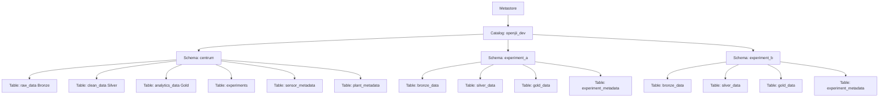

# Data Governance Model

## Introduction

Managing sensor data via the OpenJII platform calls for a structured approach that ensures consistency, security, and reproducibility. The OpenJII data governance framework aims to support data isolation, simplifies auditing, and scales as new experiments are added. Its key objectives are to preserve data lineage, control access, provide cross-experiment collaboration and optimize query performance.

## Purpose & Objectives

The data governance model is designed to:

- **Ensure Reproducibility & Auditability:**  
  Guarantee that each experiment's data processing can be exactly repeated. Immutable copies of raw data and detailed logs provide complete traceability.

- **Maintain Data Isolation & Access Control:**  
  Isolate data for individual experiments to prevent accidental interference and enforce role-based permissions, ensuring that users only see the data relevant to them.

- **Support Scalability & Maintainability:**  
  Adopt a clear, standardized structure that makes it easy to add or archive experiments, while simplifying schema modifications and routine maintenance.

- **Enforce Consistency & Standardization:**  
  Use uniform naming conventions and data structures to reduce confusion and redundancy across raw, cleaned, and metadata layers.

- **Optimize Query Performance:**  
  Store data in a preprocessed, analysis-ready form to lower query times and reduce processing overhead.

- **Provide Restricted Collaboration:**  
  Support cross-catalog and cross-schema collaboration, managed by access policies.

## Model Overview

The framework takes advantage of Databricks Unity Catalog's three-tier namespace: **Catalog → Schema → Table**. At the top level, a catalog represents the entire data domain. Within this catalog, individual schemas isolate each experiment, and tables hold the sensor data, plant data and other related metadata.

### Infrastructure Implementation

The OpenJII platform uses Terraform to provision and maintain the following components:

- A Databricks Unity Catalog **metastore** serving as the root container for all data assets
- An S3 bucket dedicated to Unity Catalog with proper IAM role-based access controls
- A central catalog named `open_jii` containing all schemas
- A central schema (`centrum`) that follows the medallion architecture
- Experiment-specific schemas that inherit data from the central schema

All data assets are managed through well-defined Terraform modules that ensure consistency and prevent configuration drift.

### Reference Diagram

The diagram below (adapted from Unity Catalog documentation) illustrates the hierarchical structure from the metastore down to individual tables:

### Catalogs (Top-Level Organizational Unit)

A single catalog (`open_jii`) covers the entire domain of OpenJII-managed experiments, with additional catalogs possible for different environments (development, testing, production).

A single catalog groups all related schemas and tables under one logical domain. This approach simplifies the enforcement of enterprise security policies, as permissions automatically apply to all underlying objects. It also minimizes complexity and prevents fragmentation, while still leaving room for additional catalogs if fundamentally different data domains arise in the future.

### Schemas (Logical Separation for Each Experiment)

Within the `openjii_dev` catalog, we maintain:

1. A **central schema** (`centrum`) that serves as the primary ingestion point and single source of truth
2. **Experiment-specific schemas** (e.g., `amsterdam_2023_tulips`) that contain experiment-specific data and views

This two-tier schema approach ensures centralized governance while enabling experiment isolation.

### Data Flow Between Schemas

The central schema (`centrum`) not only serves as the single ingest point but provides standardized, cleansed data that serves as the foundation for all experiment schemas:

1. **Data Inheritance Flow**:

   - Raw data enters through central schema Bronze layer
   - Central Silver layer applies standardized cleansing and conforming
   - Experiment schemas receive relevant data from central Silver layer
   - Experiment-specific transformations then build toward Gold tier analytics

2. **Benefits of This Approach**:
   - Consistent data quality foundation across all experiments
   - Efficient resource utilization by centralizing common transformations
   - Clear data lineage from raw data to experiment-specific analysis
   - Accelerated research workflows starting from pre-cleaned data

This approach establishes the central Silver tier as the handoff point between central platform processing and experiment-specific scientific analysis.

### Tables (Data Storage & Management)

Each schema contains a standardized set of tables adhering to the medallion architecture:

1. **Bronze Layer (`raw_data`):**  
   Contains unprocessed sensor readings with original timestamps, raw payload, and source tracking.

2. **Silver Layer (`clean_data`):**  
   Houses validated, transformed data with quality indicators for analysis readiness.

3. **Gold Layer (`analytics_data`):**  
   Provides aggregated metrics like min/max/avg values optimized for reporting and visualization.

4. **Metadata Tables:**
   - `experiments` - Central registry of all experiment configurations
   - `sensor_metadata` - Technical details about deployed sensors
   - `plant_metadata` - Information about plant subjects, species, and treatments

This table structure is automatically provisioned through the Terraform schema module for consistent implementation across all experiments.

### Dual Gold Tier Approach

Our architecture deliberately creates two specialized gold tiers:

1. **Central Gold Tier**

   - **Purpose**: Platform-wide, experiment-agnostic analytics
   - **Users**: Platform administrators, cross-experiment analysts
   - **Content**: Aggregated metrics, sensor performance data, system-wide patterns
   - **Focus**: Operational insights and platform management

2. **Experiment Gold Tier**
   - **Purpose**: Scientific analysis specific to each experiment
   - **Users**: Scientists, researchers focused on specific experiments
   - **Content**: Experiment-specific calculations, specialized metrics
   - **Focus**: Research outcomes and hypothesis testing

This dual gold tier approach enables both operational excellence and scientific rigor within the same architecture.

### Volumes

Volumes are utilized to provide scalable, persistent storage for both raw and processed datasets.

As such, volumes allow for efficient storage management independent of the catalog and schema structure. They support high data throughput and can be tuned for performance, ensuring that large volumes of sensor data are managed effectively. This also facilitates data lifecycle management and cost optimization.

### Views

Views connect experiment-specific schemas to the central schema, enabling:

1. **Data Filtering:** Experiment schemas contain views that filter the central raw data relevant to their specific experiment ID
2. **Cross-Experiment Analysis:** Views can join data across experiments for comparative analysis
3. **Simplified Access:** Users can query views without understanding the underlying storage structure

The platform uses Terraform to define SQL views that maintain these relationships automatically.

### Data Access & Security

Data access and security is based on the set of governance policies that include:

- **Role-Based Access Control (RBAC):**  
  Enforced strict role-based permissions at every level.
- **Data Retention Policies:**  
  Guidelines for data retention, archival, and purging that meet regulatory and operational needs.
- **Audit Logging:**  
  Detailed logs of all data operations are preserved to ensure accountability and support audits.

RBAC minimizes risk by restricting data access. Data retention policies help balance legal requirements with storage costs, while audit logging enhances transparency and trust by providing a detailed record of data operations.
