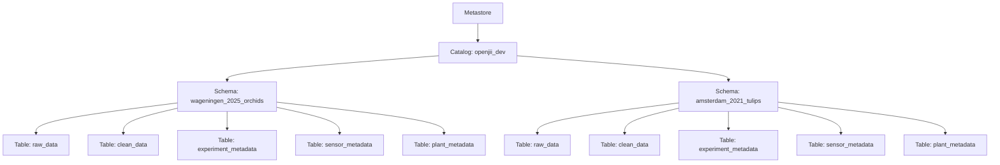

# Data Governance Model

## Introduction

Managing sensor data via the OpenJII platform calls for a structured approach that ensures consistency, security, and reproducibility. This document presents a data governance framework that uses catalogs, schemas, and tables to organize data from various field experiments. The framework aims to support data isolation, simplifies auditing, and scales as new experiments are added. Its key objectives are to preserve data lineage, control access, provide cross-experiment collaboration and optimize query performance.

## Purpose & Objectives

The data governance model is designed to:

- **Ensure Reproducibility & Auditability:**  
  Guarantee that each experiment’s data processing can be exactly repeated. Immutable copies of raw data and detailed logs provide complete traceability.

- **Maintain Data Isolation & Access Control:**  
  Isolate data for individual experiments to prevent accidental interference and enforce role-based permissions, ensuring that users only see the data relevant to them.

- **Support Scalability & Maintainability:**  
  Adopt a clear, standardized structure that makes it easy to add or archive experiments, while simplifying schema modifications and routine maintenance.

- **Enforce Consistency & Standardization:**  
  Use uniform naming conventions and data structures to reduce confusion and redundancy across raw, cleaned, and metadata layers.

- **Optimize Query Performance:**  
  Store data in a preprocessed, analysis-ready form to lower query times and reduce processing overhead.

- **Provide Restricted Collaboration:**  
  Support cross-catalog and cross-schema colloboration, managed by access policies.

## Model Overview

The framework takes advantage of Databricks Unity Catalog’s three-tier namespace: **Catalog → Schema → Table**. At the top level, a catalog represents the entire data domain. Within this catalog, individual schemas isolate each experiment, and tables hold the sensor data, plant data and other related metadata.

### Reference Diagram

The diagram below (adapted from Unity Catalog documentation) illustrates the hierarchical structure from the metastore down to individual tables:

### Catalogs (Top-Level Organizational Unit)

A single catalog (e.g., `openjii_dev`, `growy_dev`) covers the entire high-level domain of OpenJII-managed experiments, leaving room to scale to environment-based or consumer-based catalog domains.

A single catalog groups all related schemas and tables under one logical domain. This approach simplifies the enforcement of enterprise security policies, as permissions automatically apply to all underlying objects. It also minimizes complexity and prevents fragmentation, while still leaving room for additional catalogs if fundamentally different data domains arise in the future.

### Schemas (Logical Separation for Each Experiment)

Within the `openjii_dev` catalog, create separate schemas for each experiment (e.g., `wageningen_2025_orchids`, `amsterdam_2021_tulips`). Each experiment’s data is contained in its own namespace.

This separation prevents data mixing and avoids naming conflicts, while allowing each experiment to use its own data transformation logic. It also clarifies data provenance, supports granular access control, and makes it easier to archive or retire an experiment’s data without affecting others.

### Tables (Data Storage & Management)

Each experiment’s schema will include a standard set of tables:

1. **Raw Data Table (`raw_data`):**  
   Ingests and preserves sensor readings in their original form.

2. **Clean Data Table (`clean_data`):**  
   Contains validated, transformed data ready for analysis.

3. **Metadata Tables:**  
   Includes `experiment_metadata`, `sensor_metadata`, and `plant_metadata` to hold contextual and configuration information.

Storing raw data in its original state ensures reproducibility and serves as an immutable source of truth. The clean data table offers preprocessed data that boosts query performance and reduces the need for on-the-fly processing. Metadata tables centralize contextual information, support tracking, and help automate processing decisions.

### Volumes

Volumes are utilized to provide scalable, persistent storage for both raw and processed datasets.

As such, volumes allow for efficient storage management independent of the catalog and schema structure. They support high data throughput and can be tuned for performance, ensuring that large volumes of sensor data are managed effectively. This also facilitates data lifecycle management and cost optimization.

### Views

Views are created to offer virtual, analysis-ready representations of the data stored in tables.

Views enable users to query aggregated or filtered data without duplicating data. They provide an abstraction layer that simplifies complex queries and supports customized data presentations tailored to specific analytical needs. This approach reduces redundancy while improving query performance and flexibility.

### Data Access & Security

Data access and security is based on the set of governance policies that include:

- **Role-Based Access Control (RBAC):**  
  Enforced strict role-based permissions at every level.
- **Data Retention Policies:**  
  Guidelines for data retention, archival, and purging that meet regulatory and operational needs.
- **Audit Logging:**  
  Detailed logs of all data operations are preserved to ensure accountability and support audits.

RBAC minimizes risk by restricting data access. Data retention policies help balance legal requirements with storage costs, while audit logging enhances transparency and trust by providing a detailed record of data operations.

.
