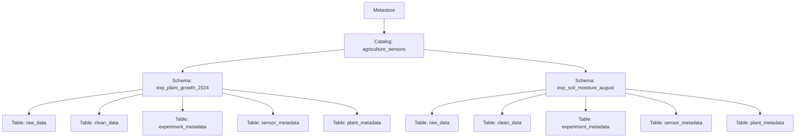

# Data Governance Model

## Introduction

Managing agricultural sensor data calls for a structured approach that ensures consistency, security, and reproducibility. This document presents a data governance framework that uses catalogs, schemas, and tables to organize data from various field experiments. The framework supports data isolation, simplifies auditing, and scales as new experiments are added. Its key objectives are to preserve data lineage, control access, and optimize query performance.

## Purpose & Objectives

### Purpose

This document serves as a formal record of the design decisions made for managing agricultural sensor data. It explains the rationale behind each decision, shows how these choices align with industry best practices, and discusses the trade-offs involved.

### Governance Objectives

The data governance model is designed to:

- **Ensure Reproducibility & Auditability:**  
  Guarantee that each experiment’s data processing can be exactly repeated. Immutable copies of raw data and detailed logs provide complete traceability.

- **Maintain Data Isolation & Access Control:**  
  Isolate data for individual experiments to prevent accidental interference and enforce role-based permissions, ensuring that users only see the data relevant to them.

- **Support Scalability & Maintainability:**  
  Adopt a clear, standardized structure that makes it easy to add or archive experiments, while simplifying schema modifications and routine maintenance.

- **Enforce Consistency & Standardization:**  
  Use uniform naming conventions and data structures to reduce confusion and redundancy across raw, cleaned, and metadata layers.

- **Optimize Query Performance:**  
  Store data in a preprocessed, analysis-ready form to lower query times and reduce processing overhead.

## Model Overview

The framework takes advantage of Databricks Unity Catalog’s three-tier namespace: **Catalog → Schema → Table**. At the top level, a catalog represents the entire data domain. Within this catalog, individual schemas isolate each experiment, and tables hold the sensor data and related metadata.

### Reference Diagram

The diagram below (adapted from Unity Catalog documentation) illustrates the hierarchical structure from the metastore down to individual tables:

### Catalogs (Top-Level Organizational Unit)

**Decision:**  
Use a single catalog (e.g., `agriculture_sensors`) to cover the entire domain of agricultural sensor data, leaving room to scale to environment-based or consumer-based catalog domains.

**Rationale:**  
A single catalog groups all related schemas and tables under one logical domain. This approach simplifies the enforcement of enterprise security policies, as permissions automatically apply to all underlying objects. It also minimizes complexity and prevents fragmentation, while still leaving room for additional catalogs if fundamentally different data domains arise in the future.

### Schemas (Logical Separation for Each Experiment)

**Decision:**  
Within the `agriculture_sensors` catalog, create separate schemas for each experiment (e.g., `exp_plant_growth_2024`, `exp_soil_moisture_august`). Each experiment’s data is contained in its own namespace.

**Rationale:**  
This separation prevents data mixing and avoids naming conflicts, while allowing each experiment to use its own data transformation logic. It also clarifies data provenance, supports granular access control, and makes it easier to archive or retire an experiment’s data without affecting others.

### Tables (Data Storage & Management)

**Decision:**  
Each experiment’s schema will include a standard set of tables:

1. **Raw Data Table (`raw_data`):**  
   Ingests and preserves sensor readings in their original form.

2. **Clean Data Table (`clean_data`):**  
   Contains validated, transformed data ready for analysis.

3. **Metadata Tables:**  
   Includes `experiment_metadata`, `sensor_metadata`, and `plant_metadata` to hold contextual and configuration information.

**Rationale:**  
Storing raw data in its original state ensures reproducibility and serves as an immutable source of truth. The clean data table offers preprocessed data that boosts query performance and reduces the need for on-the-fly processing. Metadata tables centralize contextual information, support tracking, and help automate processing decisions.

### Volumes

**Decision:**  
Utilize volumes to provide scalable, persistent storage for both raw and processed datasets.

**Rationale:**  
Volumes allow for efficient storage management independent of the catalog and schema structure. They support high data throughput and can be tuned for performance, ensuring that large volumes of sensor data are managed effectively. This also facilitates data lifecycle management and cost optimization.

### Views

**Decision:**  
Create views to offer virtual, analysis-ready representations of the data stored in tables.

**Rationale:**  
Views enable users to query aggregated or filtered data without duplicating data. They provide an abstraction layer that simplifies complex queries and supports customized data presentations tailored to specific analytical needs. This approach reduces redundancy while improving query performance and flexibility.

### Data Access & Security

**Decision:**  
Implement a set of governance policies that include:

- **Role-Based Access Control (RBAC):**  
  Enforce strict role-based permissions at every level.
- **Data Retention Policies:**  
  Set guidelines for data retention, archival, and purging that meet regulatory and operational needs.
- **Audit Logging:**  
  Keep detailed logs of all data operations to ensure accountability and support audits.

**Rationale:**  
RBAC minimizes risk by restricting data access. Data retention policies help balance legal requirements with storage costs, while audit logging enhances transparency and trust by providing a detailed record of data operations.

## Trade-offs and Considerations

While the design follows best practices, several trade-offs have been made:

- **Single Catalog vs. Multiple Catalogs:**  
  A single catalog simplifies management and centralizes security policies, although multiple catalogs might provide better isolation for very different data domains at the cost of increased complexity.
- **Granular Isolation with Schemas vs. Administrative Overhead:**  
  Isolating data by experiment ensures clear separation and precise access control, but managing many schemas may require additional automation and periodic reviews.
- **Immutable Raw Data vs. Storage Costs:**  
  Keeping immutable raw data supports auditability and reproducibility. However, the ongoing accumulation of raw data can increase storage costs, making retention policies crucial.
- **Preprocessed Clean Data vs. Data Freshness:**  
  Preprocessing data improves query performance but may introduce some latency between ingestion and analysis.
- **Centralized Metadata vs. Flexibility:**  
  A centralized metadata structure streamlines experiment tracking and automation, but a rigid format might limit adaptability for unique experiment requirements.
- **Fine-Grained RBAC vs. Administrative Overhead:**  
  Strict role-based access control enhances security but requires careful management and regular audits to keep administrative tasks under control.

## Conclusion

The proposed governance framework provides a structured, scalable, and maintainable method for managing agricultural sensor data. By using a single catalog, isolating experiments in dedicated schemas, and adopting standardized table structures along with strong security and retention policies, the design ensures data integrity, reproducibility, and optimized performance. While there are trade-offs, the clear data lineage, efficient query performance, and centralized governance contribute to the long-term success of managing agricultural sensor data.

Team members and stakeholders can work confidently with the sensor data, knowing it is managed under a robust framework that aligns with modern data architecture best practices.
