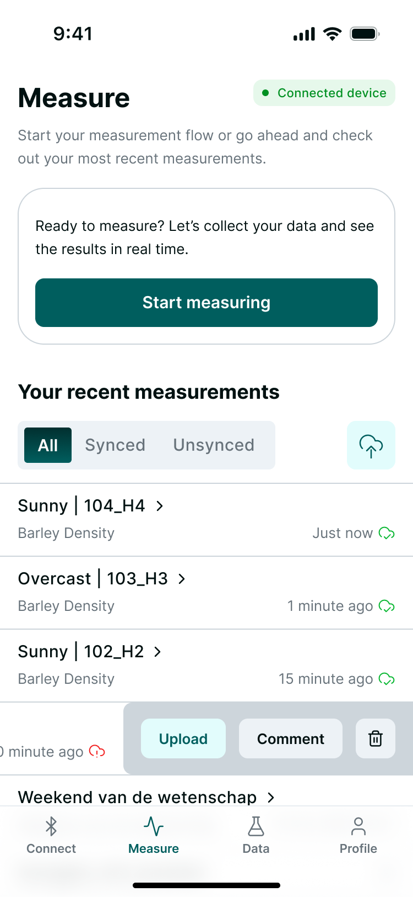
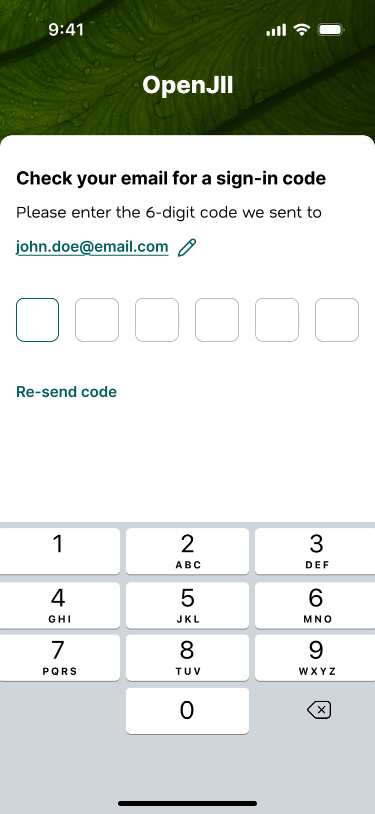

# Mobile app

After registering, download the openJII app from [Play Store](https://play.google.com/store/apps/details?id=com.openjii.app) (Android only).
At the moment the mobile app is mostly targeted at the MultispeQ sensor, but more sensors will be added soon.

## Key features

- Log in via **ORCID, GitHub or email** (6-digit OTP code)
- Connect to **MultispeQ** via Bluetooth
- Inspect MultispeQ battery status
- **Take measurements** via MultispeQ
- Streamlined measurement flow with animated progress bar
  - Do measurements with or without internet connectivity (online/offline)
  - Auto-advance on yes/no and multi-choice answers
  - Auto-remember answers and auto-skip instructions on repeat iterations
  - Preview raw data and processed data in tabbed view
  - Upload measurement to web platform
- **Question-only flows** — collect survey data or field observations without a sensor
- **Add comments** to measurements via bottom-sheet modal
- **Swipe actions** on measurements — swipe to upload, comment, or delete
- **Export measurements** locally as JSON for backup or external analysis
- **Python macro processing** — run Python macros on-device via embedded Pyodide runtime
- **View measurement data** of experiments
- **Turn off** sensor device

### Measurement flow

### Logging in on a phone without email inbox

Be sure to have an [openJII account](../introduction/quick-start-guide).
Log in via ORCID, GitHub or if you want to use a phone that does **not** have access to your email inbox, you need this procedure to log in.

Use the following steps to **log in via email**:
- Download the openJII app on the phone (let's call it the 'sensorphone') that you want to connect to your sensor
- Open the app and enter your email address at the login screen
- Now go to a device that has your email inbox, like a desktop, laptop, tablet or (personal) mobile phone. Open the email and scroll to the 6-digit code
- Use the sensorphone and enter the 6-digit code
- You will be logged in to the app

### Minimal specs
- Android 7.0 Nougat (API level 24) or newer
- minimum 2 GB of RAM
