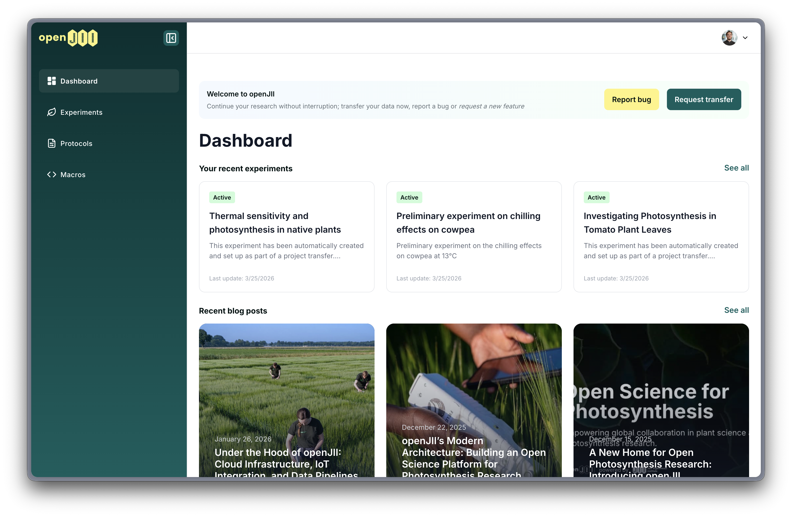
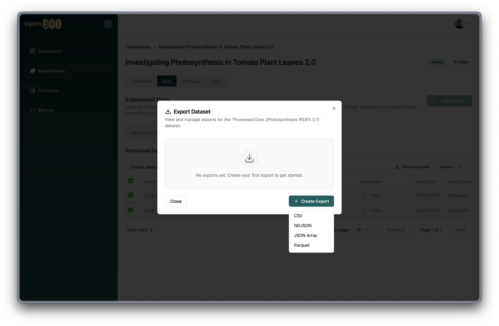

import DocButton from '@site/src/components/DocButton';

# Overview

The openJII Web Platform (https://openjii.org/) provides a secure, scalable environment to manage experiments, collect sensor time-series, and run reproducible analyses.

### Key features

- **Scalable data layer:** Centralized `centrum` schema with medallion architecture (Bronze–Silver–Gold) for efficient ingestion, storage, and querying of large time-series and sensor datasets.
- **Secure authentication & access control:** Email login via 6-digit OTP code, ORCID and GitHub sign-in, plus [role-based access](./roles) and configurable visibility (Public/Private). See [Register](./0012-register.md) to create an account.
- **Experiment management:** Create, edit and version experiments; add members, locations, metadata and tags; set visibility and embargo periods — see [Create / Edit Experiment](./0013-create-add-experiment.md).
- **Metadata:** Attach plot or plant metadata (genotype, treatment, harvest date, etc.) to your measurements via CSV, Excel, or clipboard — see [Metadata](./0017-metadata.md).
- **User invitations:** Invite collaborators by email — pending invitations are automatically accepted when the invitee creates an account.
- **Protocol-macro compatibility:** Many-to-many linking between protocols and macros, with sort order and preferred badges — see [Protocols / Macros](./0014-protocol.md).
- **Visual measurement flows:** Drag-and-drop flow editor (Instruction, Question, Measurement, Analysis nodes). Supports question-only flows for survey data collection.
- **Data exploration & visualization:** Interactive dashboards, plots, filtering, and export in multiple formats (CSV, NDJSON, JSON, Parquet) for downstream analysis.
- **Data export:** Asynchronous export system — select your format, initiate the export, and download when ready.
- **Project transfers:** Import experiments, protocols, and measurement data from external platforms.
- **Analysis & reproducibility:** Run analysis macros, integrate notebooks (Databricks/Jupyter), and capture provenance so analyses can be reproduced.

See [features of mobile app](../002-mobile-app.md)

Excited?
<DocButton href="../../introduction/quick-start-guide" variant="primary"> Follow our Quick Start Guide to try it out</DocButton>
