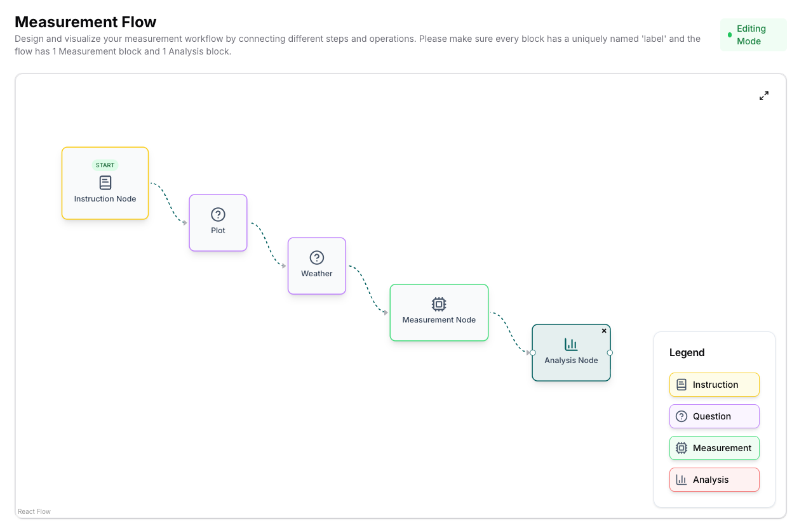

# Create / Edit Experiment

This page explains how to create and edit an experiment using the openJII web platform.

## Quick steps

- Navigate to the **Experiments** section in the Web platform.
- Click **Create Experiment** to open the experiment form.
- Fill in required fields: experiment name, description, etc.
- Optionally add members and set the vivibility: Public or private. This Open Science platform encourages to op make your experiemtn visible. A maximum embargo of 12 months applies.
- Optionally set one or more locations of th experiment
- Review the settings and Create it
- Now go to the Flow-tab to setup a Measurement flow
  - First add an Instruction Node and add the instructions to the person using the sensor
  - Optionally add one or more Question-nodes to the right side of the Instruction node. Use a short and clear name in the Label field as they will appear in the data.
  - Add an Measurement node and select the desired protocol
  - Add an Analysis node and select the macro that belongs to the protocol (!). Usually they have the same name.
  - Chain all nodes together one by one by dragging the circle shape to the circle shape of the next node. (see screenshot)
  - Press Save flow
  - More advanced options will be added later to this Measurement flow. For now a flow should have 1 Measurement node and 1 Analysis node.
- Save the experiment and verify it appears in your experiments list.
- Use the openJII mobile app to do a measurement and check if the flow meets your needs

## Tips

- Use clear, descriptive experiment names to simplify search and collaboration.
- Add tags and metadata to help group related experiments for analysis.

