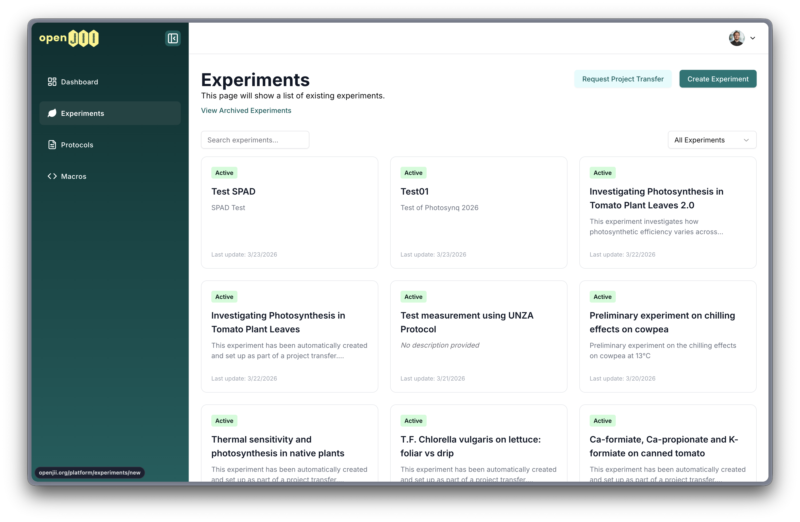
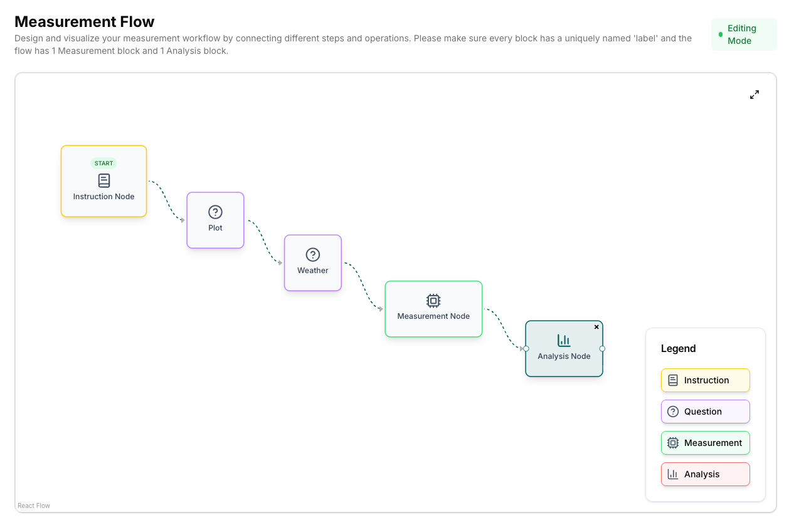

# Create / Edit Experiment

This page explains how to create or edit an experiment using the openJII web platform. The guide covers creating the experiment record, configuring visibility and locations, and building a Measurement Flow to collect data.

## Quick overview

1. Go to the **Experiments** section in the Web platform.
2. Click **Create Experiment** to open the experiment form (or select an existing experiment to edit).
3. Fill in required fields such as:
  - **Experiment name**
  - **Description**
4. Optionally:
  - Add members and set the experiment visibility (**Public** or **Private**). We encourage openness — a **maximum embargo of 12 months** may be applied.
  - Add one or more locations for the experiment.
5. Review settings and click **Create** (or **Save** when editing).

## Configure the Measurement Flow (Flow tab)

After creating the experiment, open the **Flow** tab to define the measurement workflow that field users will follow.

Recommended minimal flow:

- Instruction node (yellow): add the instructions shown to the person operating the sensor.
- Measurement node (measurement icon): select the protocol you want to run.
- Analysis node (analysis icon): choose the analysis macro that corresponds to the chosen protocol (usually they share the same name).

:::note[🎬 Video needed]
Short screen recording (30–60s) showing the full flow-building process: adding an Instruction node, a Measurement node, an Analysis node, connecting them, and saving.
:::

How to build the flow:

1. Add a yellow **Instruction** node and enter the instructions for the field operator.
2. Optionally add one or more purple **Question** nodes to the right of the Instruction node. Use short, clear labels — these labels appear in the recorded data.
3. Add a **Measurement** node and select the desired protocol.
4. Add an **Analysis** node and select the matching macro for the protocol.
5. Chain nodes in the intended order by dragging the small connector circle from one node to the next.
6. Click **Save flow**.

Notes:
- For now, a valid flow should include at least one Measurement node and one Analysis node. More advanced flow options will be added over time.
- Unconnected nodes are ignored when the flow runs.
- If your flow includes a question asking for a plant identifier, place it **first** among the Question nodes. The mobile app displays the answer to the first ID question as a contextual banner on subsequent questions, helping field operators confirm which plot they are measuring.

## Verify and use

- After saving, confirm the experiment appears in your experiments list.
- Use the openJII mobile app to perform a measurement and verify that the flow (instructions, questions, and analysis) behaves as expected.

## Tips

- Use clear, descriptive experiment names to make search and collaboration easier.
- Keep node layouts tidy — a top-left to bottom-right arrangement improves readability.
- Click on a connection (edge) to reveal the option to remove it.

