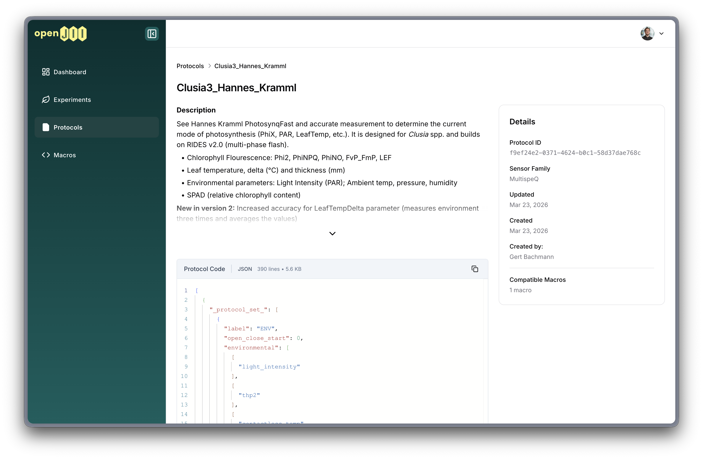
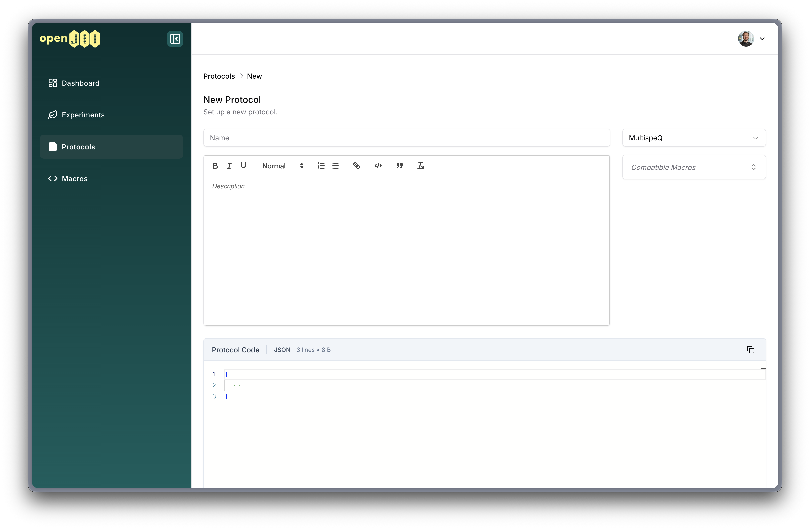
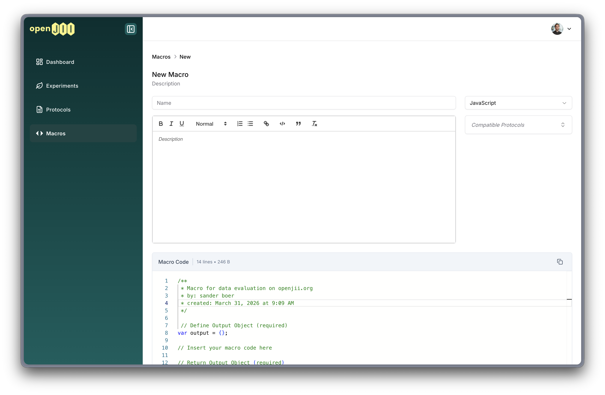

# Protocols / Macros

A protocol is an executable measurement recipe (steps, parameters, timings) the app/sensor follows to collect a Measurement and turns it into raw data.
A [macro](#macros) is a piece of post-processing code that turns your raw data into more valuable processed data that is easier to digest.

Protocols and macros have a **many-to-many relationship**: a single protocol can be compatible with multiple macros, and a single macro can work with multiple protocols. This flexibility allows you to mix and match processing logic with measurement recipes.

## Contents of a protocol



- **Name & description:** concise human-readable title and short summary of the protocol's purpose.
- **Protocol code:** sensor-specific parameters such as integration time, LED intensity, or measurement mode.
- **Output schema:** the structure of the produced measurement record and any computed outputs.
- **Family:** the sensor family the protocol targets (e.g. MultispeQ, Ambit).
- **Compatible macros:** one or more macros linked to the protocol for post-processing.

## Creating a protocol



1. On the openJII web platform, go to the Protocols area.
2. Click **Create Protocol** and provide required metadata (name, description, family).
3. Select one or more **compatible macros** — selected macros are sorted alphabetically for easy reference.
4. Add the protocol code using the built-in code editor.
5. Save the protocol.

Documentation on protocol structure for the MultispeQ can be found at:
https://help.photosynq.com/protocols/structure.html along with code snippets.

## Protocol detail page

The protocol detail page uses a single-page layout:

- **Main area:** inline-editable title and description, and a full-width code editor with auto-save and sync status indicator.
- **Sidebar:** metadata (ID, family, created/updated dates, creator), compatible macros cards, and a danger zone for deletion (for the protocol creator).

Compatible macros are shown as mini-cards displaying the macro name and language badge (JavaScript, Python, or R). Creators can add or remove compatible macros directly from the sidebar.

## Sorting and discovery

- Protocols and macros can be assigned a **sort order** by platform administrators. Items with a sort order appear first and are marked with a "Preferred" badge.
- Items without a sort order follow, sorted alphabetically by name.
- When browsing protocols or macros, colored family badges (MultispeQ, Ambit) and language badges help identify items at a glance.

## Question-only flows

Measurement flows can consist of **only questions and/or instruction nodes** — without requiring a sensor measurement step. This is useful for collecting survey data, field observations, or manual measurements.

In a question-only flow:
- The mobile app detects that no measurement node is present.
- After all questions are answered, a summary screen shows the recorded answers.
- Answers are submitted via MQTT without device or macro data.
- Users can choose to **Finish** or **Submit & Continue** for repeated data collection.

## Best practices

- Keep protocol names descriptive and versioned when you make breaking changes.
- Use short protocols for routine measurements and longer protocols when more metadata is required.
- Link all relevant compatible macros so that users can choose the right post-processing for their experiment.

## Examples

- "Chlorophyll Fluorescence Standard": MultispeQ protocol using standard integration times and producing Fv/Fm and other derived traits.
- "Leaf Gas Exchange": gas-exchange protocol with extended inputs and analysis macro for photosynthetic parameters.

For advanced usage and authoring of analysis macros, refer to the Developers guide and Analysis documentation.


## Macros

A macro is a piece of post-processing code that turns your raw data into more valuable processed data that is easier to digest.

## Creating a macro



1. On the openJII web platform, go to the Macros area.
2. Click **Create Macro** and provide required metadata (name, description, language).
3. Select one or more **compatible protocols** — selected protocols are sorted alphabetically.
4. Write your post-processing script (JavaScript, Python, or R) in the built-in code editor.
5. Save the macro.

```jsx title="yourmacro.js"
/**
 * Macro for data on openJII.org
 * by: John Doe
 * created: 5 December 2025
 */

// Define the output object
var output = {};

/* Your code goes here */

if (json.time !== undefined){ // Check if the key time exists in json
    output.time = json.time; // Add key time and value to output
}

// Return data
return output;
```

## Macro detail page

The macro detail page mirrors the protocol page layout:

- **Main area:** inline-editable title and description, full-width code editor with auto-save.
- **Sidebar:** metadata (ID, language, created/updated dates, creator), compatible protocols cards, and danger zone.

Compatible protocols are shown as mini-cards with protocol name and family badge. Creators can manage compatibility from the sidebar.

Documentation on macros for the MultispeQ can be found on:
https://help.photosynq.com/macros/coding-and-functions.html#code-structure along with code snippets


## Best practices

- Keep macro names descriptive and aligned with the protocol(s) they process.
- Keep names versioned when you make breaking changes.
- Use the many-to-many compatibility feature to link a macro to all protocols it supports.
