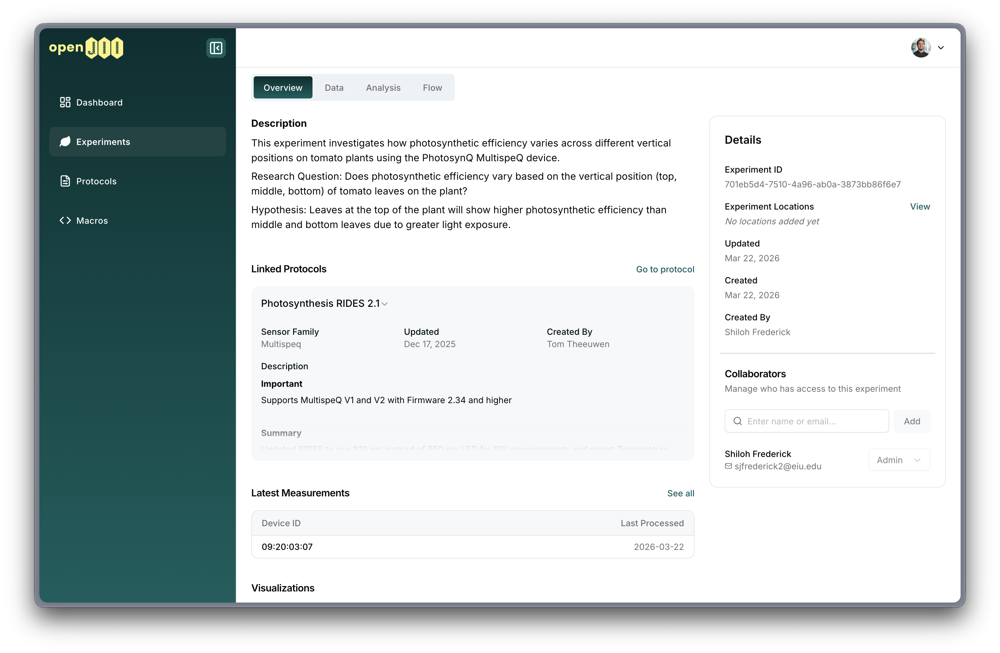

# Roles and rights

The openJII platform has no platform-wide roles, so when navigating the web platform and the app, in principle everyone is the same, but there is a difference when it comes to individual experiments:  
Within an experiment a user that is part of that experiment can have a role: "experiment admin" or "experiment member". These roles are set **per experiment**. To be concise we refer to them as 'admin' and 'member' roles.

### Experiment admin

An experiment is set up and owned by an 'admin'. This person has editing (admin) rights to the entire experiment. An experiment can also be shared among multiple admins and once there are multiple admins, you can even be demoted to user or leave the experiment.

### Experiment member

An experiment member is appointed by an admin of an experiment. A member is someone who contributes to (manual) measurements and can support in setting up and configuring sensors and devices. Generally, a member is someone who takes measurements in a field (using the openJII mobile app).

### Roles and rights at experiments

|                                                 | Non-member | Experiment member | Experiment admin |
| :---------------------------------------------- | :--------: | :---------------: | :--------------: |
| See experiment                                  |    ✓ \*    |         ✓         |        ✓         |
| See experiment measurements/data/visualizations |    ✓ \*    |         ✓         |        ✓         |
| Add measurements via app                        |     -      |         ✓         |        ✓         |
| Add/edit comments/flags (app&web)               |     -      |         ✓         |        ✓         |
| Leave an experiment                             |     -      |         ✓         |      ✓ \*\*      |
| Create/edit/delete visualizations               |     -      |         -         |        ✓         |
| (Bulk) Upload data via web                      |     -      |         -         |        ✓         |
| Edit experiment settings\*\*\*                  |     -      |         -         |        ✓         |
| Edit measurement flow                           |     -      |         -         |        ✓         |
| Add/remove members/admins from experiment       |     -      |         -         |        ✓         |
| Change role of members/admins                   |     -      |         -         |        ✓         |
| Archive experiment                              |     -      |         -         |        ✓         |

`*` unless experiment is private and embargo is active - those experiments are hidden  
`**` unless you are the last admin  
`***` title, description, visibility, location

### Adding collaborators to an experiment

There are two ways users can join an experiment:

1. **Admin-initiated invitations** – Admins invite collaborators by email.
2. **User-initiated join requests** – Users request to join public experiments.

#### Inviting users to an experiment

Experiment admins can invite new collaborators by email:

1. Go to your experiment's Collaborators tab.
2. Search for an existing user or enter an email address.
3. If the email matches a registered user, they are added immediately with the chosen role.
4. If the email does not match a registered user, an **invitation** is sent. The invitee receives a notification email.
5. When the invitee creates an openJII account, all pending invitations are **automatically accepted** — they are added to the experiment(s) with the role specified in the invitation.

Admins can change the role of a pending invitation or revoke it before it is accepted.

#### Requesting to join a public experiment

Users can request to join public experiments without needing an invitation from an admin:

1. When viewing a public experiment they don't belong to, users can submit a join request with an optional message.
2. The join request has a status: **pending**, **approved**, **rejected**, or **cancelled**.
3. Users can cancel their own pending requests at any time.
4. All experiment admins receive an email notification when a new join request is submitted.
5. Admins can view all pending join requests in the **Collaborators** tab of the experiment (under the "Requests" sub-tab).
6. Admins can approve or reject join requests from the Collaborators tab.
7. Users receive email notifications when their requests are approved or rejected.
8. Upon approval, users are added as members with the **Viewer** role by default.

### Protocols and macros

Protocols and macros can be seen and used by everyone. Editing is restricted to the user who created the protocol/macro.
