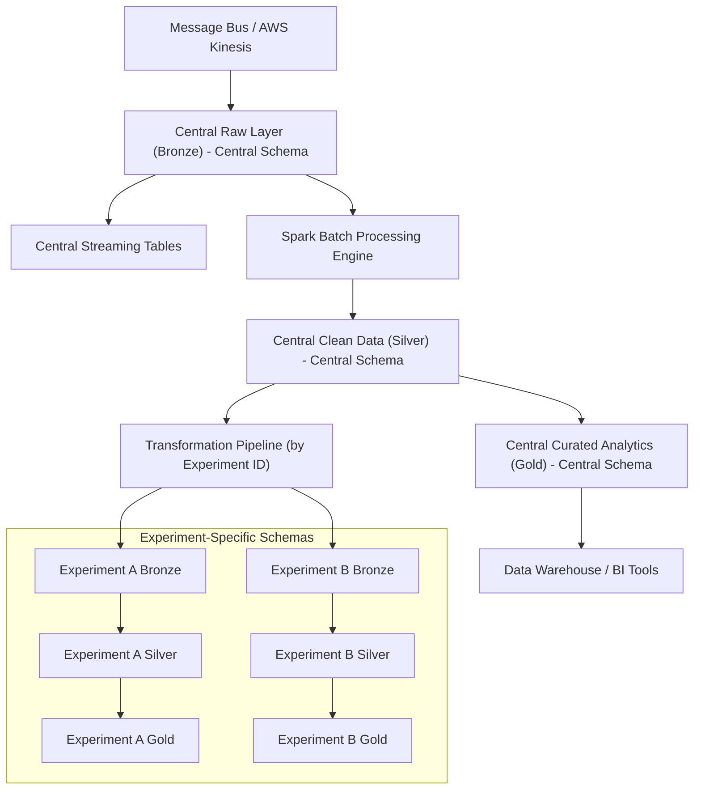

# Data Ingestion Architecture

## Introduction

This document outlines a data ingestion architecture for the OpenJII platform. The approach uses a dual medallion (Bronze–Silver–Gold) framework applied across a central schema and experiment-specific schemas. The central schema handles overall IoT, plant, and sensor analysis, while dedicated pipelines route experiment-related data from the central raw layer into separate experiment schemas with their own medallion processes.

## Architectural Overview

A unified ingestion and transformation pipeline stores all sensor data in the central raw layer. A metadata-driven process then identifies and routes experiment-specific records into their dedicated schemas, ensuring that each experiment receives a dataset processed to meet its needs.

The architecture features two parallel medallion models:

- Central Schema Layers:

  - Bronze: Captures raw sensor data from sources (such as AWS Kinesis).
  - Silver: Cleans and transforms the data and applies quality checks.
  - Gold: Aggregates the refined data for analytics and business intelligence.

- Experiment-Specific Layers:
  - Bronze: Receives raw, experiment-specific data from the central schema.
  - Silver: Processes and validates the data according to each experiment’s requirements.
  - Gold: Provides a curated view to support specific research questions.

A unified **ingestion pipeline** stores all sensor data in the central raw layer. A metadata-driven process then identifies and routes experiment-specific records into their dedicated schemas via a **transformation pipeline**, ensuring that each experiment receives a dataset processed to meet its needs.

### Data Processing and Integration

The system combines aspects of both data lakehouses and data warehouses. Sensor data is ingested in real time via AWS Kinesis into a centralized raw layer, which acts as the single source of truth. Apache Spark handles both batch and near-real-time transformations, converting the raw data into structured, refined datasets.

The central schema evolves into a data warehouse that provides broad insights into IoT, plant, and sensor data. At the same time, experiment-specific schemas receive tailored data through the transformation pipeline that detects experiment identifiers and directs the relevant records. This process supports near real-time and real-time processing while preserving a clear data lineage for troubleshooting and auditing.

Both streaming and batch processing are essential. Streaming data is captured immediately via AWS Kinesis, while batch processing with Apache Spark cleanses and organizes the data for deeper analysis. The transformation pipeline continuously monitors the central raw layer and automatically directs data to the appropriate experiment schema.

### Data Pipelines

The OpenJII data platform uses two types of pipelines that align with our schema structure:

1. **Ingestion Pipeline**: Writes all sensor data into the central `raw_data` table (Bronze layer) in the central schema.

2. **Transformation Pipeline**: 
   - Processes data from central Bronze → Silver → Gold within the central schema
   - Routes experiment-specific data from central schema to experiment-specific schemas
   - Transforms data within each experiment schema through its own Bronze → Silver → Gold progression

Each experiment schema contains views that filter data from the central raw layer, ensuring consistency while enabling experiment-specific processing.

## Pipeline Implementation

The pipelines are implemented as Apache Spark jobs that:

1. Monitor the central raw layer for new data
2. Process and validate the data according to quality rules
3. Identify experiment IDs and route data accordingly
4. Maintain data lineage information for traceability

### Visual Representation

The diagram below shows the data flow, including how the transformation pipeline moves data from the central raw layer to experiment-specific schemas, highlighting the dual medallion structures and the integration of batch and streaming processes.

## Design Rationale

Using dual medallion architectures for both the central and experiment-specific schemas enhances data quality, traceability, and scalability. By funneling all OpenJII data into a central raw layer, the system creates a single source of truth that is later refined for specific analytical needs.

A key benefit is the balance between standardization and flexibility. Standard storage formats such as Delta Lake and Parquet ensure data consistency and efficient querying, while separate experiment-specific schemas allow custom processing pipelines to operate independently. This separation simplifies troubleshooting and supports reproducibility.

Security is maintained through role-based access controls and regular audits, protecting sensitive information and ensuring compliance.
