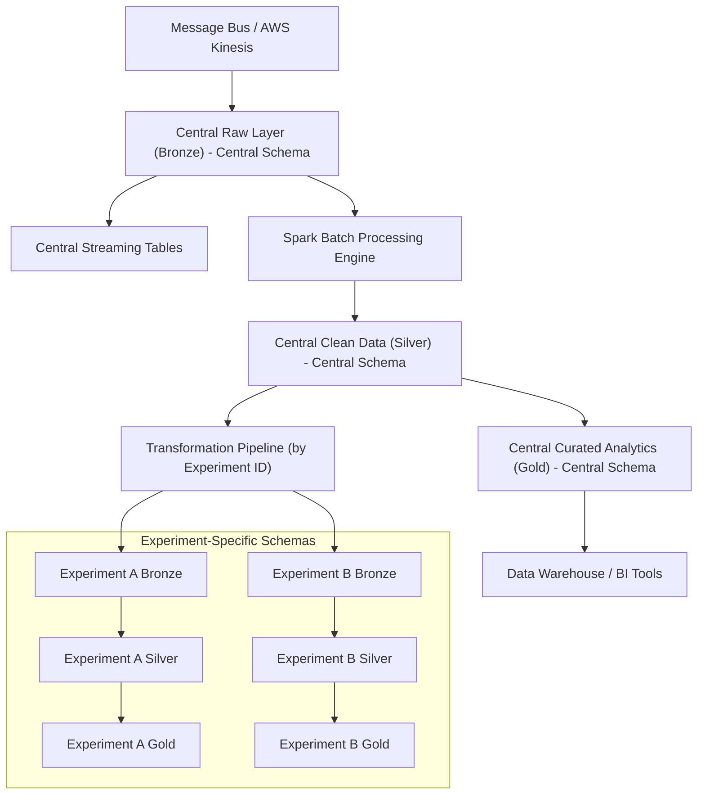

# Agricultural Sensor Data Ingestion Architecture

## Introduction

This document outlines a data engineering architecture for agricultural sensor data. The approach uses a dual medallion (Bronze–Silver–Gold) framework applied across a central schema and experiment-specific schemas. The central schema handles overall IoT, plant, and sensor analysis, while dedicated pipelines route experiment-related data from the central raw layer into separate experiment schemas with their own medallion processes.

## Architectural Overview

A unified ingestion and transformation pipeline stores all sensor data in the central raw layer. A metadata-driven process then identifies and routes experiment-specific records into their dedicated schemas, ensuring that each experiment receives a dataset processed to meet its needs.

The architecture features two parallel medallion models:

- Central Schema Layers:
  - Bronze: Captures raw sensor data from sources such as AWS Kinesis.
  - Silver: Cleans and transforms the data and applies quality checks.
  - Gold: Aggregates the refined data for analytics and business intelligence.
- Experiment-Specific Layers:
  - Bronze: Receives raw, experiment-specific data from the central schema.
  - Silver: Processes and validates the data according to each experiment’s requirements.
  - Gold: Provides a curated view to support specific research questions.

A unified ingestion and transformation pipeline stores all sensor data in the central raw layer. A metadata-driven process then identifies and routes experiment-specific records into their dedicated schemas, ensuring that each experiment receives a dataset processed to meet its needs.

### Data Processing and Integration

The system combines aspects of both data lakehouses and data warehouses. Sensor data is ingested in real time via AWS Kinesis into a centralized raw layer, which acts as the single source of truth. Apache Spark handles both batch and near-real-time transformations, converting the raw data into structured, refined datasets.

The central schema evolves into a data warehouse that provides broad insights into IoT, plant, and sensor data. At the same time, experiment-specific schemas receive tailored data through a pipeline that detects experiment identifiers and directs the relevant records. This process supports real-time processing while preserving a clear data lineage for troubleshooting and auditing.

Both streaming and batch processing are essential. Streaming data is captured immediately via AWS Kinesis, while batch processing with Apache Spark cleanses and organizes the data for deeper analysis. The transformation pipeline continuously monitors the central raw layer and automatically directs data to the appropriate experiment schema.

### Visual Representation

The diagram below shows the data flow, including how the transformation pipeline moves data from the central raw layer to experiment-specific schemas, highlighting the dual medallion structures and the integration of batch and streaming processes.

## Design Rationale and Benefits

Using dual medallion architectures for both the central and experiment-specific schemas enhances data quality, traceability, and scalability. By funneling all sensor data into a central raw layer, the system creates a single source of truth that is later refined for specific analytical needs.

A key benefit is the balance between standardization and flexibility. Standard storage formats such as Delta Lake and Parquet ensure data consistency and efficient querying, while separate experiment-specific schemas allow custom processing pipelines to operate independently. This separation simplifies troubleshooting and supports reproducibility.

The design addresses operational challenges such as system complexity and data duplication. Robust orchestration tools, automated testing, and tiered storage strategies manage these challenges. A metadata-driven pipeline minimizes manual intervention by dynamically routing data based on experiment needs, balancing real-time processing with quality checks.

Security is maintained through role-based access controls and regular audits, protecting sensitive information and ensuring compliance.

## Trade-offs and Considerations

Implementing this architecture involves several trade-offs:

- Complexity vs. Flexibility:
  Dual medallion architectures and dynamic pipelines increase system complexity. Advanced orchestration tools and automated testing frameworks help keep processes streamlined.
- Storage Costs vs. Data Integrity:
  Duplicating data across schemas raises storage costs, but this redundancy is essential for maintaining a verifiable data lineage. Periodic reviews and tiered storage strategies help manage these costs.
- Latency vs. Real-Time Needs:
  The metadata-driven pipeline may introduce some delay as data is routed from the central layer to experiment-specific schemas. Fine-tuning batch sizes and processing intervals helps maintain an acceptable balance.
- Streaming Integration Challenges:
  Continuous data streams from AWS Kinesis come with synchronization and error-handling challenges, addressed through robust error management and real-time monitoring.
- Managing Metadata:
  Consistent metadata capture is key to dynamic processing. A centralized metadata management solution ensures that data governance and lineage are maintained.
- Security Overhead:
  Detailed role-based access controls add administrative work, but automated security tools and regular audits keep the process manageable.

## Conclusion

This architecture combines the strengths of data lakehouses and data warehouses through dual medallion layers—one for a centralized view of IoT and sensor data, and another for experiment-specific insights. A metadata-driven transformation pipeline directs data efficiently from the central raw layer to the appropriate experiment environments.

By combining real-time streaming via AWS Kinesis with batch processing using Apache Spark, the design handles both continuous data flows and in-depth analytics. Although the increased complexity introduces some challenges, these are managed through advanced orchestration, strong security practices, and effective error handling. The result is a flexible, scalable, and resilient architecture that supports strategic decision-making and detailed scientific research.
