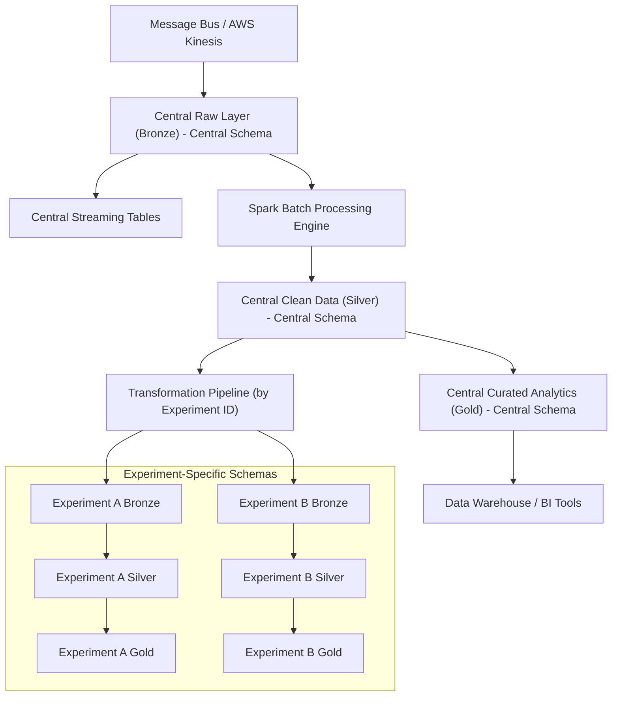

# Data Ingestion Architecture

## Introduction

This document outlines a data ingestion architecture for the OpenJII platform. The approach uses a dual medallion (Bronze–Silver–Gold) framework applied across a central schema and experiment-specific schemas. The central schema handles overall IoT, plant, and sensor analysis, while dedicated pipelines route experiment-related data from the central raw layer into separate experiment schemas with their own medallion processes.

## Architectural Overview

A unified ingestion and transformation pipeline stores all sensor data in the central raw layer. A metadata-driven process then identifies and routes experiment-specific records into their dedicated schemas, ensuring that each experiment receives a dataset processed to meet its needs.

The architecture features two parallel medallion models:

- Central Schema Layers:

  - Bronze: Captures raw sensor data from sources (such as AWS Kinesis).
  - Silver: Cleans and transforms the data and applies quality checks.
  - Gold: Aggregates the refined data for analytics and business intelligence.

- Experiment-Specific Layers:
  - Bronze: Receives relevant data from the central Silver layer.
  - Silver: Processes and validates the data according to each experiment's requirements.
  - Gold: Provides a curated view to support specific research questions.

This dual medallion approach creates two distinct gold tiers - one for platform operations (central schema) and one for scientific analysis (experiment schemas).

### ELT Approach

OpenJII implements an **ELT (Extract, Load, Transform)** architecture rather than a traditional ETL approach:

1. **Extract**:

   - Data is extracted from agricultural IoT sensors
   - Streamed through AWS IoT Core to Kinesis

2. **Load**:

   - Raw, unprocessed data is loaded directly into the Databricks Bronze layer
   - The `raw_data` table preserves original values, timestamps, and metadata

3. **Transform**:
   - All transformations happen within Databricks after loading
   - The medallion architecture (Bronze → Silver → Gold) provides progressively refined transformations
   - Transformations are divided between central schema (standardized processing) and experiment schemas (specialized scientific processing)

This ELT approach offers several advantages for agricultural research:

- **Data Preservation**: Raw sensor data remains intact in the Bronze layer, ensuring scientific reproducibility
- **Processing Flexibility**: Different experiments can apply unique transformations to the same source data
- **Transformation Power**: Databricks' distributed processing capabilities handle complex transformations efficiently
- **Schema Evolution**: Research protocols can evolve without disrupting the ingestion pipeline
- **Scientific Integrity**: Clear separation between raw data and transformed views supports rigorous scientific methodology

This ELT pattern aligns perfectly with our dual medallion architecture, where transformations occur at multiple levels to serve both operational and scientific needs.

### Data Processing and Integration

The system combines aspects of both data lakehouses and data warehouses. Sensor data is ingested in real time via AWS Kinesis into a centralized raw layer, which acts as the single source of truth. Apache Spark handles both batch and near-real-time transformations, converting the raw data into structured, refined datasets.

The central schema evolves into a data warehouse that provides broad insights into IoT, plant, and sensor data. At the same time, experiment-specific schemas receive tailored data through the transformation pipeline that detects experiment identifiers and directs the relevant records. This process supports near real-time and real-time processing while preserving a clear data lineage for troubleshooting and auditing.

Both streaming and batch processing are essential. Streaming data is captured immediately via AWS Kinesis, while batch processing with Apache Spark cleanses and organizes the data for deeper analysis. The transformation pipeline continuously monitors the central raw layer and automatically directs data to the appropriate experiment schema.

### Central Silver Tier as Starting Point

The central Silver tier serves as the critical handoff point between platform-wide processing and experiment-specific analysis:

1. **Data Quality Foundation**: Central Silver data has already passed standardized quality controls, unit conversions, and basic transformations
2. **Starting Point for Experiment Schemas**: Experiment schemas ingest relevant data from the central Silver tier rather than raw Bronze data
3. **Benefits**: This approach provides consistent quality standards across experiments while allowing specialized scientific transformations

This design balances centralized governance with experiment-specific flexibility, ensuring both operational efficiency and scientific integrity.

### Data Pipelines

The OpenJII data platform uses two types of pipelines that align with our schema structure:

1. **Ingestion Pipeline**: Writes all sensor data into the central `raw_data` table (Bronze layer) in the central schema.

2. **Transformation Pipeline**:
   - Processes data from central Bronze → Silver → Gold within the central schema
   - Routes experiment-specific data from central Silver to experiment-specific Bronze
   - Transforms data within each experiment schema through its own Bronze → Silver → Gold progression

Each experiment schema contains views that filter data from the central layer, ensuring consistency while enabling experiment-specific processing.

### Event-Driven Pipeline Orchestration

Rather than running all experiment pipelines on a fixed schedule, OpenJII uses an event-driven orchestration approach:

1. **Central Registry**: The central schema maintains an `experiments` table that tracks configuration and data freshness
2. **Data Freshness Tracking**: When new data arrives, the system marks affected experiments as having "stale" data
3. **Selective Processing**: Orchestration processes only trigger pipelines for experiments with stale data
4. **Status Management**: After successful processing, experiment status is updated to "fresh"

This approach optimizes computing resources by only processing experiments with new data, creating a reactive data platform.

### Infrastructure Components

The OpenJII platform provisions all required Databricks components through Terraform:

1. **Unity Catalog Metastore:** Secured S3 storage with IAM-based access control
2. **Schemas and Tables:** Centrally defined with consistent structure across experiments
3. **Views:** Automatically created SQL views that filter experiment-specific data

The following table columns are standardized across all schemas:

| Layer  | Key Tables/Columns                                                                                  | Purpose                            |
| ------ | --------------------------------------------------------------------------------------------------- | ---------------------------------- |
| Bronze | `raw_data`: sensor_id, timestamp, value, experiment_id, raw_payload, source, ingest_timestamp       | Original, immutable data ingestion |
| Silver | `clean_data`: sensor_id, timestamp, value, experiment_id, quality_check_passed, processed_timestamp | Validated and transformed data     |
| Gold   | `analytics_data`: sensor_id, date, experiment_id, min_value, max_value, avg_value, reading_count    | Aggregated metrics for analysis    |

Additional metadata tables provide context about experiments, sensors, and plants being studied.

## Pipeline Implementation

The pipelines are implemented as Apache Spark jobs that:

1. Monitor the central raw layer for new data
2. Process and validate the data according to quality rules
3. Identify experiment IDs and route data accordingly
4. Maintain data lineage information for traceability

### Central Schema vs. Experiment Schemas

The central schema (`centrum`) serves as the single source of truth containing all sensor data. Experiment schemas filter this data to provide isolation and specialized processing while maintaining data lineage back to the original source.

For experiment schemas:

- Views automatically filter by experiment_id
- Data inheritance ensures experiments always work with the latest central schema data
- Custom experiment-specific transformations can be applied without affecting the central data

### Visual Representation

The diagram below shows the data flow, including how the transformation pipeline moves data from the central raw layer to experiment-specific schemas, highlighting the dual medallion structures and the integration of batch and streaming processes.



## Design Rationale

Using dual medallion architectures for both the central and experiment-specific schemas enhances data quality, traceability, and scalability. By funneling all OpenJII data into a central raw layer, the system creates a single source of truth that is later refined for specific analytical needs.

A key benefit is the balance between standardization and flexibility. Standard storage formats such as Delta Lake and Parquet ensure data consistency and efficient querying, while separate experiment-specific schemas allow custom processing pipelines to operate independently. This separation simplifies troubleshooting and supports reproducibility.

The dual gold tier approach creates natural separation between platform-wide operational analytics and experiment-specific scientific analysis, allowing each to optimize for their specific requirements without compromising the other.

Security is maintained through role-based access controls and regular audits, protecting sensitive information and ensuring compliance.

# Event-Driven Experiment Pipeline Orchestration

## Introduction

OpenJII's architecture requires orchestrating potentially hundreds of experiment-specific data pipelines, each with similar structure but isolated processing requirements. This document outlines our approach to efficient pipeline orchestration using a central experiment registry and event-driven processing model.

## Experiment Registry Pattern

### Core Concept

The platform maintains a central experiment registry table in the `centrum` schema that serves as the "single source of truth" for experiment configuration and orchestration:

```sql
CREATE TABLE centrum.experiments (
  experiment_id STRING,
  experiment_name STRING,
  schema_name STRING,
  status STRING,  -- active, archived, etc.
  readings_status STRING, -- fresh, stale
  last_processed_timestamp TIMESTAMP,
  last_data_arrival_timestamp TIMESTAMP,
  pipeline_version STRING,
  custom_parameters MAP<STRING, STRING>,
  custom_extensions ARRAY<STRING>,
  created_at TIMESTAMP,
  updated_at TIMESTAMP
)
```

This registry drives all experiment-related operations from schema creation to pipeline execution.

### Event-Driven Processing

Rather than running all experiment pipelines on a fixed schedule, OpenJII uses an event-driven approach:

1. **Data Detection**: When new data arrives in the central schema, the system tracks which experiments have received new data
2. **Status Tracking**: The `readings_status` column in the registry is updated to "stale" for affected experiments
3. **Selective Processing**: Orchestration processes only launch pipelines for experiments with "stale" status
4. **Status Update**: After successful processing, status is updated to "fresh"

This approach significantly reduces unnecessary processing and optimizes platform resources.

## Implementation Architecture

### Pipeline Orchestrator

The Pipeline Orchestrator is a scheduled job that:

1. Queries the experiment registry for experiments with `readings_status = 'stale'`
2. Launches parameterized pipelines for those experiments
3. Updates experiment status upon completion

### Templated Pipeline Code

Instead of maintaining separate pipeline code for each experiment, OpenJII uses parameterized templates:

```python
# Example parameterized pipeline
import dlt
from pyspark.sql import functions as F

# Get parameters from pipeline configuration
experiment_id = spark.conf.get("experiment_id")
target_schema = spark.conf.get("target_schema", experiment_id)

@dlt.table(
    name="bronze_readings",
    schema=target_schema
)
def bronze_readings():
    # Pull from central schema silver layer
    return (
        spark.table("centrum.clean_data")
        .where(F.col("experiment_id") == experiment_id)
    )

# Additional pipeline stages...
```

### Extension Mechanism

For experiment-specific customizations, an extension mechanism allows for custom processing without modifying the core pipeline:

1. **Registration**: Custom extensions are registered in the experiment registry
2. **Discovery**: Pipeline code dynamically loads extensions at runtime
3. **Application**: Extensions apply custom transformations to the standard data flow

```python
# Extension handling in pipeline
custom_extensions = spark.conf.get("custom_extensions", "")
if custom_extensions:
    for extension in custom_extensions.split(","):
        # Dynamically load extensions
        module_path = f"experiment_extensions.{extension}"
        extension_module = __import__(module_path, fromlist=["apply"])
        df = extension_module.apply(df)
```

## Benefits and Considerations

### Benefits

1. **Resource Optimization**:

   - Only process data for experiments with new readings
   - Eliminate redundant pipeline executions
   - Prioritize urgent experiments when resources are constrained

2. **Operational Clarity**:

   - Central view of all experiments and their processing status
   - Clear tracking of data freshness across the platform
   - Simplified monitoring and alerting

3. **Maintenance Efficiency**:
   - Single codebase for all experiment pipelines
   - Centralized pipeline updates and improvements
   - Version-controlled templates

### Implementation Considerations

1. **Data Freshness Tracking**:

   - Implement reliable mechanisms to detect new data for specific experiments
   - Handle edge cases such as late-arriving data or reprocessing requirements

2. **Concurrency Management**:

   - Control how many experiment pipelines run concurrently
   - Implement queuing for resource-intensive experiments
   - Handle pipeline failures and retries

3. **Monitoring and Observability**:
   - Track pipeline execution metrics by experiment
   - Alert on consistently stale experiments
   - Report on data processing SLAs

## Conclusion

The event-driven orchestration approach, centered around a comprehensive experiment registry, enables OpenJII to efficiently manage numerous experiment pipelines while maintaining scientific isolation. This pattern optimizes computing resources, simplifies maintenance, and provides clear visibility into platform operations.

### Further on the architecture

OpenJII implements a dual medallion architecture that extends the traditional Bronze-Silver-Gold lakehouse pattern to support both centralized data governance and experiment-specific scientific integrity. This document explores the rationale, benefits, and implementation considerations for this architecture.

The dual medallion approach consists of:

1. **Central Schema Medallion** - Processes all sensor data through Bronze → Silver → Gold tiers
2. **Experiment-Specific Medallions** - Process experiment-filtered data through their own Bronze → Silver → Gold tiers

This creates a hybrid architecture with two gold tiers:

- **Central Gold Tier** - Platform-wide operational analytics
- **Experiment Gold Tier** - Scientific experiment-specific analytics

### Reasoning

Agricultural research experiments require:

- **Data Isolation**: Each experiment must be independently verifiable and reproducible
- **Specialized Processing**: Different crop types, sensor calibrations, and research questions require unique transformations
- **Scientific Integrity**: Experiments should not impact or be impacted by other experiments

The dual medallion architecture provides these benefits while still maintaining central governance and platform-wide analytics capabilities.

### Data Flow and Lineage

#### Central Schema Flow

1. **Bronze**: Raw sensor data ingested from AWS Kinesis

   - Preserves original timestamps, values, and experiment identifiers
   - Immutable source of truth for all platform data

2. **Silver**: Standardized, cleansed data

   - Common quality checks (outlier detection, timestamp validation)
   - Standard unit conversions and normalization
   - **Acts as the starting point for experiment schemas**

3. **Gold**: Platform-level aggregations and metrics
   - System-wide sensor performance analytics
   - Cross-experiment operational insights
   - Platform usage and health monitoring

#### Experiment Schema Flow

1. **Bronze**: Filtered data from central silver tier

   - Contains only data relevant to the specific experiment
   - Creates experiment-specific snapshot for reproducibility

2. **Silver**: Experiment-specific processing

   - Specialized validation rules for the research protocol
   - Custom transformations required by the research methodology
   - Advanced data quality controls for research-specific requirements

3. **Gold**: Scientific research analytics
   - Experiment-specific aggregations and metrics
   - Research question-focused data products
   - Publication-ready datasets

### Key Decision Points

#### Why Central Silver as the Starting Point for Experiments?

The central silver tier is the ideal entry point for experiment schemas because:

1. **Quality Foundation**: Data has already passed basic quality controls
2. **Consistent Starting Point**: All experiments begin with standardized, cleansed data
3. **Efficient Processing**: Common transformations happen once centrally
4. **Reduced Duplication**: Basic cleaning logic isn't repeated across experiments

By using the central silver tier as the starting point, experiments inherit the platform's data quality standards while maintaining freedom to apply specialized scientific transformations.

#### Advantages of Dual Gold Tiers

The architecture creates two specialized gold tiers:

1. **Central Gold Tier Benefits**:

   - Platform-wide operational insights
   - Cross-experiment analytics
   - System health and performance monitoring
   - Administrative decision support

2. **Experiment Gold Tier Benefits**:
   - Specialized scientific analysis
   - Research hypothesis testing
   - Experiment-specific aggregations
   - Publication-ready data sets

This separation ensures that platform operations and scientific research can both optimize for their specific analytical needs.

### Implementation Considerations

#### Storage Efficiency

The dual medallion approach requires storing data multiple times. Mitigate storage costs by:

- Using efficient storage formats (Delta Lake, Parquet)
- Implementing tiered storage policies for older data
- Applying data retention policies for experiment data

#### Processing Efficiency

To maximize computational efficiency:

- Process central schema first, then trigger experiment-specific pipelines
- Use event-driven processing based on data freshness
- Share common code libraries across experiment pipelines

#### Schema Evolution

As research requirements evolve:

- Central schema changes should be backward compatible
- Experiment schemas can evolve independently
- Version both schema definitions and processing code
