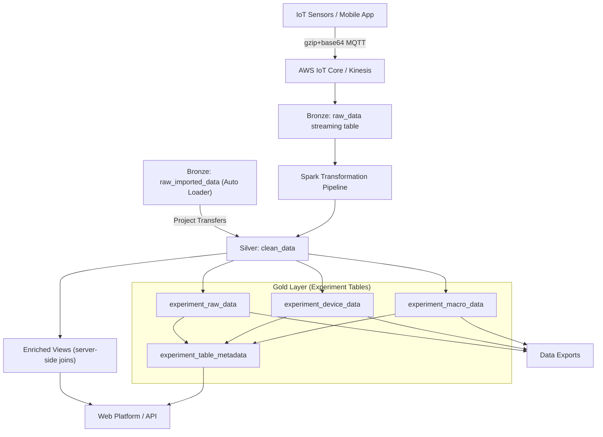

# Data Ingestion Architecture

## Introduction

This document outlines the data ingestion architecture for the openJII platform. The platform uses a centralized **medallion architecture** (Bronze–Silver–Gold) within a single `centrum` schema. All sensor data flows through a unified pipeline from ingestion to refined analytics, while experiment-specific views provide isolated, filtered access to the data each experiment needs.

## Architectural Overview

A unified ingestion and transformation pipeline stores all sensor data in the central raw layer. Experiment-specific data is accessed through views and metadata-driven queries, ensuring that each experiment receives a dataset tailored to its needs without the overhead of maintaining separate schemas.

The architecture features a single medallion model within the `centrum` schema:

- **Bronze:** Captures raw sensor data from sources (such as AWS Kinesis) and imported data from external platforms.
- **Silver:** Cleans and transforms the data, applies quality checks, and enriches records with user profiles and annotations via server-side views.
- **Gold:** Provides experiment-level tables for raw data, device data, and macro outputs, with flexible schema support via VARIANT columns.

### ELT Approach

openJII implements an **ELT (Extract, Load, Transform)** architecture rather than a traditional ETL approach:

1. **Extract:**
   - Data is extracted from agricultural IoT sensors
   - Streamed through AWS IoT Core to Kinesis
   - MQTT payloads are compressed (gzip + base64) to reduce network transfer

2. **Load:**
   - Raw, unprocessed data is loaded directly into the Databricks Bronze layer
   - The `raw_data` streaming table preserves original values, timestamps, and metadata
   - Imported data (e.g. from project transfers) enters via `raw_imported_data` streaming table using Auto Loader

3. **Transform:**
   - All transformations happen within Databricks after loading
   - The medallion architecture (Bronze → Silver → Gold) provides progressively refined transformations
   - Compressed MQTT payloads are automatically decompressed in the pipeline (backward-compatible with uncompressed data)
   - VARIANT columns store flexible JSON data (macro outputs, question answers) without rigid schema requirements

This ELT approach offers several advantages for agricultural research:

- **Data Preservation**: Raw sensor data remains intact in the Bronze layer, ensuring scientific reproducibility
- **Processing Flexibility**: Different experiments can apply unique transformations to the same source data
- **Transformation Power**: Databricks' distributed processing capabilities handle complex transformations efficiently
- **Schema Evolution**: Research protocols can evolve without disrupting the ingestion pipeline — VARIANT columns accommodate arbitrary output shapes
- **Scientific Integrity**: Clear separation between raw data and transformed views supports rigorous scientific methodology

### Data Processing and Integration

The system combines aspects of both data lakehouses and data warehouses. Sensor data is ingested in real time via AWS Kinesis into a centralized raw layer, which acts as the single source of truth. Apache Spark handles both batch and near-real-time transformations, converting the raw data into structured, refined datasets.

The `centrum` schema serves as the single source of truth for all sensor data. Experiment-specific queries are built dynamically based on table type and experiment identifiers, with enriched views pre-joining user profiles and annotations server-side to eliminate redundant client-side processing.

Both streaming and batch processing are essential. Streaming data is captured immediately via AWS Kinesis, while batch processing with Apache Spark cleanses and organizes the data for deeper analysis.

### Table Identity Model

Tables in the data platform use a two-part identity system:

- **`identifier`**: the logical name of the table (e.g. `raw_data`, `device`, or a macro UUID for macro-generated tables)
- **`tableType`**: a discriminator — either `static` (built-in platform tables) or `macro` (generated by macro processing)

This decouples table identity from display names. Macro tables use the macro's UUID as their identifier, and display names are resolved separately via the macro registry. This ensures stable references even when macro names change.

### Gold Layer Tables

The gold layer provides three core experiment-level tables:

| Table | Purpose | Key Features |
| ----- | ------- | ------------ |
| `experiment_raw_data` | Per-sample measurements | VARIANT columns for flexible macro output and question answers |
| `experiment_device_data` | Aggregated device metadata | Per-experiment device summaries |
| `experiment_macro_data` | Unified macro outputs | VARIANT support, grouped by macro identifier |

An `experiment_table_metadata` table caches row counts and schema information for all tables, enabling efficient pagination without expensive `COUNT(*)` queries.

### Enriched Views

Server-side views provide pre-joined data for the application layer:

- `enriched_experiment_raw_data` — joins raw measurement data with user profiles and annotations
- `enriched_experiment_macro_data` — joins macro outputs with user context
- `enriched_raw_ambyte_data` — joins Ambit device data with user context

These views eliminate the need for client-side joins and ensure consistent data enrichment across all access patterns.

### MQTT Data Compression

To reduce bandwidth usage, especially for mobile devices with intermittent connectivity:

1. The mobile app **gzip-compresses** the `sample` field (sensor measurement data) and **base64-encodes** it before publishing via MQTT.
2. A `_sample_encoding: "gzip+base64"` marker is added to the payload.
3. The data pipeline detects this marker and decompresses automatically.
4. Legacy payloads without the marker pass through unchanged — full backward compatibility.

### Data Pipelines

The openJII data platform uses two types of pipelines:

1. **Ingestion Pipeline**: Writes all sensor data into the central `raw_data` streaming table in the `centrum` schema. Imported data enters via the `raw_imported_data` streaming table.

2. **Transformation Pipeline**:
   - Processes data from Bronze → Silver → Gold within the `centrum` schema
   - Applies decompression for gzip+base64 encoded payloads
   - Builds enriched views with server-side joins
   - Populates experiment-level gold tables with VARIANT column support
   - Updates `experiment_table_metadata` cache for efficient querying

The pipeline runs on a scheduled basis, processing all experiments centrally rather than managing per-experiment pipeline orchestration.

### Infrastructure Components

The openJII platform provisions all required Databricks components through OpenTofu (Terraform):

1. **Unity Catalog Metastore:** Secured S3 storage with IAM-based access control
2. **Centrum Schema:** Single centralized schema containing all tables and views
3. **Databricks Asset Bundles:** Pipeline code managed as a Turborepo app with bundled deployment
4. **Data Volumes:** Dedicated volumes for data uploads and exports

### Visual Representation

The diagram below shows the data flow from sensor ingestion through the medallion layers to experiment-level gold tables.

```mermaid
graph TD
A[IoT Sensors / Mobile App]
B[AWS IoT Core / Kinesis]
C["Bronze: raw_data streaming table"]
D["Bronze: raw_imported_data (Auto Loader)"]
E[Spark Transformation Pipeline]
F["Silver: clean_data"]
G["Enriched Views (server-side joins)"]

subgraph "Gold Layer (Experiment Tables)"
H[experiment_raw_data]
I[experiment_device_data]
J[experiment_macro_data]
K[experiment_table_metadata]
end

L[Web Platform / API]
M[Data Exports]

A -->|"gzip+base64 MQTT"| B
B --> C
D -->|"Project Transfers"| F
C --> E
E --> F
F --> G
F --> H
F --> I
F --> J
H --> K
I --> K
J --> K
G --> L
K --> L
H --> M
I --> M
J --> M
```

## Data Exports

The platform provides an asynchronous export system:

1. Users select a table and format (CSV, NDJSON, JSON array, or Parquet).
2. A Databricks job processes the export, handling type conversions as needed (e.g. VARIANT → JSON string for CSV).
3. Completed exports are stored in Unity Catalog volumes and available for download.
4. Export metadata is tracked in a Delta table for status monitoring.

## Design Rationale

Using the centralized `centrum` schema with a single medallion architecture simplifies operations while maintaining data quality, traceability, and scalability. All sensor data flows into a single raw layer that serves as the source of truth, then gets refined through well-defined transformation stages.

Key benefits of the current architecture:

- **Operational simplicity**: One schema and one pipeline to manage, regardless of the number of experiments
- **Flexible schema**: VARIANT columns accommodate arbitrary data shapes from different protocols and macros without schema migrations
- **Efficient querying**: Metadata caching, enriched views, and smart query building reduce latency and compute costs
- **Backward compatibility**: Compression, table identity changes, and schema evolution are handled transparently
- **Security**: Role-based access controls and regular audits protect sensitive information and ensure compliance

Standard storage formats (Delta Lake, Parquet) ensure data consistency and efficient querying, while the centralized approach eliminates the complexity of managing hundreds of experiment-specific schemas.
