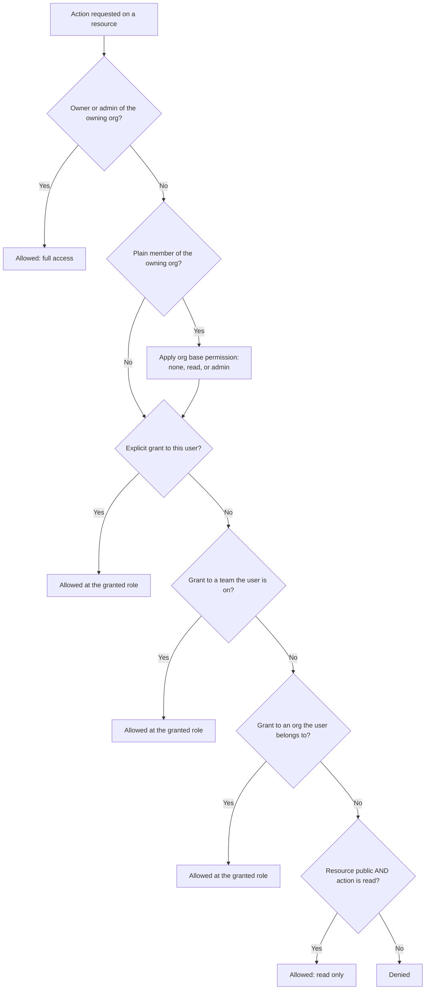

# How access is decided

When you try to do something with a resource in openJII, the platform has to answer a single question: *is this action allowed for this user?* A resource (an experiment, protocol, macro, or workbook, and devices in the future) is owned by an organization, and access to it can come from several places at once. You might be an admin of the owning organization, a plain member who inherits the organization's [base permission](./004-base-permissions.md), the recipient of a direct grant, a member of a team that was granted access, part of an organization that was granted access, or simply someone viewing a public resource.

Rather than trying to combine all of those at once, openJII evaluates them in a fixed order and stops at the first one that applies. This page explains that order, why it exists, and how it plays out in a real example.

## The precedence chain

openJII checks the following sources of access **in order**. The **first match wins**: as soon as one rule applies, it decides the outcome and no later rule is consulted.

| # | Check | If it matches, the user gets… |
| --- | --- | --- |
| 1 | **Owner or admin of the owning organization** | Full access to the resource, always. |
| 2 | **Plain member of the owning organization** | The organization's **base permission** (`none`, `read`, or `admin`). |
| 3 | **An explicit grant to the user** | The role on that grant (owner, admin, member, or viewer). |
| 4 | **An explicit grant to a team the user is on** | The role on that team grant. |
| 5 | **An explicit grant to an organization the user belongs to** | The role on that organization grant. |
| 6 | **The resource is public and the action is read** | Read access. |
| — | **Otherwise** | Access is denied. |

A few things follow directly from this ordering:

- **Owners and admins are unconditional.** Organization owners and admins always have full access to every resource the organization owns. The base permission, individual grants, and visibility settings never reduce their access.
- **Base permission is the floor for members, not the ceiling.** A plain member starts from the organization's base permission. But because explicit grants are checked next, a grant can *raise* a member above a restrictive base permission. This is why a base permission of `none` does not lock members out forever: you can still share specific resources with them.
- **Explicit grants always override the base permission.** If the base permission is `none` (members get nothing implicitly) but a member has a direct `member` grant on one protocol, they can read that protocol. The grant in step 3 wins over the base permission's silence.
- **More specific grants are considered first.** A grant aimed at *you* (step 3) is evaluated before a grant aimed at a *team* you are on (step 4), which is evaluated before a grant aimed at an *organization* you belong to (step 5). The most specific applicable grant decides.
- **Public read is the last resort.** If nothing above grants access, a public resource still allows the *read* action to anyone. Public visibility never grants write or manage access, and it does nothing for private resources.

### Roles a grant can carry

Grants (to a user, a team, or an organization) carry one of four roles. The same role meanings apply wherever a grant lands in the chain:

| Role | Can do |
| --- | --- |
| `owner` | Read, edit, manage, and share the resource. |
| `admin` | Read, edit, manage, and share the resource. |
| `member` | Read only. |
| `viewer` | Read only. |

See [Sharing resources](./008-sharing-resources.md) for how grants are created and managed, and [Base permissions](./004-base-permissions.md) for how the organization-wide member default is set.

## Decision flowchart

The diagram below shows the evaluation order. Follow it top to bottom; the first box that resolves to "allowed" or "denied" is the answer.

The base-permission step is drawn as part of the flow but does not short-circuit it the way the diagram's simplest reading suggests: when a plain member's base permission does not cover the requested action, openJII keeps looking for an explicit grant that does. The worked example below shows exactly that case.

## Worked example: a private protocol shared with one team

Consider the **Photosynthesis Lab** organization. It owns a **private** protocol, *Leaf Gas Exchange v3*. The organization's base permission is set to `none`, so plain members get no implicit access to anything the organization owns. There is one team, **Field Crew**, and the protocol has a single explicit grant: **Field Crew → `member`** (read-only).

Now trace four different people asking to **read** the protocol:

| Person | Relationship | Which check matches | Outcome |
| --- | --- | --- | --- |
| **Asha** | Organization **admin** | Step 1: owner/admin of the owning org | **Allowed (full access).** Asha can also edit, manage, and re-share, regardless of base permission or grants. |
| **Ben** | Plain **member**, on the Field Crew team | Step 2 yields `none` (no access), so evaluation continues; Step 4 matches the Field Crew grant | **Allowed (read-only).** The base permission gave Ben nothing, but the team grant raised him to `member`. |
| **Carla** | Plain **member**, *not* on any team | Step 2 yields `none`; no grant in steps 3–5; resource is private so step 6 fails | **Denied.** A base permission of `none` and no grant means no access. |
| **Dan** | Not a member of Photosynthesis Lab; has a direct `viewer` grant on the protocol | Step 3 matches the explicit user grant | **Allowed (read-only).** Dan is an **Outside Collaborator**: he holds a grant on this one resource but is not a member of the owning organization, so he is labeled as such in the collaborators list and cannot be added to the Field Crew team. |

Now trace one person asking to **edit** the protocol:

| Person | Relationship | Which check matches | Outcome |
| --- | --- | --- | --- |
| **Ben** | Plain member with a Field Crew `member` grant | Steps 1–5 give Ben at most `member` (read-only); step 6 only covers read | **Denied.** `member` and `viewer` grants are read-only; editing needs an `owner` or `admin` role, which Ben does not have. |

The example highlights the two rules people most often trip over:

1. **A restrictive base permission is not the final word.** Photosynthesis Lab uses `none`, yet Ben can still read the protocol because the Field Crew grant is checked after the base permission and overrides it.
2. **Visibility only ever helps with reading.** Even if *Leaf Gas Exchange v3* were public, that would let anyone read it but would still not let Ben edit it. Write and manage access always come from being an owner/admin of the organization or holding an `owner`/`admin` grant.

## How this interacts with visibility and embargo

The public-read check (step 6) depends on a resource's **visibility**. Every resource is either public or private, and visibility in openJII is **monotonic**: a private resource can be made public, but once it is public it can never be made private again. Published data stays published. That means step 6 can only ever start *allowing* read access over a resource's lifetime; it never starts denying it.

Experiments add one wrinkle. An experiment can be private with an **embargo date**: it stays private (so step 6 does not apply to non-collaborators) until that date, after which a job that runs daily at midnight UTC automatically publishes it. The default embargo is 90 days from creation. Because publishing only flips private → public, the embargo is fully consistent with monotonic visibility: an embargoed experiment moves from "private, decided by steps 1–5" to "public, where step 6 also allows reads," and never back.

For how these access rules connect to data isolation and access control in the underlying data platform, see [Data governance](../003-data-platform/002-data-governance.md).

## Quick reference

- Access is decided by walking the chain **owner/admin → member base permission → user grant → team grant → organization grant → public read**, and the **first match wins**.
- Owners and admins of the owning organization always have full access.
- A plain member's starting point is the organization's base permission, but **explicit grants override it** — a `none` base permission can still be supplemented by sharing specific resources.
- `owner` and `admin` grants can edit, manage, and share; `member` and `viewer` grants are read-only.
- A grantee who is not a member of the owning organization is an **Outside Collaborator** and cannot be added to teams.
- Public visibility only ever enables the *read* action, and visibility can only move from private to public, never back.
