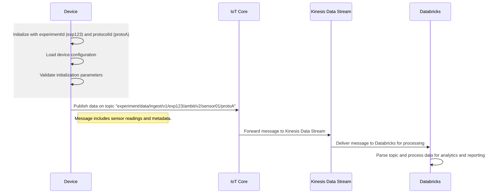

# MQTT Data Ingestion Topic

## Overview

### Purpose

To propose a new, standardized MQTT topic structure that will support the ingestion of experimental data from multiple device families. This proposal outlines a consistent naming convention to streamline integration and to provide a scalable foundation for data ingestion.

### Scope

This document focuses solely on defining the structure for the MQTT topic name used for data ingestion, detailing each topic component for clarity and consistency.

### Background

Having well-defined MQTT topic structures for data ingestion will allow us to avoid challenges in message routing, scalability, and difficulties in device, experiment and protocol management. By introducing a clear and scalable topic format, we aim to provide a foundation for efficient data routing, simplify filtering, scalable to future integrations and needs.

## Proposal

We propose a structured topic format designed specifically for experiment data ingestion, based on the device family and identifiers of the protocol used and the device itself. The format captures these identifiers, as well as versioning details to ensure that each message can be efficiently routed, filtered and processed.

#### Proposed Topic Name

```code
experiment/data/ingest/v1/<experimentId>/<sensorType>/v<sensorVersion>/<sensorId>/<protocolId>
```

#### Topic Components

- `experiment/data/ingest/v1`  
  This fixed prefix indicates that the topic pertains to experiment data ingestion and specifies that version 1 of the format is in use.

- `<experimentId>`  
  Represents a unique identifier for the experiment.

- `<sensorType>`  
  Specifies the category or type of sensor (for example, Ambit or MultispeQ). This component allows messages to be filtered based on sensor classification.

- `v<sensorVersion>`  
  Denotes the sensor's version, prefixed with "v" (for example, v1 or v2.1), which helps track firmware or hardware revisions.

- `<sensorId>`  
  A unique identifier for the sensor generating the data.

- `<protocolId>`  
  Identifies the protocol or methodology used for data sampling or measurement, facilitating differentiation when multiple protocols are in use.

#### Example

```code
experiment/data/ingest/v1/exp123/ambit/v2/sensor01/protoA
```

In this example, data from experiment exp123 is collected from an Ambit-family device of version 2, with the device identifier sensor01, using protocol protoA.

#### Sequence Diagram

The diagram below illustrates the hierarchical structure of the proposed topic:



## Implementation

### Steps

1. **Documentation:**
   Update internal guidelines and AsyncAPI documentation to include the new topic format.

2. **Development:**
   Modify the infrastructure to adopt the proposed topic structure. This includes updating terraform code.

3. **Testing:**
   Conduct comprehensive testing using appropriate subscriptions to ensure that messages are correctly published and received.

4. **Monitoring & Feedback:**
   Monitor system performance after deployment and gather feedback from all stakeholders to refine the topic structure if necessary.

#### Timeline

The change is expected to be implemented and delivered effective immediately.

#### Dependencies

Coordination with firmware developers and JII researches, in order to verify proposed data ingestion sequence.

## Proposal Feedback

We welcome your input on the proposed MQTT topic structure for data ingestion. Please share your comments, suggestions, and any concerns so that we can refine and improve this approach. Your feedback is critical to ensuring that this solution meets our integration and operational needs.
