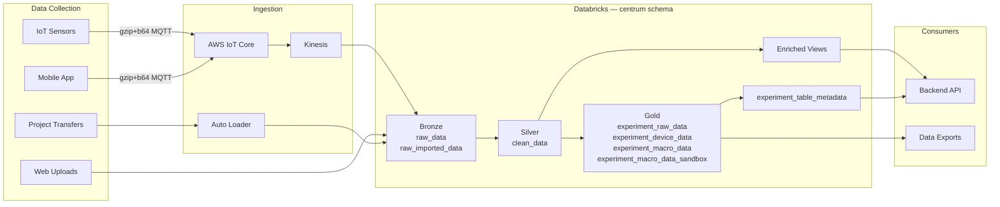

# System Architecture & Data Pipeline

## Overview

openJII is a monorepo built with [Turborepo](https://turbo.build/) and [pnpm](https://pnpm.io/), hosting all applications and shared packages in a single repository. The platform enables agricultural researchers to collect, process, and analyze sensor data through web and mobile interfaces.

## Applications

| App                  | Technology                      | Purpose                                                                                            |
| -------------------- | ------------------------------- | -------------------------------------------------------------------------------------------------- |
| `apps/web`           | Next.js (React)                 | Web platform — experiment management, data visualization, protocol/macro editing                   |
| `apps/mobile`        | React Native (Expo)             | Mobile app — sensor connection, measurement collection, offline support                            |
| `apps/backend`       | NestJS                          | REST API — business logic, authentication, data access                                             |
| `apps/data`          | Python / PySpark                | Databricks pipelines — data ingestion, transformation, export jobs                                 |
| `apps/macro-sandbox` | AWS Lambda, Docker, Python/JS/R | Sandboxed Lambda-based execution environment for user-authored macros in Python, JavaScript, and R |
| `apps/docs`          | Docusaurus                      | Documentation site                                                                                 |
| `apps/cms`           | Contentful integration          | Content management for landing pages                                                               |

## Shared Packages

| Package                  | Purpose                                                                                                                                            |
| ------------------------ | -------------------------------------------------------------------------------------------------------------------------------------------------- |
| `packages/api`           | Shared Zod schemas, API types, and column type utilities                                                                                           |
| `packages/auth`          | Better Auth configuration — email OTP, OAuth (GitHub, ORCID), session management                                                                   |
| `packages/db`            | Drizzle ORM schema, migrations, and database client                                                                                                |
| `packages/iot`           | Platform-agnostic device communication — transport adapters (Bluetooth, BLE, USB, Web Serial) and device drivers (MultispeQ, generic JSON devices) |
| `packages/transactional` | Email templates (React Email) — OTP codes, invitations, project transfer notifications                                                             |
| `packages/ui`            | Shared React UI components                                                                                                                         |
| `packages/tsconfig`      | Shared TypeScript configurations                                                                                                                   |

## Infrastructure

### Cloud Services (AWS)

- **ECS (Fargate)**: Backend API deployment
- **RDS (PostgreSQL)**: Application database
- **Cognito**: User pool (validated from backend via Better Auth)
- **IoT Core + Kinesis**: Real-time sensor data ingestion via MQTT
- **S3**: Object storage for data lake, exports, and static assets
- **CloudFront + ALB**: CDN and load balancing
- **Lambda**: Server functions, automated code revert on failure, and sandboxed execution of user-authored macros (`apps/macro-sandbox`) in Python, JavaScript, and R. Each language runtime runs in its own Lambda container with pre-loaded helper libraries (Python also includes numpy, pandas, scipy). Supports timeout enforcement (1s per-item, 10-60s handler-level) and enforces limits: 1MB script size, 10MB output, 1000 items/request

### Data Platform (Databricks)

- **Unity Catalog**: Data governance with metastore, schemas, and access controls
- **Delta Lake**: Storage format for all data tables (Bronze/Silver/Gold medallion)
- **Databricks Asset Bundles**: Pipeline code deployed as a Turborepo app
- **Volumes**: Dedicated storage for data imports and exports
- **Jobs**: Scheduled pipelines, on-demand export tasks, project transfer processing

### Monitoring & Observability

- **Amazon Managed Grafana**: Production dashboards for API latency, ECS metrics, IoT/Kinesis throughput, DORA metrics
- **PostHog**: Mobile app crash reporting and analytics (EU-hosted)
- **Pino**: Structured JSON logging in backend (replaced previous logger in Q1 2026)
- **CloudWatch**: AWS service metrics and alerting
- **Secrets Manager**: Automated credential rotation

### Infrastructure as Code

- **OpenTofu (Terraform)**: All infrastructure provisioned declaratively
- **OIDC roles**: GitHub Actions authenticate to AWS without long-lived credentials
- **WAF**: Rate limiting and web application firewall rules
- **ECR**: Immutable container image repositories

## Data Pipeline

See [Data Ingestion Architecture](/docs/data-platform/ingestion-architecture) for detailed documentation on the medallion architecture, VARIANT columns, table identity model, and export system.

## Authentication

openJII uses [Better Auth](https://www.better-auth.com/) running in the NestJS backend:

- **Email OTP**: Passwordless login via 6-digit codes sent to email
- **OAuth**: GitHub and ORCID providers with deep-link support for mobile
- **Sessions**: 7-day expiry, cookie-based with extended cache for offline field use
- **Rate limiting**: OTP sends (3/min), sign-in attempts (5/min), verification (10/min)
- **Post-auth hooks**: Auto-accept pending experiment invitations for first-time users

Both web and mobile authenticate against the same backend API endpoints.

## Device Communication

The `@repo/iot` package provides a layered architecture for sensor communication:

1. **Transport Adapters** — platform-specific I/O (Bluetooth Classic, BLE, USB Serial, Web Bluetooth, Web Serial)
2. **Device Drivers** — protocol implementations:
   - **MultispeqDriver**: checksummed responses, versioned command sets, `\r\n` framing
   - **GenericDeviceDriver**: JSON-based protocol with capability discovery (INFO probe), supporting Arduino, Raspberry Pi, and custom sensors
3. **CommandExecutor** — wires driver to transport, exposing `execute<T>(command): Promise<T>`

## Key Architectural Patterns

- **Centralized data schema**: Single `centrum` schema with VARIANT columns for flexible JSON storage, replacing per-experiment schemas
- **Event-driven ingestion**: MQTT → IoT Core → Kinesis → Databricks streaming tables
- **Async exports**: Background Databricks jobs with status tracking and multi-format support (CSV, NDJSON, JSON, Parquet)
- **Many-to-many protocol/macro compatibility**: Join table linking protocols and macros independently
- **Invitation system**: Email-based invitations with auto-acceptance on first sign-in
- **On-device macro execution**: Python macros run via embedded Pyodide in mobile app
- **Server-side macro execution**: Python, JavaScript, and R macros invoked via AWS Lambda functions from backend — supports individual execution and batch execution via webhook endpoint for Databricks pipeline integration
- **Compression throughout**: gzip+base64 for MQTT payloads, gzip for on-device storage
