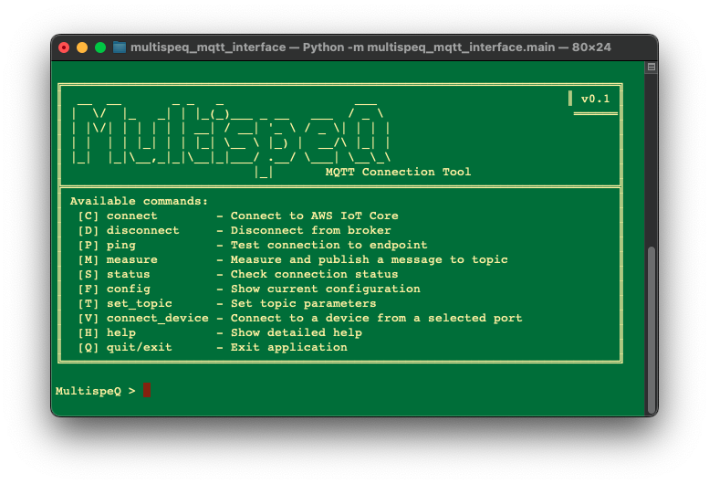
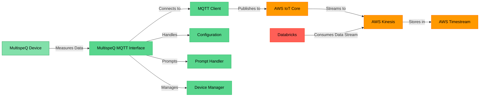

# Introduction

The MultispeQ MQTT Interface (MMI) is a command-line tool that facilitates communication between MultispeQ devices and MQTT brokers. It serves as a bridge that enables seamless data flow from devices to cloud infrastructure, making it an essential component in the OpenJII ecosystem for development purposes.

## Overview

The MultispeQ MQTT Interface provides a lightweight, reliable connection layer between MultispeQ photosynthesis measurement devices and various data processing and storage systems. By leveraging the MQTT protocol, it enables efficient communication patterns including device-to-cloud messaging, configuration management, and remote control capabilities.

## Key Features

- **Bidirectional Communication**: Send commands to devices and receive measurement data
- **Protocol Translation**: Converts between device-specific formats and standardized MQTT messages
- **Secure Authentication**: Implements industry-standard security practices for device authentication
- **Flexible Configuration**: Adapt to different development scenarios with customizable options
- **Error Handling**: Robust error detection and recovery mechanisms
- **Logging**: Comprehensive logging for monitoring and troubleshooting

## Development Use Cases

The MultispeQ MQTT Interface is designed to support development-related use cases:

- **Local Testing**: Test device communication in controlled development environments
- **Protocol Development**: Prototype and refine communication protocols
- **Integration Testing**: Verify connectivity with cloud services and other system components
- **Data Flow Validation**: Confirm proper formatting and handling of device measurements
- **Debugging**: Trace message flow and identify communication issues

## Target Audience

This tool is primarily intended for developers:

- **Software Engineers** working on the OpenJII ecosystem
- **Device Firmware Developers** testing device communication
- **Backend Developers** integrating MultispeQ data into applications
- **QA Engineers** validating system functionality

## Getting Started

To begin using the MultispeQ MQTT Interface for development, proceed to the **[Installation](./002-installation.md)** section for setup instructions, or refer to the **[Basic Usage](./003-usage/001-basic-usage.md)** guide for quick start information.
