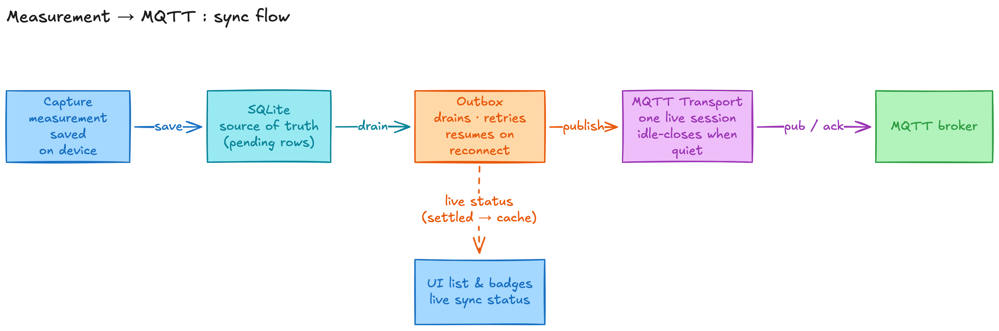
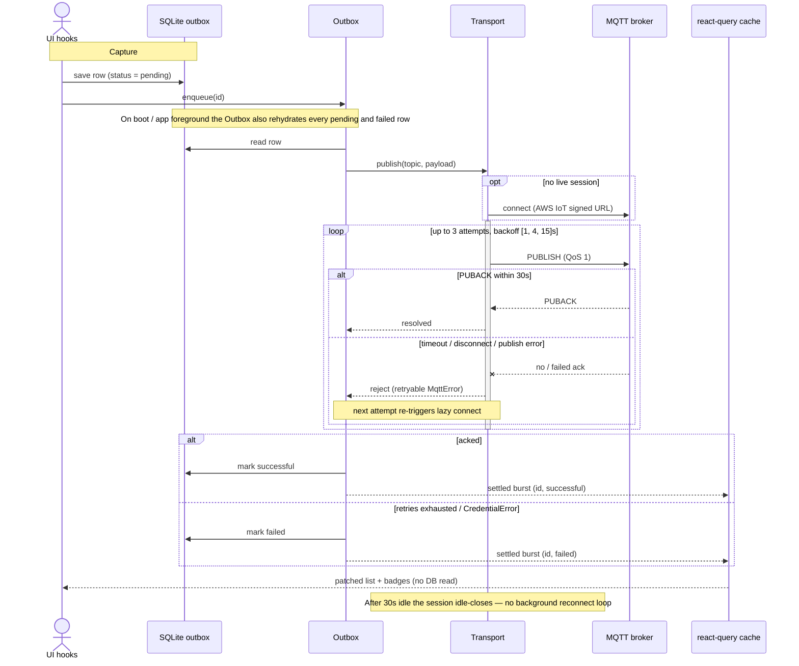

# Measurements Sync

How a measurement captured on the mobile device makes its way to the MQTT
broker, and how the UI stays in sync along the way.

## High-level flow



A captured measurement is written to a local **SQLite outbox** (the source of
truth). The in-memory **Outbox** drains pending rows, publishes them through a
single long-lived **MQTT Transport** session, and reports live status back to
the UI. Delivery, retries, and reconnects all key off the SQLite rows, so the
flow survives app restarts and offline periods.

## Detailed flow

The sync pipeline follows the [transactional outbox pattern](https://microservices.io/patterns/data/transactional-outbox.html):
the `measurements` SQLite table _is_ the queue. Rows with status `pending` or
`failed` are the work list; everything else is in-memory scheduling and
transport.



## Status model

Every measurement row carries a `status`, checked at the DB level and indexed
for the queries the Outbox and UI run:

| status       | meaning                                           |
| ------------ | ------------------------------------------------- |
| `pending`    | saved locally, not yet acknowledged by the broker |
| `failed`     | Outbox exhausted retries; requires user action    |
| `successful` | broker acked (QoS 1 PUBACK)                       |

`pending` and `failed` rows are the work list. On cold start and on app
foreground the Outbox **rehydrates** them and re-enqueues. The table has
indexes on `status`, `(status, timestamp)`, and `created_at` so list/queue
queries stay cheap as rows accumulate.

## Retry, backoff & concurrency

Defined in `services/upload-constants.ts`:

```ts
export const UPLOAD_CONCURRENCY = 8;
export const UPLOAD_RETRY_BACKOFF_MS = [1_000, 4_000, 15_000];
```

- Up to **8** rows publish concurrently (`AsyncQueuer`).
- Each row gets **3 attempts** with backoff `[1s, 4s, 15s]`. After the last
  attempt the row goes to `failed`.
- The Transport does **no** retry of its own. Every Outbox retry triggers a
  fresh lazy reconnect via the Transport, so the `[1, 4, 15]s` backoff _is_ the
  reconnect schedule.

### Error classification

`isRetryableMqttError` (in `mqtt/mqtt-errors.ts`) decides whether an attempt
counts against the budget or is terminal:

| `MqttError.kind`  | retryable | why                                                      |
| ----------------- | --------- | -------------------------------------------------------- |
| `PublishError`    | ✅        | transient wire failure                                   |
| `Timeout`         | ✅        | no PUBACK within `PUBLISH_TIMEOUT_MS` (30s)              |
| `Disconnected`    | ✅        | session dropped; next attempt reconnects                 |
| `CredentialError` | ❌        | Cognito misconfig won't fix itself — fail fast, no noise |

Non-`MqttError` throwables are treated as retryable by default.

## Single MQTT session lifecycle

The Transport (`mqtt/mqtt-transport.ts`) holds **at most one** live session:

- **Lazy connect** on the first publish; reuse the session for subsequent ones.
- **Idle-close** after `IDLE_DISCONNECT_MS` (30s) with zero in-flight messages,
  keeping the radio quiet when there is nothing to send.
- **No background reconnect loop** — reconnect happens on the next publish,
  driven by the Outbox retry cadence.
- `mqtt/mqtt-paho-session.ts` wraps a single `paho-mqtt` client per session and
  is recreated on disconnect. Connection signing lives in `mqtt/aws-iot-auth.ts`
  (AWS IoT signed WebSocket URL).

## Reactive surface

The Outbox is the single source of upload-progress reactivity. It exposes three
channels, consumed via hooks in `hooks/use-outbox-state.ts`:

- **snapshot** — `useOutboxSnapshot()` for aggregate badges/counts.
- **per-id** — `useIsProcessing(id)` subscribes to one row, so a settle wakes
  only that row, not every visible list item.
- **settled burst** — batched stream of `{ id, status }` after each settle.

`outbox-to-query-cache-bridge.ts` is mounted **once** at the app root
(`app/_layout.tsx`) and feeds settled bursts to the react-query cache via
`measurement-list-cache.ts`. Settles are **coalesced** before they touch the
cache: a [TanStack Pacer](https://tanstack.com/pacer) `Throttler`
(`leading + trailing`, 2s window) buffers them by id (last status wins), so a
lone settle patches instantly while a burst collapses into **one**
`applySettledPatchBatch`. Inside that, `notifyManager.batch` collapses the
list/counts writes into ~1 re-render, the patcher rewrites only the changed rows
(returning the _same_ reference when a query is unchanged, so memoized rows skip
re-render), and the patch carries the terminal status directly — **no DB
round-trip** downstream. See [Performance](#performance-ojd-1470) for why the
coalescing matters.

## Performance (OJD-1470)

paho-mqtt is **pure JavaScript**, so it parses every PUBACK on the same single
JS thread that React renders on. While a batch uploads with the Recent tab
mounted, anything that hogs that thread — a re-render per ack, per-item date
parsing, a heavy first list commit — **starves PUBACK parsing**: the broker has
already replied, but paho can't read the frame until the thread frees up, so the
measured `wire_ms` balloons. Symptoms were upload times climbing from ~1.5s
toward ~5s after visiting Recent, plus a ~1.5s spike on each tab switch. Every
change below exists to keep that thread free for paho.

- **Coalesced settle bursts.** The cache bridge throttles settles through a
  Pacer `Throttler` (2s, leading + trailing) and buffers by id, so a draining
  Outbox produces ~1 cache write per window instead of one re-render per ack.
  See [Reactive surface](#reactive-surface).
- **Reference-stable, surgical patches.** `applySettledPatchBatch` wraps its
  writes in `notifyManager.batch` and returns the _same_ array/object reference
  when a query is unchanged, so memoized rows and unaffected lists bail out of
  re-render entirely.
- **Counts off the list render.** Aggregate counts live in their own
  toolbar-local subscription (`useMeasurementCounts`); the list screen
  subscribes via `useHasAnyMeasurements`, whose `select` returns a boolean so it
  re-renders only when the library flips empty↔non-empty — not on every ack.
  Previously the counts changed on every settle and dragged the whole list
  render with them.
- **Derived columns — never decompress on the list path.** `questions_text`,
  `has_comment`, and `day_key` are computed once at write time
  (`deriveListColumns`) and read straight from SQLite by `getMeasurementsList`,
  so the list query never decompresses `measurement_result` or runs Zod. A
  one-time `backfillDerivedColumns` populates legacy rows in batches with
  `setTimeout(0)` yields (migrations `0003`/`0004`).
- **`day_key` removes per-item Luxon from grouping.** `groupMeasurementsByDay`
  buckets on the precomputed `day_key` (regex-validated `YYYY-MM-DD`), parsing
  the ISO timestamp only as a fallback for not-yet-backfilled rows. Grouping
  ~50 rows dropped from ~140ms to ~20ms.
- **Deferred first list commit.** The Recent screen holds its first FlashList
  commit behind `InteractionManager.runAfterInteractions` (with a 500ms
  fallback) and bounds `drawDistance`, so the PUBACKs queued during the tab
  transition drain _before_ the ~200ms commit of 50 gesture-handler/reanimated
  swipeable rows. The screen stays mounted afterward, so return visits are
  instant.

Net effect: the per-ack render storm and per-item date parsing are gone, and the
one-time tab-switch commit no longer blocks in-flight acks — upload latency stays
near the broker round-trip (~250ms locally) instead of climbing.

## Composition root & the HMR gotcha

`shared/composition/upload.ts` is the only place that picks concrete adapters:
it wires **one Transport into one Outbox**, lazily, behind `getTransport()` /
`getOutbox()`. Everything else takes `Transport` / `Outbox` as injected
dependencies, so tests substitute fakes.

The singletons live on `globalThis`, **not** module-level `let`s, on purpose.
React Native Fast Refresh re-evaluates the module on each edit; with `let`
bindings the next getter would build a _fresh_ pipeline while the old one keeps
running inside closures the GC can't reach — N reloads ⇒ N live Outboxes all
draining the same SQLite queue and re-publishing every pending row (the
duplicate-PUBACK bug). A value parked on `globalThis` survives re-eval, and a
`module.hot.dispose` handler tears the graph down so the next getter rebuilds on
new code. Production has no Fast Refresh, so this is structural insurance.

## Tracing (wide events)

`shared/utils/trace.ts` accumulates events keyed by a correlation id (the
measurement id) and emits **one** fat log entry on `end()` with timings + every
event. Modules attach to the same trace via `getTrace(id)` without threading a
trace object through signatures. The Transport attaches `queued` / `wire_send`
/ `puback` lifecycle events when `publish()` is given a `traceId`, so a single
wide event covers DB → MQTT for one measurement.

## Module map

| Concern                             | File                                                           |
| ----------------------------------- | -------------------------------------------------------------- |
| Source of truth / queue             | `shared/db/schema.ts`, `shared/db/measurements-storage.ts`     |
| Scheduler                           | `recent-measurements/services/outbox.ts`                       |
| Tuning constants                    | `recent-measurements/services/upload-constants.ts`             |
| Cache patcher                       | `recent-measurements/services/measurement-list-cache.ts`       |
| Cache bridge                        | `recent-measurements/services/outbox-to-query-cache-bridge.ts` |
| Reactive hooks                      | `recent-measurements/hooks/use-outbox-state.ts`                |
| Recent list screen (deferred mount) | `recent-measurements/screens/recent-measurements-screen.tsx`   |
| Day grouping (local-date buckets)   | `shared/utils/group-measurements-by-day.ts`                    |
| Derived-column backfill             | `shared/db/measurements-backfill.ts`                           |
| MQTT transport (session mgmt)       | `connection/services/mqtt/mqtt-transport.ts`                   |
| Paho client wrapper                 | `connection/services/mqtt/mqtt-paho-session.ts`                |
| AWS IoT auth (signed URL)           | `connection/services/mqtt/aws-iot-auth.ts`                     |
| Error kinds / retry policy          | `connection/services/mqtt/mqtt-errors.ts`                      |
| Composition root (wiring)           | `shared/composition/upload.ts`                                 |
| Wide-event tracing                  | `shared/utils/trace.ts`                                        |

## Debugging tips

- **Duplicate PUBACKs / "N idle — closing session" logs in dev**: a second
  pipeline was layered by Fast Refresh. Confirm the `globalThis` graph and
  `module.hot.dispose` teardown in `upload.ts` are intact.
- **Rows stuck `pending`**: check connectivity — the Outbox pauses offline and
  resumes on reconnect. A `failed` row instead means retries were exhausted (or
  a terminal `CredentialError`).
- **UI not updating after a sync**: the cache bridge must be mounted at the app
  root. Without it the react-query cache never receives settled bursts.
- **Topic / payload shape**: see [Topic Structure](./001-topic-structure.md) and
  [Message Format](./002-message-format.md).
