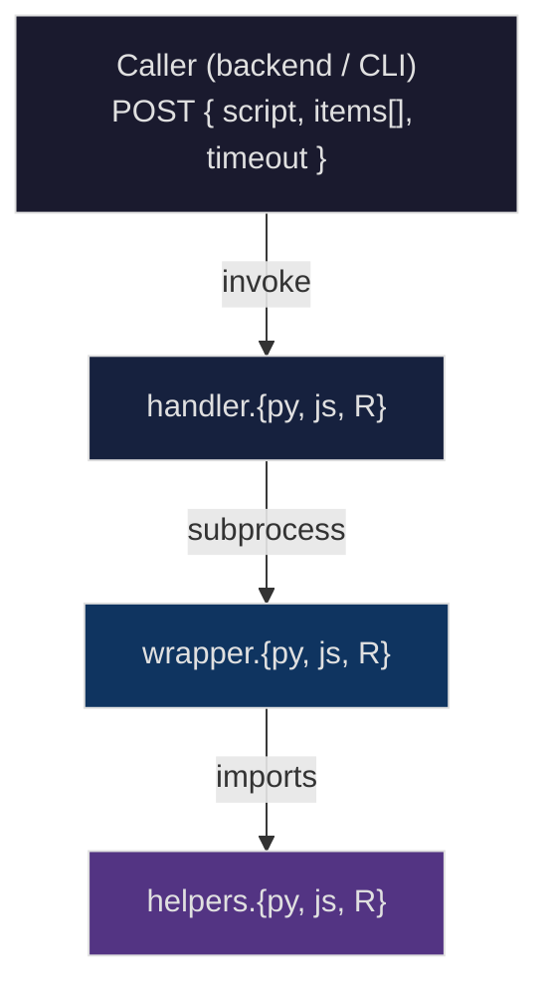

# Macro Sandbox

Sandboxed execution environment for running user-authored plant science macros (chlorophyll, SPAD, etc.) as AWS Lambda functions. Supports **Python**, **JavaScript**, and **R** runtimes, each running in its own Lambda container with language-specific helper libraries pre-loaded.

## Architecture



Each invocation:

1. **Handler** validates the event, base64-decodes the user script, writes it and the input items to temp files.
2. **Wrapper** is spawned as a subprocess with a minimal environment (no AWS credentials). It loads helpers, compiles the user script once, then iterates over each item - injecting `json` (item data) and `output` (result dict) into the script's scope.
3. **Helpers** provide domain-specific functions (`MathMEAN`, `MathROUND`, `ArrayNth`, `TransformTrace`, etc.) mirroring the MultispeQ ecosystem.

### Limits

| Limit             | Value |
| ----------------- | ----- |
| Max script size   | 1 MB  |
| Max output size   | 10 MB |
| Max items/request | 1,000 |
| Max timeout       | 60 s  |
| Default timeout   | 10 s  |

### Timeout Behavior

There are **two levels** of timeout enforcement:

| Level        | Value   | Controlled by         | Description                                                                                           |
| ------------ | ------- | --------------------- | ----------------------------------------------------------------------------------------------------- |
| **Per-item** | 1 s     | Wrapper (hardcoded)   | Each item in the `items[]` array gets at most 1 second of execution time. Not configurable by caller. |
| **Handler**  | 10–60 s | `timeout` event field | Total wall-clock time for the subprocess (wrapper + all items). Defaults to 10 s if omitted.          |

The per-item timeout prevents a single bad item from consuming the entire handler budget. If one item times out, processing continues to the next item - the timed-out item is recorded with `success: false` and an error message. The handler-level timeout is a hard ceiling on the entire invocation.

## Event Schema

```jsonc
{
  // Private backend-to-sandbox contract marker. Versions the event schema; it is
  // never stored on a macro or Workbook snapshot.
  "input_contract": "canonical-measurement-v1",
  "script": "<base64-encoded script>",
  "items": [
    // `data` is one canonical measurement supplied by the backend. It is not a
    // { sample: [...] } envelope or a top-level array; the backend normalizer
    // (packages/api normalizeMacroInput) has already projected it.
    { "id": "sample-1", "data": { "trace_1": [45.2, 46.8, 44.1] } },
    { "id": "sample-2", "data": { "trace_1": [38.1, 39.5, 37.8] } },
  ],
  "timeout": 10,
  "protocol_id": "proto-123",
}
```

### Contract guard

Each handler runs a boundary guard (`lib/guards/guard.{js,py,R}`) that validates
`input_contract` and classifies every item's `data` as a postcondition check. It
does not re-shape values; the backend owns the single shaping algorithm.

| Item `data`                                             | Classification           | Item error (enforce)  |
| ------------------------------------------------------- | ------------------------ | --------------------- |
| direct object/scalar, `{}`, object with scalar `sample` | `canonical`              | none                  |
| `[]`, `{ "sample": [] }`                                | `empty-envelope`         | `empty-envelope`      |
| `[m, ...]`, `{ "sample": [m] }`, `{ "sample": {} }`     | `non-canonical-envelope` | `non-canonical-input` |

Modes are selected by the `MACRO_GUARD_MODE` env var:

- **`shadow`** (default): classify and log content-free telemetry to stderr, but
  run every item exactly as before. No functional change.
- **`enforce`**: a missing/unsupported marker fails the whole invocation
  (`unsupported-input-contract`); each non-canonical item fails on its own
  (`{ id, success: false, error }`) while valid siblings still run, results
  merged back in request order.

Shadow telemetry is a single stderr line, e.g.
`[guard] {"event":"macro-guard","mode":"shadow","markerPresent":true,"markerValid":true,"counts":{},...}`.
It carries bounded facts only (marker presence/validity, counts, item IDs) and
never the caller-supplied marker value, measurement contents, or macro source.
The R runtime bootstrap forwards handler stderr to the Lambda log stream on every
invocation so this line is visible in R as well as Python and JavaScript.

The three guards are held to one serialized conformance corpus
(`test/conformance/corpus.json`) so Python, JavaScript, and R produce identical
item IDs, order, classifications, and error codes. The R guard inspects the raw
JSON container kind before `jsonlite` simplification so `{}` and `[]` are
distinguished.

### Response

```jsonc
{
  "status": "success", // or "error"
  "results": [
    { "id": "sample-1", "success": true, "output": { "chlorophyll": 45.37 } },
    { "id": "sample-2", "success": false, "error": "Item timed out after 1s" },
  ],
  "errors": [], // populated on handler-level failure
}
```

## Project Structure

```text
apps/macro-sandbox/
├── functions/                  # Lambda entry points (one per language)
│   ├── javascript/
│   │   ├── Dockerfile
│   │   └── handler.js
│   ├── python/
│   │   ├── Dockerfile
│   │   └── handler.py
│   └── r/
│       ├── bootstrap           # Custom Lambda Runtime API bootstrap
│       ├── Dockerfile
│       ├── entry.sh
│       └── handler.R
├── lib/
│   ├── guards/                 # Canonical-measurement contract guards
│   │   ├── guard.js
│   │   ├── guard.py
│   │   └── guard.R
│   ├── helpers/                # Domain-specific helper libraries
│   │   ├── helpers.js
│   │   ├── helpers.py
│   │   └── helpers.R
│   └── wrappers/               # Script execution wrappers
│       ├── wrapper.js
│       ├── wrapper.py
│       └── wrapper.R
└── test/
    ├── event.json              # Sample invoke payload (marked)
    ├── event.unmarked.json     # Sample invoke payload without the marker
    ├── conformance/            # Cross-language guard conformance corpus
    ├── data/                   # Test case data files
    │   ├── samples.json
    │   ├── intensive.json
    │   ├── security.json
    │   └── generate/           # Add new test cases here
    ├── integration/            # Integration tests (vitest)
    └── scripts/                # Test data management CLI
        ├── generate.ts         # Merge test cases from generate/
        ├── init.ts
        ├── view.ts
        └── edit.ts
```

## Getting Started

### Prerequisites

- Docker
- pnpm

### Build

Build all three runtime images:

```sh
pnpm build
```

Or build individually:

```sh
pnpm build:python
pnpm build:js
pnpm build:r
```

### Run Locally

Start all three Lambda containers using Docker Compose (with the Lambda Runtime Interface Emulator):

```sh
pnpm dev
```

Each language is exposed on a separate port:

| Language   | Port |
| ---------- | ---- |
| Python     | 9001 |
| JavaScript | 9002 |
| R          | 9003 |

### Invoke

Send a test event to a running container:

```sh
pnpm invoke:python
pnpm invoke:js
pnpm invoke:r
```

Or invoke directly with curl:

```sh
curl -XPOST http://localhost:9001/2015-03-31/functions/function/invocations \
  -d @test/event.json
```

## Testing

Guard conformance runs without Docker: it drives the real per-language guard code
against `test/conformance/corpus.json` and asserts identical decisions across
Python, JavaScript, and R.

```sh
pnpm test:unit
```

Integration tests spin up all three containers on isolated ports (9011–9013), run test suites against each language, then tear down.

```sh
pnpm test
```

This is equivalent to:

```sh
pnpm test:up      # build & start test containers
pnpm test:run     # run vitest integration suite
pnpm test:down    # stop & remove containers
```

### Test Suites

| Suite       | Description                                                |
| ----------- | ---------------------------------------------------------- |
| `samples`   | Standard macros - validates output matches expected values |
| `intensive` | Heavier workloads - large datasets, complex computations   |
| `security`  | Sandbox escape attempts - verifies isolation               |

### Adding Test Cases

Create a directory under `test/data/generate/` with:

```text
test/data/generate/my_test/
  macro.py              # or .js / .R
  input.json            # array of { id, data } items
  expectations.json     # { dataset, success, error }
  output.json           # (optional) expected per-item output
```

Then merge into the test data files:

```sh
pnpm test:generate
```

See [test/data/generate/README.md](test/data/generate/README.md) for full details.

### Test Data Scripts

| Script               | Description                           |
| -------------------- | ------------------------------------- |
| `pnpm test:generate` | Merge new test cases from `generate/` |
| `pnpm test:init`     | Initialize test data files            |
| `pnpm test:view`     | Pretty-print existing test cases      |
| `pnpm test:edit`     | Edit test cases interactively         |
