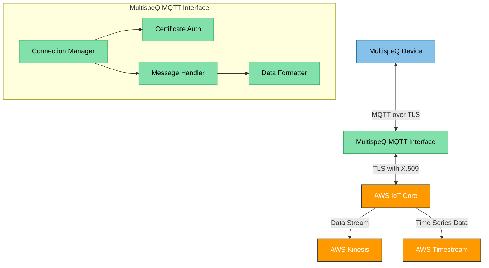

# MultispeQ MQTT Interface

This tool provides an interface to connect MultispeQ devices to the OpenJII Platform via MQTT. It enables secure communication between MultispeQ devices and AWS IoT Core for real-time data transmission and analysis.

> **Note**: This tool is currently in active development and intended for development purposes only. APIs and functionality may change without notice.

## Overview

The MultispeQ MQTT Interface facilitates bi-directional communication between MultispeQ devices and the OpenJII cloud infrastructure. It handles device authentication, message formatting, and ensures data is properly routed to AWS Timestream and Kinesis for storage and processing.



## Features

- **Secure Communication**: Uses TLS certificates for device authentication
- **Data Formatting**: Standardizes measurement data for cloud processing
- **Real-time Processing**: Enables immediate data ingestion and analysis
- **Error Handling**: Robust error recovery mechanisms
- **Logging**: Comprehensive logging for troubleshooting

## Prerequisites

- Python 3.6 or higher
- AWS IoT Core account and credentials
- AWS IoT Core certificates (CA, certificate, private key)
- MultispeQ device for testing (Optional, can publish mocked messages)
- Node.js (v16 or higher) (Optional, dependent on choice of installaion, see below)

## Installation

### For Users

```bash
# Install directly from GitHub
pip install git+https://github.com/Jan-IngenHousz-Institute/open-jii.git#subdirectory=apps/tools/multispeq_mqtt_interface
```

### For Developers

```bash
# Clone the repository
git clone https://github.com/Jan-IngenHousz-Institute/open-jii.git

# Navigate to the tool directory
cd open-jii/apps/tools/multispeq_mqtt_interface

# Install in development mode
pip install -e .
```

## Command Reference

## Command Reference

| Command          | Shortcut | Description                              |
| ---------------- | -------- | ---------------------------------------- |
| `connect`        | `c`      | Connect to AWS IoT Core MQTT broker      |
| `disconnect`     | `d`      | Disconnect from broker                   |
| `ping`           | `p`      | Test connection to endpoint              |
| `publish`        | `m`      | Measure and publish a message to topic   |
| `status`         | `s`      | Check connection status                  |
| `config`         | `f`      | Show current configuration               |
| `set_topic`      | `t`      | Set topic parameters                     |
| `connect_device` | `v`      | Connect to a device from a selected port |
| `help`           | `h`      | Show detailed help                       |
| `exit`/`quit`    | `q`      | Exit application                         |
| `clear`          |          | Clear the screen                         |

## Installation

```bash
# Clone the repository
git clone https://github.com/Jan-IngenHousz-Institute/open-jii.git

# Navigate to the tool directory
cd open-jii/apps/tools/multispeq_mqtt_interface

# Install dependencies
pnpm install
```

## Configuration (Optional)

The tool can be configured using environment variables or a `.env` file in the project root.

```bash
# AWS IoT Core configuration
AWS_IOT_ENDPOINT=a2s5vvyojsnl53-ats.iot.eu-central-1.amazonaws.com
AWS_REGION=eu-central-1

# Device authentication
AWS_IOT_CERT_FILEPATH=/path/to/certificate.pem
AWS_IOT_PRIVATE_KEY_FILEPATH=/path/to/private.key
AWS_IOT_CA_FILEPATH=/path/to/ca.pem
```

```bash
# Connection settings
AWS_IOT_PORT=8883                  # Default: 8883
AWS_IOT_CLIENT_ID=client-name      # Default: "test-" + UUID
AWS_IOT_KEEP_ALIVE=30              # Default: 30
AWS_IOT_CLEAN_SESSION=False        # Default: False

# Topics
AWS_IOT_TOPIC=experiment/data_ingest/v1/{experiment_id}/multispeq/v1.0/{sensor_id}/{protocol_id}

# Proxy settings (if needed)
AWS_IOT_PROXY_HOST=proxy.example.com
AWS_IOT_PROXY_PORT=8080

# Logging
LOG_LEVEL=INFO                    # Default: INFO
```

## Usage

### Starting the Interface

```bash
# Start in production mode
pnpm start

# Start in development mode with hot reloading
pnpm dev
```

### Testing the Connection

```bash
# Run tests
pnpm test
```

## Troubleshooting

Common issues and solutions:

1. **Connection failures**: Verify AWS credentials and network connectivity
2. **Authentication errors**: Check certificate paths and permissions
3. **Message delivery issues**: Confirm topic structure and subscription status

Check logs for detailed error messages.

## Development

```bash
# Lint code
pnpm lint

# Format code
pnpm format

# Build for production
pnpm build
```

## Related Documentation

- [OpenJII Documentation Hub](https://docs.openjii.org)
- [AWS IoT Core Documentation](https://docs.aws.amazon.com/iot/latest/developerguide/what-is-aws-iot.html)

## Contributing

Please refer to the [Contributing Guidelines](../../../CONTRIBUTING.md) in the root of the repository.

## License

This project is licensed under the same license as the parent OpenJII project. See the [License](../../../LICENSE) file in the repository root for details.
