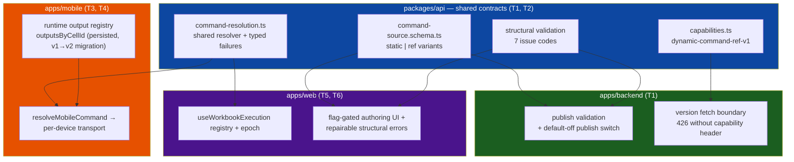

# Walkthrough: dynamic command cells (Tickets 1–7)

**Changeset:** ~153 files (110 modified, 43 new), ~8,110 insertions / ~1,046 deletions, all uncommitted in the `traycer-open-jii-polite-badger` worktree. Every ticket passed independent cold review; the only open gate is the real MultispeQ hardware matrix (Ticket 7, needs a human with a device).

## What this change does

A workbook command cell can now reference an **earlier cell's runtime output** (typically a Python macro computing per-device `{ toDevice }` strings, or a question's answer) instead of a static string. At run time, each host resolves the reference against its own output registry and dispatches the resolved value to devices — with a hard safety contract:

<user_quoted_section>A dynamic command is dispatched only from the referenced source's output under the active workbook version and execution epoch, and a device-scoped value is never substituted across device identities. Every invalid case fails before transport with a typed, translated error.</user_quoted_section>

Everything is dark: the web authoring flag defaults off, the backend publish switch defaults off, and the CMS minimum client version is untouched.

## Architecture at a glance

## Change areas by ticket

| Ticket | Area | What changed |
| --- | --- | --- |
| 1 — Safe contracts & server boundary | `packages/api` schemas, `apps/backend` | Strict `static \| ref` command-source variants (static shape unchanged → no data migration); shared structural validator (7 issue codes); backend publish validation; capability header `dynamic-command-ref-v1`; old clients get **426** on dynamic versions with no payload leak; publish switch `DYNAMIC_COMMAND_PUBLISH_ENABLED` default-off |
| 2 — Shared runtime resolver | `packages/api/src/transforms` | `command-resolution.ts`, `runtime-output.ts`, `output-lookup.ts`, `flow-graph-topology.ts`: one resolver both hosts call; 18 typed resolution failure codes; freshness (epoch/version), earlier-in-flow ordering, exact-device scoping |
| 3 — Mobile output state migration | `apps/mobile` stores | Persisted `outputsByCellId` registry with v1→v2 migration, rehydration guard, malformed-resume coordinated reset (`FLOW_RESUME_STATE_INVALID`) |
| 4 — Mobile dynamic execution (+amendment) | `apps/mobile` measurement-flow | Ref carrier survives cells↔flow; `resolveMobileCommand` resolves from raw cell once per target; invalid devices pre-fail with zero transport; replies recorded under exact producer/device; **amendment:** legacy `scanResult`/`scanResults` upload projection preserved, branch transport failures attributed to exact producer |
| 5 — Web dynamic execution | `apps/web/hooks/workbook` | Same resolver contract through `useWorkbookExecution`; per-device assignments, previews, epoch invalidation |
| 6 — Web authoring (+amendment) | `apps/web/components`, `packages/i18n` | Flag-gated (`DYNAMIC_COMMAND_AUTHORING`, default-off) command-cell authoring; question sources atomically pin `field:"answer"`; hostile-input-safe `publish-error.ts` parser; shared `StructuralIssueList` (role="alert", repair links) on all three attach paths + upgrade dialog; upgrade mutation reset lifecycle; durable new-experiment creation-result panel; en-US + de-DE parity |
| 7 — Qualification (+UI pass) | 4 new fixture suites, polish | 36 cross-host qualification tests (shared 15, mobile 12, web 4, backend 5 with real DB/HTTP); evidence artifact + rollout readiness checklist; UI polish: last hardcoded English localized, aria labels, `rel="noopener noreferrer"` |

## Suggested review order

1. **`packages/api/src/domains/workbook/command-source.schema.ts` + `capabilities.ts`** — the persisted contract everything else derives from. Check: static cells stay valid without `kind`; ref variant is strict with no fallback.
2. **`packages/api/src/transforms/command-resolution.ts`** — the safety core. Check the typed failure paths: stale epoch, wrong version, missing/empty/non-string field, source-device failure, cross-device isolation. This is where "fails before transport" is decided.
3. **Backend boundary** — `apps/backend/src/workbooks/presentation/workbook.controller.ts` + `publish-version.ts`: 426 refusal must not leak cell content; publish gate must be exact-`"true"` opt-in.
4. **Mobile execution** — `mobile-command-resolution.ts`, `command-node.tsx`, `use-measurement-capture.ts`, `use-multi-scanner.ts`: per-device dispatch, the preserved legacy upload projection (amendment), and producer-exact failure attribution.
5. **Mobile persistence** — stores + rehydration guard + migration: valid resume survives restart/upgrade, malformed state resets rather than half-loads.
6. **Web authoring UX** — `command-cell.tsx`, `publish-error.ts`, `structural-issue-list.tsx`, `workbook-upgrade-dialog.tsx`, `new-experiment.tsx`: repairability (issues keyed by command cell with links), never auto-repair/delete, retry not permanently blocked.
7. **Qualification fixtures** — the four `*dynamic*qualification*` suites; the api one is the strongest single file to read (whole matrix, transport-not-called assertions).
8. **i18n + polish** — locale key parity en-US/de-DE (nl-NL intentionally omitted, falls back to en-US).

## Important decisions (not obvious from the diff)

| Decision | Why |
| --- | --- |
| Ref variant has **no static fallback content** | A hidden fallback could silently dispatch stale/wrong commands — the core risk this design exists to prevent |
| No data migration for existing workbooks | `kind` absent = static; old saved cells parse unchanged |
| Old-client safety lives at the **version-fetch boundary** (426 + capability header), not in the schema | Old strict static schemas can't parse a ref carrier; refusing serve is the only safe option |
| Command replies become **reference outputs** in a unified registry, but the legacy `scanResult` upload projection is preserved (T4 amendment) | Initial implementation dropped the projection; review caught that the plan required existing upload/analysis behavior to remain green |
| Structural errors parsed by a **strict allowlist, own-property-safe** parser | Server error envelopes are hostile input: prototype pollution, throwing getters, and proxies are all rejected without executing them |
| New-experiment structural rejection stays on a **durable creation-result panel** instead of toast + navigate | Review rejected two earlier versions that lost all repair context; the panel keeps issues, workbook repair link, and created-experiment link |
| Question sources atomically pin `field: "answer"` | Prevents a stale field from a previous non-question source silently misresolving |
| Telemetry is **identifier/code-only** everywhere | Resolved command strings and raw source data may contain secrets; tests assert non-leak with sentinels |

## Gotchas

- **Branch vs direct attribution (mobile):** only *executed* transport failures are recorded under the producer (`SOURCE_DEVICE_FAILED` on later refs); resolver pre-failures are non-executions (`DEVICE_OUTPUT_MISSING`). Both fail closed — the distinction is diagnostic accuracy.
- **TanStack mutation errors persist until `reset()`** — the upgrade dialog derives its blocked state from the retained error, so the card resets on mount/target-change/fresh-open (never on the failure itself) or one rejection would block retry forever.
- **`setScanResults(projection, nodeId)` double-writes** the registry entry for one synchronous instant before `recordDeviceProducerOutcomes` overwrites it — net-correct, flagged by review as a non-blocking cleanup.
- **Web test harness renders i18n keys** (`t: (key) => key`), so component assertions match keys — which doubles as a no-hardcoded-English check.
- **Environment quirks:** repo requires Node 24 (better-sqlite3 fails to self-register under 22); root `pnpm typecheck` is broken (turbo task is `check-types`) — worth a separate one-line fix; `data#test` fails under turbo strict env (JAVA_HOME dropped), passes standalone; `experiment-dashboards` widget tests flake under high parallelism.

## Verification

**Done (all on Node 24, recorded in the [qualification evidence](../../dynamic-command-cell-technical-plan/tickets/07-cross-host-device-qualification/qualification-evidence/index.md)):**

- Full suites: mobile 937 ✓, web 4,871 ✓ (2 pre-existing unrelated dashboard failures), api 358 ✓, backend workbooks 109 ✓ (real test DB); `turbo run check-types` 4/4; `pnpm build:affected` 11/11; lints and `git diff --check` clean.
- Every ticket independently cold-reviewed to ACCEPT (Tickets 4 and 6 each required amendments before acceptance). Qualification fixtures audited assertion-by-assertion for non-vacuousness — invalid cases assert transport **not called**.
- Rollout readiness checklist confirms all three switches off: authoring flag default-false, publish switch unset (exact-`"true"` opt-in), CMS minimum version untouched.

**Still open:**

- **Real MultispeQ hardware matrix** (11 scenarios × host/device/version/reconnect/replies) — template in the evidence artifact, requires a human with hardware. Ticket 7 stays in-progress until executed; the readiness checklist blocks flag-flipping on it.
- The changeset is uncommitted — commit/PR is a separate step.

## Related artifacts

- [Technical plan](../../dynamic-command-cell-technical-plan/index.md) · [Core flows](../../dynamic-command-cell-core-flows/index.md) · [Tickets](../../dynamic-command-cell-technical-plan/tickets/index.md)
- Reviews: [T4](../../dynamic-command-cell-technical-plan/tickets/04-mobile-dynamic-execution/review-ticket-4-mobile-dynamic-execution/index.md) · [T6 amendment](../../dynamic-command-cell-technical-plan/tickets/06-web-dynamic-authoring/amendments/01-authoring-safety-and-publication-errors/review/index.md) · [T7](../../dynamic-command-cell-technical-plan/tickets/07-cross-host-device-qualification/review-ticket-7-qualification/index.md)
