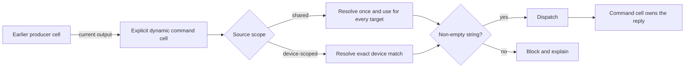

# Dynamic command cells

## Intent

Let a workbook author make an explicit command step consume a value produced by another cell. Python or another producer computes data only; it does not create a cell or dispatch a device command by returning a special value.

The safety invariant is: **a dynamic command may dispatch only a valid value from the referenced source in the current workbook version and execution cycle, and a device-scoped value may never be substituted across devices.**

## Authoring flow

1. The author adds a normal command cell at the point where the device command must execute.
2. The author chooses one of two modes:
  - **Static** — enter the command directly, preserving existing string, JSON, and YAML behavior.
  - **Dynamic** — select an earlier output-producing cell and one top-level field from its output.
3. Dynamic mode may reference an earlier protocol, command, macro, or question cell.
4. The Dynamic controls explain that the value is resolved on every run and that no static fallback is saved.
5. If the source has visible output, the author can select one of its top-level fields. Before output exists, the author may enter the field name manually. A question exposes the single field `answer`.
6. The selected field must resolve to a non-empty string. Dynamic JSON/YAML payloads, nested paths, templates, and structured values are outside v1.
7. After execution, the command cell shows the resolved string for that run. If device-scoped values differ, it shows the resolved command per device.

## Dependency and execution order

Authored document order is authoritative, even when branch, goto, or loop execution order differs.

- A source must appear before the dynamic command in the workbook. Running a visually later source first through a branch does not make it eligible.
- Branches may skip an eligible earlier source. If execution reaches the command without a fresh result, dispatch is blocked and the user is told to run the named source.
- A loop may reuse only the latest completion of that earlier source in the active session/cycle. Starting a new run-all epoch, iteration, retry, or workbook version invalidates it as described below.
- Runtime execution never inserts, removes, reorders, or persists generated cells.

This rule keeps the dependency visible to an author and makes structural validation deterministic.

## Execution flow

1. Execution reaches the authored command cell.
2. The system verifies that the reference is structurally valid and that its source completed under the active workbook version and execution epoch.
3. The system reads the selected top-level field from the source's current output.
4. Shared values are resolved once. Device-scoped outputs are resolved independently for each target device using its exact runtime device identity.
5. A non-empty string is dispatched; any other value produces a typed, user-visible failure and no device call.
6. The device reply is recorded as the output of the command cell, allowing a later dynamic command to reference it.

## Shared and device-scoped values

- Protocol and command results are device-scoped. Each target receives only the value produced for its own device identity.
- A producer that explicitly emits per-device results is device-scoped, even in a one-device run.
- A question answer is intentionally shared. Its `answer` value may be used unchanged for every target device.
- A macro's runtime scope follows how it executed: a workbook-level result is shared; per-device macro results require exact device matches.
- When a device-scoped result is missing or failed for one device, that device is pre-failed. Other valid devices may still run.
- Primary/display data is never used as a fallback for a missing device-specific result.

## Freshness and resume

### Web

A source is fresh only after it completes in the current mounted execution session under the current workbook design and version. Page mount, Clear outputs, the start of Run all, an authored design change, or a workbook-version change invalidates prior values and resolved previews. Manually running a source and then its command in the same unchanged session succeeds.

### Mobile

An output is fresh only when it belongs to the active workbook version and measurement cycle. It survives an app background, restart, and a compatible store upgrade so an in-progress cycle can resume offline.

Starting a new iteration, retrying, resetting, abandoning the flow, or changing the workbook version clears producer outputs, question answers for the active cycle, and resolved previews. A same-version data refetch does not reset the cycle.

If persisted state cannot be migrated safely, the active cycle restarts rather than exposing an ambiguous value. If a device reconnects with a new runtime identity, its old device-scoped result does not transfer; the user must rerun the source for the reconnected device.

## Validation and failure behavior

Drafts with broken references remain loadable and editable. Publishing is blocked by the backend when a dynamic command:

- has no source;
- references a deleted or ineligible cell;
- references itself or a cell at or after the command; or
- has an empty field name.

Field existence, freshness, runtime scope, value type, and value emptiness are checked at execution because they depend on that run.

| State | User-visible outcome |
| --- | --- |
| Source is missing, deleted, or below the command | Draft remains repairable; publish and execution are blocked with the command and source identified. |
| A branch skipped the source | No dispatch; prompt the user to run the named source in the active cycle. |
| Workbook version changed | Restart the active cycle; no output or answer from the prior version is eligible. |
| Field is absent, empty, or not a string | No dispatch; identify the source and field and state that v1 requires a non-empty string. |
| One device has no exact result or its source failed | Pre-fail only that device; never use primary data or another device's value. |
| Device reconnected under a new identity | Pre-fail that device and require its source to run again. |
| Device is disconnected or transport fails | Use the command cell's existing device error behavior and retain reference context for diagnosis. |
| Client lacks dynamic-command capability | Do not return the unsupported workbook version; show an update-required outcome. |

## Compatibility and rollout

- Existing static command cells retain their current saved shape and behavior.
- A dynamic reference is authored structure. Resolved values, previews, and device replies are execution state.
- Published versions preserve the source-cell and field reference through workbook and flow representations.
- Unsupported clients must not receive a workbook version containing a dynamic reference.
- Dynamic publication stays disabled on the backend until compatible mobile and web clients advertise support. The web authoring flag remains off until that release gate is open.
- The mobile force-update screen improves the upgrade experience but is not relied on as the safety boundary.
- Disabling authoring or publication never disables runtime support for already-published dynamic workbooks.

## Confirmed decisions

| Decision | Direction |
| --- | --- |
| Execution ownership | Explicit authored command cell |
| Eligible sources | Any earlier output-producing protocol, command, macro, or question |
| Precedence | Authored document order, regardless of branch/goto runtime order |
| Field selection | One top-level field; dynamic string commands only in v1 |
| Runtime freshness | Active web epoch or mobile cycle, scoped to workbook version |
| Device safety | Exact identity for device-scoped output; no fallback |
| Question semantics | `answer` is intentionally shared across target devices |
| Mobile upgrade | Preserve a valid active cycle; reset ambiguous/malformed state |
| Runtime workbook mutation | None |
| Old-client safety | Backend capability refusal, not the fail-open CMS gate |

## Success criteria

- An author can dispatch a string produced by a Python macro without turning Python into an implicit command constructor.
- A dynamic command is retained on the web canvas, in mobile execution, and across workbook ↔ flow conversion.
- Workbook order remains visible and deterministic.
- A stale, cross-version, cross-cycle, or cross-device value can never be silently sent.
- A branch-skipped source, reconnect, or migration ambiguity fails before transport with a repair path.
- A structurally broken reference cannot be published through any client.
- Static command workflows and formats remain unchanged.
