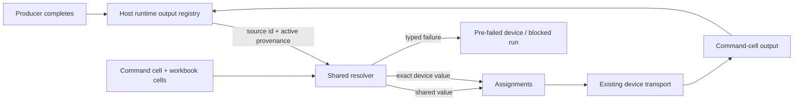

# Dynamic command cells: technical plan

This revision implements the behavior in [Dynamic command cells: core flows](../dynamic-command-cell-core-flows/index.md) and closes findings F1–F11 from the [adversarial critique](../dynamic-command-cell-artifact-critique/index.md).

## Architectural direction

Extend the current web and mobile runners. Put command-source schemas, flow serialization, structural validation, output normalization, reference lookup, typed resolution failures, and capability names in shared API code. Each host keeps ownership of transport and UI state while exposing current, provenance-scoped outputs through the same resolver contract.



The hard invariant is: **a dynamic command is dispatched only from the referenced source's output under the active workbook version and execution epoch, and a device-scoped value is never substituted across device identities.**

## 1. Persisted schemas and flow-node serialization

### Shared command source

Move the reusable definitions into a neutral API module so workbook-cell schemas, experiment-flow schemas, validation, and both hosts import one contract.

```ts
type StaticCommandSource = {
  kind?: "static"; // absent in every existing saved static cell
  format: "string" | "json" | "yaml";
  content: string;
};

type ReferencedCommandSource = {
  kind: "ref";
  ref: {
    sourceCellId: string;
    field: string;
  };
};

type CommandPayload = (StaticCommandSource | ReferencedCommandSource) & {
  name?: string;
};

type ExperimentMeasurementCommandContent = {
  command: StaticCommandSource | ReferencedCommandSource;
};
```

Both source variants are strict. The existing static payload shape remains valid without adding `kind`, so stored static workbooks require no data migration. Dynamic mode stores only the reference and optional author name; it has no hidden static fallback.

### Explicit workbook ↔ flow mapping

F1 is a concrete serialization deliverable:

- `cellsToFlowGraph` branches on the command-source variant before reading `format` or `content`.
- A static cell keeps the existing flow carrier `{ command: { format, content } }`.
- A dynamic cell uses `{ command: { kind: "ref", ref: { sourceCellId, field } } }`.
- The dynamic flow-node label comes from the author name or a deterministic non-empty derived label such as `Dynamic command · <field>`. It never dereferences absent static content.
- `flowNodesToWorkbookCells` recognizes the ref carrier before the static carrier and reconstructs the reference payload. It omits a generated label rather than fabricating an authored `name`.
- Conversion tests assert that the command node count, id, source id, field, order, and outgoing branch edges survive cells → flow and flow → cells.
- Mobile dispatch identifies the command node in the derived graph but resolves the command from the raw workbook cell and runtime registry. Flow content is the serialization/canvas carrier, not a second resolver implementation.

Do not claim that an old client can safely parse a ref-only workbook payload. Its strict static schema makes that impossible without unsafe sentinel encoding. Old-client safety is provided at the version-fetch boundary in section 8.

## 2. Structural validation and backend publish enforcement

Keep cross-cell reference checks outside Zod so a damaged draft still loads and can be repaired. Add a pure shared validator, used by both the authoring UI and backend:

```ts
validateDynamicCommandReferences(cells): DynamicCommandValidationIssue[]
```

It returns stable codes and structured context (`commandCellId`, `sourceCellId` when present, `field`, and document index):

| Code | Structural condition |
| --- | --- |
| `DYNAMIC_COMMAND_SOURCE_MISSING` | No source id or referenced cell was deleted |
| `DYNAMIC_COMMAND_SOURCE_INELIGIBLE` | Source is not protocol, command, macro, or question |
| `DYNAMIC_COMMAND_SOURCE_NOT_EARLIER` | Source is self, later, or only earlier at runtime through goto |
| `DYNAMIC_COMMAND_FIELD_EMPTY` | Field is blank after trimming |

`validateWorkbook` aggregates these issues for the web editor, but it is not the enforcement point.

`PublishVersionUseCase.execute` must run the shared structural validator immediately after loading the workbook and before resolving snapshots or creating the version. Any blocking issue returns `AppError.badRequest` with a stable `WORKBOOK_STRUCTURAL_VALIDATION_FAILED` code and `{ issues }` details. This makes direct API, web, and future-client publication follow the same rule. Tests must prove that the repository `create` method is not called on failure.

The publish path also checks the release kill switch described in section 8 before accepting a workbook with any ref command.

Runtime-only checks remain out of publication: whether the source ran, whether a field exists in this run, output scope, exact device presence, and string validity.

## 3. Runtime output registry and shared lookup

The prior plan inferred scope from the optional presence of `deviceResults`. Replace that ambiguity with an explicit discriminated runtime envelope:

```ts
interface OutputProvenance {
  workbookVersionId: string;
  executionEpoch: string; // web session/design epoch or persisted mobile cycle epoch
}

type RuntimeCellOutput =
  | {
      scope: "shared";
      provenance: OutputProvenance;
      data: unknown;
    }
  | {
      scope: "device";
      provenance: OutputProvenance;
      deviceResults: Array<{
        deviceId: string;
        deviceLabel?: string;
        data?: unknown;
        error?: string;
      }>;
    };
```

Rules:

- Protocol and command execution records `scope: "device"` even for a one-device run.
- A per-device macro records every device result. A macro explicitly executed once at workbook scope records `scope: "shared"`.
- A question is adapted as shared `{ answer }` from the active iteration's answer store.
- Display-oriented primary data may still exist in output cells or scan UI state, but it is never the resolver's fallback for a device-scoped result.
- The command's own device replies are recorded in the registry, so a later command can reference them.

Add shared `findOutputCellByProducer(cells, sourceCellId)` semantics for the web's separate output cells: it matches `cell.type === "output" && cell.producedBy === sourceCellId` and selects the current host-owned result. Hosts normalize their data behind a single `getRuntimeCellOutput(sourceCellId)` boundary.

## 4. Shared resolver

Use one host-neutral resolver:

```ts
resolveCommandPayload({
  commandCell,
  cells,
  targetDeviceId,
  activeProvenance,
  getRuntimeCellOutput,
}): CommandResolutionResult
```

Static commands continue through the existing string/JSON/YAML resolver unchanged. A reference command resolves in this order:

1. Confirm the source exists, is eligible, and precedes the command in authored document order.
2. Load its output through `getRuntimeCellOutput`. For a question, adapt the current iteration's answer to `{ answer }`.
3. Require provenance to equal the active workbook version and execution epoch.
4. For `scope: "device"`, require one exact successful `deviceId` match. Never use another device or display/primary data.
5. For `scope: "shared"`, use the shared data for every target.
6. Read the selected top-level field and require a non-empty string.

Expected failures are values, not exceptions. Stable codes include missing source, source not earlier, ineligible source, stale source, output missing, device result missing, source-device failure, field missing, non-string value, and empty value. A reconnected device with a new id receives `DEVICE_OUTPUT_MISSING` and must rerun the source.

Dynamic v1 sends the resolved string raw. It does not infer or parse JSON/YAML; structured dynamic commands remain out of scope.

## 5. Authored order, branches, and loops

Document order is the structural dependency rule.

- The validator and resolver both compare indexes in hydrated authored cells, excluding output cells from the author-order relation.
- Branch/goto execution never makes a visually later source eligible.
- If a branch skips an earlier source, freshness resolution fails before dispatch.
- In a loop, a producer completion overwrites its own registry entry within the same active epoch. The command consumes that latest entry.
- Starting Run all on web creates a new epoch before the first step. Starting a mobile iteration or retry creates a new epoch and clears the old registry.
- Branch-routed device subsets call the same resolver per planned device; there is no branch-specific binding model.

## 6. Web lifecycle and integration

`useWorkbookExecution` owns a synchronous `runtimeOutputsByCellId` registry alongside React display state. Output-cell presence alone is not freshness.

- Generate an active execution epoch on mount and whenever invalidation occurs.
- Record every completing producer with explicit shared/device scope and the active provenance.
- Clear the registry and resolved previews on page mount, Clear outputs, start of Run all, authored design change, or workbook-version change.
- Output insertion/removal alone does not count as an authored design change.
- Manual source execution followed by its command succeeds while the epoch is unchanged.
- Resolve separately for every target device before invoking the existing assignment executor. Invalid devices become rejected per-device outcomes; valid assignments still run.
- Reuse the same path for branch-dispatched subsets.
- Keep device replies as the command-cell output and render the runtime-only resolved preview.

## 7. Mobile lifecycle, unified state, and migration

### Unified producer registry

Add persisted `outputsByCellId: Record<cellId, RuntimeCellOutput>` as the sole source of truth for protocol, command, and macro results.

- Fold legacy `cellOutputs` and the singular `scanResults`/`producerCellId` attribution into this per-producer map.
- Retain all producer entries for the active cycle; a later scan cannot erase an earlier producer's device split.
- If `scanResult`, `scanResults`, or `producerCellId` remain temporarily for upload/UI compatibility, make them derived projections and never read them for reference resolution.
- Expose one `getRuntimeCellOutput` adapter. Question sources read the active iteration from `flow-answers-storage` and return a shared envelope with the active provenance.
- Mobile command and branch assignment paths call the shared resolver per planned device.

### Workbook-version freshness

`setFlowGraph` must compare the incoming `workbookVersionId` with the active id:

- Same id from a query refetch: update graph data without clearing the cycle.
- Different id, including experiment switch: synchronously restart the flow epoch and clear `outputsByCellId`, scan projections, producer attribution, active-cycle answers, resolved previews, branch state, and iteration progress before the new graph becomes executable.

Every registry entry also carries the version id and epoch, so a missed cleanup still fails closed at resolution.

New iteration, retry, reset, abandonment, and explicit workbook change create a new epoch and clear producer state. App background/restart preserves the current epoch and entries for offline resume.

### Persisted-store migration

Coordinate both Zustand stores:

1. Bump `measurement-flow-storage` from v1 to v2 and implement a real migration.
2. Convert each legacy macro `cellOutputs[cellId]` entry to a v2 envelope tied to the persisted `workbookVersionId` and iteration epoch.
3. Convert the latest `producerCellId` plus `scanResults` into a device-scoped entry only when device identities are present. Preserve legacy display state but do not make an unattributed scan resolvable.
4. Preserve `cells`, edges, branch state, progress, and the active workbook id when the migrated state validates.
5. Bump `flow-answers-storage` from v1 to v2 with an identity migration because its wire shape is unchanged; this explicitly preserves current-cycle answers instead of using the old discard-on-version-mismatch behavior.
6. After both stores hydrate, run a resume guard. If provenance, workbook identity, epoch, or required state is malformed/inconsistent, reset both stores and surface that the cycle must restart.

V1 workbooks cannot contain dynamic refs, so legacy unscoped macro data may preserve their existing static/branch resume behavior but must not become eligible for a dynamic resolver. Changing to a dynamic workbook version triggers the version reset before execution.

Migration tests use real serialized v1 fixtures, not only hand-built v2 state.

## 8. Backward compatibility and rollout guarantees

The CMS force-update gate is fail-open in several conditions and is not a safety boundary. Adopt a hard server capability handshake:

- Define the shared capability name `dynamic-command-ref-v1`.
- Updated web and mobile API clients send `x-openjii-capabilities: dynamic-command-ref-v1` on workbook-version requests. Use a header so the React Query cache key remains unchanged and offline resume retains its cached version.
- Before serializing a workbook version, `GetWorkbookVersionUseCase` detects whether its cells contain a ref command. If so and the capability is absent, return `DYNAMIC_COMMAND_CLIENT_UPGRADE_REQUIRED` mapped to HTTP 426. Do not return cells for the old client to parse.
- Runtime parsing and execution stay enabled regardless of authoring flags.
- Add a default-off backend `DYNAMIC_COMMAND_PUBLISH_ENABLED` kill switch. `PublishVersionUseCase` rejects a dynamic workbook while it is off, even if the web authoring flag was enabled accidentally.
- Add the default-off web authoring flag only around creating/editing ref commands. Existing dynamic cells remain visible and runnable when it is off.

Release sequence:

1. Deploy shared schemas, serialization, validator, server capability refusal, and runtime support with publication disabled.
2. Deploy compatible web and release compatible mobile; both advertise the capability.
3. Set the CMS minimum mobile version for upgrade UX and verify production capability telemetry.
4. Enable backend dynamic publication.
5. Enable web authoring for internal users, perform real-device verification, then expand the flag.

This sequence gives old offline clients only versions they cached before dynamic publication. An online old client requesting a new dynamic version receives upgrade-required, not an unparsable payload. Rollback disables authoring and new dynamic publication while retaining runtime/capability support for versions already published.

## 9. Failure handling and observability

- Resolution failures make no device call.
- One device's resolution or transport failure does not cancel valid devices.
- Log stable failure code, workbook version id, execution epoch, command cell id, source cell id, and device id.
- Do not log resolved command strings or raw source data.
- Emit metrics for capability refusals, publish-gate refusals, structural validation codes, migration resets, stale provenance, and missing exact-device matches.
- Clear previews whenever provenance is invalidated.
- Treat duplicate results for one device id, duplicate producer output cells, or conflicting scope as invalid output and fail closed.

## 10. Verification strategy

### Shared schema, conversion, and resolver

- Parse unchanged legacy static payloads and preserve static string/JSON/YAML behavior.
- Accept a strict ref payload; reject mixed static/ref fields and blank ref fields at validation.
- Round-trip static and ref commands through workbook cells and flow nodes without dropping, retyping, or reordering the node.
- Verify dynamic node labeling never reads absent `content`.
- Test `findOutputCellByProducer` and duplicate-output handling.
- Resolve every eligible source type with authored-order enforcement.
- Cover shared question `answer`, shared macro, one-device scoped output, multi-device output, failed device, missing exact device, duplicate device id, stale epoch, prior workbook version, missing field, non-string, and empty string.

### Backend

- Publish rejects each structural issue with stable structured details and never creates a version.
- Direct API publication receives the same validation as web publication.
- Backend publication kill switch blocks only workbooks containing refs.
- Version fetch returns static versions without a capability and dynamic versions with it.
- Dynamic version fetch without capability returns 426 and no workbook payload.
- Existing version list and static version contracts remain compatible.

### Web

- Static/Dynamic toggle, tooltip, earlier-source filtering, question `answer` field, manual field entry, and reference-only persistence.
- Single-device and per-device resolution with preview updates.
- Branch-routed subsets and partial per-device failure.
- Direct command execution blocks until the source runs in the active epoch.
- Run all, clear, authored edits, and version change invalidate; output-only rendering changes do not.
- The authoring flag hides creation/edit controls without disabling runtime.

### Mobile

- Persisted v1 → v2 migrations for legacy macro state, attributed scan state, unattributed scan state, and answers.
- Same-cycle resume after app restart and after a valid upgrade.
- Malformed or inconsistent cross-store state resets both stores.
- Same-version refetch preserves state; workbook-version/experiment change clears outputs, answers, iteration, scan projections, and previews.
- Every protocol, command, and macro result is retained per producer with exact device identities.
- Question answers adapt as shared values.
- Reconnect with a changed device id pre-fails until the source reruns.
- Dynamic direct and branch assignments resolve per device without fallback.
- Existing static flow, offline cache, upload, answer, and branch behavior remains green.

### End-to-end and device verification

- Web and mobile: protocol → Python macro emits `{ toDevice }` → dynamic command references `toDevice` → reply becomes command output.
- Repeat with two devices producing different strings and verify each transport receives only its own value.
- Exercise a shared question answer across two devices.
- Exercise branch-skipped source, visually later source reached by goto, loop refresh, missing field, one-device source failure, reconnect, retry, app restart, valid store migration, workbook-version change, capability refusal, and publish refusal.
- Run API, backend, web, and mobile unit/type checks, followed by real MultispeQ calibration verification before broad authoring rollout.

## 11. Implementation surfaces

| Area | Primary surfaces |
| --- | --- |
| Shared schemas | `packages/api/src/domains/workbook/workbook-cells.schema.ts`, `packages/api/src/domains/experiment/experiment.schema.ts`, new neutral command-source module |
| Flow conversion | `packages/api/src/transforms/cells-to-flow.ts`, `packages/api/src/transforms/flow-to-workbook-cells.ts` |
| Resolver/output lookup | `packages/api/src/transforms/command-payload.ts` plus shared runtime-output and validation helpers |
| Publish enforcement | `apps/backend/src/workbooks/application/use-cases/publish-version/publish-version.ts` |
| Capability refusal | workbook version contract/client headers, controller, and `GetWorkbookVersionUseCase` |
| Web authoring/execution | command cell editor and `useWorkbookExecution` paths |
| Mobile execution/state | flow transitions/store, load hook, command/branch assignment paths, hydration and output adapters |
| Persistence | `measurement-flow-storage` and `flow-answers-storage` migrations and resume coordinator |

## 12. Critique disposition

| Finding | Resolution |
| --- | --- |
| F1 | Explicit ref flow carrier; both converters branch on the variant; mobile resolves from raw cells; round-trip tests |
| F2 | Shared structural validator enforced inside `PublishVersionUseCase` with structured errors |
| F3 | Per-producer `outputsByCellId` replaces macro-only and singular-scan authority |
| F4 | Version-scoped provenance plus atomic different-version reset of outputs and answers |
| F5 | Server capability refusal and backend publish kill switch; CMS force gate documented as UX-only |
| F6 | Authored document order wins over branch/goto runtime order; loops use latest same-epoch output |
| F7 | Real coordinated v1 → v2 migrations for both persisted stores; valid resume preserved, ambiguity resets |
| F8 | Dynamic v1 is explicitly raw non-empty string only; static JSON/YAML unchanged |
| F9 | Question `answer` is explicitly shared across devices |
| F10 | Shared lookup names `producedBy === sourceCellId` and normalizes behind one host adapter |
| F11 | New reconnect identity cannot inherit the prior result; exact-match pre-failure requires rerun |

## Deliberate trade-offs

- **No unfinished runtime dependency:** shared pure mechanics eliminate semantic drift without making the unmerged workbook runtime a prerequisite.
- **Visible dependencies over control-flow flexibility:** authored order rejects a visually later source even if a goto executed it first.
- **Explicit scope and provenance:** slightly more runtime state prevents inference-based cross-device or cross-version dispatch.
- **Preserving valid mobile work:** real migration costs more than discarding state but protects offline field sessions; ambiguous state still fails closed.
- **Hard compatibility boundary:** the extra server/client capability mechanism is necessary because the strict old payload cannot safely parse a ref-only variant.
- **Top-level strings only:** this satisfies the calibration use case while keeping v1 dispatch typing unambiguous.
