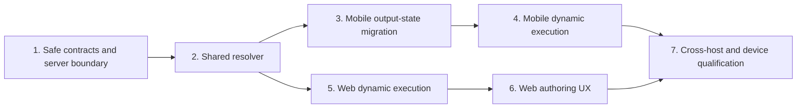

# Dynamic command cells: implementation tickets

This story implements the [technical plan](../index.md) and [Core Flows](../../dynamic-command-cell-core-flows/index.md), including every correction recorded in the [adversarial critique](../../dynamic-command-cell-artifact-critique/index.md).

The set is intentionally coarse: seven independently verifiable tickets, with shared safety foundations before either host exposes the feature.

## Ordered ticket set

| Order | Ticket | Primary outcome | Depends on | Plan coverage |
| --- | --- | --- | --- | --- |
| 1 | [Establish safe contracts and the server boundary](./01-safe-contracts-and-server-boundary/index.md) | Ref payloads round-trip without reaching unsupported clients or bypassing publish validation | None | F1, F2, F5 |
| 2 | [Implement the provenance-scoped resolver](./02-shared-runtime-resolver/index.md) | One pure contract enforces order, freshness, scope, exact-device matching, and string-only dynamic values | 1 | F6, F8–F11 |
| 3 | [Migrate mobile to the unified output registry](./03-mobile-output-state-migration/index.md) | All producer outputs survive per cell/device with version and cycle provenance | 2 | F3, F4, F7 |
| 4 | [Execute dynamic commands safely on mobile](./04-mobile-dynamic-execution/index.md) | Direct and branch mobile dispatch use exact current-cycle values | 1–3 | Mobile core flow |
| 5 | [Execute dynamic commands safely on web](./05-web-dynamic-execution/index.md) | Web uses an epoch-scoped registry for direct, Run all, loop, and branch dispatch | 1–2 | Web core flow |
| 6 | [Add repairable web authoring behind the flag](./06-web-dynamic-authoring/index.md) | Authors can configure and diagnose refs without enabling production authoring | 1, 5 | Authoring and publish UX |
| 7 | [Qualify the cross-host flow and real device](./07-cross-host-device-qualification/index.md) | Automated and MultispeQ evidence proves the complete safety invariant | 4, 6 | End-to-end plan |

## Sequencing notes

- Ticket 1 lands with dynamic publication disabled and authoring absent. This is the safety boundary for every later change.
- Ticket 2 is host-neutral. After it lands, tickets 3 and 5 may proceed in parallel.
- Ticket 4 waits for the mobile store migration; ticket 6 waits for the web runtime so authoring cannot get ahead of execution support.
- Ticket 7 is qualification, not deployment. It does not enable the backend publication switch, the web authoring flag, or the CMS minimum-version gate.
- No ticket introduces the unfinished environment-agnostic workbook runtime as a dependency.

## Story completion criteria

- Every child ticket is complete and its verification evidence is recorded.
- Static command schema, flow conversion, web execution, mobile resume, branch behavior, and offline cache regressions remain green.
- The backend refuses structurally invalid publication and unsupported-client version fetches.
- Web and mobile demonstrate the Python output → dynamic command → device reply flow, including two-device exact matching.
- No rollout switch is enabled by implementation work alone.
