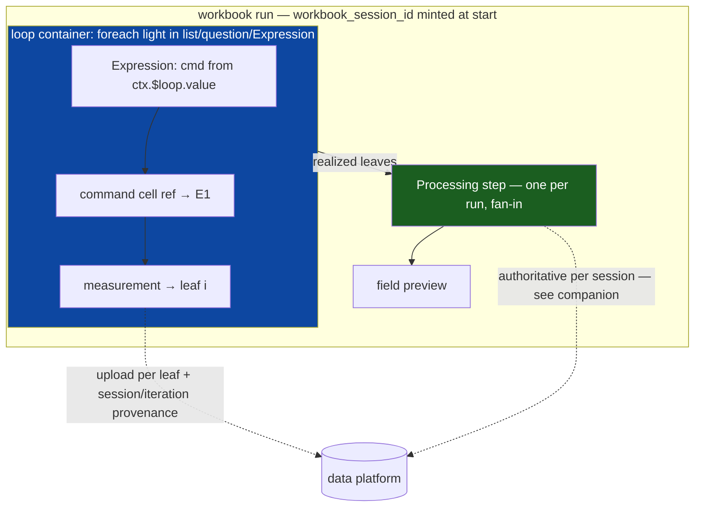

# Workbook loops: technical plan

Builds directly on the dynamic command cell epic (merged: PR #1835 — shared resolver, ref command cells, runtime output registry, capability gating, upload provenance). Companion artifact: [Session provenance & streaming completeness](loop-run-provenance-and-completeness/index.md). Adversarial critique + rev-2 re-review folded in: [critique](critique/index.md) (rev 3 resolves B1–B4, D1–D6, G1–G5 and re-review N1–N6; user decisions: streaming infra, single-level v1 with nesting-ready ids, web-executes-mobile-records).

## Problem

Authors need basic loops: *measure at light X, then Y, then Z* — i.e. `foreach value in [X,Y,Z]: build command from value → dispatch → measure`, then one computation over all N results. Today this is only expressible as a MultispeQ mega-protocol with loops baked into one opaque object. The workbook should express it as composable cells.

## Load-bearing decision 1: split "macro" into two roles

"Macro" today conflates two roles with opposite dataflow. The split dissolves the macro-stacking problem and removes the need for cross-iteration state in the resolver.

|  | **Expression** (new) | **Processing step** (new) |
| --- | --- | --- |
| Direction | *on the way in* — computes a value that feeds a command input or branch condition | *on the way out* — computes a result from what came back |
| Cardinality | any number, inline in the flow | **exactly one per workbook run**, terminal |
| Timing | per iteration, synchronously before its consumer | once, after the run's loop completes |
| Reads | current iteration's loop variable + same-iteration upstream outputs (existing resolver registry) | the run's **collected leaves** (all iterations' measurements) — NOT the resolver registry |
| Sandbox run mode | per-item (existing fan-out contract) | **fan-in** (new run mode: leaf array in, one result out — see execution model) |
| Runs | on-device/web, offline | in-app (field preview) AND authoritative per-run in the data platform |
| Languages | JS, Python | JS, Python |

**"Macro" is deprecated as a user-facing concept.** It remains only as the low-level executable entity (macro-sandbox Lambda, `macroId`, stored scripts). No infra rename in v1.

**Reclassification (scoped honestly per critique D6):** the epic's "analysis node → ref command" pattern becomes an Expression. This is not only a label rename; it touches `producerKindFor` / `MobileProducerKind` ("macro" member) in `apps/mobile/.../runtime-output.ts`, the normalize/merge helpers, the narrow `producer_kind` upload type, and the bronze/silver `producer_kind` column vocabulary. Plan: introduce `"expression"` as a new producer kind alongside the existing values; keep reading legacy `"macro"` values forever (data), map old node payloads at load time (code). Still cheap while the authoring flag is dark, but it is a small migration ticket, not a find-and-replace.

## Load-bearing decision 2: no cross-iteration state in the resolver

Verified by critique: `command-resolution.ts` is pure over the provided registry — this holds. The runtime output registry stays **ephemeral per iteration**. Inside the loop body, refs resolve within the current iteration under the existing freshness/exact-device rules.

Cross-iteration aggregation is served by the **collected leaves**: each iteration's completed measurement is appended to a per-run leaf collection (mobile: persisted with the existing per-run upload state; web: held in-memory for the run — see host parity). The Processing step reads that collection, not the resolver.

Definitions the critique forced to be explicit:

- **Leaf** = one device-scoped measurement completion inside the loop body: `(iteration_index, producer_cell_id, device_slot, data, dispatched provenance)`. A branch that skips the measurement on some iterations simply produces no leaf for that iteration — the leaf collection is *sparse by design*, and the Processing step (and the completeness manifest) work from the realized set, never an assumed dense grid.
- **Ordering scope**: author order inside a container is the container's own body order; "earlier within the same iteration" is evaluated within the body sequence plus cells before the loop. Refs from outside the loop into the body are structurally invalid.
- Consequence (v1 constraint): **the aggregate cannot drive control flow.** The Processing-step result is displayed and recorded; no branch conditions on it.

## Load-bearing decision 3: loop = container node, single level in v1

User decision after critique B4: **v1 ships one loop level; identifiers are nesting-ready.** `iteration_path` / `loop_cell_path` stay arrays (length 1 in v1) in every schema, payload, and pipeline column so nesting later is a runtime change, not a data migration. Structural validation rejects nested containers in v1. `ctx.$loop = { value, index, name }` (the `$loops` multi-level addressing is deferred with nesting).

- Bound forms: `foreach` over a value list (literal, question answer, or Expression-computed) and `repeat N` (foreach over `0..N-1`). Bounds capped by structural validation (default 1000).
- **Serialization must be additive (critique B3).** The flow graph is a flat sequence with a closed `type` enum, `.strict()` schemas, and converters that drop unknown nodes — the container encoding must leave non-loop workbooks byte-identical, and a loop workbook must be recognizable at the *content* level via `flowGraphHasLoop()` beside `flowGraphHasDynamicCommandRef()`. Guard sites, scoped honestly (critique N6): the **backend** refusal points exist and extend directly (`get-workbook-version` 426 path, `get-flow` capability check) via the `workbook-loop-v1` capability; the **mobile** extension point is the existing `flow-rehydration-guard` (fails closed) — it gains the content-level loop check, because offline resume performs no capability re-check; the **web** content guard is **net-new** (web has no read boundary today — the check lands beside the cells→flow conversion in the design surface). A stale cached flow on an old client fails closed through the rehydration guard, never silent-drops nodes.
- Round-trip tests prove container structure, body order, and bound survive cells→flow→cells (epic's conversion-test pattern).

## Execution model (revised per critique B2)

Verified matrix: mobile runs JS (`new Function`) and Python (registered `PythonMacroRunner`) on-device offline; the sandbox Lambda runs JS/Python/R; R is server-only and excluded from both roles in v1.

The critique showed "same definition, two run sites" requires designed work, not hope:

- **New sandbox run mode `fan-in`**: one invocation receives the ordered leaf array and returns one result. Today's wrapper strips arrays to `[0]` (`unwrapMeasurement`) and applies a 1s per-item VM cap — fan-in gets its own injection (`leaves`, `ctx`, `output`) and a single per-invocation budget (Lambda's 60s / 10MB *output* ceilings). Input is the binding constraint: sync invoke caps request payloads (~6MB), so server-side fan-in accepts an S3 **input pointer** (`{ input_ref }`) with inline input only below a size threshold (see companion). Explicit contract addition to `apps/macro-sandbox`, all three wrappers eventually, JS+Python required for v1; existing per-item callers unaffected (mode discriminator, backward-compatible event schema).
- **Mobile/web fan-in parity**: the on-device runners gain the same fan-in injection. Known drift fixed alongside (critique): mobile's JS runner today lacks the `output` global the Lambda provides — parity of injected globals between run sites becomes a tested contract (a shared conformance fixture executed against Lambda, mobile JS, mobile Python, and web).
- Expressions keep the existing per-item mode unchanged.

## Host parity (revised per critique G1)

User decision: **web executes, mobile records.**

- Both hosts get full loop execution and the in-app Processing preview in v1.
- Only mobile runs produce the authoritative data-platform record (web has no upload path into the ingestion today; building one is explicitly out of v1). Web's Processing result is preview-only and labelled as such.
- Mobile: the loop interpreter is **new state** — the existing whole-flow `iterationCount`/`branchVisitCounts`/`consumedNodeIds` machinery is wrap-scoped and flat (critique B4); v1 adds a single-level loop scope (loop cell id + iteration index + body-scoped clearing) rather than pretending to reuse the wrap counter. Resume/restart persists loop position + collected leaves.
- Web: `useWorkbookExecution` gains the loop interpreter over the same shared semantics; per-iteration epoch/registry reset scoped to the body; leaves collected in-memory per run.
- Shared loop semantics (iteration order, ctx shape, leaf identity, validation) live in `packages/api` transforms — one contract, two interpreters, like the epic's resolver.

## Field preview honesty (critique D3)

The in-app Processing result is presented as a **preview** ("preliminary result — final result is computed after upload"), not as the authoritative value. No result push-back to the app in v1; divergence stays observable in the data plane (manifest hash + `complete` flag, companion artifact).

## Compatibility & gating

- New capability `workbook-loop-v1` beside `dynamic-command-ref-v1`; refusal at version fetch (426, no leak) plus the content-level guards above for cached/resumed flows.
- Publish-time structural validation extends the shipped validator: well-formed single-level container, bound caps, Expression language rules (JS/Python only), exactly-one-Processing-step, no cross-iteration refs, no external refs into the body, no branch escaping the body except to its end.
- Ships dark behind the same rollout discipline (authoring flag default-off, publish gate default-off, CMS minimum untouched).

## Explicitly out of v1

- Nested loops (identifiers are nesting-ready; runtime and validation defer).
- Aggregate result driving branches/control flow.
- R Expressions / R Processing steps; result push-back to the app.
- Web → ingestion upload path (web runs are preview-only records).
- while/until loops; per-inner-loop aggregation tiers; macro-sandbox infra rename.

## Verification strategy

Epic discipline: shared-contract round-trip + interpreter tests in `packages/api`; the run-site conformance fixture for injected globals; per-host integration suites (foreach-from-question, Expression-built command per iteration, branch-skip sparse leaves, per-device isolation inside iterations, resume mid-loop); additive-serialization proof (old-client fixtures parse non-loop workbooks unchanged; loop graphs fail closed on stale clients); adversarial review before any ticket closes.
