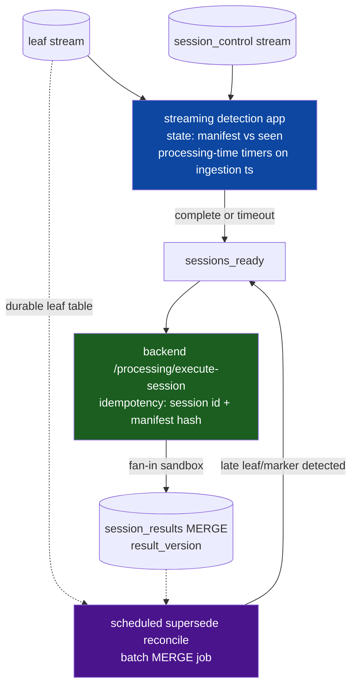

# Session provenance & streaming completeness

Companion to the [workbook loops technical plan](../index.md). Covers the off-device half: per-leaf identity in the pipeline, how the platform knows a run is complete, and how the authoritative per-run Processing step fires. Rev 3 after the critique's [rev-2 re-review](../critique/index.md): N1 (device identity), N2 (marker durability), N3 (streaming scope), N4 (watermark vs supersede), N5 (fan-in input size) resolved below. Extends the merged Ticket 8 provenance fields.

## Naming

Whole-run identifier: **`workbook_session_id`** (a session exists for every workbook run once this ships, loop or not). The existing `workbook_run_id` keeps its per-multi-device-round meaning, untouched.

## Why a new id is required (verified)

`workbook_run_id` cannot anchor per-run processing: minted per multi-device round only, absent for single-device rows, many per looped run; no run entity exists anywhere and the Outbox sends N independent messages. Whole-run identity and a completion signal are introduced here. **Mobile-only in v1** (web executes, mobile records).

## Leaf identity (rev 3: no stable device identity required — resolves N1)

Minted at run start; stamped on every uploaded leaf: `workbook_session_id`, `iteration_path` (array, length 1 in v1, nesting-ready), `loop_cell_path`, `loop_values` (active loop variables at dispatch).

**Key insight replacing rev 2's `device_slot`:** completeness never needs a device identity that survives reconnects. The app is the source of truth for what it dispatched — each leaf embeds the device id *as it was at dispatch*, and the end-of-run manifest records the **exact realized leaf keys** the app produced. Matching arriving leaves against the manifest uses the same as-dispatched id both sides, so reconnects (new id next iteration) and replaced units are just different keys the manifest already lists. Outbox retries resend byte-identical payloads, so dedupe on the full leaf key holds.

Leaf key: `(workbook_session_id, iteration_path, producer_cell_id, device_id_as_dispatched)`.

Transport/pipeline: same MQTT payload → bronze top-level extraction → silver columns with null-cast legacy fallback → gold/enriched passthrough (Ticket 8 pattern). `loop_values` is a small scalar map — no IoT SQL/compression impact.

## End-of-run marker (rev 3: durable by reconcile, not "atomicity" — resolves N2)

One control record per session:

```jsonc
{
  "record_kind": "workbook_session_complete",
  "workbook_session_id": "…",
  "workbook_version_id": "…",
  "leaf_manifest": [   // exact realized leaf keys, sparse by design
    { "iteration_path": [0], "producer_cell_id": "c1", "device_id": "dev-A" },
    { "iteration_path": [0], "producer_cell_id": "c1", "device_id": "dev-B" },
    { "iteration_path": [2], "producer_cell_id": "c1", "device_id": "dev-C" }  // dev-B replaced mid-run: fine
  ],
  "completed_at": "…"
}
```

Emitted **when the loop completes regardless of local preview success** (a buggy preview must not delay the authoritative result).

**Durability (honest mechanism):** there is no cross-store transaction between flow state (AsyncStorage) and the outbox (SQLite), so "atomic" is not claimable. Instead, marker emission is an **idempotent reconcile**: on loop completion the app derives the manifest from the persisted leaves and enqueues the marker with a deterministic client id (= `workbook_session_id`); on every boot, a reconcile pass re-derives and re-enqueues markers for any persisted completed-but-unmarked session (the outbox already rehydrates unsynced rows; enqueue is dedup-by-id). A crash between completion and enqueue is repaired at next launch; a crash before completion persists means the session correctly never marks and the long-stop watermark handles it.

**Ingestion routing:** bronze routes `record_kind` rows to a `session_control` table, never the measurement path; the mobile recent-measurements list filters `record_kind` rows.

## Completeness & firing (rev 3: two-layer design — resolves N3 + N4)

User decision stands: build real streaming infrastructure. Scoped honestly per the re-review:

**This is a new Structured Streaming application, not a DLT extension.** centrum is DLT (triggered dev / continuous prod) and exposes no `foreachBatch`/`writeStream`/stateful-operator surface; nothing in `apps/` or `infrastructure/` runs Structured Streaming today. The completeness layer is therefore a **separate deployment surface** with its own checkpoints, cluster/serverless job config, monitoring, and IaC — budgeted as such in ticketing.

**Two layers, because one stateful operator cannot both watermark-evict and supersede (N4):**

1. **Streaming detection (fast path):** the new streaming app reads the leaf and `session_control` streams and maintains per-session state (manifest vs leaves seen). **Time semantics: processing-time timers keyed on the bronze ingestion timestamp** — device event-time is days-stale for offline field data, so watermarks on it would be meaningless; `T` (default 24h after marker ingestion) and `T2` (default 7d after last leaf ingestion, no marker) are processing-time timeouts, config not code. On manifest-match → emit `sessions_ready(complete=true)`; on timeout → emit `sessions_ready(complete=false, missing set)`. State for a decided session is evicted — the streaming layer never handles lateness after decision.
2. **Batch supersede reconcile (correctness path):** a scheduled batch job (this is where the repo's existing MERGE pattern lives) compares the durable leaf table against `session_results.input_manifest_hash` for decided sessions; any session whose realized leaf set changed after decision (late leaf, late marker) is re-emitted to `sessions_ready` for recompute. `session_results` is MERGE-upserted keyed by `workbook_session_id` with `result_version` — latest wins, idempotent, nothing double-counts. The state diagram's `Processed → Processed` transition lives **here**, not in the streaming operator.



**Invocation boundary (unchanged from rev 2, endorsed by re-review):** the pipeline never calls Lambda. The `sessions_ready` sink calls the new backend endpoint `/processing/execute-session`; backend loads the session's leaves, invokes sandbox **fan-in** once, MERGEs `session_results`. Backend owns retries and idempotency (session id + input manifest hash).

**Fan-in input transport (resolves N5):** Lambda synchronous invoke caps request payloads (~6MB) — a multi-device 100-iteration run's leaf array can exceed it. The backend therefore **stages the ordered leaf array to S3 and invokes the sandbox with an input pointer** (`{ input_ref }` alternative in the event schema; the handler fetches and injects `leaves`). Inline input allowed below a size threshold as an optimization. Existing 1000-leaf cap and the 10MB output / 60s ceilings still bound the run.

Result table: `session_results(workbook_session_id, workbook_version_id, result, complete, missing_leaves, input_manifest_hash, result_version, computed_at)`. The in-app result is a **preview**; this is authoritative; divergence observable via manifest hash + `complete`, field user not notified in v1 (known limitation).

## Failure handling

| Failure | Behavior |
| --- | --- |
| Crash between loop completion and marker enqueue | boot-time reconcile re-derives + re-enqueues (idempotent by session id) |
| Leaf never uploads | timeout → partial result with missing keys from manifest diff; supersede reconcile recomputes if it arrives later |
| Duplicate leaf (outbox retry) | identical payload → dedupe on full leaf key |
| Mid-loop reconnect or device replacement | manifest lists as-dispatched ids; no stable identity needed |
| Buggy preview script | marker still emitted; authoritative failure recorded on result row (`result=null, error_code`), backend retries |
| Workbook re-published mid-run | leaves pin `workbook_version_id`; session executes that version's script |
| Backend endpoint down | `sessions_ready` rows durable; sink retries with backoff |
| Streaming app down | leaves/markers accumulate durably; state rebuilt from checkpoint on restart; worst case sessions decide late |

## Explicitly out (v1)

- Web-originated sessions in the authoritative record; result push-back to the app; cross-run aggregation; R execution.
- No server-side run entity/API beyond `/processing/execute-session`.
- Telemetry rules unchanged: ids/codes/counts in logs; leaf data and results stay in the data plane.
