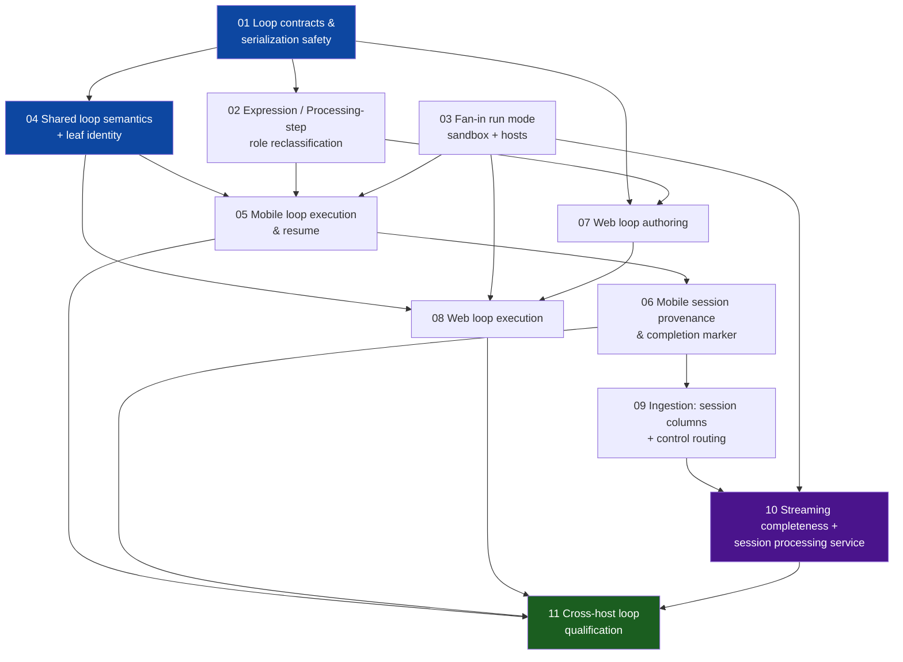

# Workbook loops — implementation tickets

Breakdown of the [technical plan (rev 3)](../index.md) and the [session provenance & streaming completeness companion](../loop-run-provenance-and-completeness/index.md), following the dynamic-command epic's ticket discipline: every ticket ships dark, leaves the tree green, and passes independent review before closing. Rollout switches: `WORKBOOK_LOOPS` authoring flag (default-off), publish gate refuses loop graphs unless enabled, CMS minimum untouched.

| # | Ticket | Layer |
| --- | --- | --- |
| 01 | [Loop contracts & serialization safety](01-loop-contracts-and-serialization/index.md) | packages/api + backend |
| 02 | [Expression / Processing-step role reclassification](02-expression-processing-roles/index.md) | cross-cutting rename/migration |
| 03 | [Fan-in run mode](03-fan-in-run-mode/index.md) | macro-sandbox + mobile/web runners |
| 04 | [Shared loop semantics + leaf identity](04-shared-loop-semantics/index.md) | packages/api |
| 05 | [Mobile loop execution & resume](05-mobile-loop-execution/index.md) | apps/mobile |
| 06 | [Mobile session provenance & completion marker](06-mobile-session-provenance/index.md) | apps/mobile |
| 07 | [Web loop authoring](07-web-loop-authoring/index.md) | apps/web |
| 08 | [Web loop execution](08-web-loop-execution/index.md) | apps/web |
| 09 | [Ingestion: session columns + control routing](09-ingestion-session-tables/index.md) | apps/data (centrum) |
| 10 | [Streaming completeness + session processing service](10-streaming-completeness/index.md) | new streaming app + backend + data |
| 11 | [Cross-host loop qualification](11-cross-host-loop-qualification/index.md) | all |
