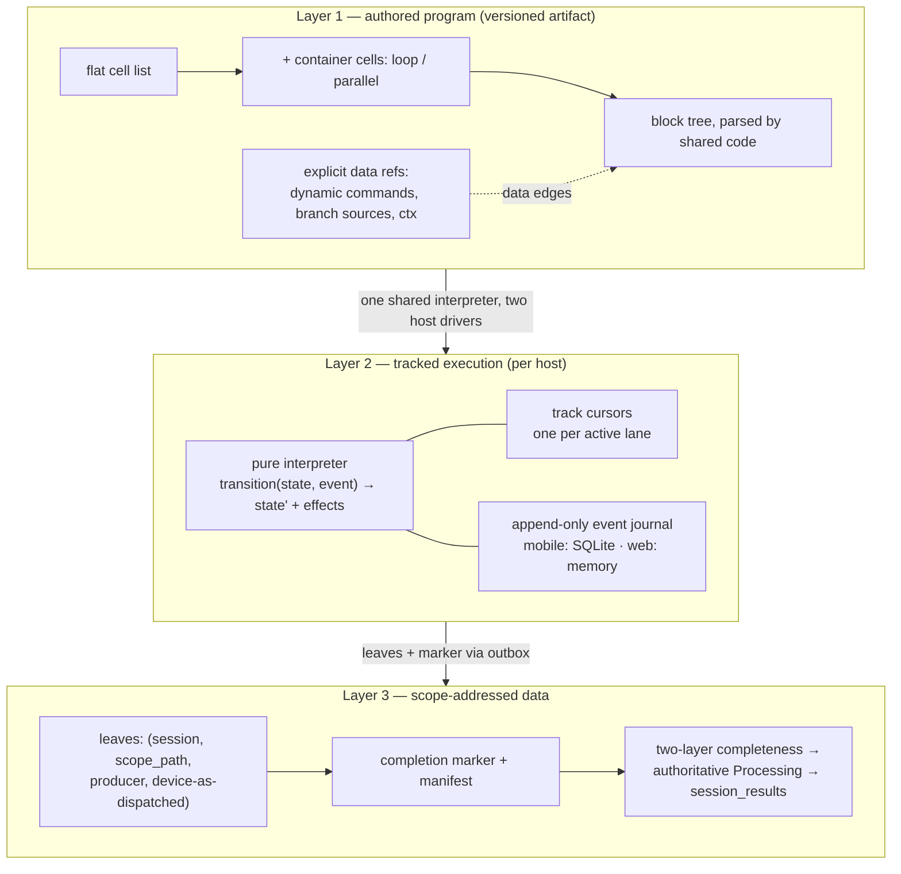
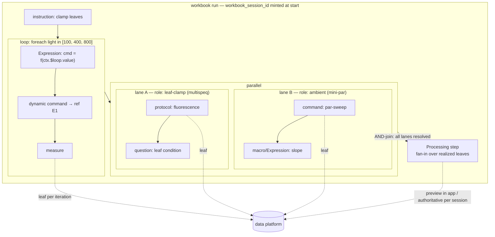
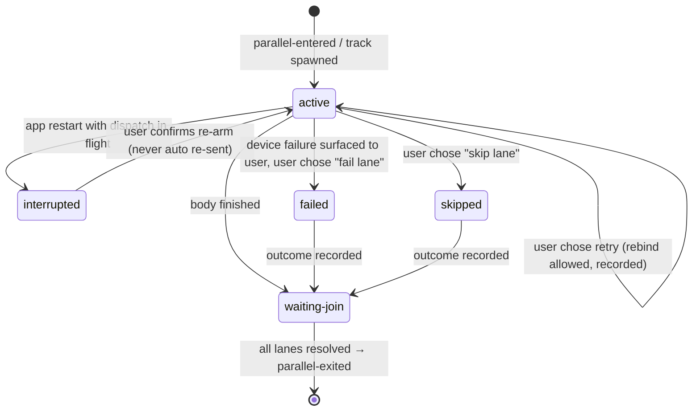
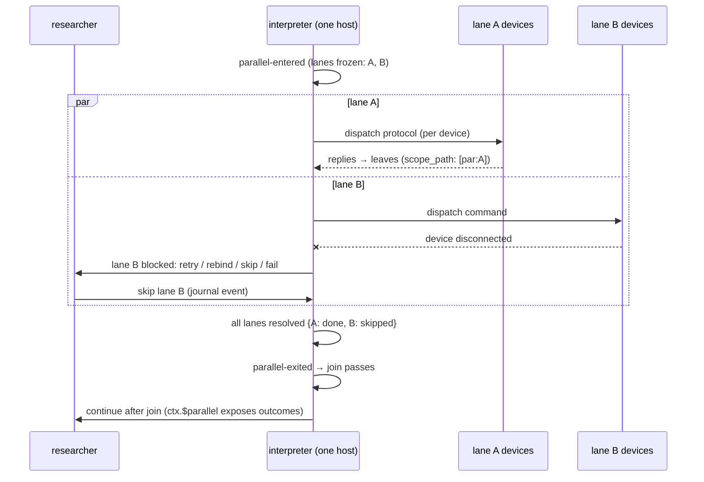
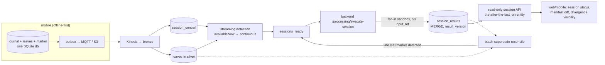
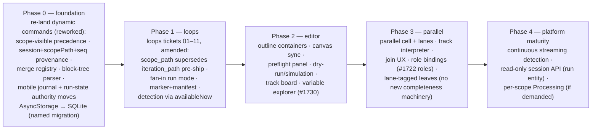

# Workbook next generation — unified design proposal

One design covering four capabilities — **dynamic commands**, **loops**, a **working flow editor**, and **true parallel branching (fork → per-device paths → join)** — as one system rather than four bolt-ons.

**Grounding.** Every claim about current behavior cites code on `main` (this worktree), the branch `traycer/open-jii-polite-badger` (PR #1835, prefixed `badger:`), a committed planning artifact under `badger:docs/plans/`, or a GitHub issue/PR. Claims are **[V]erified** (read in code / issue text) or **[A]ssumed** (design judgment). Two record-vs-reality corrections found while grounding are flagged inline (§2.6, §9.1). This revision incorporates two independent adversarial reviews (one external-model, one internal), which produced the invocation-sequence provenance component (§5.3), the runtime lane-disjointness gate (§5.2), the journaled-timer rule (§5.5), and the honest re-scoping of Phase 0 and of the completeness interim mode (§6.2, §9.3).

**Relationship to prior artifacts.** This proposal builds on, and where stated amends, the committed plans: `dynamic-command-cell-core-flows`, `dynamic-command-cell-technical-plan` (+ its F1–F11 critique), `workbook-loops-technical-plan` rev 3 (+ its B/D/G/N critique cycle), and `loop-run-provenance-and-completeness` rev 3. User decisions already settled there (Expression/Processing split, single-level loops v1 with nesting-ready ids, "web executes, mobile records", `workbook_session_id` naming, real streaming infrastructure as the end state) are treated as constraints; where this proposal pressures one, it says so explicitly rather than silently overriding it (§10).

---

## 1. Summary of the proposal

**The unifying abstraction is a structured program over the existing flat cell list, executed as a set of per-device tracks by one shared pure interpreter, with every result carried as an event-sourced, scope-addressed leaf.** Three layers:

| Layer | What it is | What it unifies |
| --- | --- | --- |
| **Authoring: structured blocks** | The flat cell array gains *container cells* (`loop`, `parallel`) whose bodies are ordered child cell lists. Control flow is structured (containers + boundary-restricted branch/goto); data flow is explicit refs (dynamic-command refs, branch sources, `ctx` reads). | Loops and parallel branches become the same kind of thing (a scoped container); the editor gets a real tree to render; dynamic-command legality generalizes from "earlier in a line" to "visible in scope". |
| **Execution: tracked interpretation** | One pure, host-neutral interpreter (`transition(state, event) → {state', effects[]}`) whose program counter is a *set of track cursors* (one per parallel lane; exactly one outside parallel). Hosts (web, mobile) own transport, UI, and persistence; mobile persists an append-only event journal in SQLite. | Web/mobile semantic parity by construction; restart-safe loops *and* parallel from the same journal; fork/join as structured-concurrency scope entry/exit. |
| **Data: scope-addressed leaves + session** | Every measurement leaf carries `(workbook_session_id, scope_path, producer_cell_id, device_id_as_dispatched)`. A completion marker carries the realized-leaf manifest; a two-layer completeness engine (streaming detection + batch supersede) fires the authoritative Processing step; `session_results` becomes the embryo of a real run entity. | Loops and parallel lanes are the *same* provenance dimension (`scope_path`); completeness math is identical for both; the dynamic-command safety invariant extends unchanged. |

The dynamic-command safety invariant is preserved and strengthened: *a command is dispatched only from the referenced source's output under the active workbook version, **session, scope instance, and invocation order**, and a device-scoped value is never substituted across device identities* — with "scope instance + invocation sequence" replacing the flat epoch so the invariant survives iteration, lanes, and goto revisits (§5.3).

What this costs, honestly: the shipped-in-branch dynamic-command code needs a **coordinated rework of four load-bearing decisions before it can host loops or parallel** (§9); mobile gains a new persistence surface (the journal); and parallel branching on mobile is transport-gated by the unresolved mixed-transport spike (#1722) — the design is ready before the transport is (§10.4).

---

## 2. Current system — the facts the design must respect

Condensed; each line is [V] with citation.

### 2.1 Data model

- The canonical workbook body is a **flat, ordered cell array**; sequence is array position, there are no edges or nesting. 7 cell types (`protocol, command, macro, question, branch, output, markdown`) — `packages/api/src/domains/workbook/workbook-cells.schema.ts:121-129`.
- A branch is **conditional forward `gotoCellId` jumps**, not graph edges: paths with AND-ed conditions over `(sourceCellId, field, operator, value)` — `workbook-cells.schema.ts:69-92`. It is the only *authored intra-workbook* loop mechanism (backward goto) and the only branch mechanism; mobile additionally iterates by wrapping the whole flow (`iterationCount`, §2.3).
- The **flow graph** (`{nodes, edges}`, React-Flow shaped, 5 node types) is a *derived, lossy projection* used by the experiment design page: outputs are dropped, commands ride `measurement` nodes for old-client compat, and on `main` branch cells are **lost** in the flow→cells direction — `packages/api/src/transforms/cells-to-flow.ts:39-108`, `flow-to-workbook-cells.ts:45-111` (no `branch` case). The badger branch fixes the round-trip (`badger:` both converters + conversion tests).
- A workbook **version** is an immutable cells snapshot + pinned entity code (`workbook-version.schema.ts:17-26`). There is **no run entity, no loop, no fork/join, no `workbook_session_id` anywhere** on `main` or badger code (grep-verified by the schema survey). Badger's `flow-graph-topology.ts:114-153` explicitly classifies ordinary-edge `fork`/`merge`/`cycle` as *problems* that fail all dynamic refs closed.

### 2.2 Web execution and editing

- `useWorkbookExecution` is an **imperative async index-walk** (no reducer): `runAll` walks `i = 0..n`, branch jumps set `i = jumpIndex − 1`, revisits capped at `MAX_VISITS_PER_CELL = 100` — `apps/web/hooks/workbook/useWorkbookExecution/useWorkbookExecution.ts:814-854`. Protocol/command dispatch is `Promise.allSettled` fan-out over connected devices (`:302-316`); macros run per-device serially; a `$device` branch is a per-device *dispatcher* (groups devices by matched path) — `:590-651`.
- Results are written back **into the cell array as `output` cells** (`producedBy` ownership, `:91-121`) and autosaved wholesale. Web has **no measurement upload path and no run/completeness concept at all** (grep-verified across `apps/web` + `packages/api`).
- Two disconnected authoring surfaces exist: the runnable **linear list editor** (`apps/web/components/workbook/workbook-editor.tsx`, dnd-kit sortable, rich branch authoring via dropdowns — `branch-cell.tsx:262-446`) and a **React Flow canvas** on the experiment design page (`apps/web/components/flow-editor/flow-editor.tsx`) that is editable but **not wired to execution**. Branch/goto control flow is invisible in the list (dropdowns only); branch validation happens only at run time as an error output cell.

### 2.3 Mobile execution and offline model

- The engine is a **single linear cursor** `currentFlowStep` over `flowNodes` derived by `cellsToFlowGraph` at load — `apps/mobile/src/features/measurement-flow/domain/flow-transitions.ts:40-76`, `hooks/use-load-experiment-flow.ts:47-58`. Iteration = whole-flow wrap (`iterationCount`); branch loop cap `MAX_BRANCH_VISITS = 100` (`evaluate-and-route.ts:44`).
- Scripts run on-device: JS via `new Function` with deep-frozen `ctx` (`utils/process-scan/process-scan.ts:33-53`), Python via a registered Pyodide-in-WebView runner (`python-macro-runner.ts`, `services/python/python-macro-sandbox.ts`). **No R on device.**
- Offline-first upload: the `measurements` SQLite table **is** the outbox (`shared/db/schema.ts:16-43`); each device's result is an independent MQTT message retried with backoff (`features/recent-measurements/services/outbox.ts:279-353`); `workbook_run_id` is minted **only when `results.length > 1`** (`features/recent-measurements/hooks/use-measurement-upload.ts:113`).
- Restart safety today: flow position, branch state, outputs, and answers are persisted (`use-measurement-flow-store.ts:178-198`), **but `devicePlan` and `consumedNodeIds` are deliberately ephemeral** — an app restart mid-dispatch-round silently degrades to broadcast (`flow-transitions.ts:71-75`). This is the single biggest existing restart gap for anything parallel-shaped.
- On `main`, mobile sends no capability header and has no 426 handling (`shared/api/orpc.ts:13`); the rehydration guard is only an orphaned-answers check (`flow-rehydration-guard.ts:8-30`). Both are upgraded on badger.

### 2.4 Script execution surfaces

- The macro-sandbox Lambda is **fan-out only**: N items in → N results out, per-item 1 s VM cap hardcoded (`apps/macro-sandbox/lib/wrappers/wrapper.js:160-184`, `wrapper.py:275-361`), 1 MB script / 1000 items / 60 s / 10 MB output; responses gzip'd under the 6 MB sync cap (`functions/javascript/handler.js:7-22,103`).
- The **element-0 unwrap lives on the host side**, not in the sandbox: `normalize-macro-input.ts:33-47` selects `sample[0]` and discards the rest (with warning metadata). The Databricks UDF deliberately wraps legacy arrays into `{sample: [...]}` to trigger it (`apps/data/src/lib/enrich/enrich/macro_execution.py:51-72`).
- Version pinning **is implemented** on `main` — items carrying `workbook_version_id` resolve scripts from immutable snapshots, grouped by `(macro_id, version)` per batch (`apps/backend/src/macros/application/use-cases/execute-macro-batch/execute-macro-batch.ts:47-133`) — but only when the id propagates; rows without it silently fall back to the **live** macro, which is why #1797 stays open. [V]
- The pipeline **never calls Lambda**: Databricks → backend `/api/v1/macros/execute-batch` (HMAC) → backend fans out (`macro_execution.py:1-15`, `backend_client.py:38`).

### 2.5 Data platform

- centrum is **DLT, triggered (dev) / continuous with 120 s trigger interval (prod)**; zero stateful streaming operators repo-wide (grep: no `withWatermark`, `foreachBatch`, `*GroupsWithState`, `session_window`) — `infrastructure/modules/databricks/pipeline/main.tf:64`, `infrastructure/env/*/main.tf`.
- Run correlation today is only `workbook_run_id` (nullable, per multi-device round — `apps/data/src/lib/openjii/openjii/centrum/schemas.py:75-77`), and the macro gold table **drops even that** (`gold/experiment_macro_data.py:150-172`). The pipeline **cannot know a multi-message run is complete** — no marker, no cardinality, no windowing. [V]

### 2.6 Record-vs-code drift (flagged for the requirements record)

The A1/A2 issue record (#1715/#1716) specifies `bundle_id`/`bundle_size`/`device_index` correlation. **None of those fields exist in code** — mobile, `packages/api`, and `apps/data` all grep clean; what shipped is `workbook_run_id` + per-row `_client_id` dedupe (`features/recent-measurements/hooks/use-measurement-upload.ts:113`, `outbox.ts:295-301`, `schemas.py:75-77`). Downstream designs (including the loops companion) correctly build on `workbook_run_id`/`workbook_session_id`; the issue text is stale. [V]

### 2.7 The requirements record (issues), in one paragraph

Epic #1714 sequences the platform: A-track homogeneous fan-out (shipped: #1715/#1716, PR #1785), B-track cross-cell state (`ctx` shipped #1717 via PR #1791; macro-as-command-constructor #1718 and its capability gate #1719 open), C-track heterogeneous (branch-per-sensor `$device` + per-device dispatch shipped #1720/#1721 via PR #1791; **mixed BT+serial transport #1722 open** — it also absorbed role-bound device slots and sweep loops from #1632), D-track runtime (xstate spike #1723 **rejected** in favor of #1741's pure-reducer `@repo/workbook`, which was **built and closed unmerged** in PR #1740, alive on branch `claude/confident-grothendieck-e28928`). Loops demand traces through #497/#699/#1765 (auto-increment/wrap plot loops), #1486 (goto loop-back), #1618/#1632 (calibration sweeps; "a repeat primitive is a separate discussion"). Editor demand: #1484 (flowchart sidebar), #1730 (Variable Explorer). Protocol→command unification #1780 (built, unmerged PR #1778) will eventually collapse the measurement/command node distinction. [V per issue synthesis]

---

## 3. The unifying conceptual model

### 3.1 What kind of thing is a workbook?

A workbook is **a human-paced measurement procedure**: an ordered narrative a researcher steps through with physical instruments, containing embedded computation. It is *not* a batch dataflow (no interchangeable workers — device 2's leaf is not device 1's), *not* a pure DAG (instructions and questions are sequenced human actions with no data edges), and *not* server-orchestrated (it must run in a field with no connectivity).

That framing selects the model:



### 3.2 Why structured blocks (and not the alternatives)

**Chosen: structured containers with matched scope semantics** — a loop or parallel container encloses its body; entering/leaving a scope is the only way in or out; branches cannot cross a container boundary except to the container's own end.

Rejected alternatives, with reasons:

1. **Pure dataflow DAG (Nextflow-style channels).** Emergent parallelism from data readiness is elegant for stateless compute but wrong here: steps are human actions in a deliberate order; device commands are irreversible physical side effects that must not fire "whenever inputs are ready"; channel reordering is unacceptable when each element is bound to a physical device and sample. We keep dataflow *within* the model — as explicit refs — but subordinate to a control-flow spine (the Unreal Blueprints exec-pin/data-pin split, which cleanly separates "when things happen" from "where values come from").
2. **Free-form graph with data-dependent joins (BPMN inclusive/OR-join).** Twenty years of workflow-engine literature says OR-join semantics (waiting for "whichever branches were activated") require global lookahead and are formally miserable. We forbid it structurally: joins are **AND-joins over a lane set frozen at fork time**; a dead device is a *failed known lane*, never an "un-activated" one (§5.4).
3. **Actor-per-device.** Attractive for parallel execution but wrong as the *authored* model: it fragments one experiment into N scripts, has no shared narrative for the field researcher, and founders on unstable device identity (reconnects mint new ids — `serial-port-connection.ts`; firmware ids best-effort — loops critique N1). We keep the actor *intuition* at the execution layer only: a track ≈ an actor, but tracks are spawned/joined by the structured program, not free-standing.
4. **Implicit map-over-everything (n8n item lists).** Ergonomic until identity-linking breaks; n8n's fragile `pairedItem` mechanism is its top silent-bug source. We adopt the good half (identity-preserving iteration à la Galaxy collections) by making provenance **mandatory and first-class** (`scope_path` on every leaf), and reject the implicit half.
5. **Target-driven backward synthesis (Snakemake).** No artifact targets exist to pull from; field researchers think forward and imperatively.
6. **XState machine.** Already litigated in-repo: spike #1723 proved the concept, #1741 productized it *without* the dependency as a pure reducer. This proposal adopts #1741's architecture (§5.1) rather than re-deciding.

Prior-art anchors for the chosen shape [V per comparative research]: KNIME's paired loop start/end nodes (structured loops on a canvas, trivially validated); structured-concurrency nurseries (fork and join are the same lexical bracket; the scope cannot exit until every child resolves); Step Functions' **Map vs Parallel** distinction (iterate-over-data vs fork-across-different-paths, both with static positional result merging); Temporal's event-sourced replay (rebuild state from a journal; keep device I/O off the replay path); Opentrons' two-front-ends-one-IR (Protocol Designer vs Python API); Airflow's late `.expand()` retrofit (design runtime fan-out in from day one — loop bounds and lane device-sets resolve at run time, then freeze).

### 3.3 The two container primitives

Following Step Functions' Map/Parallel split, loops and parallel branching are **different primitives sharing one scope mechanism**:

- **`loop`** — *same body, N times, sequentially*: `foreach` over a value list (literal, question answer, or Expression output — realized at loop entry and frozen) or `repeat N`. One track; the body sees `ctx.$loop = {value, index, name}`. This is exactly the rev-3 loops plan; this proposal adopts it and its ticket breakdown (§9.3), amending only provenance (§5.3).
- **`parallel`** — *different bodies, simultaneously, on disjoint device groups*: K authored **lanes**, each with a device selector; entering the container binds connected devices to lanes and freezes the assignment; each lane runs its body as an independent track; the container exits through an AND-join.



### 3.4 Composition rules — where the design says "no"

| Composition | v1 | Target | Why |
| --- | --- | --- | --- |
| `loop` at top level | **yes** | yes | The rev-3 loops plan, unchanged. |
| `loop` inside a `parallel` lane | no (validation) | **yes (v2)** — per-lane loops with independent iteration counts | This is the real multi-device science case (device A sweeps 9 lights while device B logs ambient once a minute). Schema and `scope_path` are ready for it from day one; only validation and the mobile interpreter gate it. |
| `parallel` inside a `loop` | **no** | reassess after v2 | Join-per-iteration multiplies the human failure-resolution UX by N, manifest keys grow a dimension, and no grounded requirement asks for it (nothing in #1714's tracks or the calibration issues). Schema stays nesting-ready; saying yes later is a validation+interpreter change, not a migration — the same posture rev 3 took for nested loops (loops plan, decision 3). |
| `loop` inside `loop` | no | deferred | Settled user decision (loops critique B4 → rev 3); ids are nesting-ready (`iteration_path` arrays). |
| `parallel` inside `parallel` | **no, indefinitely** | — | No use case; device sets can't meaningfully sub-fork; UX collapses. |
| branch/goto crossing any container boundary | **no** | no | The structural guarantee everything else rests on. A branch inside a body may jump within the body or to the body's end ("exit/continue"); loops-plan ticket 01 already specifies this for loops; parallel inherits it. |
| dynamic ref into a container body from outside | **no** | no | Loops plan decision 2; a body cell's output has iteration/lane identity an outside consumer can't name. |
| dynamic ref across sibling lanes | **no** | no | Lane isolation is what makes a lane restart/fail independently; cross-lane values flow only through the join (leaves → Processing) — see §5.4. |
| ref from after the join to a cell inside a lane | **no (v1)** | revisit with per-scope aggregation | After the join, per-lane data is consumed via the Processing step over lane-tagged leaves. Allowing direct refs would demand a lane-qualified ref syntax and per-lane freshness UX; defer until demanded. |
| aggregate (Processing) output driving control flow | **no** | no (standing decision) | Loops plan decision 2 consequence: the in-app aggregate is a *preview*; the authoritative value computes later in the platform. Letting a preview steer a branch means web/mobile could take a path the authoritative recompute would contradict. This extends to join policy: no "continue only if slope > x" in v1. |
| loop bound from an Expression | **yes** | yes | Runtime fan-out from day one (Airflow lesson); the list is realized at loop entry, frozen, and recorded in the journal so replay is deterministic. |

### 3.5 The Expression / Processing split under this model — critique

The loops plan splits "macro" into **Expression** (inline, per-iteration, feeds a command/branch) and **Processing step** (terminal, once per run, fan-in over collected leaves, also runs authoritatively in the platform). Verdict: **the split is correct and survives parallel branching — but it is one role short.** Today's "macro" conflates *three* user purposes, not two, and they differ in exactly the dimension that matters here: where they *must* run vs where they are *authoritative* [V, maintainer-confirmed taxonomy]:

| Purpose | Cardinality / direction | Must run | Authoritative home | Role |
| --- | --- | --- | --- | --- |
| Command generation | per-iteration, *into* the run | phone (offline) + web | device/web — no server fallback exists offline | **Expression** |
| Data quality (QA) | per-leaf, immediate verdict | phone (offline) — its whole point is gating "re-measure" in the field | device/web | **Expression** feeding a branch condition |
| Transformation / extraction | per-leaf, *out* of the run | phone today (only one macro type exists) | **data ingest** | **Transform** — the missing third role |
| Run aggregate | per-run, fan-in | phone as preview | data platform | **Processing** |

- *Why the in/out split is right:* Expression and Processing have opposite dataflow, opposite cardinality, and opposite run sites — and the split is precisely what keeps the resolver free of cross-iteration state (loops plan decision 2, verified against `command-payload.ts`'s purity).
- *Why the third role costs almost nothing:* **Transform already exists in infrastructure, just not in vocabulary.** The platform re-runs macros per-row at ingest today — gold `experiment_macro_data` → backend `/execute-batch` → Lambda per-item fan-out (§2.4/§2.5) — which is exactly "authoritative transformation at ingest; the on-device copy is the field preview." Naming it costs a third wire `producer_kind` and ticket-02 vocabulary, **zero new execution infrastructure** (it rides the existing per-item contract; only Processing needs the new fan-in mode). The naming buys two things: the editor can say what a script *is for*, and the platform knows which on-device results it is expected to recompute authoritatively (Transform, Processing) versus which are device-final (Expression, QA).
- *QA and control flow, stated so the rule isn't over-applied:* a per-leaf QA verdict **may drive a branch** ("below threshold → prompt re-measure"). The no-control-flow rule (§3.4) binds only run-level aggregates (Processing), whose authoritative value computes later; a QA Expression is track-local and same-iteration, so acting on it is safe and is the field-researcher use case. Corollary: mobile/server script parity (#1702) is a *hard correctness* requirement for Expression/QA (no server fallback offline) but only a *preview-fidelity* requirement for Transform/Processing.
- *Under parallel branching the roles hold:* Expression/QA are **track-local** — they read the current iteration/lane's upstream outputs through the same resolver, and lane isolation (§3.4) means they never see a sibling lane. Transform is per-leaf and lane-agnostic. Processing reads **lane-tagged leaves** — sparse by design, exactly as branch-skipped iterations already are; the manifest tells it what was realized.
- *What doesn't hold forever:* "exactly one Processing per run, terminal." Method hackers running per-lane sweeps will want **per-lane/per-loop summaries** ("slope per device") before the terminal aggregate. Recommendation: keep exactly-one-terminal in v1 (as ticketed), but give the Processing cell a `scope` field (`"run"` now, a container id later) from day one, so per-scope aggregation is additive rather than a new cell type; the platform lift (per-scope `session_results` keyed by `(session, scope_path)`) reuses the same MERGE pattern. [A]
- *Honest cost restated:* the producer-kind reclassification (critique D6 → rev 3) must introduce **three** wire kinds — `"expression"`, `"transform"`, `"processing"` — beside legacy `"macro"` (read forever), and ticket 02's scope grows accordingly. QA needs no fourth kind: it is an Expression by dataflow; if telemetry ever needs to distinguish it, that is a cell-level `purpose` annotation, not a wire kind. [A]

---

## 4. The authored schema

### 4.1 Container encoding: nested bodies, additive serialization

Loops ticket 01 already commits to a **container cell with an ordered body** (`zLoopCell`). This proposal adopts that encoding and extends it to `parallel`, for one decisive reason over bracket-pair cells: **an old client that somehow parsed a bracket pair would drop the two unknown marker cells and execute the body once, linearly — silent mis-execution.** A container cell fails atomically: the whole unknown cell (body included) drops, and the content-level guard + capability gate refuse the workbook long before that (§8.1). [A, aligned with ticket 01]

```ts
// packages/api — sketch, following command-source.schema.ts conventions
type LoopCell = {
  id: string;
  type: "loop";
  bound:
    | { kind: "repeat"; count: number }                    // 1..1000 (cap per ticket 01)
    | { kind: "foreach"; values: string[] }                // literal
    | { kind: "foreach-ref"; ref: { sourceCellId: string; field: string } }; // question/Expression
  name?: string;                                           // ctx.$loop.name
  body: WorkbookCell[];                                    // ordered, no nested containers in v1
};

type ParallelCell = {
  id: string;
  type: "parallel";
  join: { policy: "wait-all"; laneTimeoutMs?: number };    // policy enum is intentionally 1-long in v1
  lanes: Array<{
    id: string;
    label: string;                                          // "Leaf clamp", "Ambient reference"
    selector:                                               // device binding, resolved at scope entry
      | { kind: "role"; role: string; family?: string; cardinality: "one" | "all" }
      | { kind: "rest" };                                   // everything not claimed by earlier lanes
    body: WorkbookCell[];
  }>;
};
```

Notes:

- **Command is the measurement primitive going forward.** A command is a superset of a protocol, and protocol is on a deliberate, gradual deprecation path (#1780: "a protocol is a command", full implementation parked on unmerged PR #1778; kept incremental on purpose so the rename never has to land in one go). Consequence for everything in this proposal: **new constructs speak only "command"** — lane targets, dynamic refs, eligible-source rules, leaf `producer_kind`, container bodies. `protocol` remains a recognized legacy cell type in compat paths (converters, existing workbooks, and the wire/firmware carve-outs #1780 enumerates: MQTT `{protocolId}` topic segment, `_protocol_set` firmware key, mobile SQLite `protocol_name`, PostHog flag values), but no new surface area is minted for it. [V direction, maintainer-confirmed]
- **Honesty about "flat":** nested `body` arrays make the canonical cell document a *shallow tree* (depth ≤ 2 in v1), not literally flat. The constraint that actually protects old clients is the closed type enum + strict schemas + capability gating, not flatness itself — and loops ticket 01 already crossed this line by choosing a container. The cost is real and enumerable: every consumer that iterates the top-level array becomes container-aware — the converters, the structural validators, publish-time entity-snapshot collection, the egress content guards, `buildCellNamespace`, and both editors. That enumeration is Phase 0/1 work (§9.3), stated here so "flat" is never cited as an unbroken invariant. [A]
- **Device selectors reuse the role model from #1632/#1722** (`{key, family, label, cardinality}` role-bound slots, bound to connected devices at run start) — that spike's recommendation to "land `target`/`role` as optional now" becomes load-bearing here. Roles are the *stable logical identity* lanes need; physical ids stay as-dispatched (§5.3). [V ref: #1722 scope, issue synthesis]
- `foreach-ref` reuses the shipped `zCommandRef` shape and the same structural validator vocabulary (source exists / eligible / **dominates** / field non-empty), so authors meet one reference mechanism everywhere.
- The **flow-graph projection** must carry the body *inside the container node's content*, not as flat sibling nodes with a `parentId`: a consumer that drops the unknown container node then loses the body atomically, whereas React Flow's native flat parent-child encoding would leave known-typed body nodes behind as orphaned siblings — recreating exactly the one-pass linear execution hazard the container encoding exists to prevent. React Flow's `parentId` grouping is a *render-time expansion* in the canvas, never the serialized shape. Conversion tests must prove container id, lane order, body order, bound, and selectors survive cells→flow→cells, byte-identical for container-free workbooks (ticket 01's additivity proof, extended).
- **Validation vocabulary** (extends the shipped `DYNAMIC_COMMAND_*`/loops codes): `PARALLEL_LANE_EMPTY`, `PARALLEL_LANE_SELECTOR_OVERLAP` (two lanes claim the same role), `PARALLEL_REF_CROSSES_LANE`, `CONTAINER_BRANCH_ESCAPES_BODY`, `CONTAINER_NESTING_UNSUPPORTED`, `PARALLEL_JOIN_UNRESOLVED_DEMAND` (a post-join ref into a lane). All repairable-in-draft, blocking at publish — the F2-established pattern (`PublishVersionUseCase` + `WORKBOOK_STRUCTURAL_VALIDATION_FAILED`).

### 4.2 Ordering: from "strictly earlier" to scope-visible precedence

The shipped legality rule — source strictly earlier in the flat array; any fork/merge/cycle fails **every** ref closed (`badger:dynamic-command-refs.ts:285-297`; runtime re-check `badger:command-payload.ts:~127-131`) — is correct for a line and fatal for this design: a loop *is* a cycle and parallel *is* a fork/merge (badger audit, finding 1). Replace it with the block-tree equivalent, which preserves the invariant's intent ("the dependency is visible above you"):

> A ref from consumer C to source S is structurally valid iff S precedes C **within the same body**, or S precedes C's *enclosing container chain* at some ancestor level — i.e. S is **scope-visible above C** in the block tree. Refs never point into a body from outside, across sibling lanes, or across iterations.

Two deliberate properties, stated so nobody relitigates them later:

- **This is authored precedence, not control-flow dominance.** A branch inside the body may skip S on the path that reaches C; the rule still admits the ref, exactly as the shipped design does for the flat case — *structural* legality is "the dependency is visible", and *runtime freshness* (no fresh registry entry ⇒ typed failure, no dispatch) handles execution-order gaps. That division is the settled core-flows semantics ("Branches may skip an eligible earlier source… dispatch is blocked and the user is told to run the named source"), preserved unchanged. Renaming it "dominance" would overclaim; it is scope-visible authored precedence backed by fail-closed freshness.
- **The runtime re-check must be rebuilt, not merely renamed.** Today `resolveCommandPayload` does a flat `findIndex` positional comparison with no topology awareness; the scope-aware precedence helper is a Phase 0 deliverable shared by the validator and the resolver so they cannot drift.

The rule is still a pure function of the authored artifact, still deterministic, and reduces exactly to today's rule when no containers exist. `DYNAMIC_COMMAND_GRAPH_AMBIGUOUS` remains for genuinely malformed graphs (duplicate ids, dangling edges) but no longer fires on well-formed containers.

---

## 5. Execution semantics

### 5.1 One interpreter, two hosts

Adopt #1741's architecture (built in unmerged PR #1740; branch `claude/confident-grothendieck-e28928`): a **pure reducer** `transition(state, event) → {state, effects}` with effect-id gating so cancel races and re-runs can never record stale device results, hosts injecting ports (command executor, macro runner, output store, clock), and versioned pure-JSON snapshots for resume. [V: issue #1741 + re-layer note]

This proposal's amendment to #1741: the program counter generalizes from one cursor to a **track set**, and resume is anchored on an **event journal**, not only snapshots (§5.5):

```ts
type RunState = {
  sessionId: string;                       // workbook_session_id — minted at run start, BOTH hosts
  workbookVersionId: string;
  bindings: Record<roleKey, DeviceBinding>; // role → as-dispatched device id + identity snapshot
  tracks: Track[];                          // exactly 1 outside parallel
  registry: Record<RegistryKey, RuntimeCellOutput>; // RegistryKey = `${cellId}@${scopePath}`
                                            // commits are gated by invocation seq — see §5.3
  seqByProducer: Record<cellId, number>;    // monotonic per-producer invocation counter (journal-derived)
  journalSeq: number;
};

type Track = {
  id: string;                               // `${parallelCellId}:${laneId}` or "main"
  laneId?: string;
  frames: Frame[];                          // scope stack: [{scopeId, kind, iteration, boundList?}]
  pc: { body: CellPath; index: number };
  status: "active" | "waiting-join" | "interrupted" | "failed" | "skipped" | "done";
};
```

The interpreter, the block-tree parser (§4), the dominance validator (§4.2), the resolver (`resolveCommandPayload`, unchanged in purity), and the leaf/manifest derivations live in shared code (`packages/api` transforms or the revived `@repo/workbook`); web and mobile become thin drivers, exactly the "one contract, two interpreters" discipline the loops plan already prescribes for loops (ticket 04) — extended to the whole engine rather than per-feature.

*Migration honesty:* neither host runs a reducer today (web: imperative walk, §2.2; mobile: store transitions, §2.3). The path is incremental — Phase 0 lands the shared contracts and the journal; hosts adopt the reducer per-construct (loops first, then parallel) rather than in one rewrite. The parity claim is scoped accordingly: **a construct ships only when both hosts route its interpretation — including branch/goto behavior *inside* its body — through the shared reducer**; that is what loops tickets 04/05/08 already prescribe for loops, generalized. Until a construct migrates, the legacy top-level goto/branch walk stays host-owned, and parity for it remains what it is today: convention plus shared `evaluateBranch`, not construction. Splitting a container's interior between shared code and two host walkers is exactly the drift generator this architecture exists to kill, so it is forbidden by rule rather than discouraged by review. [A]

### 5.2 Track lifecycle and the fork

Entering a `parallel` container is a single journal event that **binds and freezes**:

1. Resolve each lane's selector against currently-bound devices (role bindings established at run start or by explicit user action). Unclaimed lanes with `cardinality: "one"` and no candidate device **block entry** with a repairable prompt ("Lane 'Ambient' needs a mini-PAR — connect one or skip the lane"); the researcher's choice (bind / skip-lane) is recorded as an event *before* the fork commits.
2. **Enforce binding disjointness at runtime, atomically, before the fork commits**: the resolved per-lane device-id sets must be pairwise disjoint. Structural validation can only reject *same-role* overlap; two roles accidentally bound to one physical device is a runtime condition, and entering the fork with it would let two lanes dispatch interleaved, incompatible commands to one instrument. Overlap blocks entry with a repairable prompt (rebind or skip a lane), like an unbound role.
3. Emit `parallel-entered {parallelCellId, scopeInstance, lanes: [{laneId, deviceIds[] as dispatched, skipped?}]}`. The lane set and device assignment are now **frozen for this scope instance** — the join's AND-set is static from this moment (BPMN lesson; Airflow lesson: the set is *discovered* at fork time, *frozen* for the join).
4. Spawn one track per non-skipped lane.

On mobile, "parallel" is **interleaved orchestration from one phone**: the app dispatches lane A's protocol to its device group, and while awaiting replies advances lane B's track to *its* next dispatch — single-threaded interleaving, the multi-scanner executor already being per-device (`use-scanner-command-executor-store.ts:62`). What is genuinely concurrent is the *devices'* work, which is the point. Human-gated cells (question, instruction) in two lanes at once are serialized by the UI: the track board (§7.4) queues them; a lane waiting on the human is `active` with a pending interaction, not blocked-failed. [A]



### 5.3 Provenance: from flat epoch to (session, scope instance, invocation)

The shipped `OutputProvenance {workbookVersionId, executionEpoch}` cannot distinguish two passes over the same cell (badger audit, finding 2) and means different things per host (finding 3: mobile = measurement cycle, web = invalidation generation; web even puns the workbook *id* into the version slot — doc comment `badger:useWorkbookExecution.ts:70-76`, assignment `:430`). Replace both with one three-part definition:

```ts
type OutputProvenance = {
  workbookVersionId: string;
  sessionId: string;          // replaces executionEpoch on both hosts — same rotation points (below)
  scopePath: ScopeFrame[];    // [] at top level; [{scopeId, iteration}] in a loop;
                              // [{scopeId, lane}] in a lane; nesting-ready, length ≤ 1 in v1+lanes
  seq: number;                // per-producer invocation number, assigned at dispatch start,
                              // ordered by the journal — monotonic within the session
};
```

- **`sessionId` rotates exactly where the epoch rotated** — mobile: cycle wrap / new iteration / retry / reset / abandonment / version change; web: `invalidateRuntime` (run-all start, clear, authored-design change, workbook-key change). It is not weaker than the epoch anywhere; it *is* the epoch, renamed and additionally uploaded (§6.1). A loop container's iterations live *inside* one session (the loops-companion definition); the mobile whole-flow wrap starts a *new* session (a new plot is a new run).
- **`seq` is the discriminator scopePath alone cannot provide.** Both adversarial reviews independently showed the gap: within one scope instance — including the retained top-level backward goto (`scopePath: []`) — two invocations of the same producer are otherwise indistinguishable, and an in-flight completion from pass 1 can land *after* pass 2's, making "latest write" diverge from "latest execution". Rules: the registry key stays `(cellId, scopePath)` with **latest-wins by `seq`, not by arrival** — a commit whose `seq` is lower than the stored one is rejected (this closes an out-of-order-commit window the shipped epoch design also has); a ref resolves to the highest-seq entry of its scope instance, which is the settled "latest completion within the active cycle" semantics made precise. Leaves carry `seq` too (§6.1), so repeated measurements are distinct leaves rather than a dedupe collision.
- The **registry key becomes `(cellId, scopePath)`**, ending the overwrite collision under iteration and the web replace-vs-mobile-merge divergence (audit finding 4: web `Map.set` erases sibling device groups — `badger:useWorkbookExecution.ts:457-459` — while mobile merges via `mergeDeviceProducerOutput`; the merge semantics become part of the shared contract).
- Freshness = same session + same scope instance (loop bodies: same iteration; the loops plan's "per-iteration registry reset" becomes a *keying* consequence instead of a wipe). "Latest completion of an earlier source in the active cycle" (core-flows) is preserved for pre-container sources: their `scopePath` is `[]` and stays fresh across iterations.
- The dynamic-command invariant now reads: *dispatched only from the referenced source's output under the active workbook version, **session, compatible scope instance, and highest invocation**, never across device identities.* Strictly stronger than the shipped one (the shipped epoch is the degenerate `scopePath: [], seq`-less case).
- **Wire identity, reconciled:** the uploaded run identifier is `workbook_session_id` — the companion's field, one name, one column. Badger's `execution_epoch` bronze column (`badger:raw_data.py:72-101`) is renamed to `workbook_session_id` at re-land time; since PR #1835 never merged, nothing live carries the old name, so there is no double-encoding and no legacy alias. `scope_path` supersedes the companion's planned `iteration_path` **as a schema amendment, not a rename**: `iteration_path` was an integer array, `ScopeFrame[]` is an object array, which changes the planned column type and `get_json_object` extraction in the (unbuilt) ticket-09 work — exactly the class of correction the loops critique itself applied in G5. Tickets 04/06/09 adopt it before anything ships. [A]

### 5.4 Join semantics

**Policy: AND-join over the frozen lane set, wait-all, human-resolved degradation.** Every lane must reach a terminal outcome ∈ {`done`, `failed`, `skipped`, `timed-out`} before the join passes — but *failed/skipped/timed-out are valid resolutions*, so the join never deadlocks on a dead device; it waits on a **decision**, and a physically present researcher is the decider. This is the key difference from server workflow engines: fork/join here has an operator standing next to the devices, so "partial convergence" is an explicit human action recorded in the journal, not a policy constant guessing intent.

- **Device failure/disconnect mid-lane:** the lane surfaces the failure with three choices — *retry* (optionally after re-binding the role to a reconnected/replacement device; the rebind is a recorded event and the new as-dispatched id simply appears in the manifest, exactly the rev-3 "no stable device identity required" insight), *skip lane* (lane resolves `skipped`; its realized leaves stand), or *fail lane* (resolves `failed`). Other lanes are unaffected throughout — the same per-device isolation the dynamic-command work shipped (`finishDeviceFanOut` partial-failure semantics; core-flows "pre-fail only that device").
- **Optional `laneTimeoutMs`:** for unattended lanes (a logging lane), a timeout auto-resolves the lane `timed-out` instead of waiting for a human. Two guards keep it from defeating the human-decider premise: the timeout clock **pauses while the lane has a surfaced human decision pending** (a disconnect prompt queued behind another lane's question must not silently expire into `timed-out`, discarding the retry the present researcher would have chosen) and while the app is backgrounded; and deadlines are journaled events, not wall-clock reads (§5.5). No quorum ("first K of N") in v1 — no grounded requirement, and it reopens OR-join-shaped reasoning. [A]
- **What crosses the join:** control flow and *status*, not values. Post-join cells see `ctx.$parallel[containerName] = {lanes: {laneLabel: {status, leafCount, devices[]}}}` — enough for a branch to say "if ambient lane failed, go to the manual-reading question" without any cross-lane data ref. Data crosses only as **lane-tagged leaves** consumed by the Processing step (or a future per-scope aggregate). This keeps the join a pure synchronization point and the aggregate rule of §3.4 intact.



### 5.5 Restart safety: the journal

Mobile persistence moves from "snapshot the mutable store" to **append-only events in SQLite, in the same database as the outbox** (`shared/db/client.ts` `measurements.db`), with a compacted snapshot for fast boot:

- Events: `session-started`, `cell-completed {cellId, scopePath, seq, outputRef}`, `leaf-recorded`, `loop-entered/iteration-advanced/exited`, `parallel-entered/lane-resolved/exited`, `binding-changed`, `answer-recorded {value}`, `dispatch-started/confirmed {effectId}`, `deadline-set/deadline-fired {laneId, at}`, `session-completed`.
- **One engine, one transaction boundary — stated as a rule, not an aspiration:** any value the interpreter branches on or the resolver reads is either **inline in its event** (answers, realized loop bounds, lane decisions — all small) or **written in the same SQLite transaction** as the event that references it (device outputs land in an outputs table beside the journal; `cell-completed {outputRef}` and its referenced row commit together). Without this rule the journal reintroduces, one layer down, the exact cross-engine crash window (AsyncStorage vs SQLite) that the loops critique's N2 exposed and this section claims to close. Consequence, named honestly: **the run-scoped half of the Zustand flow store ceases to be a persistence authority.** The store remains as an in-memory projection for UI, but `currentFlowStep`, `iterationCount`, `outputsByCellId`, branch state, and their AsyncStorage `partialize`/`migrate` discipline (`use-measurement-flow-store.ts:173-198`) are superseded by the journal — a real store migration with the same conservative fail-closed rules the badger v1→v2 migration established, and a named Phase 0 deliverable (§9.3), not a footnote.
- **Restart mid-parallel:** replay (or snapshot + tail) rebuilds every track cursor, lane binding, and registry entry. This *closes* the existing `devicePlan`/`consumedNodeIds` gap (§2.3) instead of inheriting it. A dispatch that was in flight at the kill re-arms as `interrupted` and is **never auto re-sent** (a device command is a physical side effect — #1741's rule, kept).
- **Determinism discipline (Temporal lesson):** everything the interpreter branches on is *in* the journal (answers, realized loop bounds, device replies by reference-in-same-transaction, lane decisions, **and timer firings** — a `laneTimeoutMs` expiry is a journaled `deadline-fired` event; replay consumes journaled firings and never consults the wall clock, and un-fired deadlines re-arm from their journaled `deadline-set` timestamps after replay); the flow definition is pinned by `workbookVersionId` for the life of the session; replay after upgrade runs the rehydration guard and fails closed to a fresh session on any mismatch (the shipped badger guard pattern, `badger:flow-rehydration-guard.ts:92-115`, pointed at the journal).
- **The completion marker becomes a derivation, not a hazard:** `session-completed` and the leaf rows live in one SQLite database, so marker emission is a transaction-adjacent, idempotent, boot-time-reconciled derivation — the rev-3 N2 resolution, strengthened (the companion's reconcile loop stays as the safety net; the shared-database placement removes most of the window it guards).
- **Web:** journal in memory (session-scoped), same event vocabulary; no upload in v1 ("web executes, mobile records" — settled). Because the journal is host-neutral, a future web upload path is additive, not a redesign.

Storage note: the journal grows with events, not payloads (outputs stored by reference into the existing stores); this also advances #1704's complaint about re-serializing the whole Zustand slice per update, since hot-path writes become row inserts. [A]

---

## 6. Data platform: completeness, identity, and the run entity

### 6.1 What this proposal adopts unchanged

The rev-3 companion (`loop-run-provenance-and-completeness`) survived its own adversarial cycle and is adopted on these points, with two key amendments flagged inline [V]:

- **Leaf identity without stable device identity**: key `(workbook_session_id, iteration_path→scope_path, producer_cell_id, device_id_as_dispatched, `**`seq`**`)`; the app is the source of truth for what it dispatched; reconnects/replacements are just different keys the manifest lists. The `seq` component (§5.3) is an **amendment to the companion's key**, which cannot otherwise represent a legitimate repeated measurement — the same device re-running cell M within one iteration (retry, backward goto) would produce two byte-distinct leaves with one identical key, and "dedupe on full leaf key" would silently collapse a real physical measurement. With `seq`, dedupe still holds for genuine outbox re-sends (identical key *and* payload) while multiplicity survives. A second amendment: a mid-lane **rebind** (§5.4) stamps subsequent leaves with an incremented `binding_generation`, and the manifest marks the lane `rebound: true` — completeness math is unaffected, but the Processing step and the session result can *see* that a lane's leaves span two instruments instead of silently combining them (a scientific-validity flag the identity model alone cannot provide).
- **End-of-run marker** `record_kind: "workbook_session_complete"` with the exact realized `leaf_manifest`, sparse by design; durable via idempotent boot-time reconcile; bronze routes control records to `session_control`, never the measurement path; the mobile recent-measurements list filters them.
- **Two layers because one operator can't watermark-evict *and* supersede** (N4): a streaming detection layer on processing-time timers over ingestion timestamps (device event-time is days-stale offline), and a scheduled batch MERGE reconcile that owns late-data supersede via `input_manifest_hash` + `result_version`.
- **Invocation boundary**: pipeline never calls Lambda; `sessions_ready` → backend `/processing/execute-session` → sandbox **fan-in** once; backend owns retries/idempotency; large inputs staged to S3 (`{input_ref}`) under the 6 MB sync-invoke cap (N5).

Parallel branching slots into this **without new machinery**: a lane is one more `scope_path` value on the same leaf key; the manifest lists lane leaves like iteration leaves; lane skip/fail produces exactly the sparse-manifest case branch-skips already produce. That is the payoff of making loops and lanes the same provenance dimension.

### 6.2 Critique and two amendments

1. **De-risk the streaming layer's arrival, keep its shape — with the timeout caveat stated.** "Build real streaming infrastructure" is a settled user decision and the two-layer design is right — but its first deployment can run the *same* Structured Streaming code with `Trigger.AvailableNow` on a schedule (minutes-latency), promoted to a continuous stream when session volume justifies a standing cluster. One thing does **not** carry over unmodified: processing-time timers only advance while a query executes batches, so an `AvailableNow` run over quiet data can end without ever firing the T/T2 timeouts — a marker-less session could wait indefinitely. In interim mode, timeout detection is therefore a trivial scheduled batch query over the durable leaf/`session_control` tables (sessions whose marker or last leaf is older than T/T2 and undecided → emit `sessions_ready(complete=false)`), retired when the continuous stream with real timers takes over. Manifest-match detection, checkpoints, state store, and sink are unchanged between modes. Field sessions already tolerate day-scale latency (offline uploads), so nothing user-facing depends on sub-minute detection. This honors the decision while refusing to gate loops v1 on a new 24/7 ops surface. [A]
2. **Yes, a run entity should finally exist — grown, not imposed.** The companion says "no server-side run entity beyond `/processing/execute-session`". This proposal agrees for *execution* (a field phone must never need a server to start a run — client-minted `workbook_session_id` is non-negotiable) but disagrees for *consumption*: `session_results` + `session_control` already *are* a run record; refusing to name it just means every consumer re-derives it. Amendment: a read-only, lazily-materialized **session API** (backend `GET /experiments/:id/sessions`, `GET /sessions/:sessionId` → status, manifest diff, result version, per-lane realization) over those tables, feeding the researcher-facing "did my morning's runs all land?" question (#1663's anxiety, the D3 divergence-visibility limitation, and the Variable Explorer's run-history future). The run entity is thus an **after-the-fact materialization of the data plane**, never a precondition of the control plane. [A]



---

## 7. UI/UX — two users, one artifact

Design rule (Opentrons lesson): **two front-ends, one IR.** The field researcher and the method hacker never share a surface; they share the artifact. Nothing the field researcher sees requires understanding containers; nothing the method hacker needs requires leaving the artifact.

### 7.1 Field researcher (mobile, offline, "start the known experiment fast")

The existing stepper stays the entire experience. Containers change what the *engine* does, not what this user sees:

- A loop renders as the same sequence of steps with a progress affordance: "Light 400 — step 2 of 3 · iteration 4 of 9" (this also finally gives #1697's "which plot am I on" indication a principled home: the frame stack *is* the context line).
- A parallel container renders as a **device checklist**: one card per lane showing its device(s), current step, and state; the phone walks the researcher through whichever lane needs a human next ("MultispeQ A: clamp leaf 3 and press measure" while the mini-PAR lane logs autonomously). Lane failure shows the three-verb prompt (retry / skip / fail) in plain language with the device name — never an error code.
- Guided mode never shows the graph, the refs, or the scope machinery. Progressive disclosure is structural: the runner renders *frames*, the editor renders *structure*.

### 7.2 Method hacker (web-first): outline + canvas, kept in sync by construction

Keep **both** representations, but end today's split-brain (§2.2) by making them views of the same cell array in one place:

- **Outline (primary editing surface).** The existing list editor gains containers as indented, collapsible blocks. Costed honestly: the shipped editor uses dnd-kit's *flat* sortable preset (`SortableContext` + `restrictToVerticalAxis` over one flattened group array — `workbook-editor.tsx:10-20,168`); nested, legality-constrained tree drag-and-drop (reparenting into/out of bodies, forbidden targets greyed) is **net-new work** on the community sortable-tree pattern, not a capability the stack already has. All authoring — including loop bounds, lane selectors, and dynamic refs — happens here, extending shipped patterns (mode toggles, source pickers with broken-ref preservation, `StructuralIssueList` repair surfaces — `badger:command-cell.tsx`, `structural-issue-list.tsx`).
- **Canvas (structure and flow visualization; structural editing only).** The React Flow surface renders the same block tree: containers as group nodes, lanes as columns inside the parallel group, goto edges as the existing `BackEdge` arcs, data refs as visually distinct (dashed) edges — the exec/data separation made visible. Canvas edits are *structural* (move/reorder/connect within legality); payload editing opens the outline cell. Both surfaces edit cells, so sync is by construction, not by reconciliation. This supersedes the flowchart-sidebar mock (#1484) with the same intent.

```
┌────────────────────────────────────────────────────────────────────┐
│ Outline                       │ Canvas                             │
│                               │                                    │
│ 1 ▤ Instruction: setup        │   [start]──▶[setup]                │
│ 2 ▼ Loop  foreach light…  ⟳3  │        │                           │
│ 2.1  ƒ Expression: cmd        │   ┌─ loop: 3 values ────────────┐  │
│ 2.2  ⌘ Command  ← ref 2.1  ✓  │   │ [ƒ expr]┄┄▶[⌘ cmd]──▶[▣ ms] │  │
│ 2.3  ▣ Measure                │   └─────────────────────────────┘  │
│ 3 ▼ Parallel        [2 lanes] │        │                           │
│ 3.A  Lane: Leaf clamp (spq)   │   ┌─ parallel ──────────────────┐  │
│ 3.A.1 ▣ Protocol fluor        │   │ lane A          lane B      │  │
│ 3.B  Lane: Ambient (minipar)  │   │ [▣ fluor]       [⌘ sweep]   │  │
│ 3.B.1 ⌘ Command sweep         │   │     └────┬─────────┘        │  │
│ 4 Σ Processing (terminal)     │   └──── AND join ───────────────┘  │
│                               │        │                           │
│ ⚠ Problems (2)   ▶ Simulate   │   [Σ processing]──▶[end]           │
└────────────────────────────────────────────────────────────────────┘
```

### 7.3 Seeing what a flow will do before running it

The purity of the interpreter + resolver is the feature: **simulation is the same code with a fake device port.**

- **Preflight panel (always on):** the structural validators run as-you-type; issues are the existing stable codes rendered as repairable rows with click-to-cell (shipped pattern). Unreachable cells, unjoined lanes, cross-boundary refs, missing-device roles all surface here *before* publish, closing the "branch validation happens only at run time as an error output" gap (§2.2).
- **Dry-run:** execute the interpreter against synthetic or recorded outputs (last session's journal is a ready-made fixture). The author steps or auto-plays; the canvas animates track tokens; every dynamic command shows its **per-device resolved string** (extending `commandPreviews` — `badger:useWorkbookExecution.ts` — from run-time-only to simulation); questions prompt inline or take scripted answers; loop bounds realize visibly ("this foreach will run 9 times with these values").
- **Device-plan preview:** for a parallel container, a table of role → matched connected device (or "unbound") before entry — the same resolution the fork will perform, shown early.

### 7.4 Live execution: the track board

When a run involves containers or multiple devices, both hosts render a **track board** — one row per track, columns for lane/devices, current cell, frame context (iteration i/N), leaf count, and state; join barriers as vertical rules; the human-action queue at the top ("2 steps waiting for you"). On mobile this is the compact card list of §7.1; on web it is the monitoring surface for a method hacker watching devices progress at different rates. The Variable Explorer (#1730) docks beside it, now organized by `(cell, scopePath)` — the registry's own key — with the `ctx.…` accessor shown per entry, as that issue specifies.

### 7.5 Error repair philosophy

Everything keeps the badger discipline [V]: drafts with broken structure load and are repairable (validation outside Zod); errors are stable codes → translated guidance, never payloads; a broken source ref renders as a preserved amber option, never silently dropped; runtime failures name the cell, the source, and the repair ("Run 'PAR sweep' again for device B — its result belongs to a previous iteration"). New container codes (§4.1) join the same rails.

---

## 8. Compatibility and rollout

### 8.1 The (now standard) gating pattern, per capability

Each construct ships behind the four-layer pattern the dynamic-command epic established and the loops plan extends [V]:

1. **Capability token** per construct: `workbook-loop-v1`, `workbook-parallel-v1` beside `dynamic-command-ref-v1` (`badger:capabilities.ts`), sent as a header so cache keys and offline caches are untouched.
2. **Server refusal at every cells/graph egress** (`get-workbook-version`, `get-flow`): content-level `flowGraphHasLoop()` / `flowGraphHasParallel()` guards, total over `unknown`, refusing with 426 and **no payload leak**. Known weakness to carry forward: these egress points are enumerated manually — there is no central choke-point (badger audit, finding 9); the ticket adding each capability must re-audit egresses.
3. **Client-side content guards for cached/offline flows**: the mobile rehydration guard (fails closed, `resetIncompatibleResume`) gains the container checks; the web design surface gets the net-new read guard the loops critique showed is missing (N6).
4. **Publish gates default-off** (`…_PUBLISH_ENABLED` + authoring flags), additive-serialization proof (container-free workbooks byte-identical through conversion), CMS minimum-version as UX only — never the safety boundary (F5).

### 8.2 Old-client failure analysis for containers

An old client can encounter a container workbook only via (a) fetch — refused with 426; (b) a cached version — impossible to be a container version if publication postdates the client's last fetch of *that version* (versions are immutable); (c) resumed persisted state after a downgrade/edge case — the rehydration guard's content check fails it closed.

The residual behavior if the gates were somehow bypassed, stated precisely rather than optimistically: the old **canonical cells parser fails the whole document** — `zWorkbookCellArray` is an array of a closed union, so one unknown cell type fails the entire parse (`workbook-cells.schema.ts:121-131`), a hard, visible error, not truncation. The old **flow converters** silently drop unknown node types (`flow-to-workbook-cells.ts` `default → null`), which is why §4.1 requires the body to ride *inside* the container node's content: the drop is then atomic (container + body vanish together — truncation), never body-orphaning. The safety guarantee is therefore the **gating chain**, with the encoding ensuring both bypass modes degrade safely (hard error or atomic truncation) rather than into one-pass linear execution of a loop body. The bracket-pair encoding was rejected because it fails this last test in *both* representations. [A, on [V] mechanisms]

---

## 9. Honest assessment of the badger branch

### 9.1 First, a record correction

The loops plan's header says it "builds directly on the dynamic command cell epic (**merged**: PR #1835)". **PR #1835 is closed, unmerged**; none of its runtime code (`command-source.schema.ts`, `runtime-output.ts`, the resolver extension, capabilities, the mobile v2 stores) exists on `main` (grep-verified by the schema survey; `gh pr view 1835` → CLOSED). The loops tickets' stated foundation is therefore **not landed**. This changes sequencing (§9.3): the dynamic-command work must be re-landed — reworked, per below — before loops ticket 01 has anything to stand on. [V]

### 9.2 Keep / rework / discard

The implementation audit's verdict, adopted here: *the safety architecture is excellent and kept nearly verbatim; four load-bearing decisions cannot survive loops/parallel and must be reworked at re-land time — cheaper now, while the PR is unmerged, than as migrations later.*

**Keep (nearly verbatim)** [V, audited on branch]:
- Strict two-variant command source with optional-`kind` back-compat (no data migration) — `badger:command-source.schema.ts:32-67`.
- The pure, fail-closed resolver and its 15-code taxonomy; identifiers-only diagnostics; exact-device matching (`badger:command-payload.ts:90-184`).
- Validation-outside-Zod with repairable drafts; publish enforcement in `PublishVersionUseCase`; the smuggled-carrier defense (`.strict()` everywhere + `flowNodeContentMatchesType`).
- Capability header + 426 refusal with no payload leak, at both cells and graph egress.
- Mobile v2 persistence migration discipline (conservative, ambiguity-fails-closed) and the hardened rehydration guard.
- Atomic flow binding (`materializeFlowGraph` + `FlowBindingRepository.bind`); the round-trip repair of branch cells in the converters; the ~8k lines of behavioral tests, especially the cross-host qualification suites and shared fixtures.
- The upload provenance columns (`producer_cell_id`, `producer_kind`, `dispatched_command`, `command_source`, `execution_epoch`) threaded bronze→enriched.

**Rework before re-landing** [V findings → §5 designs]:
1. **Linear-order legality → scope-visible precedence** (§4.2). As shipped, any loop or parallel container would fail *every* dynamic ref in the workbook closed (`DYNAMIC_COMMAND_GRAPH_AMBIGUOUS` on fork/merge/cycle) — a direct conflict between capability 1 and capabilities 2/4. The shared precedence helper must serve both the structural validator and the runtime resolver (today's runtime re-check is a flat `findIndex` with no topology awareness).
2. **Registry keyed by `cellId` alone → `(cellId, scopePath)` with seq-gated commits**; `OutputProvenance` gains `sessionId` + `scopePath` + `seq` (§5.3). scopePath alone fixes iteration overwrites but not same-scope revisits (top-level goto: `scopePath` is `[]` for every pass) nor out-of-order in-flight commits — `seq` covers both.
3. **Unify epoch semantics as `sessionId`** on both hosts, rotating exactly where each host's epoch rotates today; remove the web workbook-id-as-version pun (`badger:useWorkbookExecution.ts:430`) before any web output can ever be uploaded.
4. **Web registry replace → merge** for device-scoped outputs (shared merge helper), matching mobile.
5. Minor, same pass: move `COMMAND_OUTPUT_DUPLICATE` out of the resolver into the display layer (it couples resolution to display artifacts and misfires the moment multiple outputs per producer are legitimate); single-source the triply-defined `ELIGIBLE_SOURCE_TYPES`; deduplicate web's `runCell`/`runAll` walk bodies (the place per-scope provenance would otherwise be threaded twice).

**Discard**: nothing architectural. The planning artifacts stay as the decision record; the core-flows document's "loop may reuse the latest completion of an earlier source" wording should be restated in scope-instance terms when §5.3 lands (it becomes the `scopePath: []` case).

### 9.3 Phased path from today



- **Phase 0** is the highest-leverage step but not a small one, and its largest single item must be named: **moving run-state persistence authority from the AsyncStorage Zustand slice to the SQLite journal** (§5.5) — a real store migration with in-flight-upgrade compatibility, the badger v1→v2 conservative-migration discipline, and a rewrite of the persistence-contract tests. The rest is rework-and-re-land of an already-built branch. Together they fix today's worst restart gap (`devicePlan`, §2.3) independently of any new capability. The `@repo/workbook` runtime (PR #1740's branch) is the natural home; re-landing it and badger together should be evaluated first, since both were built to be each other's context.
- **Phase 1 before Phase 2**: loops are fully planned (11 tickets, critique-hardened) and unblock the dominant user need (#1618's 9-panel calibration, sweep issues); the editor work then has real structures to render. Each phase ships dark behind §8.1 gating.
- **Phase 3 last among the capabilities** because it has a hard external dependency: mobile mixed transports (#1722, open spike) gate *which* device combinations can populate lanes ("N USB **or** exactly one BT" today — #1715). The design (roles, lanes, join, leaves) is transport-agnostic and can ship web-first + USB-only-mobile if C3 slips; that decision point is called out in §10.4.

---

## 10. Hard trade-offs, failure modes, open questions

### 10.1 Conflicts between the four capabilities — stated, not papered over

- **Dynamic commands vs loops/parallel:** the shipped legality model *bans* the topology the other capabilities require (§9.2.1). Resolved only by the dominance rework; there is no additive path.
- **Loops vs the sandbox contract:** Processing needs fan-in; the sandbox is fan-out with a host-side element-0 unwrap (§2.4). The new run mode is unavoidable, and mobile/web runner parity (the `output` global drift — loops critique B2) is a real deliverable, not a rename.
- **Editor vs parallel:** a linear outline cannot show simultaneity well; a canvas cannot host payload editing well. The dual-surface answer (§7.2) is deliberately redundant — that redundancy is the cost of serving both audiences on one artifact.
- **Offline-first vs run identity:** client-minted session ids + after-the-fact materialization (§6.2) is the only ordering compatible with a field phone; anyone wanting server-authoritative runs must not win that argument.
- **Preview vs authority:** the in-app Processing result stays a labeled preview; the authoritative value computes in the platform, divergence visible in the data plane only (D3's known limitation stands in v1, mitigated later by the session API).

### 10.2 Failure modes designed for (and their residuals)

| Failure | Behavior | Residual risk |
| --- | --- | --- |
| Device dies mid-lane | Lane blocks on human decision (retry/rebind/skip/fail); other lanes unaffected; manifest lists realized leaves only | An unattended run (no human) stalls until `laneTimeoutMs`; choosing good defaults per protocol is authoring burden |
| App killed mid-parallel | Journal replay restores tracks; in-flight dispatch re-arms `interrupted`, never auto re-sent | The device may have executed the command whose confirmation was lost; the researcher must judge (surfaced explicitly) |
| Reconnect mints new device id | Old device-scoped values pre-fail (shipped invariant); role rebinding is explicit and journaled; post-rebind leaves carry `binding_generation` and the manifest marks the lane `rebound` | UX cliff on calibration flows (F11) remains; whether a rebound lane's pre-rebind leaves are scientifically usable is the Processing author's call — the platform flags, it does not judge |
| Marker never sent (crash) | Boot-time reconcile re-derives from journal+leaves in one SQLite db | Device lost/destroyed before any sync ⇒ session decides `partial` via long-stop timeout — unavoidable |
| Late leaves after decision | Batch supersede recomputes; `result_version` bumps | Consumers must read latest-version semantics; document loudly |
| Buggy Expression in a loop | Per-iteration typed failure; command blocked before transport (invariant) | A bound-list Expression failing at loop *entry* blocks the whole loop — correct but blunt; surfaced in preflight/simulation |
| Two lanes route to the same producer cell | Structurally impossible (lane bodies are disjoint by construction) — the web overwrite hazard (audit finding 4) is closed structurally *and* by keyed merge | — |
| Two roles resolve to the same physical device | Fork entry blocked by the runtime disjointness gate (§5.2) with a rebind/skip prompt | Detection is at scope entry; a device swapped *between* entry checks on retry re-runs the gate |

### 10.3 Where this proposal deliberately says no

Multi-operator parallelism (two phones, one session) — out of scope; sessions are single-host, cross-phone correlation stays post-hoc. Quorum/OR-joins — no. Aggregates driving control flow — no (standing decision). **Adaptive/feedback sweeps** (iteration N's command computed from iteration N−1's measurement — a real titration/adaptive-light-curve pattern) — no in v1: it follows from the settled no-cross-iteration-refs rule (loops decision 2), and this proposal inherits rather than relaxes it; named here so the limitation is chosen, not discovered. Reactive re-execution of measurement cells on upstream change — no (physical side effects; Observable's model applies to *evaluation*, not dispatch). Workbook loops as a replacement for **protocol-internal** loops — no: sub-second optical averaging belongs inside the MultispeQ protocol; workbook loops are for human-paced, cross-device, minutes-scale iteration. The boundary is dispatch latency: if an iteration must not wait for the app round-trip, it stays in the protocol. [A]

### 10.4 Open questions (decision points, with owners-shaped framing)

1. **Transport for mobile parallel (#1722):** does C3 land mixed BT+serial before Phase 3, or does parallel ship web-first + USB-only-mobile? The design is agnostic; the release plan is not.
2. **Re-land vehicle:** rework badger *onto* the `@repo/workbook` runtime (one landing, more risk) or re-land badger first and migrate hosts to the reducer per-construct (two landings, longer parity window)? §9.3 leans to the latter; needs a spike-sized estimate of the merge cost of PR #1740's branch against today's `main`.
3. **`scope_path` vs `iteration_path` on the wire:** this proposal says generalize before anything ships (§5.3); the loops tickets 06/09 must confirm the pipeline columns while they are still unbuilt.
4. **Per-scope Processing demand:** ship run-scope only and watch; the `scope` field reserves the slot (§3.5). What evidence triggers building it?
5. **Session API surface (§6.2):** minimal read-only endpoints vs folding into the existing experiment-data contract — and whether the mobile app shows authoritative-vs-preview divergence (lifting D3) in the same release.
6. **Protocol→command unification (#1780, unmerged PR #1778):** the *direction* is settled — command is the superset, protocol deprecates gradually, and all new constructs in this proposal speak command-only (§4.1). The open question is narrower: when does the **storage/route rename** (migration 0036, `/api/v1/commands`) land? Before Phase 2 keeps the editor single-vocabulary; after means converters carry both vocabularies through the container work. Sequencing preference: before Phase 2. [A]
7. **Web `sessionId` semantics for drafts:** drafts have no version id (the pun of §5.3.3); define the draft-session provenance rule (workbook id + session) as part of Phase 0's contract, since the Variable Explorer and simulation both read it.

---

## 11. Success criteria (measurable, per capability)

1. A researcher authors *measure at 100/400/800 µmol* as a three-value loop with an Expression-built command — no mega-protocol — and the authoritative per-session slope lands in `session_results` computed by the same script previewed on the phone. (Capabilities 1+2, the #1618 calibration case.)
2. Two devices run different lane bodies simultaneously from one phone; one disconnects; the researcher skips its lane; the session completes `partial` with an exact manifest of what was realized; nothing blocks, nothing silently drops. (Capability 4 + completeness.)
3. A method hacker builds that whole workbook in the outline, watches the canvas render it, simulates it with per-device resolved-command previews, and repairs every structural error from the preflight panel without publishing once. (Capability 3.)
4. An app killed mid-parallel resumes to the exact track positions, with every in-flight dispatch re-armed as `interrupted` and zero auto re-sends. (Execution layer.)
5. A pre-container mobile client never parses a container workbook: 426 online, rehydration-guard reset offline, byte-identical serialization for container-free workbooks proven in CI. (Compatibility.)
6. The dynamic-command invariant holds under iteration and lanes: no test in the qualification suites can produce a dispatch from a stale scope instance or a foreign device identity. (Capability 1, strengthened.)
