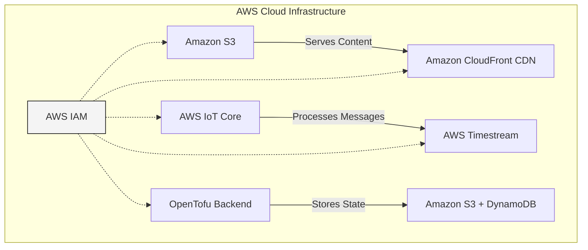

# 🏗️ OpenJII Infrastructure

This directory contains [OpenTofu](https://opentofu.org/manifesto/) (Terraform) configuration for deploying and managing the **OpenJII** cloud infrastructure. It follows a **modular architecture**, allowing the infrastructure to be efficiently configured with services that are necessary. Though it is scalable to multiple environments, currently the system is running on a single, development environment.

## 📖 Overview

The infrastructure is built on **Amazon Web Services (AWS)** and defined using **OpenTofu** as Infrastructure as Code (IaC), with the goal of providing a secure, scalable, and maintainable cloud infrastructure that supports the **OpenJII platform**.

This repository leverages **cloud best practices**, including **least privilege access control**, **automated deployments**, and **separation of concerns** to ensure performance, robustness, security and flexibility.

### 🏛️ Cloud Architecture

This infrastructure is designed to enable the **communcation and data ingestion** from JII MultispeQ devices, as well as **data persistance and processing**. Furthermore, it provisions for all other OpenJII touchpoints, such as the Community Hub, native and web application, as well as OpenJII **static content**, including the Documentation Hub and deployment configuration.



### 🔧 Key Components

- **Amazon S3** – Scalable object storage for static assets, logs, and deployment configuration, with encryption and lifecycle policies for security and cost management.
- **Amazon CloudFront** – A global Content Delivery Network (CDN) that caches and distributes content efficiently, reducing latency and improving security with TLS encryption.
- **AWS IoT Core** – A managed service for connecting and managing IoT devices, supporting MQTT and HTTP protocols for secure device-to-cloud messaging.
- **AWS Timestream** – A managed time-series database optimized for IoT and operational analytics, with automatic data tiering for performance and cost efficiency.
- **IAM (Identity and Access Management)** – Enforces authentication and fine-grained access controls, integrating with AWS services to manage permissions securely.

### 📂 Directory Structure

The directory is structured as follows:

```
infrastructure/
├── env/                # Environment-specific configurations (dev, staging, prod)
│   ├── dev/
├── modules/            # Reusable OpenTofu modules
│   ├── s3/             # S3 storage module
│   ├── cloudfront/     # CloudFront CDN module
│   ├── iot-core/       # IoT Core module
│   ├── timestream/     # Timestream database module
│   ├── docusaurus-s3/  # Module for documentation hub hosting
├── provider.tf         # OpenTofu provider configurations
├── variables.tf        # Global variables shared across modules
└── README.md           # Project documentation
```

## 📜 Infrastructure Design and Considerations

It is crucial that the OpenJII cloud infrastructure is **resilient, scalable, and cost-effective**, and remains as such. For this purpose, decisions and considerations are recorded as **Architecture Design Records (ADRs)** in the OpenJII Documentation Hub:

[Design Records: Infrastructure](/)

## 🛠️ Developer's Guide

### Prerequisites

Ensure you have the following tools installed:

- **OpenTofu**: [Download OpenTofu](https://opentofu.org/download/)
- **AWS CLI**: [Install AWS CLI](https://docs.aws.amazon.com/cli/latest/userguide/install-cliv2.html)
- **Git**: Used for version control.

### AWS Authentication

To run OpenTofu commands against AWS, you need valid AWS credentials. Authentication can be done using:

- **AWS Profile**:

  ```sh
  aws configure
  ```

  This will prompt you to enter your **AWS Access Key, Secret Key, Region**, and default output format.

- **Environment Variables**:
  ```sh
  export AWS_ACCESS_KEY_ID=your-access-key
  export AWS_SECRET_ACCESS_KEY=your-secret-key
  export AWS_REGION=your-region
  ```
  These variables allow OpenTofu to interact with AWS services without storing credentials in a file.

### Deployment Steps

To deploy the infrastructure, follow these steps:

1. **Change the directory to the environment**:

   ```
   cd infrastructure/env/dev
   ```

2. **Initialize OpenTofu**:

   ```sh
   tofu init
   ```

3. **Validate and preview the changes before applying**:

   ```sh
   tofu validate && tofu plan
   ```

4. **Apply the configuration**:
   ```sh
   tofu apply
   ```

If `pnpm` is installed, one can also simply run the following command from the project root directory:

   ```sh
   pnpm run tf
   ```

## ⚠️ Disclaimer

While the OpenJII project is **open source**, provisioning infrastructure on AWS is **restricted to repository owners and administrators**. This is necessary to prevent **unauthorized access, security risks, and unnecessary costs**, and to ensure the platform remains operational and retains longevity.

However, we welcome **contributions, ideas, and improvements**! If you have an idea for improving the infrastructure, you are encouraged to:

1. **Fork the repository** and deploy it in your own cloud environment.
2. **Test your changes** and verify improvements.
3. **Submit a pull request** with your proposed modifications.

This ensures that all contributions are vetted before being applied to the official infrastructure.
