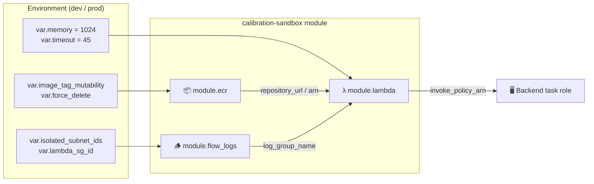

# 🔬 Calibration Sandbox Module

This module orchestrates **isolated Lambda-based execution of calibration scripts**. It composes an ECR repository, VPC flow logs, and the calibration Lambda into a single deployable unit.

## 📖 Overview

A calibration run is a bench session: an operator drives instruments from the browser, the readings are posted to the backend, and the definition's fitting script turns them into coefficients. That script is author-supplied, so it runs here rather than in the backend process.

The module wires together three sub-modules:

1. **ECR** — one container image registry for the Python image
2. **VPC Flow Logs** — subnet-level traffic auditing for the isolated subnets
3. **Calibration Lambda** — IAM role, function, CloudWatch logs, invoke policy

## 🔒 Isolation

The function runs in the isolated subnets: no internet gateway, no NAT. Its security group allows no inbound traffic and egress only on 443 to the interface endpoints' own security group (ECR API, ECR DKR, CloudWatch Logs), not to the VPC CIDR, so nothing else in the VPC is reachable from a script. The execution role may write its own log group and nothing more: it carries no ECR permissions (the Lambda service pulls the image under the repository policy), an explicit deny for every data-bearing service, and a deny on network-interface management conditioned on `lambda:SourceFunctionArn`, which is present on calls made from inside a running function and absent from the Lambda service's own. This layer is the boundary; the process isolation and audit hook inside the runtime (see `apps/calibration-sandbox/README.md`) turn an escape into an error but share the function's user and credentials.

The isolated subnets' flow logs belong to the macro sandbox that shares them; this module reads that log group for its rejected-traffic metric rather than logging the same subnets twice.

Unlike the macro sandbox, retries are disabled. A calibration run is requested by a person standing at a bench and is recorded against one device, so a retried invoke would write a second run for a single request.

## ⏱️ Timeout

`handler.py` stops a fitting script at 30 seconds and returns its own error describing what happened. The function timeout is deliberately above that, so the graceful failure reaches the operator instead of the Lambda being killed mid-run.

## 🔗 Wiring

The environment passes `function_name` to the backend as `AWS_LAMBDA_CALIBRATION_SANDBOX_FUNCTION_NAME` and attaches `invoke_policy_arn` to the backend task role. Until both exist, the backend refuses every calibration run with "Calibration sandbox Lambda is not configured" rather than failing to boot.

## 📦 Image deployment

Terraform creates the function pointing at `:latest` and then ignores `image_uri`. `.github/workflows/deploy-calibration-sandbox.yml` builds `apps/calibration-sandbox/functions/python/Dockerfile`, scans it with Trivy, pushes it tagged with the commit SHA, and calls `aws lambda update-function-code`. A rerun of a commit whose tag already exists skips the build and deploys that image, since the repository refuses to overwrite a tag.

A new environment is a two-step bootstrap, because the repository and the function are created by the same apply and the function needs an image that only the workflow pushes. The first apply creates the repository and fails on the function; the first workflow run then pushes the commit's image and, finding no `:latest`, publishes it under that tag once and skips the function update; the second apply creates the function from it, and every later workflow run updates the function to a `:<sha>` tag.
