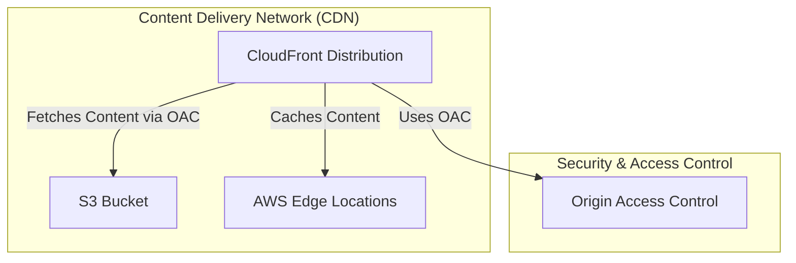

# 🌍 CloudFront Module

This module provisions an **Amazon CloudFront distribution** to serve static content from an existing S3 bucket using **CloudFront Origin Access Control (OAC)**. The S3 bucket is assumed to be private, and the module restricts access so that only requests originating from this CloudFront distribution can retrieve objects.

## 📖 Overview

Amazon CloudFront is a **global content delivery network (CDN)** that caches and delivers content from edge locations worldwide. In this module, CloudFront is configured to securely fetch content from a private S3 bucket using OAC. With OAC, CloudFront signs requests using AWS Signature Version 4 (sigv4), ensuring that only authorized requests are processed.


```mermaid
graph TD;
    subgraph "Content Delivery Network (CDN)"
        A[CloudFront Distribution] -->|Fetches Content via OAC| B[S3 Bucket];
        A -->|Caches Content| D[AWS Edge Locations];
    end
    subgraph "Security & Access Control"
        E[Origin Access Control];
        A -->|Uses OAC| E;
    end
```

## 🛠 Resources Used

| Resource                               | Description                                                                        | Documentation                                                                                                                  |
| -------------------------------------- | ---------------------------------------------------------------------------------- | ------------------------------------------------------------------------------------------------------------------------------ |
| `aws_cloudfront_origin_access_control` | Creates a CloudFront Origin Access Control (OAC) to sign requests to the S3 origin | [CloudFront OAC](https://registry.terraform.io/providers/hashicorp/aws/latest/docs/resources/cloudfront_origin_access_control) |
| `aws_cloudfront_distribution`          | Creates a CloudFront distribution using OAC for secure access                      | [CloudFront Distribution](https://registry.terraform.io/providers/hashicorp/aws/latest/docs/resources/cloudfront_distribution) |
| `aws_cloudfront_function` (optional)   | Viewer-request function: legacy 301 redirect map + clean-URL rewrite (opt-in)      | [CloudFront Function](https://registry.terraform.io/providers/hashicorp/aws/latest/docs/resources/cloudfront_function)         |

## ⚙️ Usage

Include the following configuration in your Terraform code to deploy this module. **Note:** The S3 bucket must already exist.

```hcl
module "cloudfront" {
  source                  = "../../modules/cloudfront"
  bucket_name             = "my-bucket-name"
}
```

## 🔑 Inputs

| Name                      | Description                                                                                                          | Type        | Default      | Required |
| ------------------------- | -------------------------------------------------------------------------------------------------------------------- | ----------- | ------------ | :------: |
| bucket_name               | The name of the S3 bucket used as the CloudFront origin.                                                             | string      | n/a          |   Yes    |
| default_root_object       | The default root object served by CloudFront (e.g., `index.html`).                                                   | string      | "index.html" |    No    |
| aws_region                | The AWS region for deployment.                                                                                       | string      | n/a          |   Yes    |
| enable_redirect_function  | Attach a viewer-request function that 301-redirects legacy paths and rewrites clean URLs to static-export `.html`.   | bool        | false        |    No    |
| redirect_map              | Old-path → new-path 301 map templated into the function (only used when `enable_redirect_function` is true).         | map(string) | {}           |    No    |
| enable_spa_error_response | `true` serves 403/404 as `/index.html` (200) for SPA routing; `false` serves the exported `/404.html` with HTTP 404. | bool        | true         |    No    |

## 📤 Outputs

| Name                                | Description                                                                               |
| ----------------------------------- | ----------------------------------------------------------------------------------------- |
| cloudfront_distribution_domain_name | The domain name assigned to the CloudFront distribution (e.g., `d123xyz.cloudfront.net`). |
| cloudfront_distribution_arn         | The ARN of the CloudFront distribution.                                                   |

## 🌍 Notes

- This module **does not** create the S3 bucket but assumes it exists.
- CloudFront’s cache behavior can be modified for custom caching policies.
- CloudFront’s SSL certificate defaults to the **AWS-managed certificate**, but a custom SSL certificate can be applied.
