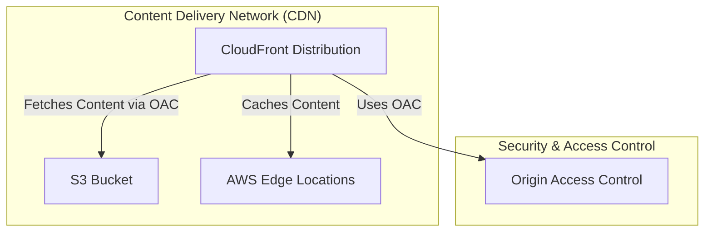

# 🌍 CloudFront Module

This module provisions an **Amazon CloudFront distribution** to serve static content from an existing S3 bucket using **CloudFront Origin Access Control (OAC)**. The S3 bucket is assumed to be private, and the module restricts access so that only requests originating from this CloudFront distribution can retrieve objects.

## 📖 Overview

Amazon CloudFront is a **global content delivery network (CDN)** that caches and delivers content from edge locations worldwide. In this module, CloudFront is configured to securely fetch content from a private S3 bucket using OAC. With OAC, CloudFront signs requests using AWS Signature Version 4 (sigv4), ensuring that only authorized requests are processed.



## 🛠 Resources Used

| Resource                                      | Description                                                                              | Documentation |
|-----------------------------------------------|------------------------------------------------------------------------------------------|---------------|
| `aws_cloudfront_origin_access_control`        | Creates a CloudFront Origin Access Control (OAC) to sign requests to the S3 origin         | [CloudFront OAC](https://registry.terraform.io/providers/hashicorp/aws/latest/docs/resources/cloudfront_origin_access_control) |
| `aws_cloudfront_distribution`                 | Creates a CloudFront distribution using OAC for secure access                              | [CloudFront Distribution](https://registry.terraform.io/providers/hashicorp/aws/latest/docs/resources/cloudfront_distribution) |

## ⚙️ Usage

Include the following configuration in your Terraform code to deploy this module. **Note:** The S3 bucket must already exist.

```hcl
module "cloudfront" {
  source                  = "../../modules/cloudfront"
  bucket_name             = "my-bucket-name"
}
```

## 🔑 Inputs

| Name                      | Description                                                                 | Type     | Default         | Required |
|---------------------------|-----------------------------------------------------------------------------|----------|-----------------|:--------:|
| bucket_name               | The name of the S3 bucket used as the CloudFront origin.                    | string   | n/a             | Yes      |
| default_root_object       | The default root object served by CloudFront (e.g., `index.html`).            | string   | "index.html"    | No       |
| aws_region                | The AWS region for deployment.                                              | string   | "eu-central-1"  | No       |

## 📤 Outputs

| Name                                  | Description                                                                  |
|---------------------------------------|------------------------------------------------------------------------------|
| cloudfront_distribution_domain_name   | The domain name assigned to the CloudFront distribution (e.g., `d123xyz.cloudfront.net`). |
| cloudfront_distribution_arn             | The ARN of the CloudFront distribution.                                      |

## 🌍 Notes

- This module **does not** create the S3 bucket but assumes it exists.
- CloudFront’s cache behavior can be modified for custom caching policies.
- CloudFront’s SSL certificate defaults to the **AWS-managed certificate**, but a custom SSL certificate can be applied.
