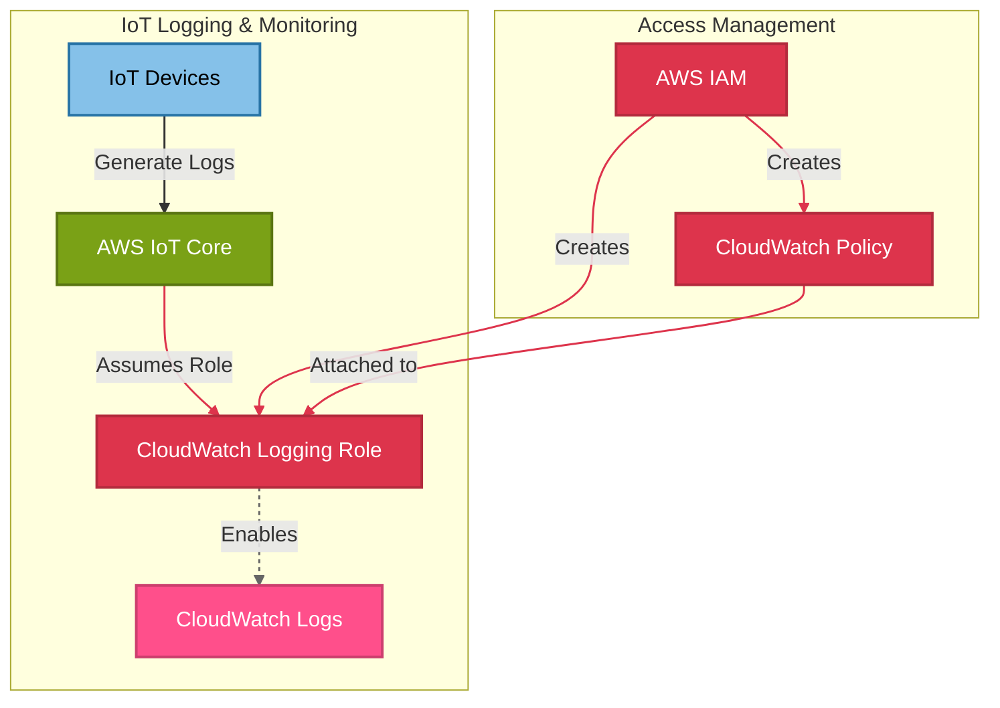

# 📊 CloudWatch Logging Module

This module provisions **AWS CloudWatch** resources to enable logging for IoT devices in the OpenJII Platform. It creates IAM roles and policies necessary for IoT Core to write logs to CloudWatch.

## 📖 Overview

AWS CloudWatch enables comprehensive **monitoring and observability** for IoT workloads. This module sets up an **IAM role** for IoT logging to CloudWatch, allowing IoT Core to send logs and diagnostic information.



## 🛠 Resources Used

| Resource         | Description                                            | Documentation                                                                                            |
| ---------------- | ------------------------------------------------------ | -------------------------------------------------------------------------------------------------------- |
| `aws_iam_role`   | IAM role for IoT to write logs to CloudWatch           | [AWS IAM Role](https://registry.terraform.io/providers/hashicorp/aws/latest/docs/resources/iam_role)     |
| `aws_iam_policy` | IAM policy defining allowed CloudWatch logging actions | [AWS IAM Policy](https://registry.terraform.io/providers/hashicorp/aws/latest/docs/resources/iam_policy) |

## ⚙️ Usage

To deploy this CloudWatch module, include the following Terraform configuration:

```hcl
module "cloudwatch" {
  source                 = "../../modules/cloudwatch"
  aws_region             = "eu-central-1"
  log_retention_days     = 60
  cloudwatch_role_name   = "iot-cloudwatch-role"
  cloudwatch_policy_name = "iot-cloudwatch-policy"
}
```

## 🔑 Inputs

| Name                   | Description                         | Type     | Default | Required |
| ---------------------- | ----------------------------------- | -------- | ------- | -------- |
| aws_region             | AWS region for CloudWatch resources | `string` | n/a     | ✅ Yes   |
| log_retention_days     | Number of days to retain logs       | `number` | 30      | ❌ No    |
| cloudwatch_role_name   | Name for the CloudWatch IAM role    | `string` | n/a     | ✅ Yes   |
| cloudwatch_policy_name | Name for the CloudWatch IAM policy  | `string` | n/a     | ✅ Yes   |

## 📤 Outputs

| Name                    | Description                                |
| ----------------------- | ------------------------------------------ |
| iot_cloudwatch_role_arn | ARN of the IAM role for CloudWatch logging |
