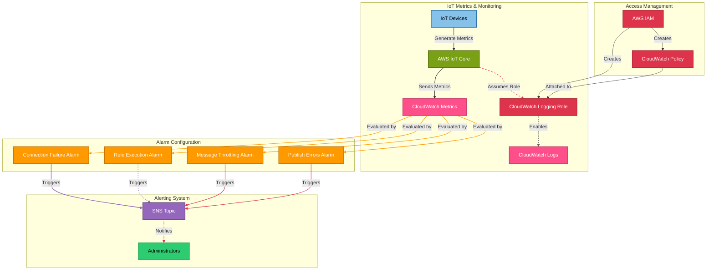

# 📊 CloudWatch Monitoring Module

This module provisions **AWS CloudWatch** resources to monitor IoT devices and set up alerting for the OpenJII Platform. It creates IAM roles for logging, configures CloudWatch metric alarms for critical IoT metrics, and establishes an SNS topic for notifications.

## 📖 Overview

AWS CloudWatch enables comprehensive **monitoring and observability** for IoT workloads. This module sets up an **IAM role** for IoT logging to CloudWatch, multiple **CloudWatch alarms** for IoT metrics, and an **SNS topic** for alert notifications when thresholds are exceeded.



## 🛠 Resources Used

| Resource                      | Description                                            | Documentation                                                                                                                      |
| ----------------------------- | ------------------------------------------------------ | ---------------------------------------------------------------------------------------------------------------------------------- |
| `aws_iam_role`                | IAM role for IoT to write logs to CloudWatch           | [AWS IAM Role](https://registry.terraform.io/providers/hashicorp/aws/latest/docs/resources/iam_role)                               |
| `aws_iam_policy`              | IAM policy defining allowed CloudWatch logging actions | [AWS IAM Policy](https://registry.terraform.io/providers/hashicorp/aws/latest/docs/resources/iam_policy)                           |
| `aws_sns_topic`               | SNS topic for IoT alerts and notifications             | [AWS SNS Topic](https://registry.terraform.io/providers/hashicorp/aws/latest/docs/resources/sns_topic)                             |
| `aws_cloudwatch_metric_alarm` | CloudWatch alarms for monitoring IoT metrics           | [AWS CloudWatch Metric Alarm](https://registry.terraform.io/providers/hashicorp/aws/latest/docs/resources/cloudwatch_metric_alarm) |

## ⚙️ Usage

To deploy this CloudWatch module, include the following Terraform configuration:

```hcl
module "cloudwatch" {
  source                 = "../../modules/cloudwatch"
  aws_region             = "eu-central-1"
  cloudwatch_role_name   = "iot-cloudwatch-role"
  cloudwatch_policy_name = "iot-cloudwatch-policy"
  iot_alerts_topic_name  = "iot-connection-alerts"
}
```

## 🔑 Inputs

| Name                   | Description                           | Type     | Default | Required |
| ---------------------- | ------------------------------------- | -------- | ------- | -------- |
| aws_region             | AWS region for CloudWatch resources   | `string` | n/a     | ✅ Yes   |
| cloudwatch_role_name   | Name for the CloudWatch IAM role      | `string` | n/a     | ✅ Yes   |
| cloudwatch_policy_name | Name for the CloudWatch IAM policy    | `string` | n/a     | ✅ Yes   |
| iot_alerts_topic_name  | Name for the SNS topic for IoT alerts | `string` | n/a     | ✅ Yes   |

## 📤 Outputs

| Name                    | Description                                |
| ----------------------- | ------------------------------------------ |
| iot_cloudwatch_role_arn | ARN of the IAM role for CloudWatch logging |
| iot_alerts_topic_arn    | ARN of the SNS topic for IoT alerts        |

## 🔍 Monitoring Metrics

This module configures the following CloudWatch alarms:

1. **IoT Connection Failure Rate**: Alerts when the rate of connection failures exceeds 10%
2. **IoT Rule Execution Failures**: Alerts when more than 5 rule execution failures occur within 5 minutes
3. **IoT Message Throttling**: Alerts when more than 10 message throttling events occur within 5 minutes
4. **IoT Publish Errors**: Alerts when the rate of publish errors exceeds 5%

All alarms are configured to send notifications to the specified SNS topic when thresholds are exceeded and when returning to normal state.
