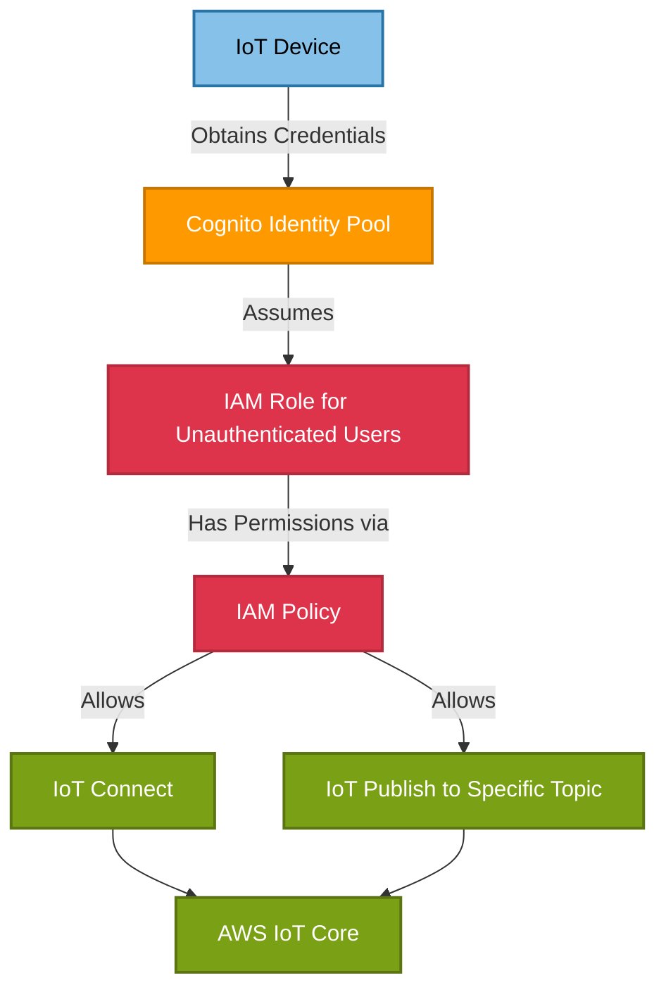

# 🔑 Cognito Module

This module creates an AWS Cognito Identity Pool that enables unauthenticated identities to securely connect to IoT Core and publish MQTT messages to specific topics. It's designed to support device data ingestion for the openJII platform.

## 📖 Overview

The Cognito module sets up a **Cognito Identity Pool** with unauthenticated access and configures the necessary IAM roles and policies to allow IoT devices to publish data to the platform. This enables **secure device communication** without requiring traditional authentication credentials, while still maintaining strict access controls that limit what actions these devices can perform.



## 🛠 Resources Used

| Resource                                     | Description                                                   | Documentation                                                                                                                                                    |
| -------------------------------------------- | ------------------------------------------------------------- | ---------------------------------------------------------------------------------------------------------------------------------------------------------------- |
| `aws_cognito_identity_pool`                  | Creates a Cognito Identity Pool for device authentication     | [AWS Cognito Identity Pool](https://registry.terraform.io/providers/hashicorp/aws/latest/docs/resources/cognito_identity_pool)                                   |
| `aws_iam_role`                               | Creates an IAM role for unauthenticated users                 | [AWS IAM Role](https://registry.terraform.io/providers/hashicorp/aws/latest/docs/resources/iam_role)                                                             |
| `aws_iam_policy`                             | Defines permissions for IoT device connections and publishing | [AWS IAM Policy](https://registry.terraform.io/providers/hashicorp/aws/latest/docs/resources/iam_policy)                                                         |
| `aws_cognito_identity_pool_roles_attachment` | Attaches IAM roles to the Cognito Identity Pool               | [AWS Cognito Identity Pool Roles Attachment](https://registry.terraform.io/providers/hashicorp/aws/latest/docs/resources/cognito_identity_pool_roles_attachment) |
| `aws_iam_role_policy_attachment`             | Attaches the IoT policy to the IAM role                       | [AWS IAM Role Policy Attachment](https://registry.terraform.io/providers/hashicorp/aws/latest/docs/resources/iam_role_policy_attachment)                         |

## ⚙️ Usage

Include this module in your Terraform configuration as follows:

```hcl
module "device_auth" {
  source             = "../../modules/cognito"
  identity_pool_name = "device-identity-pool"
  region             = "eu-central-1"
}
```

In your IoT device code, use the Cognito Identity Pool ID to obtain AWS credentials, then use those credentials to connect to AWS IoT Core and publish messages to the allowed topics.

```javascript
// Example device code using AWS SDK v3 (JavaScript)
import { CognitoIdentityClient } from "@aws-sdk/client-cognito-identity";
import { IoTDataPlaneClient, PublishCommand } from "@aws-sdk/client-iot-data-plane";
import { fromCognitoIdentityPool } from "@aws-sdk/credential-provider-cognito-identity";

// Initialize the credential provider with your Identity Pool
const credentials = fromCognitoIdentityPool({
  client: new CognitoIdentityClient({ region: "eu-central-1" }),
  identityPoolId: "eu-central-1:identity-pool-id",
});

// Create IoT client with credentials from Cognito
const iotClient = new IoTDataPlaneClient({
  region: "eu-central-1",
  credentials: credentials,
});

// Publish a message to an allowed topic
const publishParams = {
  topic: "experiment/data_ingest/v1/device123/project456/protocol789/run101/measurement",
  payload: JSON.stringify({ sensorValue: 42 }),
};

await iotClient.send(new PublishCommand(publishParams));
```

## 🔑 Inputs

| Name                 | Description                        | Type     | Default     | Required |
| -------------------- | ---------------------------------- | -------- | ----------- | :------: |
| `identity_pool_name` | Name for the Cognito Identity Pool | `string` | n/a         |  ✅ Yes  |
| `region`             | AWS region                         | `string` | "eu-west-1" |  ❌ No   |

## 📤 Outputs

| Name                       | Description                                       |
| -------------------------- | ------------------------------------------------- |
| `identity_pool_id`         | The ID of the created Cognito Identity Pool       |
| `identity_pool_arn`        | The ARN of the created Cognito Identity Pool      |
| `unauthenticated_role_arn` | The ARN of the IAM role for unauthenticated users |

## 🌍 Notes

- This module is designed specifically for devices that need to publish data to IoT Core using the topic pattern `experiment/data_ingest/v1/*/*/*/*/*`.
- The IAM role policies use the principle of least privilege, allowing only the minimum permissions needed for devices to connect and publish to specific topics.
- For production environments, consider implementing additional security measures such as device certificates or more restrictive topic patterns.
- For devices with more complex requirements, you may need to expand the IAM policies or create additional authenticated roles.
