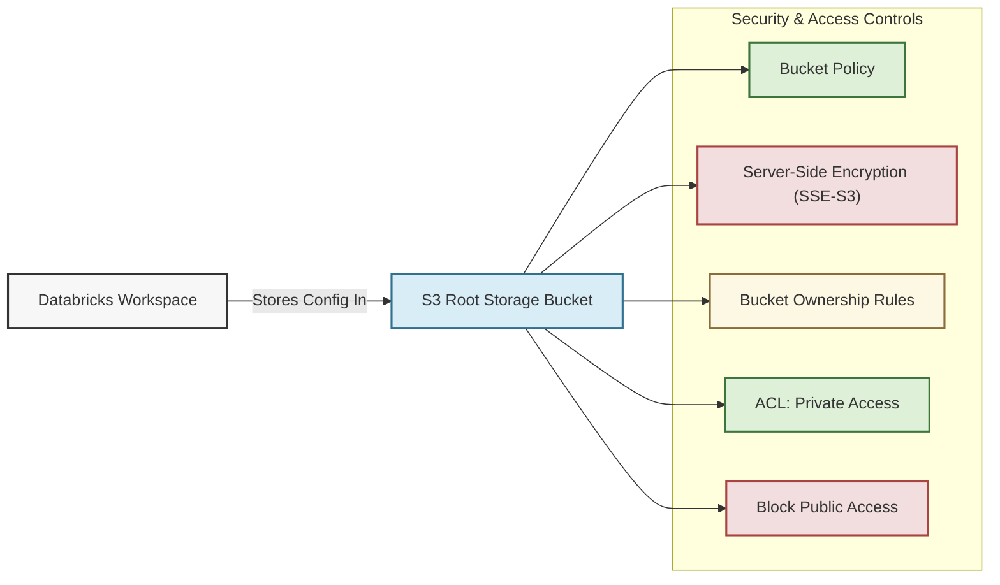

# 📦 Databricks S3 Root Storage Module

This Terraform module provisions a **secure and encrypted S3 bucket** to serve as the **root storage** for a Databricks workspace. It applies **bucket policies, encryption, access control, and public access restrictions** to ensure compliance with (suggested) security best practices.

## 📖 Overview

The **Databricks root bucket** serves as the central repository for all workspace configuration and metadata, ensuring that data is securely stored in a private, dedicated environment. It is designed with robust security measures, including either KMS or AES-256 server-side encryption and strict access controls that block any public exposure. Additionally, tailored ownership settings and a custom bucket policy further safeguard the bucket, aligning it with Databricks’ secure operational standards.



## 🛠 Resources Used

| Resource                                                                                                                                                                               | Description                                              | Documentation                                                                                                        |
| -------------------------------------------------------------------------------------------------------------------------------------------------------------------------------------- | -------------------------------------------------------- | -------------------------------------------------------------------------------------------------------------------- |
| [**`aws_s3_bucket`**](https://registry.terraform.io/providers/hashicorp/aws/latest/docs/resources/s3_bucket)                                                                           | Creates an S3 bucket for Databricks root storage.        | [Amazon S3 Bucket](https://docs.aws.amazon.com/AmazonS3/latest/userguide/Welcome.html)                               |
| [**`aws_s3_bucket_acl`**](https://registry.terraform.io/providers/hashicorp/aws/latest/docs/resources/s3_bucket_acl)                                                                   | Applies an ACL to ensure the bucket remains private.     | [S3 ACL](https://docs.aws.amazon.com/AmazonS3/latest/userguide/acl-overview.html)                                    |
| [**`aws_s3_bucket_versioning`**](https://registry.terraform.io/providers/hashicorp/aws/latest/docs/resources/s3_bucket_versioning)                                                     | Configures versioning (disabled by default).             | [S3 Versioning](https://docs.aws.amazon.com/AmazonS3/latest/userguide/Versioning.html)                               |
| [**`aws_s3_bucket_server_side_encryption_configuration`**](https://registry.terraform.io/providers/hashicorp/aws/latest/docs/resources/s3_bucket_server_side_encryption_configuration) | Enforces server-side encryption (AES-256).               | [S3 Encryption](https://docs.aws.amazon.com/AmazonS3/latest/userguide/serv-side-encryption.html)                     |
| [**`aws_s3_bucket_public_access_block`**](https://registry.terraform.io/providers/hashicorp/aws/latest/docs/resources/s3_bucket_public_access_block)                                   | Restricts all public access to the bucket.               | [Block Public Access](https://docs.aws.amazon.com/AmazonS3/latest/userguide/access-control-block-public-access.html) |
| [**`aws_s3_bucket_ownership_controls`**](https://registry.terraform.io/providers/hashicorp/aws/latest/docs/resources/s3_bucket_ownership_controls)                                     | Ensures bucket owner has full control.                   | [Ownership Controls](https://docs.aws.amazon.com/AmazonS3/latest/userguide/about-object-ownership.html)              |
| [**`aws_s3_bucket_policy`**](https://registry.terraform.io/providers/hashicorp/aws/latest/docs/resources/s3_bucket_policy)                                                             | Attaches a policy to securely integrate with Databricks. | [S3 Bucket Policy](https://docs.aws.amazon.com/AmazonS3/latest/userguide/example-bucket-policies.html)               |

## ⚙️ Usage

```hcl
module "databricks_s3" {
  source  = "./modules/databricks-s3"
  prefix  = "myproject"
  tags    = {
    Environment = "prod"
    Owner       = "data-team"
  }
}
```

## 🔑 Inputs

| Name     | Description                   | Type        | Default | Required |
| -------- | ----------------------------- | ----------- | ------- | :------: |
| `prefix` | Prefix for resource names     | string      | n/a     |  ✅ Yes  |
| `tags`   | Common tags for the S3 bucket | map(string) | `{}`    |  ❌ No   |

## 📤 Outputs

| Name          | Description                       |
| ------------- | --------------------------------- |
| `bucket_name` | The name of the created S3 bucket |
