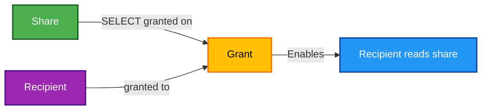

# 🔑 Delta Sharing Grant

This module grants a **recipient** read access to a **share**. Without it, both exist but no data flows.

## 📖 Overview

The share names the data and the recipient names the reader; the grant is the edge between them. It issues `SELECT` on the share, which is the only privilege Delta Sharing defines for a recipient.



## 🛠 Resources Used

| Resource                                                                                                              | Description                                   |
| --------------------------------------------------------------------------------------------------------------------- | --------------------------------------------- |
| [**`databricks_grants`**](https://registry.terraform.io/providers/databricks/databricks/latest/docs/resources/grants) | Grants `SELECT` on the share to the recipient |

## ⚙️ Usage

```hcl
module "delta_sharing_grant" {
  source = "../../modules/databricks/grant"

  share_name     = module.delta_sharing_share.share_name
  recipient_name = module.delta_sharing_recipient.recipient_name

  providers = {
    databricks.workspace = databricks.workspace
  }

  depends_on = [module.delta_sharing_share, module.delta_sharing_recipient]
}
```

## 🔑 Inputs

| Name             | Description                   | Type     | Default | Required |
| ---------------- | ----------------------------- | -------- | ------- | :------: |
| `share_name`     | Share to grant access to      | `string` | n/a     |  ✅ Yes  |
| `recipient_name` | Recipient receiving the grant | `string` | n/a     |  ✅ Yes  |

## 📤 Outputs

| Name             | Description                       |
| ---------------- | --------------------------------- |
| `grant_id`       | Unique identifier of the grant    |
| `share_name`     | Share the grant applies to        |
| `recipient_name` | Recipient the grant was issued to |

## 💡 Notes

- `databricks_grants` is authoritative for the share it manages: privileges added outside Terraform are removed on the next apply.
- The grant must exist before the recipient can list or read the share, so keep the `depends_on` above.
