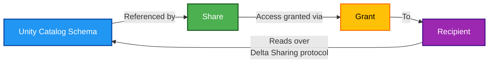

# 📤 Delta Sharing Share

This module creates a **Delta Sharing share**: a named collection of Unity Catalog schemas that can be read by recipients outside the workspace.

## 📖 Overview

A share is a pointer, not a copy. It names schemas in a catalog and grants read access to them through the Delta Sharing protocol; the underlying tables stay where they are, and destroying a share never touches data.

Sharing at the **schema** level (rather than table by table) means tables added to the schema later are visible to recipients automatically — no Terraform change per new table.



## 🛠 Resources Used

| Resource                                                                                                            | Description                           |
| ------------------------------------------------------------------------------------------------------------------- | ------------------------------------- |
| [**`databricks_share`**](https://registry.terraform.io/providers/databricks/databricks/latest/docs/resources/share) | Creates the share and its schema list |

## ⚙️ Usage

```hcl
module "delta_sharing_share" {
  source = "../../modules/databricks/share"

  share_name   = "open_jii_${var.environment}"
  catalog_name = module.databricks_catalog.catalog_name
  comment      = "Shares the centrum schema with the backend service"

  schemas = [
    {
      name    = "centrum"
      comment = "Central schema containing all experiment data tables"
    }
  ]

  providers = {
    databricks.workspace = databricks.workspace
  }

  depends_on = [module.databricks_catalog]
}
```

## 🔑 Inputs

| Name           | Description                                                   | Type                                                | Default | Required |
| -------------- | ------------------------------------------------------------- | --------------------------------------------------- | ------- | :------: |
| `share_name`   | Share name; unique per metastore. Lowercase, digits, `_` only | `string`                                            | n/a     |  ✅ Yes  |
| `catalog_name` | Catalog containing the schemas to share                       | `string`                                            | n/a     |  ✅ Yes  |
| `schemas`      | Schemas to include; each shares all its tables                | `list(object({ name = string, comment = string }))` | `[]`    |    No    |
| `comment`      | Free-text description of the share's purpose                  | `string`                                            | `null`  |    No    |

## 📤 Outputs

| Name         | Description                         |
| ------------ | ----------------------------------- |
| `share_id`   | Unique identifier of the share      |
| `share_name` | Name of the share, for grant wiring |

## 💡 Notes

- A recipient cannot read a share until a **grant** connects the two; see the `grant` module.
- Recipients read the tables as they exist in the catalog, so table features (deletion vectors, variant, column mapping) affect what a given client can read. See [Databricks: read data shared with bearer tokens](https://docs.databricks.com/aws/en/opensharing/read-data-open).
