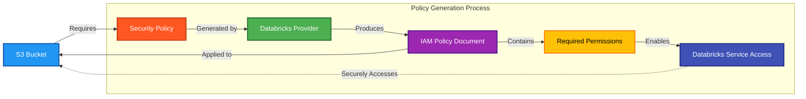

# 🔒 Databricks Workspace S3 Policy Generator

This module creates the exact IAM bucket policy required for Databricks workspace storage. It takes the guesswork out of configuring S3 permissions for Databricks.

## 📖 Overview

Setting up S3 storage for Databricks requires a specific policy with the right permissions. This module handles that complexity for you by:

1. Using the Databricks provider to generate the correct policy document
2. Keeping the policy up-to-date with Databricks' requirements
3. Seamlessly integrating with our S3 module



## 🛠 Resources Used

| Resource / Data Source                                                                                                                         | Description                                                              | Documentation                                                                                                                            |
| ---------------------------------------------------------------------------------------------------------------------------------------------- | ------------------------------------------------------------------------ | ---------------------------------------------------------------------------------------------------------------------------------------- |
| [**`databricks_aws_bucket_policy`**](https://registry.terraform.io/providers/databricks/databricks/latest/docs/data-sources/aws_bucket_policy) | Generates the precise IAM policy document required for Databricks access | [Databricks AWS Bucket Policy](https://registry.terraform.io/providers/databricks/databricks/latest/docs/data-sources/aws_bucket_policy) |

## 🔍 Policy Specifics

The generated policy grants Databricks these essential permissions:

- **Object Access**: PutObject, GetObject, DeleteObject operations
- **Bucket Management**: ListBucket, GetBucketLocation operations
- **Principal Controls**: Scoped to Databricks accounts and service roles
- **Resource Restrictions**: Limited to necessary paths and resources

These permissions follow AWS best practices while ensuring Databricks works correctly.

## ⚙️ Usage

Here's how to set up a complete Databricks storage solution:

```hcl
# Step 1: Generate the policy document
module "databricks_workspace_s3_policy" {
  source      = "../../modules/databricks/workspace-s3-policy"
  bucket_name = "databricks-root-eu-west-1-5432"
}

# Step 2: Create the S3 bucket with the policy
module "databricks_workspace_s3" {
  source             = "../../modules/s3"
  bucket_name        = "databricks-root-eu-west-1-5432"
  enable_versioning  = false  # Databricks works best without versioning
  custom_policy_json = module.databricks_workspace_s3_policy.policy_json

  tags = {
    Service     = "Databricks"
    Environment = "Production"
    Team        = "Data Engineering"
  }
}

# Step 3: Use the bucket in your Databricks workspace
module "databricks_workspace" {
  source      = "../../modules/databricks/workspace"
  bucket_name = module.databricks_workspace_s3.bucket_id
  # Add any other workspace configuration...
}
```

## 🔐 Security Recommendations

- The policy follows Databricks' recommended security configuration
- Use VPC endpoints for S3 to keep traffic on your private network
- Ensure your bucket uses encryption (the S3 module handles this)
- Enable CloudTrail and S3 access logs for audit purposes

## 🔑 Inputs

| Name          | Description                                  | Type     | Default | Required |
| ------------- | -------------------------------------------- | -------- | ------- | :------: |
| `bucket_name` | Name of the S3 bucket for Databricks storage | `string` | n/a     |  ✅ Yes  |

## 📤 Outputs

| Name          | Description                                      |
| ------------- | ------------------------------------------------ |
| `policy_id`   | The ID of the generated Databricks bucket policy |
| `policy_json` | The complete bucket policy JSON document         |

## 💡 Related Resources

- [Databricks S3 Bucket Setup Guide](https://docs.databricks.com/administration-guide/cloud-configurations/aws/customer-managed-storage.html)
- [AWS S3 Security Best Practices](https://docs.aws.amazon.com/AmazonS3/latest/userguide/security-best-practices.html)
- [Databricks E2 Architecture on AWS](https://docs.databricks.com/administration-guide/cloud-configurations/aws/e2-architecture.html)
